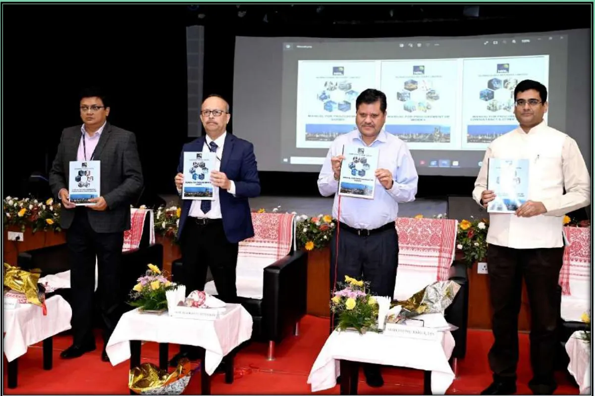

## **NUMALIGARH REFINERY LIMITED**


# **MANUAL FOR PROCUREMENT OF GOODS**

**(Released on 07.11.2022; Revised on 16.03.2023)**


1------------------------------------------------

**Numaligarh Refinery Limited  
Numaligarh**

November 7, 2022

**FOREWORD**

Numaligarh Refinery Ltd. formally brought about a comprehensive Guideline for Procurement and Contract Services in 2004 after deliberations by a dedicated cross functional committee, with due consideration of views of BPCL and CVO to streamline the procedures for procurement and contractual systems in use and to help in making decisions in a laid down manner that would stand the test of any future scrutiny as a public procuring entity.

With a similar view to improving transparency in decision making in public procurement and reducing the scope for subjectivity, Department of Expenditure (DoE), in 2006, issued a set of three Manuals on Policies and Procedures for Procurement of Goods, Works and Hiring of Consultants in conformity with the General Financial Rules (GFR), 2005. Over time, the Government of India issued new instructions in the domain of public procurement like introduction of Central Public Procurement Portal (CPPP), Government e-Marketplace (GeM), preferential market access for micro and small enterprises, preference for domestic manufacturers of electronic goods, inclusion of Integrity Pact, etc. The GFR was revised comprehensively in March 2017 covering inter-alia these set of new instructions. Consequently, the Manuals of Procurement by DoE too were revised after a decade and within a month of the release of GFR 2017.

Central Vigilance Commission (CVC) have since issued various instruction on public procurement from time to time as also various other organisations like NITI Aayog, D/o Promotion of Industry & Internal Trade etc. NRL has kept abreast of these guidelines for procurement by publishing various internal notifications and hosting them on the website to supplement/ substitute the provisions of its procurement manual. Due to multiple organizations issuing guidelines, procurement executives were commonly facing problems in having a single authoritative source of reference. CVC after deliberations with DoE and with the other organisations came to the logical conclusion that it would only be appropriate if public procurement guidelines are henceforth issued from a single source viz. DoE.

Consequently, the three Manuals for Procurement (of Goods, Works and Consultancy & Other Services) were recently revised by DoE and made effective from 1st July 2022, incorporating all interim procurement guidelines issued by DoE since its last revision in 2017 as well subsuming all extant instructions from CVC and other Government bodies. Accordingly, the CVC has issued a circular No-14/07/22 dated 11.07.2022.

Vide letter ref. NRL/Vig/02 dtd. 12.07.2022, CVO-NRL submitted the advisory to the Managing Director, NRL to update/align the procurement manual/guideline of NRL in line with the updated manuals of DoE and upload the same on NRL's website.

Accordingly, a cross functional committee was constituted by MD-NRL to review and update NRL's procurement manuals in line with the latest comprehensive version issued by the DoE while incorporating organization specific provisions. The adoption of these updated policies / guidelines by NRL is expected to uphold the fundamental principles of transparency, fairness, competition, economy, efficiency and accountability.

Public Procurement is a dynamic field where policies are constantly reviewed to help Government achieve its socio-economic or strategic goals. Hence, it will be our endeavor to update this manual from time to time at periodic intervals to ensure their continued relevance for all the years to come.

I also take this opportunity to record my appreciation to the committee members involved in participating in the knowledge sharing for updating this significant document.

Indranil Mitra  
(Director Finance)

2------------------------------------------------

**DISCLAIMER:**

The contents of this manual are up to date, till October 2022. The personnel involved in procurement activities are advised to check the precise current provisions and applicable instructions through any subsequent amendment(s) of this manual, as well as notifications issued by NRL management.

3------------------------------------------------

# Table of Contents

<table><tr><td>Abbreviations and Acronyms .....</td><td>8</td></tr><tr><td>Procurement Glossary.....</td><td>10</td></tr><tr><td>Preamble .....</td><td>14</td></tr><tr><td><b>Chapter 1: Introduction - Policies and Principles.....</b></td><td><b>15</b></td></tr><tr><td>    1.1 Procurement Rules and Regulations; and this Manual.....</td><td>15</td></tr><tr><td>    1.2 Amendments and Revision of this Manual .....</td><td>15</td></tr><tr><td>    1.3 Applicability of this Manual.....</td><td>15</td></tr><tr><td>    1.4 Authorities competent to purchase goods and their Purchase Powers .....</td><td>16</td></tr><tr><td>    1.5 Basic Aims of Procurement - the Five R's of Procurement. ....</td><td>16</td></tr><tr><td>    1.6 Refined Concepts of Cost and Value - Value for Money.....</td><td>17</td></tr><tr><td>    1.7 Fundamental Principles of Public Procurement. ....</td><td>17</td></tr><tr><td>    1.8 Standards (Canons) of Financial Propriety .....</td><td>24</td></tr><tr><td>    1.9 Public Procurement Infrastructure at the Centre.....</td><td>25</td></tr><tr><td>    1.10 Product Reservation and Preferential/Mandatory Purchase .....</td><td>26</td></tr><tr><td>    1.11 Procurement Cycle.....</td><td>36</td></tr><tr><td><b>Chapter 2: Need assessment, formulation of Specifications and Procurement Planning.....</b></td><td><b>37</b></td></tr><tr><td>    2.1 Need Assessment .....</td><td>37</td></tr><tr><td>    2.2 Formulation of Technical specifications (TS) .....</td><td>40</td></tr><tr><td>    2.3 Obtaining Technical, Administrative and Budgetary Sanctions/ Approvals and signing of Indents .....</td><td>43</td></tr><tr><td>    2.4 Procurement Planning.....</td><td>44</td></tr><tr><td>    2.5 Initiation of procurement of Goods.....</td><td>45</td></tr><tr><td><b>Chapter 3: Supplier Relationship Management.....</b></td><td><b>47</b></td></tr><tr><td>    3.1 Supplier Management. ....</td><td>47</td></tr><tr><td>    3.2 Code of Integrity for Public Procurement (CIPP) .....</td><td>47</td></tr><tr><td>    3.3 Integrity Pact (IP) .....</td><td>49</td></tr><tr><td>    3.4 Development of New Sources and Registration of Suppliers.....</td><td>51</td></tr><tr><td>    3.5 Policy for Holiday Listing / Banning / Debarring of Contractors/Suppliers.....</td><td>51</td></tr><tr><td>    3.6 Enlistment of Indian Agents .....</td><td>57</td></tr><tr><td><b>Chapter 4: Modes of Procurement and Bidding Systems.....</b></td><td><b>58</b></td></tr><tr><td>    4.1 Modes of Procurement.....</td><td>58</td></tr><tr><td>    4.2 Open Tender Enquiry(OTE) .....</td><td>58</td></tr><tr><td>    4.3 Global Tender Enquiry(GTE).....</td><td>59</td></tr><tr><td>    4.4 Limited Tender Enquiry(LTE) .....</td><td>62</td></tr><tr><td>    4.5 Selection of successful bidder among multiple L1 bidders: .....</td><td>63</td></tr><tr><td>    4.6 Proprietary Article Certificate / OEM.....</td><td>63</td></tr><tr><td>    4.7 Single Tender Enquiry (STE).....</td><td>65</td></tr><tr><td>    4.8 Drawals against Rate Contract (RC)/Framework Contract (FC) .....</td><td>66</td></tr></table>

4------------------------------------------------

<table border="0">
<tr>
<td>4.9 Direct Procurement without Quotation (Cash / Imprest purchase) .....</td>
<td>66</td>
</tr>
<tr>
<td>4.10 Direct Procurement by Purchase Committee.....</td>
<td>67</td>
</tr>
<tr>
<td>4.11 Repeat Order .....</td>
<td>71</td>
</tr>
<tr>
<td>4.12 Bidding Systems .....</td>
<td>72</td>
</tr>
<tr>
<td>4.13 Single Stage Bidding System .....</td>
<td>72</td>
</tr>
<tr>
<td>4.14 Expression of Interest Tenders - Market Exploration Two Stage Bidding.....</td>
<td>75</td>
</tr>
<tr>
<td>4.15 Electronic Procurement (e-Procurement) .....</td>
<td>77</td>
</tr>
<tr>
<td>4.16 Electronic Reverse Auction (RA) .....</td>
<td>78</td>
</tr>
<tr>
<td>4.17 One Stop Government e-Marketplace (GeM).....</td>
<td>79</td>
</tr>
<tr>
<td>4.18 Authority of Procurement Through GeM .....</td>
<td>80</td>
</tr>
<tr>
<td><b>Chapter 5: Preparing bids, publication, receipt and opening of bids.....</b></td>
<td><b>91</b></td>
</tr>
<tr>
<td>5.1 Preparation of Bid Documents .....</td>
<td>91</td>
</tr>
<tr>
<td>5.2 Receipt and Custody of Tenders.....</td>
<td>101</td>
</tr>
<tr>
<td>5.3 Procedures to be followed during Bid Opening.....</td>
<td>103</td>
</tr>
<tr>
<td><b>Chapter 6: Forms of Securities, Payment Terms and Price Variations.....</b></td>
<td><b>105</b></td>
</tr>
<tr>
<td>6.1 Forms of Security .....</td>
<td>105</td>
</tr>
<tr>
<td>6.2 Payment Clause.....</td>
<td>106</td>
</tr>
<tr>
<td>6.3 Terms of Payment for Domestic Goods.....</td>
<td>107</td>
</tr>
<tr>
<td>6.4 Terms of Payment for Imported Goods.....</td>
<td>108</td>
</tr>
<tr>
<td>6.5 Advance Payment.....</td>
<td>110</td>
</tr>
<tr>
<td>6.6 Firm Price vis-a-vis Variable Price.....</td>
<td>110</td>
</tr>
<tr>
<td>6.7 Exchange Rate Variation .....</td>
<td>112</td>
</tr>
<tr>
<td>6.8 Taxes, Duties and Levies.....</td>
<td>113</td>
</tr>
<tr>
<td>6.9 Incoterms Terms of Delivery .....</td>
<td>115</td>
</tr>
<tr>
<td>6.10e-Payment.....</td>
<td>116</td>
</tr>
<tr>
<td>6.11 Deduction of Income Tax, GST, and so on, at Source from Payments to Suppliers.....</td>
<td>116</td>
</tr>
<tr>
<td>6.12 Payment against Time Barred Claims .....</td>
<td>116</td>
</tr>
<tr>
<td><b>Chapter 7: Evaluation of Bids and Award of Contract.....</b></td>
<td><b>117</b></td>
</tr>
<tr>
<td>7.1 Tender Evaluation .....</td>
<td>117</td>
</tr>
<tr>
<td>7.2 Preparation and Vetting of Comparative Statement.....</td>
<td>117</td>
</tr>
<tr>
<td>7.3 Technical &amp; Commercial Examination .....</td>
<td>119</td>
</tr>
<tr>
<td>7.4 Evaluation of Responsive Bids and Decision on Award of Contract. ....</td>
<td>121</td>
</tr>
<tr>
<td>7.5 Deliberations for Award of Contract. ....</td>
<td>125</td>
</tr>
<tr>
<td>7.6 Award of Contract.....</td>
<td>134</td>
</tr>
<tr>
<td><b>Chapter 8: Rate Contract and other Procurements with special features.....</b></td>
<td><b>137</b></td>
</tr>
<tr>
<td>8.1 Rate Contracts .....</td>
<td>137</td>
</tr>
<tr>
<td>8.2 Handling Procurement in urgencies/ Emergencies and Disaster Management.....</td>
<td>139</td>
</tr>
<tr>
<td>8.3 Buy Back Offer .....</td>
<td>140</td>
</tr>
<tr>
<td>8.4 Capital Goods/ Equipment (Machinery and Plant - M&amp;P).....</td>
<td>140</td>
</tr>
</table>

5------------------------------------------------

<table border="0">
<tr>
<td>8.5 Turnkey Contract.....</td>
<td>141</td>
</tr>
<tr>
<td>8.6 Annual Maintenance Contract (AMC) .....</td>
<td>141</td>
</tr>
<tr>
<td><b>Chapter 9: Contract Management.....</b></td>
<td><b>144</b></td>
</tr>
<tr>
<td>9.1 Contract Management.....</td>
<td>144</td>
</tr>
<tr>
<td>9.2 Amendment to the Contract. ....</td>
<td>144</td>
</tr>
<tr>
<td>9.3 Operation of Option Clause.....</td>
<td>145</td>
</tr>
<tr>
<td>9.4 Safeguards for Handing over Procuring Entity Materials/Equipment to<br/>Contractors .....</td>
<td>146</td>
</tr>
<tr>
<td>9.5 Payments to the Contractor and Handling of Securities .....</td>
<td>147</td>
</tr>
<tr>
<td>9.6 Monitoring of Supplier Performance.....</td>
<td>147</td>
</tr>
<tr>
<td>9.7 Delays in Performance of Contract. ....</td>
<td>147</td>
</tr>
<tr>
<td>9.8 Breach of Contract, Remedies and Termination .....</td>
<td>150</td>
</tr>
<tr>
<td>9.9 Dispute Resolution .....</td>
<td>152</td>
</tr>
<tr>
<td>9.10 Final Settlements.....</td>
<td>154</td>
</tr>
<tr>
<td>9.11 Goods Receiving.....</td>
<td>155</td>
</tr>
<tr>
<td>9.12 Quality Assurance and Inspection.....</td>
<td>156</td>
</tr>
<tr>
<td>9.13 Storage and Issue of Inspected Goods.....</td>
<td>161</td>
</tr>
<tr>
<td>9.14 Accounting and Payment of Received Materials .....</td>
<td>161</td>
</tr>
<tr>
<td>9.15 Handling of Project Surplus Materials .....</td>
<td>162</td>
</tr>
<tr>
<td><b>Chapter 10: Identification &amp; Disposal of Scrap, Condemned &amp; Surplus Assets...</b></td>
<td><b>165</b></td>
</tr>
<tr>
<td>10.1 Identification of Scrap, Condemned &amp; Surplus Assets.....</td>
<td>165</td>
</tr>
<tr>
<td>10.2 Classification and Categorisation .....</td>
<td>165</td>
</tr>
<tr>
<td>10.3 Valuation for Determining Reserve Price .....</td>
<td>167</td>
</tr>
<tr>
<td>10.4 Modes of Disposal .....</td>
<td>168</td>
</tr>
<tr>
<td>10.5 Preparation for Disposal.....</td>
<td>169</td>
</tr>
<tr>
<td>10.6 Conditions of Disposal Applicable to all Modes of Disposal .....</td>
<td>169</td>
</tr>
<tr>
<td>10.7 Disposal through Tender.....</td>
<td>170</td>
</tr>
<tr>
<td>10.8 Termination of Contract.....</td>
<td>174</td>
</tr>
<tr>
<td>10.9 Donation.....</td>
<td>174</td>
</tr>
<tr>
<td>10.10 Deviation from Procedure .....</td>
<td>174</td>
</tr>
<tr>
<td>10.11 Holiday Listing of Buyer.....</td>
<td>175</td>
</tr>
<tr>
<td><b>ANNEXURES</b></td>
<td></td>
</tr>
<tr>
<td>Annexure 1 : Delegation of Authority (DOA).....</td>
<td>176</td>
</tr>
<tr>
<td>Annexure 2: List of Medical Devices and IVDs, where local manufacturers are not<br/>available, as on 17.12.2021 (as verified with the Medical Devices Manufacturing<br/>Associations).....</td>
<td>213</td>
</tr>
<tr>
<td>Annexure 3 : Model Clause/ Certificate to be inserted in tenders etc. w.r.t Order<br/>(Public Procurement No.1) .....</td>
<td>216</td>
</tr>
<tr>
<td>Annexure 4 : Proprietary Article Certificate / OEM Certificate .....</td>
<td>220</td>
</tr>
<tr>
<td>Annexure 5 : Check list for Departmental Jobs / Purchase .....</td>
<td>225</td>
</tr>
<tr>
<td>Annexure 6: Format for Note for Approval before Spot Purchase. ....</td>
<td>227</td>
</tr>
<tr>
<td>Annexure 7 : LOA Format for Spot Purchase .....</td>
<td>229</td>
</tr>
<tr>
<td>Annexure 8 : Sample Prequalification Criteria .....</td>
<td>231</td>
</tr>
</table>

6------------------------------------------------

<table><tr><td>Annexure 9: Bid Opening Attendance Sheet cum Report.....</td><td>234</td></tr><tr><td>Annexure 10: Sample format for “Technical Recommendation”.....</td><td>236</td></tr><tr><td>Annexure 11: Sample format for “TEC Recommendation Note” .....</td><td>237</td></tr><tr><td>Annexure 12: Invitation and Declaration for Negotiations .....</td><td>239</td></tr><tr><td>Annexure 13: Format of Revised Offer in Negotiations.....</td><td>240</td></tr><tr><td>Annexure 14: Letter (Notification) of Award (LoA) of Contract.....</td><td>241</td></tr><tr><td>Annexure 15: Example of Formula for Price Variation Clause .....</td><td>243</td></tr><tr><td>Annexure 16: Incoterms.....</td><td>245</td></tr><tr><td>Annexure 17: Inspection Report .....</td><td>246</td></tr><tr><td>Annexure 18: Information to bidders on NRL’s Policy for MSEs &amp; Start-Ups.....</td><td>248</td></tr><tr><td>Annexure 19: Import Procedure Manual.....</td><td>252</td></tr><tr><td>Annexure 20: Proforma for self-declaration of black listing / holiday listing.....</td><td>279</td></tr><tr><td>Annexure 21: Integrity Pact (proforma) .....</td><td>280</td></tr><tr><td>Annexure 22: Proforma of Bank Guarantee for Indigenous Purchase .....</td><td>287</td></tr><tr><td>Annexure 23: Proforma of Bank Guarantee for Imported Purchase .....</td><td>288</td></tr><tr><td>Annexure 24: GST Indemnity Bond Cum Undertaking.....</td><td>290</td></tr><tr><td>Annexure 25: Format for declaration of asset as condemned, scrap or surplus.....</td><td>296</td></tr><tr><td>Appendix 1: Business Rules, Terms &amp; Conditions of Online Reverse Auction.....</td><td>297</td></tr></table>

7------------------------------------------------

## Abbreviations & Acronyms

<table border="1">
<tr>
<td><b>AMC</b>- Annual Maintenance Contract</td>
<td><b>EFT</b>-Electronic Funds Transfer</td>
</tr>
<tr>
<td><b>ACASH</b>- Association of Corporations and Apex Societies of Handlooms</td>
<td><b>EMD</b>-Earnest Money Deposit</td>
</tr>
<tr>
<td><b>AITB</b>- Additional Instructions to Bidders (may in some instances be called Bid Data Sheet - BOS or Tender Information Sheet - TIS)</td>
<td><b>EOI</b>-Expression of Interest (Tender)</td>
</tr>
<tr>
<td><b>AMC</b>-Annual Maintenance Contract</td>
<td><b>EPM</b>-Export Promotion and Marketing</td>
</tr>
<tr>
<td><b>BC</b>-Bill Currency (selling/ buying)</td>
<td><b>ERV</b>-Exchange Rate Variation</td>
</tr>
<tr>
<td><b>BEE</b> Bureau of Energy Efficiency</td>
<td><b>EXIM</b>-Export Import (Policy)</td>
</tr>
<tr>
<td><b>BG</b> -Bank Guarantee</td>
<td><b>FA (&amp;CAO)</b>-Financial Adviser (and Chief Accounts Officer)</td>
</tr>
<tr>
<td><b>BIS</b>-Bureau of Indian Standards</td>
<td><b>FAS</b>-Free Alongside Ship</td>
</tr>
<tr>
<td><b>BOC</b>-Bid Opening Committee</td>
<td><b>FC</b>-Framework Contract</td>
</tr>
<tr>
<td><b>BSTC</b>-Buyer Specific Terms &amp; Conditions</td>
<td><b>FEMA</b>-Foreign Exchange Management Act</td>
</tr>
<tr>
<td><b>BSV</b>-Balance Sale Value</td>
<td><b>FM</b>-Force Majeure</td>
</tr>
<tr>
<td><b>C&amp;AG</b>-Comptroller and Auditor General (of India)</td>
<td><b>FOB</b>-Free On Board</td>
</tr>
<tr>
<td><b>CA</b>-Competent Authority</td>
<td><b>FOR</b>-Free On Rail</td>
</tr>
<tr>
<td><b>CAPEX</b>-Capital Expenditure (model of acquisition/ procurement)</td>
<td><b>FOT</b>-Free On Truck</td>
</tr>
<tr>
<td><b>CBI</b>-Central Bureau of Investigation</td>
<td><b>GCC</b>-General Conditions of Contract</td>
</tr>
<tr>
<td><b>CCI</b>-Competition Commission of India</td>
<td><b>GCS</b>-General Conditions of Sale</td>
</tr>
<tr>
<td><b>CFR</b>-Cost and Freight</td>
<td><b>GeM</b>-Government Electronic Market</td>
</tr>
<tr>
<td><b>CHA</b>-Custom House Agent</td>
<td><b>GeMAR&amp;PTS</b>-GeM Availability Report and Past Transaction Summary</td>
</tr>
<tr>
<td><b>CIF</b>-Cost Insurance and Freight</td>
<td><b>GFR</b>-General and Financial Rules, 2017</td>
</tr>
<tr>
<td><b>CIP</b>-Carriage and Insurance Paid</td>
<td><b>GOI</b>-Government of India</td>
</tr>
<tr>
<td><b>CIPP</b>-Code of Integrity for Public Procurement</td>
<td><b>GRIInsR</b>-Goods Receipt and Inspection Report (in short GR)</td>
</tr>
<tr>
<td><b>CMC</b>-Comprehensive Maintenance Contract</td>
<td><b>GTC</b>-General Terms &amp; Conditions</td>
</tr>
<tr>
<td><b>COMPAT</b>-Competition Appellate Tribunal</td>
<td><b>GTE</b>-Global Tender Enquiry</td>
</tr>
<tr>
<td><b>COTS</b>-Commercially Off The Shelf (Items)</td>
<td><b>HOD</b>-Head of the Department</td>
</tr>
<tr>
<td><b>CPCB</b>-Central Pollution Control Board</td>
<td><b>IEM</b>-Independent External Monitor</td>
</tr>
<tr>
<td><b>CPO</b>-Central Purchasing Organizations</td>
<td><b>INCOTERMS</b>-International Commercial Terms</td>
</tr>
<tr>
<td><b>CPPP</b>-Central Public Procurement Portal</td>
<td><b>IP</b>-Integrity Pact</td>
</tr>
<tr>
<td><b>CPSE</b>-Central Public Sector Enterprise</td>
<td><b>IRDA</b>-Insurance Regulatory and Development Authority</td>
</tr>
<tr>
<td><b>CRAC</b>-Consignee Receipt and Acceptance Certificate</td>
<td><b>ISI</b>-Indian Standards Institute</td>
</tr>
<tr>
<td><b>CST</b>-Central Sales Tax</td>
<td><b>ISO</b>-International Organization for Standardization</td>
</tr>
<tr>
<td><b>CVC</b>-Central Vigilance Commission</td>
<td><b>ITB</b>-Instructions to Bidders (may in some instance be called Instructions to Tenderers - ITT)</td>
</tr>
<tr>
<td><b>CVO</b>-Chief Vigilance Officer</td>
<td><b>ITJ</b>-Indian Trade Journal</td>
</tr>
<tr>
<td><b>DCF</b>-Discounted Cash Flow</td>
<td><b>JLG</b>-Joint Liability Group</td>
</tr>
<tr>
<td><b>DDO</b>-Direct Demanding Officer (for RCs)</td>
<td><b>KPIs</b>-Key Performance Indices</td>
</tr>
<tr>
<td><b>DFPR</b>-Delegation of Financial Power</td>
<td><b>KVIC</b>-Khadi and Village Industries Commission</td>
</tr>
<tr>
<td><b>DGS&amp;D</b>-Directorate General of Supplies and Disposals</td>
<td><b>L1</b>-Lowest Bidder</td>
</tr>
<tr>
<td><b>DPIIT</b>-Department for Promotion of Industry and Internal Trade</td>
<td><b>LC</b>-Letter of Credit</td>
</tr>
<tr>
<td><b>DSC</b>-Digital Signature Certificate</td>
<td><b>LCC</b>-Life Cycle Costing</td>
</tr>
<tr>
<td><b>EASP</b>-E-Auction Service Provider</td>
<td><b>LD</b>-Liquidated Damages</td>
</tr>
<tr>
<td><b>ECS</b>-Electronic Clearing System</td>
<td><b>LOA</b>-Letter (Notification) of Award also called Acceptance of Tender (A/T)</td>
</tr>
</table>

8------------------------------------------------

<table border="1">
<tr>
<td><b>LPP</b>-Last Purchase Price</td>
<td><b>RA/eRA</b>-Electronic Reverse Auction</td>
</tr>
<tr>
<td><b>LTE</b>-Limited Tender Enquiry</td>
<td><b>RBI</b>-Reserve Bank of India</td>
</tr>
<tr>
<td><b>M&amp;P</b>-Machinery and Plant</td>
<td><b>RC</b>-Rate Contract (or Framework Contract FC)</td>
</tr>
<tr>
<td><b>MeitY</b>-Ministry of Electronics and Information Technology</td>
<td><b>RfP</b>-(Standard) Request for Proposals (Document)</td>
</tr>
<tr>
<td><b>MoEF</b>-Ministry of Environment and Forests</td>
<td><b>RTGS</b>-Real Time Gross Settlement</td>
</tr>
<tr>
<td><b>MRP</b>-Maximum Retail Price</td>
<td><b>RTI</b>-Right to Information</td>
</tr>
<tr>
<td><b>MSE</b>-Micro and Small Enterprise</td>
<td><b>SBD</b>-Standard Bidding Document</td>
</tr>
<tr>
<td><b>MSME(D)</b>-Micro Small and Medium Enterprises (Development Act, 2006</td>
<td><b>SC</b>-Survey Committee</td>
</tr>
<tr>
<td><b>MSTC</b>-Metal Scrap Trading Corporation</td>
<td><b>SCC</b>-Special Conditions of Contract</td>
</tr>
<tr>
<td><b>NEFT</b>-National Electronic Funds Transfer</td>
<td><b>SD</b>-Security Deposit, also see PBG</td>
</tr>
<tr>
<td><b>NIC</b>-National Informatics Centre</td>
<td><b>SHG</b>-Self Help Group</td>
</tr>
<tr>
<td><b>NIT</b>-Notice Inviting Tender</td>
<td><b>SLA</b>-Service Level Agreement</td>
</tr>
<tr>
<td><b>NSIC</b>-National Small Industries Corporation</td>
<td><b>DOA</b>-Delegation of Authority (DOA) for procurement &amp; contract services</td>
</tr>
<tr>
<td><b>NTH</b>-National Test House</td>
<td><b>SPCB</b>-State Pollution Control Board</td>
</tr>
<tr>
<td><b>OEM</b>-Original Equipment Manufacturer</td>
<td><b>STA</b>-Subject to Acceptance</td>
</tr>
<tr>
<td><b>OES</b>-Original Equipment Suppliers</td>
<td><b>STC</b>-Special Terms &amp;Conditions</td>
</tr>
<tr>
<td><b>OPEX</b>-Operating Expense (model of acquisition/ procurement)</td>
<td><b>STE</b>-Single Tender Enquiry</td>
</tr>
<tr>
<td><b>OPMs</b>-Original Parts Manufacturers</td>
<td><b>TC</b>-Tender Committee also called Tender Purchase or Evaluation Committee (TPC/ TEC)</td>
</tr>
<tr>
<td><b>OTE</b>-Open Tender Enquiry</td>
<td><b>TCO</b>-Total Cost of Ownership</td>
</tr>
<tr>
<td><b>PAC</b>-Proprietary Article Certificate</td>
<td><b>TCS</b>-Tax Collected at Source</td>
</tr>
<tr>
<td><b>PBG</b>-Performance Bank Guarantee, also see SD</td>
<td><b>TDS</b>-Tax Deducted at Source</td>
</tr>
<tr>
<td><b>PC</b>-Producer Companies</td>
<td><b>ToR</b>-Terms of Reference</td>
</tr>
<tr>
<td><b>PPD</b>-Procurement Policy Division, Department of Expenditure, Ministry of Finance</td>
<td><b>TS</b>-Technical Specification</td>
</tr>
<tr>
<td><b>PPP</b>-Public Private Partnership</td>
<td><b>UAM</b>-Udyog Aadhaar Memorandum</td>
</tr>
<tr>
<td><b>PPP-MII</b>-Public Procurement (Preference to Make in India), Order</td>
<td><b>UCP 600</b>-The Uniform Customs and Practice for Documentary Credits (UCPDC or simply UCP)</td>
</tr>
<tr>
<td><b>PQB</b>-Pre-qualification Bidding</td>
<td><b>UNCITRAL</b>-United Nations Commission on International Trade Law</td>
</tr>
<tr>
<td><b>PQC</b>-Pre-qualification Criterion</td>
<td><b>URC</b>-Udyam Registration Certificate</td>
</tr>
<tr>
<td><b>PR</b>-Purchase Requisition/ Indent</td>
<td><b>URDG 758</b>-Uniform Rules for Demand Guarantees</td>
</tr>
<tr>
<td><b>PSU</b>-Public Sector Undertaking</td>
<td><b>VAT</b>-Value Added Tax</td>
</tr>
<tr>
<td><b>PVC</b>-Price Variation Clause</td>
<td><b>VfM</b>-(Best) Value for Money</td>
</tr>
<tr>
<td><b>QA</b>-Quality Assurance</td>
<td><b>WOL</b>-Whole of Life (Cost) or Total Cost of Ownership TCO</td>
</tr>
</table>

9------------------------------------------------

## Procurement Glossary

In this Manual and in the 'Procurement Guidelines', unless the context otherwise requires:

- i) "Aarohan" means the paperless e-office system implemented in NRL for processing Commercial proposals generally known as procure-to-pay cycle. The paperless e-office platform also facilitates other business functions such as HR benefit system, e-notes for approval etc.
- ii) "Bid" (including the term 'tender', 'offer', 'quotation' or 'proposal' in certain contexts) means an offer to supply goods, services or execution of works made in accordance with the terms and conditions set out in a document inviting such offers;
- iii) "Bidder" (including the term 'tenderer', 'consultant' or 'service provider' in certain contexts) means any eligible person or firm or company, including a consortium (that is an association of several persons, or firms or companies), participating in a procurement process with a procuring entity;
- iv) "(Standard) Bid(ding) documents" (including the term 'tender (enquiry) documents' or 'Request for Proposal Documents' - RfP documents in certain contexts) means a document issued by the procuring entity, including any amendment thereto, that sets out the terms and conditions of the given procurement and includes the invitation to bid. A Standard (Model) Bidding Document is the standardised template to be used for preparing Bidding Documents after making suitable changes for specific procurement;
- v) "Bidder registration document" or "Bidder enlistment document" means a document issued by a procuring entity, including any amendment thereto, that sets out the terms and conditions of registration/enlistment proceedings and includes the invitation to register/enlist;
- vi) "Bid security" (including the term 'Earnest Money Deposit'(EMD), in certain contexts) means a security from a bidder securing obligations resulting from a prospective contract award with the intention to avoid: the withdrawal or modification of an offer within the validity of the bid, after the deadline for submission of such documents; failure to sign the contract or failure to provide the required security for the performance of the contract after an offer has been accepted; or failure to comply with any other condition precedent to signing the contract specified in the solicitation documents.;
- vii) "Central Public sector enterprise" means a body incorporated under the Companies Act or established under any other Act and in which the Central Government or a Central enterprise owns more than 50 per cent of the issued share capital;
- viii) "Class-I local supplier" means a supplier or service provider, whose goods, services or works offered for procurement, meet the minimum local content as prescribed for 'Class-I local supplier' under the Public Procurement (Preference to Make in India), Order 2017;
- ix) "Class-II local supplier" means a supplier or service provider, whose goods, services or works offered for procurement, meets the minimum local content as prescribed for 'Class-II local supplier' but less than that prescribed for 'Class-I local supplier' under the Public Procurement (Preference to Make in India), Order 2017;
- x) "Competent authority" means the officer(s) who have been delegated the financial powers to approve the decision
- xi) "Consultancy services" covers a range of services that are of an advisory or professional nature and are provided by consultants. Consultancy services means any subject matter of procurement (which as distinguished from 'Non- Consultancy Services' involves primarily non-physical project-specific, intellectual and procedural processes where outcomes/deliverables would vary from one consultant to another), other than goods or works, except those incidental or consequential to the service, and includes professional, intellectual, training and advisory services or any other service classified or declared as such by a Procuring Entity but does not include direct engagement of a retired Government servant. These Services typically involve providing expert or strategic advice e.g., management consultants, policy consultants, communications consultants, Advisory and project

10------------------------------------------------

related Consulting Services which include, feasibility studies, project management, engineering services, Architectural Services, finance, accounting and taxation services, training and development etc. Consultancy services also includes one-off (that is, not repetitive and not routine) services, involving project specific intellectual and procedural processes using established technologies and methodologies but the outcomes - which are primarily of non-physical nature - may not be standardised and would vary from one consultant to another. It may include small works or supply of goods or other / non-consultancy services which are incidental or consequential to such services;

xii) "e-Procurement" means the use of information and communication technology (specially the internet) by the procuring entity in conducting its procurement processes with bidders for the acquisition of goods (supplies), works and services with the aim of open, non-discriminatory and efficient procurement through transparent procedures;

xiii) "Goods" includes all articles, material, commodity, livestock, medicines, furniture, fixtures, raw material, consumables, spare parts, instruments, machinery, equipment, industrial plant, vehicles, aircrafts, ships, railway rolling stock assemblies, sub-assemblies, accessories, a group of machines comprising an integrated production process or such other categories of goods or intangible, products like software, technology transfer, licenses, patents or other intellectual properties (but excludes books, publications, periodicals, etc., for a library), procured or otherwise acquired by a procuring entity. Procurement of goods may include certain small work or some services, which are incidental or consequential to the supply of such goods, such as transportation, insurance, installation, commissioning, training and maintenance;

The following was clarified by DoE vide letter No.F.3/1/2023-PPD dtd. 12.01.2023 [against NRL letter ref. NRL/MD/P-001 dtd. 27.12.2022 regarding - Request for guidance and further clarity on interpretation of procurement as Goods, Works or Services] - "If procurement value of Goods is substantial, then such procurement should be handled as procurement of Goods."

xiv) "Indenter" ( or the term 'User (Department)' in certain contexts) means the entity and its officials initiating a procurement indent, that is, a request to the procuring entity to procure goods, works or services specified therein;

xv) "Inventory" means any material, component or product that is held for use at a later time;

xvi) "Invitation to (pre-)qualify" means a document including any amendment thereto published by the procuring entity inviting offers for pre-qualification from prospective bidders;

xvii) "Invitation to register" or "Invitation to Enlist" means a document including any amendment thereto published by the procuring entity inviting offers for bidder registration/enlistment from prospective bidders;

xviii) "Local Content" means the amount of value added in India which shall, unless otherwise prescribed by the Nodal Ministry, be the total value of the item procured (excluding net domestic indirect taxes) minus the value of imported content in the item (including all customs duties) as a proportion of the total value, in percent.

xix) "Non-consultancy services" (including the term 'Other Services' in certain contexts) are defined by exclusion as services that cannot be classified as Consultancy Services. Other services involve routine repetitive physical or procedural non-intellectual outcomes for which quantum and performance of a measurable physical output and for which performance standards can be tangibly identified, and consistently applied and are bid and contracted on such basis. It may include small works, supply of goods or consultancy service, which are incidental or consequential to such services. Other Services may include transport services; logistics; clearing and Forwarding; courier services; upkeep and maintenance of office/ buildings/ Estates (other than Civil & Electrical Works etc.); drilling, aerial photography, satellite imagery, mapping and similar operations etc;

xx) "Non-Local supplier" means a supplier or service provider, whose goods, services or works offered for procurement, has local content less than that prescribed for 'Class-II local supplier' under the Public Procurement (Preference to Make in India), Order 2017;

11------------------------------------------------

- xxi) " Notice inviting tenders" (including the term 'Invitation to bid' or 'request for proposals' in certain contexts) means a document and any amendment thereto published or notified by the procuring entity, which informs the potential bidders that it intends to procure goods, services and/or works.;
- xxii) "Pre-qualification (bidding) procedure" means the procedure set out to identify, prior to inviting bids, the bidders that are qualified to participate in the procurement;
- xxiii) "Pre-qualification document" means the document including any amendment thereto issued by a procuring entity, which sets out the terms and conditions of the pre- qualification bidding and includes the invitation to pre-qualify;
- xxiv) "Procurement" or "public procurement" (or 'Purchase', or 'Government Procurement/ Purchase' in certain contexts) means acquisition by way of purchase, lease, license or otherwise, either using public funds or any other source of funds (e.g. grant, loans, gifts, private investment etc.) of goods, works or services or any combination thereof, including award of Public Private Partnership projects, by a procuring entity, whether directly or through an agency with which a contract for procurement services is entered into, but does not include any acquisition of goods, works or services without consideration, and the term "procure" or "procured" shall be construed accordingly;
- xxv) "Procurement contract" (including the terms 'Purchase Order' or 'Supply Order' or Release Order or 'Work Order' or 'Consultancy Contract' or 'Contract for Services' under certain contexts), means a formal legal agreement in writing relating to the subject matter of procurement, entered into between the procuring entity and the supplier, service provider or contractor on mutually acceptable terms and conditions and which are in compliance with all the relevant provisions of the laws of the country. The term "contract" will also include "rate contract" and "framework contract";
- xxvi) "(Public) Procurement Guidelines" means guidelines applicable to Public Procurement, consisting of under relevant context a set of - i) Statutory Provisions (The Constitution of India; Indian Contract Act, 1872; Sales of Goods Act, 1930; and other laws as relevant to the context); ii) Rules & Regulations (General Financial Rules, 2017; Delegation of Financial Power Rules and any other regulation so declared by the Government); iii) Manuals of Policies and Procedures for Procurement (of Goods; Works; Consultancy Services or any for other category) promulgated by the Ministry of Finance and iv) Procuring Entity's Documents relevant to the context (Codes, Manuals and Standard/ Model Bidding Documents);
- xxvii) "Procurement process" means the process of procurement extending from the assessment of need; issue of invitation to pre-qualify or to register/enlist or to bid, as the case may be; the award of the procurement contract; execution of contract till closure of all transactions under the contract;
- xxviii) "Procuring Entity" (including the term "Procuring Authority") means Numaligarh Refinery Limited or a unit thereof or its attached or subordinate office to which powers of procurement have been delegated;
- xxix) "Prospective bidder" means anyone likely or desirous to be a bidder;
- xxx) "Public Private Partnership" means an arrangement between the central, a statutory entity or any other Government-owned entity, on one side, and a private sector entity, on the other, for the provision of public assets or public services or both, or a combination thereof, through investments being made or management being undertaken by the private sector entity, for a specified period of time, where there is predefined allocation of risk between the private sector and the public entity and the private entity receives performance-linked payments that conform (or are benchmarked) to specified and predetermined performance standards, deliverables or Service Level agreements measurable by the public entity or its representative;
- xxxi) "Rate contract" ( or the term 'framework agreement' in certain contexts) means an agreement between a procuring entity with one or more bidders, valid for a specified period of time, which sets out terms and conditions under which specific procurements can be made during the term of the agreement and may include an agreement on prices which may be either predetermined or be

12------------------------------------------------

determined at the stage of actual procurement through competition or a predefined process allowing their revision without further competition;

xxxii) "Reverse auction" (or the term 'Electronic reverse auction' in certain contexts) means an online real-time purchasing technique utilised by the procuring entity to select the successful bid, which involves presentation by bidders of successively more favourable bids during a scheduled period of time and automatic evaluation of bids;

xxxiii) "Risk Purchase" (or the term 'risk & cost' or 'risk & expense' in certain contexts) means repurchase of goods / works / services, or part thereof, from alternative source(s) at the risk and cost of the defaulting contractor. That is, any additional cost incurred due to repurchase goods / works / services is to be borne by the defaulting contractor. Moreover the defaulting supplier shall have no claim over the quantity, which they failed to supply or deliver.

xxxiv) "Service" means any subject matter of procurement other than goods or works, except those incidental or consequential to the service, and includes physical, maintenance, professional, intellectual, training, consultancy and advisory services or any other service classified or declared as such by a procuring entity but does not include appointment of an individual made under any law, rules, regulations or order issued in this behalf;

The following was clarified by DoE vide letter No.F.3/1/2023-PPD dtd. 12.01.2023 [against NRL letter ref. NRL/MD/P-001 dtd. 27.12.2022 regarding - Request for guidance and further clarity on interpretation of procurement as Goods, Works or Services] - "If procurement value of services is substantial, then such procurement should be handled as procurement of Services."

xxxv) "Subject matter of procurement" means any item of procurement whether in the form of goods, services or works or a combination thereof;

xxxvi) "Works" refer to any activity, sufficient in itself to fulfil an economic or technical function, involving construction, fabrication, repair, overhaul, renovation, decoration, installation, erection, excavation, dredging, and so on, which make use of a combination of one or more of engineering design, architectural design, material and technology, labour, machinery and equipment. Supply of some materials or certain services may be incidental or consequential to and part of such works. The term "Works" includes (i) civil works for the purposes of roads, railway, airports, shipping-ports, bridges, buildings, irrigation systems, water supply, sewerage facilities, dams, tunnels and earthworks; and so on, and (ii) mechanical and electrical works involving fabrication, installation, erection, repair and maintenance of a mechanical or electrical nature relating to machinery and plants.

In reference to the clarification provided by DoE vide letter No.F.3/1/2023-PPD dtd. 12.01.2023 for "Goods" and "Services", an inference may similarly be drawn that - "If procurement value of works is substantial, then such procurement should be handled as procurement of Works."

While efforts has been made to bring clarity on segregation into goods, service and works there may be situations where confusion may arise at the time of tendering whether the job needs to be categorized as either of the three categories. In such case, Functional Heads of user dept. and Commercial dept. will document the reason towards the decision of categorizing the job / tender either of the above three categories and keep them in record before floating the tender.

xxxvii) "Outsourcing of Services" means deployment of outside agencies on a sustained long-term (for one year or more) for performance of other services which were traditionally being done in-house by the employees of Ministries/ departments (e.g. Security Services, Horticultural Services, Janitor/ Cooking/ Catering/ Management Services for Hostels and Guest Houses, Cleaning/ Housekeeping Services, Errand/ Messenger Services, and so forth). Besides outsourcing, other services also include procurement of short-term stand-alone services.

13------------------------------------------------

## **1.0 PREAMBLE**

It is necessary that the following points are kept in mind while deciding upon the tenders:

1. a) The Delegation of Authority to the various levels imposes commensurate responsibility and accountability.
2. b) In exercise of the delegated authorities, the competent authority (ies) must observe all the laid down procedures and instructions.
3. c) In deciding upon the award of contracts and / or placement of orders on contractors / suppliers, there must be commercial prudence to ensure that, firstly, the company receives value for money, and secondly, there is fairness and equity in our dealings with Contractors / Suppliers.
4. d) The fact that all transactions are, and will continue to be subject to close scrutiny, it is essential that this aspect is borne in mind and adequate records maintained to avoid problem(s) at a later date.
5. e) All expenditure shall be regulated through approved capital / revenue budget.
6. f) Earlier procedure notes / circulars / manuals with regard to procurement process through Commercial Department shall stand replaced with the release of this consolidated Manual for Procurement of Goods. Henceforth, this manual shall be referred for all new procurement of Goods.

## **2.0 RESPONSIBILITY FOR PROCUREMENT OF GOODS, WORKS & CONTRACT SERVICES:**

The responsibility for procurement of goods, works and service contracts vests with the Commercial Department for the entire company, **except:**

1. i) Crude Oil and Natural Gas-
2. ii) Security arrangements (CISF / AISF / Home Guard), Agreements with Medical Services and Schools, Ad-Hoc Vehicle arrangements, Land related issues, Guest House consumables, Guest Relation expenses including hotel charges, payment of electricity and telephone bills, empanelment of travel agencies for air/rail ticket booking, legal consultants.
3. iii) Procurement of services by user department for the value as per provisions of DOA.
4. iv) Deposit Works through Govt. & Other agencies.
5. v) Procurements made under approved DOA for HR/P&A, Marketing, Finance, CSR, Corporate Communications etc.

Though the above procurements are excluded from the responsibility of procurement by Commercial Department, the guidelines of these procurement manuals shall be followed to the extent possible.

## **3.0 PROCEDURE TO DEAL WITH EMERGENCIES :**

In the normal course of business procedure as outlined below should be followed. However, to deal with unforeseen emergencies at the Refinery / marketing installation /depots etc. due to natural calamities and/or accidents like break down of Plant and Equipment, Fire accident, structural failures, any product leakage, major power failures, short circuits etc. which need to be attended to immediately, necessary action may be initiated by the competent authority as per provisions of the DOA.

14------------------------------------------------

# **Chapter 1: Introduction - Policies and Principles**

## **1.1 Procurement Rules and Regulations; and this Manual**

Numaligarh Refinery Limited (hereinafter referred to as “NRL”) spend a sizeable amount of their budget on procurement of goods, works and services to carry out new Projects, Developmental Activities, regular Repair and Maintenance Activities etc.

The Board of Directors has delegated powers to make arrangements for procurement of goods, works and services. These powers have to be exercised as per NRL’s Delegation of Authority (DOA) and in conformity with the 'Procurement Guidelines' described below. DOA is enclosed below as Annexure 1

## **1.2 Amendments and Revision of this Manual**

The Commercial Function shall be the nodal agency for this Manual. For any revision relating to this manual, necessary action will be initiated by Commercial Department, and approval of Committee of Functional Directors shall be obtained for adoption of the same. Revision of certain clause (if specifically mentioned in the manual) may require approval from the Board of Directors.

Any revision of the current Govt. policies such as MSE order 2012, PP-LC (MII) policy etc. released by the Govt./MoPNG from time to time, or introduction of new policy by the Govt./MoPNG and applicable for NRL may be implemented suitably through internal circular issued by functional head of Commercial Department. No separate approval from higher authority is required in case the guidelines are adopted without any customization for NRL.

Such revisions/introductions shall be issued in the form of circulars as and when applicable, and treated as part of this manual. However, comprehensive review and revision of the procurement manuals should be made periodically, but not later than 03 years.

## **1.3 Applicability of this Manual**

This manual is applicable to procurement of 'Goods' as defined in “Glossary” above.

What is unique about procurement of goods (as compared to services and works) is the ability to precisely describe the technical specification of the requirement. These procurement guidelines would continue to apply if NRL outsource the procurement process or bundle the procurement process with other contractual arrangements or utilise the services of procurement support agency or procurement agents to carry out the procurement on their behalf. But these procurement guidelines would not apply to procurements by NRL for their own use (but not for purpose of trading/ sale) from their subsidiary companies including Joint Ventures in which they have controlling share.

The Interpretation or any conflicts between various documents shall be governed by the following order of precedence:-

1. 1) Manual for procurement of Goods, Works or Consultancy & Other Services, as applicable.
2. 2) Special Conditions of Contract (SCC) and other terms and conditions of the tender.
3. 3) General Purchase Conditions (GPC) / General Conditions of Contracts (GCC).

15------------------------------------------------

## **1.4 Authorities competent to purchase goods and their Purchase Powers**

A Competent authority which is competent to incur expenditure may sanction the purchase of goods required for use in accordance with the DOA by following the 'Procurement Guidelines' described in this Manual.

## **1.5 Basic Aims of Procurement - the Five R's of Procurement**

In every procurement, public or private, the basic aim is to achieve just the right balance between costs and requirements concerning the following five parameters called the Five R's of procurement. The entire process of procurement (from the time the need for an item, facility or services is identified till the need is satisfied) is designed to achieve such a right balance. The word 'right' is used in the sense of 'optimal balance'.

### **i) Right Quality**

Procurement aims to buy just the right quality that will suit the needs - no more and no less - with clear specification of the procuring entity's requirements, proper understanding of functional value and cost, understanding of the bidder's quality system and quality awareness. The concept of the right balance of quality can be further refined to the concept of utility/value (Please refer to para 1.6 below). For the Right Quality, Technical Specification is the most vital ingredient. In public procurement, it is essential to give due consideration to Value for Money while benchmarking the specification.

### **ii) Right Quantity**

There are extra costs and systemic overheads involved with both procuring a requirement too frequently in small quantities or with buying large quantities for prolonged use. Hence, the right quantity should be procured (in appropriate size of contract) which balances extra costs associated with larger and smaller quantities.

### **iii) Right Price**

It is not correct to aim at the cheapest materials/ facilities/ Services available. The price should be just right for the quality, quantity and other factors involved (or should not be abnormally low for a facilities/works/ services which could lead to a situation of non-performance or failure of contract). The concept of price can be refined further to take into account not only the initial price paid for the requirement but also other costs such as maintenance costs, operational costs and disposal costs (Also termed as life cycle costing - please also refer to para 1.6 below)

### **iv) Right Time and Place**

If the material (or facility or services) is needed by an organisation in three months' time, it will be costly to procure it too late or too early. Similarly, if the vendor delivers the materials/ facilities/ services in another city, extra time and money would be involved in logistics. An unrealistic time schedule for completion of a facility may lead to delays, claims and disputes.

### **v) Right Source**

Similarly, the source of delivery of Goods, Works and Services of the requirement must have just right financial capacity and technical capability for our needs (demonstrated through satisfactory past performance of contracts of same or similar nature). Buying a few packets of printer paper directly from a large manufacturer may not be the right strategy. On the other

16------------------------------------------------

hand, if our requirements are very large, buying such requirements through dealers or middlemen may also not be right.

## 1.6 Refined Concepts of Cost and Value - Value for Money

The concept of price or cost has been further refined into Total Cost Of Ownership (TCO) or Life Cycle Cost (LCC) or Whole-of-Life (WOL) to take into account not only the initial acquisition cost but also cost of operation, maintenance and disposal during the lifetime of the external resource procured. Similarly, the concept of quality is linked to the need and is refined into the concept of utility/ value. These two, taken together, are used to develop the concept of Value for Money (VfM, also called Best Value for Money in certain contexts). VfM means the effective, efficient, and economic use of resources, which may involve the evaluation of relevant costs and benefits, along with an assessment of risks, non-price attributes (e.g. in goods and/or services that contain recyclable content, are recyclable, minimise waste and greenhouse gas emissions, conserve energy and water and minimize habitat destruction and environmental degradation, are non-toxic etc.) and/or life cycle costs, as appropriate. Price alone may not necessarily represent VfM. In public procurement, VfM is achieved by attracting the widest competition by way of optimal description of need; development of value-engineered specifications/ Terms of Reference (ToR); appropriate packaging/ slicing of requirement; selection of an appropriate mode of procurement and bidding system.

## 1.7 Fundamental Principles of Public Procurement

Principles and other additional obligations of procuring authorities in public procurement can be organised into five fundamental principles of public procurement, which all procuring authorities must abide by and be accountable for:

### i) Transparency Principle

All procuring authorities are responsible and accountable to ensure transparency, fairness, equality, competition and appeal rights. This involves simultaneous,

symmetric and unrestricted dissemination of information to all likely bidders, sufficient for them to know and understand the availability of bidding opportunities and actual means, processes and time-limits prescribed for completion of registration of bidders, bidding, evaluation, grievance redressal, award and management of contracts. It implies that such officers must ensure that there is consistency (absence of subjectivity), predictability (absence of arbitrariness), clarity, openness (absence of secretiveness), equal opportunities (absence of discrimination) in processes. In essence Transparency Principle also enjoins upon the Procuring Authorities' *to do only that which it had professed to do as pre-declared in the relevant published documents and not to do anything that had not been so declared*. As part of this principle, all procuring entities should ensure that offers should be invited following a fair and transparent procedure and also ensure publication of all relevant information on the Central Public Procurement Portal (CPPP).

### ii) Professionalism Principle

As per these synergic attributes, the procuring authorities have a responsibility and accountability to ensure professionalism, economy, efficiency, effectiveness and integrity in the procurement process. They must avoid wasteful, dilatory and improper practices violating the Code of integrity for Public Procurement (CIPP) mentioned in Chapter 3 of this manual. They should, at the same time, ensure that the methodology adopted for procurement should not only be reasonable and appropriate for the cost and complexity but should also effectively achieve the planned objective

17------------------------------------------------

of the procurement. As part of this principle, the Government may prescribe professional standards and specify suitable training and certification requirements for officials dealing with procurement matters.

Procuring entity shall have the responsibility and accountability to bring efficiency, economy, and transparency in matters relating to public procurement and for fair and equitable treatment of suppliers and promotion of competition in public procurement.

The procedure to be followed in making public procurement must conform to the following yardsticks:-

- a) *The description of the subject matter of procurement to the extent practicable should -*
  - 1. *be objective, functional, generic and measurable and specify technical, qualitative and performance characteristics;*
  - 2. *not indicate a requirement for a particular trade mark, trade name or brand.*
- b) *The specifications in terms of quality, type etc., as also quantity of goods to be procured, should be clearly spelt out keeping in view the specific needs of the procuring organisations. The specifications so worked out should meet the basic needs of the organisation without including superfluous and non-essential features, which may result in unwarranted expenditure.*
- c) *Where applicable, the technical specifications shall, to the extent practicable, be based on the national technical regulations or recognized national standards or building codes, wherever such standards exist, and in their absence, be based on the relevant international standards. In case of Government of India funded projects abroad, the technical specifications may be framed based on requirements and standards of the host beneficiary Government, where such standards exist. Provided that a procuring entity may, for reasons to be recorded in writing, adopt any other technical specification*
- d) *Care should also be taken to avoid purchasing quantities in excess of requirement to avoid inventory carrying costs;*
- e) *offers should be invited following a fair, transparent and reasonable procedure;*
- f) *the procuring authority should be satisfied that the selected offer adequately meets the requirement in all respects;*
- g) *the procuring authority should satisfy itself that the price of the selected offer is reasonable and consistent with the quality required;*
- h) *at each stage of procurement the concerned procuring authority must place on record, in precise terms, the considerations which weighed with it while taking the procurement decision.*
- i) *After finalization of the budget, Annual Procurement Plan should be prepared and published in NRL website".*
- j) *[Notwithstanding anything contained in these Rules, Department of Expenditure may, by order in writing, impose restrictions, including prior registration and/or screening, on procurement from bidders from a country or countries, or a class of countries, on grounds*

18------------------------------------------------

*of defence of India, or matters directly or indirectly related thereto including national security; no procurement shall be made in violation of such restrictions.]*

### iii) Broader Obligations Principle

Over and above transparency and professionalism, the procuring authorities have also the responsibility and accountability to conduct public procurement in a manner to facilitate achievement of the broader objectives of the Government - to the extent these are specifically included in the 'Procurement Guidelines':

- a) *Preferential* procurement from backward regions, weaker sections and MSEs, locally manufactured goods or services, to the extent specifically included in the 'Procurement Guidelines'; and
- b) *Reservation* of *procurement* of specified class of goods from or through certain nominated CPSEs or Government Organisations, to the extent specifically included in the 'Procurement Guidelines'.
- c) *Support* to broader social *policy* and programme objectives of the Government (for example, economic growth, strengthening of local industry - make-in-India, Ease of Doing Business, job and employment creation, and so on, to the extent specifically included in the 'Procurement Guidelines');
- d) Facilitating administrative goals of other Departments of Government (for example, *ensuring* tax or environmental compliance by participants, Energy Conservation, accessibility for People With *Disabilities* etc. to the extent specifically included in the 'Procurement Guidelines').
- e) **Procurement from a Bidder from a country which shares Land Border with India:** Procurement *policies* and procedures must comply with accessibility criteria which may be mandated by the Government from time to time, which are as follows:

#### 1. Requirement of registration

- a) Any bidder from a country which shares a land border with India will be eligible to bid in any procurement whether of goods, services (including consultancy services and non-consultancy services) or works (including turnkey projects) only if the bidder is registered with the Competent Authority, specified in Para 12(c) below.
- b) The Order shall not apply to (i) cases where orders have been placed or contract has been concluded or letter/notice of award/ acceptance (LoA) has been issued on or before the date of the order (23<sup>rd</sup> July 2020); and (ii) cases falling under para 13 below.

#### 2. Transitional cases

Tenders where no contract has been concluded or no LoA has been issued so far shall be handled in the following manner: -

- a) In tenders which are yet to be opened, or where evaluation of technical bid or the first exclusionary qualification stage (i.e. the first stage at which the qualifications of tenderers are evaluated and unqualified bidders are excluded) has not been completed: No contracts shall be placed on bidders from such countries. Tenders received from bidders from such countries shall be dealt with as if they are non-

19------------------------------------------------

compliant with the tender conditions and the tender shall be processed accordingly.

- b) If the tendering process has crossed the first exclusionary qualifying stage, if the qualified bidders include bidders from such countries, the entire process shall be scrapped and initiated *de nova*. The *de nova* process shall adhere to the conditions prescribed in the Order.
- c) As far as practicable, and in cases of doubt about whether a bidder falls under paragraph (1) above, a certificate shall be obtained from the bidder whose bid is proposed to be considered or accepted, in terms of paras 5(c), 5(d) and 6 read with para (1).

### **3. Incorporation in tender conditions**

In tenders to be issued after the date (23<sup>rd</sup> July 2020) of the order, the relevant provisions of the Order shall be incorporated in the tender conditions.

### **4. Applicability**

Applicable to all Central Public Sector Enterprises and as per notification(s) of Department of Public Enterprises.

### **5. Definitions**

- a) "Bidder" for the purpose of the Order (including the term 'tenderer', 'consultant' 'vendor' or 'service provider' in certain contexts) means any person or firm or company, including any member of a consortium or joint venture (that is an association of several persons, or firms or companies), every artificial juridical person not falling in any of the descriptions of bidders stated hereinbefore, including any agency, branch or office controlled by such person, participating in a procurement process.
- b) "Tender" for the purpose of the Order will include other forms of procurement, except where the context requires otherwise.
- c) "Bidder from a country which shares a land border with India" for the purpose of the Order means
  - i. An entity incorporated, established or registered in such a country; or
  - ii. A subsidiary of an entity incorporated, established or registered in such a country; or
  - iii. An entity substantially controlled through entities incorporated, established or registered in such a country; or
  - iv. An entity whose beneficial owner is situated in such a country; or
  - v. An Indian (or other) agent of such an entity; or
  - vi. A natural person who is a citizen of such a country; or
  - vii. A consortium or joint venture where any member of the consortium or joint venture falls under any of the above
- d) "Agent" for the purpose of the Order is a person employed to do any act for another, or to represent another in dealings with third persons.

20------------------------------------------------

**6. Beneficial owner for the purposes of point (c) (iv) will be as under:**

- a) In case of a company or Limited Liability Partnership, the beneficial owner is the natural person(s), who, whether acting alone or together, or through one or more juridical person(s), has a controlling ownership interest or who exercises control through other means. Explanation:-
- b) In case of a partnership firm, the beneficial owner is the natural person(s) who, whether acting alone or together, or through one or more juridical person, has ownership of entitlement to more than fifteen percent of capital or profits of the partnership;
- c) In case of an unincorporated association or body of individuals, the beneficial owner is the natural person(s), who, whether acting alone or together, or through one or more juridical person, has ownership of or entitlement to more than fifteen percent of the property or capital or profits of such association or body of individuals;
- d) Where no natural person is identified under (6) (a) or (6) (b) or (6) (c) above, the beneficial owner is the relevant natural person who holds the position of senior managing official;
- e) In case of a trust, the identification of beneficial owner(s) shall include identification of the author of the trust, the trustee, the beneficiaries with fifteen percent or more interest in the trust and any other natural person exercising ultimate effective control over the trust through a chain of control or ownership.

**7. Sub-contracting in works contracts**

In works contracts, including turnkey contracts, contractors shall not be allowed to sub-contract works to any contractor from a country which shares a land border with India unless such contractor is registered with the Competent Authority. The definition of "contractor from a country which shares a land border with India" shall be as in paragraph (5) (c) above. This shall not apply to sub-contracts already awarded on or before the date of the Order (i.e. 23<sup>rd</sup> July, 2020).

**8. Certificate regarding compliance**

A certificate shall be taken from bidders in the tender documents regarding their compliance with the Order. If such certificate given by a bidder whose bid is accepted is found to be false, this would be a ground for immediate termination and further legal action in accordance with law.

**9. Validity of registration**

In respect of tenders, registration should be valid at the time of submission of bids and at the time of acceptance of bids. In respect of supply otherwise than by tender, registration should be valid at the time of placement of order. If the bidder was validly registered at the time of acceptance / placement of order, registration shall not be a relevant consideration during contract execution.

**10. Government e-Marketplace**

The Government E-Marketplace shall require all vendors/ bidders registered with GeM to give a certificate regarding compliance with the Order.

21------------------------------------------------

## 11. Model Clauses/ Certificates

Model Clauses and Model Certificates which may be inserted in tenders / obtained from Bidders are given at Annexure 3. While adhering to the substance of the Order, procuring entities are free to appropriately modify the wording of these clauses based on their past experience, local needs etc. without making any reference to Department of Expenditure.

## 12. Competent Authority and Procedure for Registration

- a) The Competent Authority for the purpose of registration under this Order shall be the Registration Committee constituted by the Department for Promotion of Industry and Internal Trade (DPIIT).
- b) The Registration Committee shall have the following members
  - i. An officer, not below the rank of Joint Secretary, designated for this purpose by DPIIT, who shall be the Chairman;
  - ii. Officers (ordinarily not below the rank of Joint Secretary) representing the Ministry of Home Affairs, Ministry of External Affairs, and of those Departments whose sectors are covered by applications under consideration;
  - iii. Any other officer whose presence is deemed necessary by the Chairman of the Committee.
- c) DPIIT has laid down the method of application, format etc. for such bidders as stated in para (1) (a) above. On receipt of an application seeking registration from a bidder from a country covered by para (1) (a) above the Competent Authority shall first seek political and security clearances from the Ministry of External Affairs and Ministry of Home Affairs, as per guidelines issued from time to time. Registration shall not be given unless political and security clearance have both been received.
- d) The Ministry of External Affairs and Ministry of Home Affairs may issue guidelines for internal use regarding the procedure for scrutiny of such applications by them.
- e) The decision of the Competent Authority, to register such bidder may be for all kinds of tenders or for a specified type(s) of goods or services, and may be for as specified or unspecified duration of time, as deemed fit. The decision of the Competent Authority shall be final.
- f) Registration shall not be granted unless the representatives of the Ministries of Home Affairs and External Affairs on the Committee concur.
- g) Registration granted by the Competent Authority of the Government of India shall be valid not only for procurement by Central Government and its agencies/ public enterprises etc. but also for procurement by State Governments and their agencies/ public enterprises etc. No fresh registration at the State level shall be required.
- h) The Competent Authority is empowered to cancel the registration already granted if it determines that there is sufficient cause. Such cancellation by itself, however, will not affect the execution of contracts already awarded. Pending cancellation, it may also suspend the registration of a bidder, and the bidder shall not be eligible to bid in any further tenders during the period of suspension.

22------------------------------------------------

- i) For national security reasons, the Competent Authority shall not be required to give reasons for rejection/cancellation of registration of a bidder.

[Note:

- i. In respect of application of this order to procurement by/under State Governments, all functions assigned to DPIIT shall be carried out by the State Government concerned through a specific department or authority designated by it. The compositions of the registration Committee shall be as decided by the State Government and paragraph G above shall not apply. However the requirement of political and security clearance as per para D shall remain and no registration shall be granted without such clearance.

- ii. Registration granted by State Governments shall be valid only for procurement by the State Government and its agencies/public enterprises etc. and shall not be valid for procurement in other states or by the Government of India and their agencies/ public enterprises etc.]

### 13. Special Cases [In reference to para (1) (b) above]

- a) Bona fide procurements made through GeM without knowing the country of the bidder till the date fixed by GeM for this purpose, shall not be invalidated by the Order.
- b) Bona fide small procurements, made without knowing the country of the bidder, shall not be invalidated by the Order.
- c) In projects which receive international funding with the approval of the Department of Economic Affairs (DEA), Ministry of Finance, the procurement guidelines applicable to the project shall normally be followed, notwithstanding anything contained in the Order and without reference to the Competent Authority. Exceptions to this shall be decided in consultation with DEA.
- d) The Order shall not apply to procurement by Indian missions and by offices of government agencies/ undertakings located outside India.
- e) The Order will not apply to bidders from those countries (even if sharing a land border with India) to which the Government of India has extended lines of credit or in which the Government of India is engaged in development projects. Updated lists of countries to which lines of credit have been extended or in which development projects are undertaken are given in the website of the Ministry of External Affairs.
- f) A bidder is permitted to procure raw material, components, sub-assemblies etc. from the vendors from countries which shares a land border with India. Such vendors will not be required to be registered with the Competent Authority, as it is not regarded as "sub-contracting". However, in case a bidder has proposed to supply finished goods procured directly/ indirectly from the vendors from the countries sharing land border with India, such vendor will be required to be registered with the Competent Authority<sup>15</sup>.
- g) Procurement of spare parts and other essential service support like Annual Maintenance Contract (AMC)/ Comprehensive Maintenance Contract (CMC), including consumables for closed systems, from Original Equipment Manufacturers (OEMs) or their authorized agents, shall be exempted from the requirement of registration.

23------------------------------------------------

14. Clarification to Order (Public Procurement No.1) dated 23<sup>rd</sup> July 2020

1. a) For the purpose of (2)(b) above, "qualified bidders" means only those bidders would otherwise have been qualified for award of the tender after considering all factors including price, if the Order (Public Procurement No.1) dated 23<sup>rd</sup> July 2020 had not been issued.
2. b) If bidders from such countries would not have qualified for award for reasons unconnected with the said Orders (for example, because they do not meet tender criteria or their price bid is higher or because of the provisions of purchase preference under any other order or rule or any other reason) then there is no need to scrap the tender/ start the process *de novo*.
3. c) The following examples are given to assist in implementation of the Order
   1. 1. Example 1: Four bids are received in a tender. One of them is from a country which shares a land border with India. The bidder from such country is found to be qualified technically by meeting all prescribed criteria and is also the lowest bidder. In this case, the bidder is qualified for award of the tender, except for the provisions of the Order (Public Procurement No. 1) dated 23<sup>rd</sup> July. In this case, the tender should be scrapped and fresh tender initiated.
   2. 2. Example 2: The facts are as in Example 1, but the bidder from such country, though technically qualified is not the lowest because there are other technically qualified bidders whose price is lower. Hence the bidder from such country would not be qualified for award of the tender irrespective of the Order (Public Procurement No. 1) dated 23<sup>rd</sup> July 2020. In such a case, there is no need to scrap the tender.
   3. 3. Example 3: The facts are as in Example 1, but the bidder from a country which shares a land border with India, though technically qualified, is not eligible for award due to the application of price preference as per other orders/ rules. In such a case, there is no need to scrap the tender.
   4. 4. Example 4: Three bids are received in a tender. One of them is a bidder from a country sharing a land border with India. The bidder from such a country does not meet the technical requirements and hence is not qualified. There is no need to scrap the tender.

## 1.8 Standards (Canons) of Financial Propriety

Public Procurement like any other expenditure in Government must conform to the Standards (also called Canons) of Financial Propriety.

**Standards of financial propriety:** *Every officer incurring or authorizing expenditure from public moneys should be guided by high standards of financial propriety. Every officer should also enforce financial order and strict economy and see that all relevant financial rules and regulations are observed, by his own office and by subordinate disbursing officers. Among the principles on which emphasis is generally laid are the following:-*

1. i) *Every officer is expected to exercise the same vigilance in respect of expenditure incurred from public moneys as a person of ordinary prudence would exercise in respect of expenditure of his own money.*
2. ii) *The expenditure should not be prima facie more than the occasion demands.*
3. iii) *No authority should exercise its powers of sanctioning expenditure to pass an order which will be directly or indirectly to its own advantage.*

24------------------------------------------------

- iv) *Expenditure from public moneys should not be incurred for the benefit of a particular person or a section of the people, unless -*
  - a) *a claim for the amount could be enforced in a Court of Law, or*
  - b) *the expenditure is in pursuance of a recognized policy or custom.*
- v) *The amount of allowances granted to meet expenditure of a particular type should be so regulated that the allowances are not on the whole a source of profit to the recipients.*
- vi) *While discharging the duties of financial concurrence of any public expenditure, such authorities subsequent to such decision, shall not be involved in any future audit responsibilities which may create conflict of interest.*

## 1.9 Public Procurement Infrastructure at the Centre

### i) Procurement Policy Division

Procurement Policy Division (PPD) in Department of Expenditure; Ministry of Finance has been created to encourage uniformity and harmonisation in public procurement processes by dissemination of best practices, provision of guidance, oversight and capacity building and issuing of procurement manuals. However Centralisation of procurement or involvement in procurement processes is not the intended purpose of creation of PPD.

### ii) Central Public Procurement Portal

Central Public Procurement Portal (CPPP) has been designed, developed and hosted by National Informatics Centre (NIC, Ministry of Electronics & Information Technology) in association with Dept. of Expenditure to ensure transparency in the public procurement process. The primary objective of the Central Public Procurement portal is to provide a single point access to the information on procurements made across various Ministries and the Departments. The CPPP has e-publishing and e-procurePAMent modules. It is mandatory for all Ministries / Departments of the Central Government, Central Public Sector Enterprises (CPSEs) and Autonomous and Statutory Bodies to publish on the CPPP all their tender enquiries and information about the resulting contracts. CPPP provides access to information such as documents relating to pre-qualification, Bidders' registration, Bidding documents; details of bidders, their pre-qualification, registration, exclusions/ debarments; decisions taken regarding prequalification and selection of successful bid.

iii) **Government e Marketplace (GeM):** The Government e Marketplace (GeM) platform was launched on 9th August, 2016 as an online, end to end solution for procurement of commonly used goods and services for all Central Government and State Government Ministries, Departments, Public Sector Units (PSUs) and affiliated bodies. Common use Goods and Services available on GeM are required to be procured mandatorily through GeM. Since, inception GeM has been continually evolving with new features & functionalities to facilitate the buyers & sellers to overcome technical & functional hurdles in public procurement process enabling them to maximize procurement through GeM.

The GeM portal shall be utilized by the Government buyers for direct on-line purchases as under within the allowed value limits:-

- (i) Through any of the available suppliers on the GeM, meeting the requisite quality, specification and delivery period.
- (ii) Through the GeM Seller having lowest price amongst the available sellers, of at least three different manufacturers, on GeM, meeting the requisite quality, specification and delivery period.

25------------------------------------------------

- (iii) Through the supplier having lowest price meeting the requisite quality, specification and delivery period after mandatorily obtaining bids, using online bidding or reverse auction tool provided on GeM.

The tools for online bidding and online reverse auction available on GeM can be used by the Buyer.

Procurements through GeM will be governed by the built-in/set rules & procedures of GeM.

## **1.10 Product Reservation and Preferential/Mandatory Purchase from certain sources**

The Central Government may, by notification, provide for mandatory procurement of any goods or services from any category of bidders, or provide for preference to bidders on the grounds of promotion of locally manufactured goods or locally provided services.

**Note:** *Before considering any Purchase Preference/ product reservation mentioned below, the Procuring Entity should check the latest directives in this regard for necessary action. Product Reservation/ Purchase Preference provision shall invariably be part of the Notice Inviting Tender (NIT) and Instructions to Bidders (ITB).*

### **1.10.1 Reservation of Procurement of certain class of Products from certain agencies- Khadi Goods/Handloom Textiles**

The Central Government has reserved all items of hand-spun and hand-woven textiles (Khadi goods) for exclusive purchase from Khadi & Village Industries Commission (KVIC). Of all items of textiles required by the Central Government departments, it shall be mandatory to make procurement of at least 20% from amongst items of handloom origin, for exclusive purchase from KVIC and/ or Handloom Clusters such as Co-Operative Societies, Self Help Group (SHG) Federations, Joint Liability Group (JLG), Producer Companies (PC), Corporations etc. including Weavers having Pehchan Cards.

### **1.10.2 Reservation of specific items for procurement from Micro and Small Enterprises (MSE)**

To enable wider dispersal of enterprises in the country, particularly in rural areas, the Central Government Ministries or Departments or Public Sector Undertakings shall continue to procure items reserved for procurement exclusively from MSE (presently 358 (three hundred and fifty-eight items including eight items of Handicrafts) from Micro and Small Enterprises, which have been reserved for exclusive purchase from them. The latest list may be seen from the website of the MSME Ministry. Ministry of MSME has clarified that the laminated paper Gr. I, II and III are not covered under the paper conversion product (SI.No.202) of the Public Procurement Policy. For locating the sources of such reserved items, NSIC may be contacted.

### **1.10.3 Public Procurement Policy for Micro and Small Enterprises (MSEs)**

- i) From time to time, the Government of India (Procuring Entity) lays down procurement policies to help inclusive national economic growth by providing long-term support to micro, small and medium enterprises and disadvantaged sections of society. The Procurement Policy for Micro and Small Enterprises, 2012 [amended 2018 and 2021] has been notified by the

26------------------------------------------------

Government in exercise of the powers conferred in Section 11 of the Micro, Small and Medium Enterprises Development (MSMED) Act, 2006. Details of the policy along with the amendments issued in 2018 and 2021 are available on the MSME website.

- ii) Micro and Small Enterprises (MSEs) registered under Udyam Registration are eligible to avail the benefits under the policy.
- iii) The Policy is applicable to all the Central Government Ministries/ Departments/ CPSUs. However, the policy is presently not applicable to State Government Ministries/ Departments/ PSUs.
  - 1) To reduce transaction cost of doing business, MSEs will be facilitated by providing them tender documents free of cost, exempting MSEs from payment of earnest money deposit, adopting e-procurement to bring transparency in tendering process. However, exemption from paying Performance Bank Guarantee is not covered under the policy. MSEs may also be given relaxation in prior turnover and prior experience criteria during the tender process, subject to meeting of quality and technical specifications. However, there may be circumstances (like procurement of items related to public safety, health, critical security operations and equipment, etc.) where procuring entity may prefer the vendor to have prior experience rather than giving orders to new entities.
  - 2) Chapter V of the MSMED Act, 2006 also has provision for ensuring timely payments to the MSE suppliers. The period agreed upon for payment must not exceed forty-five days after the supplies. For delays in payment the buyer shall be liable to pay compound interest to the supplier on the delayed amount at three times of the bank rate notified by the Reserve Bank. For arbitration and conciliation regarding recovery of such payments and interests, Micro and Small Enterprises Facilitation Council has been setup in states.
  - 3) In tender, participating Micro and Small Enterprises (MSE) quoting price within price band of L1+15 (fifteen) per cent shall also be allowed to supply a portion of requirement by bringing down their price to L1 price in a situation where L1 price is from someone other than a MSE and such MSE shall be allowed to supply up to 25(twenty five) per cent of total tendered value. The 25(twenty five) per cent quantity is to be distributed proportionately among these bidders, in case there are more than one MSEs within such price band.
  - 4) Within this 25% (Twenty Five Percent) quantity, a purchase preference of four (4) per cents reserved for MSEs owned by Scheduled Caste (SC)/ Scheduled Tribe (ST) entrepreneurs and three (3) percent is reserved for MSEs owned by women entrepreneur (if they participate in the tender process and match the L1 price). However, in event of failure of such MSEs to participate in tender process or meet tender requirements and L1 price, four percent sub-target for procurement earmarked for MSEs owned by SC/ST entrepreneurs and three (3) percent earmarked to women entrepreneur will be met from other MSEs. MSEs would be treated as owned by SC/ ST entrepreneurs:
    - a) In case of proprietary MSE, proprietor(s) shall be SC /ST;
    - b) In case of partnership MSE, the SC/ ST partners shall be holding at least 51% (fifty-one percent) shares in the unit;
    - c) In case of Private Limited Companies, at least 51% (fifty-one percent) share shall be held by SC/ ST promoters.
- iv) If subcontract is given to MSEs, it will be considered as procurement from MSEs.

27------------------------------------------------

- v) In case of tender item cannot be split or divided, etc. the MSE quoting a price within the band L1+15% may be awarded for full/ complete supply of total tendered value to MSE, considering the spirit of the Policy for enhancing Govt. Procurement from MSEs.
- vi) To develop MSE vendors so as to achieve their targets for MSEs procurement, Central Government Ministries /Departments /PSUs shall take necessary steps to develop appropriate vendors by organizing Vendor Development Programmes (VDPs) or Buyer-Seller Meets focused on developing MSEs for procurement through the Government e-Marketplace (GeM) portal. In order to develop vendors belonging to MSEs for Public Procurement Policy, the Ministry of MSME is regularly organizing State Level VDPs and National Level VDPs under the Procurement and Marketing Support Scheme. For enhancing participation of MSEs owned by SCs/STs/Women in Government procurement, Central Government Ministries/Departments/CPSUs have to take the following steps:
  - a) Special Vendor Development Programmes/ Buyer-Seller Meets would be conducted by Departments/ CPSUs for SC/STs and Women.
  - b) Outreach programmes will be conducted by National Small Industries Corporation (NSIC) to cover more and more MSEs from SC/STs under its schemes of consortia formation; and
  - c) NSIC would open a special window for SCs/ STs under its Single Point Registration Scheme (SPRS).
  - d) A National SC/ST hub scheme was launched in October, 2016, for providing handholding support to SC/ST entrepreneur which is being coordinated / implemented by the NSIC under this Ministry.

The condition of prior turnover and prior experience may be relaxed for Startups (as defined by Department of Industrial Policy and Promotion) subject to meeting of quality & technical specifications and making suitable provisions in the bidding document. The quality and technical parameters are not to be diluted. As defined by Department of Policy & Promotion (DIPP) an entity shall be considered as a 'start-up'-

- a) Up to ten years from the date of its incorporation/ registration.
- b) If its turnover for any of the financial years has not exceeded Rs 100 (Rupees Hundred ) crore
- c) It is working towards innovation, development or improvement of products or processes or services, or if it is a scalable business model with a high potential of employment generation or wealth creation
- d) Provided further that in order to obtain benefits a Startup so identified under the above definition shall be required to be recognized as Startup by DPIIT.

As per Department of Expenditure's OM No.F.20/2/2014-PPD dated 20.09.2016, relaxation regarding the prior turnover and prior experience is applicable **only to all** startups recognized by Department of Industry & Internal Trade (DPIIT) subject to meeting of quality and technical specifications. Startups may be MSMEs or otherwise.

- vii) Where any Aggregator has been appointed by the Ministry of MSME, themselves quote on behalf of some MSE units, such offers will be considered as offers from MSE units and all such facilities would be extended to these also.
- viii) This Policy is meant for procurement of only goods produced and services rendered by MSEs. Traders/ distributors/ sole agent/ Works Contract are excluded from the purview of the policy.
- ix) It may also be decided that in case the successful MSE bidder matching the L1 price

28------------------------------------------------

refuses or fails to execute the supply/service after award, the quantities or unexecuted quantities may be subsequently offered to any of the other MSE bidders (not selected for award so far, and falling within the price band of L1+15%), in the sequence of their ranking (i.e., L3, L4 and so on) subject to their matching the evaluated L1 price. In absence of such MSE bidder, the quantity may be offered to the original L1 agency (non-MSE).

- • In case of “refusal”, subsequent award to next eligible agency shall be done within original or extended offer validity.
- • In case of “failure”, unexecuted quantities shall be offered to the eligible next agency within maximum one year from the original date of award.

Defaulting supplier/contractor shall be subject to penalties as per procedure.

Above conditions should be specified in the tender documents.

- x) There should be a suitable tender clause to seek confirmation from the bidder whether the bidder is participating as MSE or Startup, if he falls under both the categories. Such clarity should be sought for unambiguous evaluation of bids.
- xi) **Exemptions from the policy:** Given their unique nature, defence armament imports shall not be included in computing 25(twenty five) per cent goal for Ministry of Defence. In addition, defence equipments like weapon systems, missiles, etc. shall remain out of purview of such Policy of reservation. Monitoring of goals set under the policy will be done, in so far as they related to Defense sector, by Ministry of Defense itself in accordance with suitable procedures to be established by them.
- xii) Procurement & payment data should be uploaded regularly in the recommended website(s), following the Govt. guidelines issued from time to time to monitor the progress of procurement from MSEs or in general, by the procuring entity.

Information to bidders on NRL's Policy for Micro and Small Enterprises (MSEs) & Start-Ups is enclosed as Annexure 18 which shall be published as part of all tenders.

#### 1.10.4 Preference to Make in India (PP-LC (MII) POLICY)

##### a) **Policy to provide Purchase Preference linked with Local Content (PP-LC)**

1. 1. Ministry of Petroleum & Natural Gas (MoPNG) vide Circular No. FP-20013/2/2017-FP-PNG, Dated 17th November, 2020 has notified the Purchase Preference (linked with local content) (referred herein after as PP-LC Policy) for the procurement of goods and services under Oil & Gas Projects in India. PP-LC Policy is enclosed herewith for ready reference of the bidders.

Vide Circular No. FP-20013/5/2020-FP-PNG (E-33953) dated 16-12-2020, Ministry of Petroleum and Natural Gas clarified that for small value tenders, in order to avoid documentation the cases valuing less than Rs.1 crore have been exempted from purview of PP-LC policy.

1. 2. Under this policy, buyer reserves the right to allow Manufacturers or Suppliers or Service **providers** in a tender and purchase preference as admissible under the prevailing policy, subject to complying with the requirements/ conditions defined herein and submitting documents required to support the same.

##### 3. Definitions

1. a) **Local Content** hereinafter abbreviated to LC shall be the value of local components in goods, service and EPC contracts, indicated in percentage.
2. b) **Supplier of goods and/or provider of service** shall be a business entity having capability of providing goods and/or service in accordance with the business line and qualification thereof and classified as under:

29------------------------------------------------

- ▪ ‘Class-I local supplier’ means a supplier or service provider, whose goods, services or works offered for procurement, has local content equal to or more than 50% as defined herein.
- ▪ ‘Class-II local supplier’ means a supplier or service provider, whose goods, services or works offered for procurement, has local content equal to or more than 20% but less than 50%, as defined in PPLC Policy.
- ▪ ‘Non-local supplier’ means a supplier or service provider, whose goods, services or works offered for procurement, has local content less than 20%, as defined in PPLC Policy.

- c) **Verification** shall be an activity to verify the accomplishment of LC by domestic manufacturers and/or suppliers of **goods** and/or providers of service with the data obtained or collected from respective business activities.
- d) **Purchase preference:** Where the quoted price is within the margin of purchase preference of the lowest **price**, other **things** being equal, purchase preference may be granted to the bidder concerned, at the lowest valid price bid.
- e) **Local Content (LC) in Goods** shall be the use of raw materials, design and engineering towards manufacturing, fabrication and finishing of work carried out within the country.
- f) **Local Content (LC) in Services** shall be the use of services up to the final delivery by utilizing manpower (including specialist), working appliance (including software) and supporting facilities carried out within in the country.
- g) **Local Content (LC) in EPC contracts** shall be the use of materials, design and engineering comprising of manufacturing, fabrication, assembly and finishing as well as the use of services by utilizing manpower (including specialist), working appliance (including software) and supporting facility up to the final delivery, carried out within the country.
- h) **Factory overhead cost** shall be indirect costs of manpower, machine/working appliance/facility and the **whole** other fabrication costs needed to produce a unit of product with the cost not chargeable directly to specified product.
- i) **Company overhead cost** shall be costs related to the marketing, administration and general affairs cost of the company.
- j) **Indian Company** means a company formed and registered under the Companies Act, 2013.
- k) **Foreign company** means any company or body corporate incorporated outside India which— (a) has a place of business in India whether by itself or through an agent, physically or through electronic mode; and (b) conducts any business activity in India in any other manner.
- l) **Margin of Purchase preference:** The margin of purchase preference shall be 20%.

#### 4. Eligibility and Conditions

- a) In case the tender has been specifically issued to / applicable for Class-I Local Suppliers, only Class-I Local Suppliers, as defined above shall be eligible to bid.
- b) Other than 4.1 above, any tender issued on domestic tender (bidding) basis, only Class-I local supplier and Class-II local supplier shall be eligible to bid in such tender.  
  In case the tender is issued on global tender (bidding) basis, Non-local suppliers shall also be eligible to bid along with Class-I local suppliers and Class-II local suppliers.

30------------------------------------------------

In above tenders, Class-I local supplier shall only be eligible for purchase preference as per clause 5.0 below.

##### **5. Purchase Preference- Linked with Local Content (LC)**

The manufacturers/ service providers having the capability of meeting/ exceeding the local content targets shall be eligible for purchase preference under the policy, i.e., LC manufacturers/ LC service providers respectively as described below:

- a) In procurement of all items/ services/ works which are divisible in nature, the Class I local supplier shall get purchase preference over 'Class II local supplier' as well as 'Non Local Supplier' as per following procedure:
  - i. Among all qualified bids, the lowest bid will be termed as L1. If L1 is 'Class I local supplier', the contract for full quantity will be awarded to L1.
  - ii. If L1 bid is not a 'Class-I local supplier', the bidders shall be ranked in the ascending order of evaluated prices and the lowest bidder among the 'Class-I local supplier' will be invited to match the lowest bidder's evaluated price for the 50% quantity against the respective item(s) of MR subject to the Class-I local supplier's quoted prices falling within the margin of purchase preference, and contract for that quantity shall be awarded to such 'Class-I local supplier' subject to matching the lowest bidder's evaluated price. In case such lowest eligible Class-I local supplier fails to match the lowest bidder's evaluated price or accepts less than the offered quantity, the next higher Class-I local supplier with the margin of purchase preference shall be invited to match the L1 price for remaining quantity against the respective item(s) of MR and so on, and contract shall be awarded accordingly. In case some quantity is still left uncovered on Class-I local suppliers, then such balance quantity may also be ordered on the L1 bidder.

If 50% quantity of an item works out to a fraction of quantity, the bidder shall be considered for next higher quantity. In case the quantity cannot be split, the order shall be placed with the entire quantity.

In case none of the Class-I local suppliers agree to match the lowest price, the natural lowest bidder will be awarded the job.

- b) In the procurement of all items which are not divisible in nature, and in procurement of services where the bid is evaluated on price alone, the 'Class-I local supplier' shall get purchase preference over 'Class-II local supplier' as well as 'Non-local supplier', as per following procedure:
  - i. Among all qualified bids, the lowest bid will be termed as L1. If L1 is 'Class-I local supplier', the contract will be awarded to L1.
  - ii. If L1 is not 'Class-I local supplier', bidders shall be ranked in the ascending order of evaluated prices and the lowest bidder among the 'Class-I local supplier' will be invited to match the lowest bidder's evaluated price subject to Class-I local supplier's quoted price falling within the margin of purchase preference, and the contract shall be awarded to such 'Class-I local supplier' subject to matching the lowest bidder's evaluated price.
  - iii. In case such lowest eligible 'Class-I local supplier' fails to match the L1 price, the 'Class-I local supplier' with the next higher bid within the margin of purchase preference shall be invited to match the lowest bidder's evaluated price and so on and contract shall be

31------------------------------------------------

awarded accordingly. In case none of the 'Class-I local supplier' within the margin of purchase preference matches the lowest bidder's evaluated price, the contract may be awarded to the L1 bidder.

c) The option in case of MSE bidders qualifying under both Policies for purchase preference, namely, Purchase Preference under the Public Procurement Policy - 2012 (PPP-2012) for MSE bidders and Purchase Preference Linked with Local Content (PP-LC) shall be exercised as under:

- i. The MSE bidder can avail only one out of the two applicable purchase preference policies, i.e., PP-LC or PPP-2012 and therefore, bidder will be required to furnish the option under which he desires to avail purchase preference. This option must be declared in the original offer and no change in the option shall be allowed. In case bidder fails to indicate his option in the original bid although he is eligible for both the Policies, NRL/Consultant shall evaluate his offer considering PPP-2012 as the default chosen option.

In case, a MSE bidder opts for preference under PPP-2012, he shall not be eligible to claim benefit under PP-LC (irrespective of the fact whether he furnishes the details of LC in his offer and this LC meets the stipulated LC criteria as Class-I local supplier).

- ii. In case a MSE bidder opts for purchase preference based on PP-LC, he shall not be entitled to claim benefit of purchase preference benefit as applicable for MSE bidders under PPP-2012. However, the exemptions from furnishing Bidding Document fee ,Bid security and relaxation in Bid Qualification Criteria, if any, mentioned in the bidding document shall continue to be available to such a bidder.

A. Bidder's quoted prices against various items of enquiry shall remain valid even in case of splitting of quantities of the items as described above, except in case of items where the quantity cannot be split since these are to be awarded in a Lot or as a package or Group.

B. While evaluating the bids, for price matching opportunities and distribution of quantities among bidders, the order of precedence shall be as under:

- • MSE bidder (PPP-2012)
- • Class-I Local Supplier (PP-LC)

### **Examples of Purchase Preference:**

#### **Non divisible item**

L1 bidder is non MSE or other than class-I local supplier

L2 bidder is Class-I local supplier (within 20%)

L3 bidder is MSE bidder (within 15%)

MSE bidder shall be given preference to match the L1 evaluated price. If L3 bidder matches the L1 evaluated price, order shall be placed on him, otherwise, option for matching the L1 price shall be given to L2 bidder (Class-I local supplier).

#### **Divisible item**

L1 bidder is non MSE or other than class-I local supplier

L2 bidder is Class-I local supplier (within 20%)

L3 bidder is MSE bidder (within 15%)

MSE bidder shall be given preference to match the L1 evaluated price. If bidder matches the L1 price, order shall be placed on him for the quantity specified in the bidding document (i.e., 25% of

32------------------------------------------------

the quantities against the item(s) of MR). For the balance quantity (i.e. 50% of tendered quantity / value) option for matching the L1 evaluated price shall be given to L2 bidder (Class-I local supplier). Balance quantity (i.e., 25% of the quantities against the item(s) of MR) shall be awarded to natural lowest bidder.

In above case, if there will be 2 or more MSE bidder within 15%, then 25% quantity shall be distributed proportionately / equally among the MSEs who have agreed to match the L1 prices.

- C. In case lowest bidder is a MSE bidder, the entire work shall be awarded to him without resorting to purchase preference to bidders complying with Local Content.
- D. In case lowest bidder is a Class-I local supplier, purchase preference shall be resorted to MSE bidder as per provisions specified in the enquiry document w.r.t. PPP-2012 only.

d) In case purchase preference is applicable, but negotiation is to be conducted with L1 bidder, negotiation shall be carried out. MSE and/or Class-I local supplier shall be offered to match the negotiated prices (even if, post negotiation, they are higher by more than 20% (for Class-I local supplier)/ 15% (for MSEs) as compared to L1 bidder provided they were within 20% (for Class-I local supplier)/ 15% (for MSEs) of L1 bidder as per original quoted prices) and left out quantity, if any, as per provisions of enquiry document shall be awarded to that bidder.

## 6. Determination of LC

### a) LC of goods

(i) LC of goods shall be computed on the basis of the cost of domestic components in goods, compared to the whole cost of product.

(ii) The criteria for determination of the local content cost in the goods shall be as follows:

- a) in the case of direct component (material), based on country of origin;
- b) in the case of manpower, based on INR component.

(iii) The calculation of LC of the combination of several kinds of goods shall be based on the ratio of the sum of the multiplication of LC of each of the goods with the acquisition price of each goods to the acquisition price of the combination of goods.

### b) LC of service

(i) LC of Service shall be calculated on the basis of the ratio of service cost of domestic component in service to the total cost of service.

(ii) The total cost of service shall be constituted of the cost spent for rendering of service, covering:

- a) cost of component (material) which is used;
- b) manpower and consultant cost; cost of working equipment/ facility; and
- c) general service cost

(iii) The criteria for determination of cost of local content in the service shall be as follows:

- a) in the case of material being used to help the provision of service, based on country of origin;
- b) in the case of manpower and consultant based on INR component of the services contract;
- c) in the case of working equipment/facility, based on country of origin; and
- d) in the case of general service cost, based on the criteria as mentioned in clauses a, b, and c above.
- e) Indian flag vessels in operation as on date.

33------------------------------------------------

**c) LC of the EPC Contracts:**

(i) LC of EPC contracts shall be the ratio of the whole cost of domestic components in the combination of goods and services to the whole combined cost of goods and services.

(ii) The whole combined cost of goods and services shall be the cost spent to produce the combination of goods and services, which is incurred on work site. LC of the combination of goods and services shall be counted in every activity of the combination work of goods and services.

(iii) The spent cost as mentioned in paragraph 6.3.2 shall include production cost in the calculation of LC of goods as mentioned in clause 6.1.1 and service cost in the calculation of LC of services as mentioned in clause 6.2.2.

**d) Calculation of LC and Reporting**

LC shall be calculated on the basis of verifiable data. In the case of data used in the calculation of LC being not verifiable, the value of LC of the said component shall be treated as nil.

**7. Certification of Local Content:**

a) "Class-I / Class- II Local suppliers are eligible to bid only if they meet the local content norms, therefore whether or not they want to avail PP-LC benefit, it will still be mandatory for them to give adequate documentation as follows to establish their status as class-I or class-II local supplier:

(i) At bidding stage:

a) Bidder shall furnish the percentage of the local content in the bid, taking into account the factors and criteria listed out in the policy.

b) The bidder shall also submit the following:

➤ The bidder shall submit an undertaking from the authorised signatory of bidder having the Power of Attorney along with the bid stating the bidder meets the mandatory minimum LC requirement and such undertaking shall become a part of the contract.

➤ In cases of procurement for a value in excess of Rs. 10 Crores, the Undertaking submitted by the bidder shall be supported by a certificate from the statutory auditor or cost auditor of the company (in the case of companies) or from a practicing cost accountant or practicing chartered accountant (in respect of other than companies) giving the percentage of local content.

However, in case of foreign bidder, certificate from the statutory auditor or cost auditor of their own office or subsidiary in India giving the percentage of local content is also acceptable. In case office or subsidiary in India does not exist or Indian office/ subsidiary is not required to appoint statutory Auditors or cost auditor, certificate from practicing cost accountant or practicing chartered accountant giving the percentage of local content is also acceptable.

**Note:**

1. Bidder shall furnish the undertaking/ declaration in the enclosed **Format-2A** in the unpriced part of the bid duly signed, seal & stamp.

Format for providing the certification from the statutory auditor / cost auditor / practicing cost

34------------------------------------------------

accountant / practicing chartered accountant, is enclosed as **Format-2B**.

Format for Declaration of Minimum Local Content (Item wise, applicable for Multiple Item Splitable Tender is enclosed as **Format-2C**

2. The onus of submission of appropriately certified documents lies with the bidder and the purchaser shall not have any liability to verify the contents and will not be responsible for the same.

However, in case the procuring company has any reason to doubt the authenticity of the Local Content, it reserves the right to obtain the complete back up calculations before award of work failing which the bid shall be rejected.

**(ii) After award of contract:**

- ➤ The bidder shall submit an undertaking from the authorised signatory of bidder having the Power of Attorney along with the bid stating the bidder meets the mandatory minimum LC requirement and such undertaking shall also become a part of the contract.
- ➤ In cases of procurement for a value in excess of Rs. 10 Crores, the Undertaking submitted by the bidder shall be supported by a certificate from the statutory auditor or cost auditor of the company (in the case of companies) or from a practicing cost accountant or practicing chartered accountant (in respect of other than companies) giving the percentage of local content.

However, in case of foreign bidder, certificate from the statutory auditor or cost auditor of their own office or subsidiary in India giving the percentage of local content shall be acceptable. In case office or subsidiary in India does not exist or Indian office/ subsidiary do not have statutory Auditors or cost auditor, certificate from practicing cost accountant or practicing chartered accountant giving the percentage of local content is also acceptable.

- ➤ The Local Content Certificate shall be submitted along with each invoice raised. However, the % of local content may vary with each invoice while maintaining the overall % of local content for the total work / purchase of the pro-rata local content requirement. In case, it is not satisfied cumulatively in the invoices raised up to that stage, the supplier shall indicate how the local content requirement would be met in the subsequent stages.
- ➤ Procuring company shall also have the authority to audit as well as witness production processes to certify the achievement of the requisite local content and/or to obtain the complete back up calculation before award of work failing which the bid shall be rejected and appropriate action may be initiated against the bidder.

**8. Failure of bidder in complying with the local content post award:**

In case bidder, who has specified in his bid that the bid meets the minimum Local Content specified in the enquiry document for Class-I Local Supplier or Class-II Local supplier, fails to achieve the same, the following actions shall be taken by the procuring company:

1. a. Pre-determined penalty @ 10% of total contract value.
2. b. Banning business with the supplier/contractor for a period of one year.

To ensure the recovery of above pre-determined penalty, payment against dispatch/ shipping document shall be adjusted to the extent that the 10% payment out of the milestone payment shall be released after completion of the milestone as well as submission of certification towards

35------------------------------------------------

achievement of Local Content. In case of tenders for services/ works, this portion of 10% shall be retained from the major milestone payment (value wise) against the item. Alternatively, this payment shall be released against submission of additional bank guarantee valid till completion schedule, plus 3 months or as required by purchasing company.

#### **NOTES:**

1. Procurement in respect of which a Nodal Ministry has communicated separate guideline in respect of local contents of the goods under administrative control of such nodal ministry, the prevailing guideline/circular from the respective nodal ministry should be followed.

Particular reference may be made in respect of procurements of Electronic & ICT Goods, Steel (DMI&SP), Petroleum Products and Medical Equipment

2. The updated procurement projection for the next 05 years will be uploaded in the corporate website every year in the first quarter.

3. The above policy is subject to modification based on guidelines issued by MoPNG / Nodal Ministry from time to time.

### **1.11 Procurement Cycle**

The procurement process for goods, works and/or services typically involves the following cycle of activities, undertaken in the order stated below.

- i) **Need Assessment:** Need assessment, formulation of Specifications and Procurement Planning
- ii) **Bid Invitation:** Preparing bid documents, publication, receipt and opening of bids;
- iii) **Bid Evaluation:** Evaluation of bids and award of contract; and
- iv) **Contract Execution:** Contract management and closure.
- v) **Disposal of Scrap:** Disposal of Scrap through various modes of disposal.

Details and procedures of various stages of the procurement cycle would be described in subsequent Chapters of the manuals.

36------------------------------------------------

## Chapter 2: Need assessment, formulation of Specifications and Procurement Planning

### 2.1 Need Assessment

2.1.1 Procurements should be initiated only based on an indent from the user Department. The authority in the user Department initiating the indent for procurement shall first determine the need (including anticipated requirement) for the subject matter of the procurement. Description and Specification of Need assessment is of fundamental importance in ensuring value for money, transparency, competition and level playing field in procurement. The user Department shall maintain all documents relating to the determination and technical/financial/budgetary approvals of the need for procurement. During need assessments, the following matters are decided to comply with the 'Procurement Guidelines':

- i) **The expression/description of the need** keeping in view the Value for Money (VfM) and to ensure wide competition. Therefore to the extent practicable it should be:
  - a) Unambiguous, complete, using common terminology prevalent in relevant trade;
  - b) In accordance with the guidelines prescribed if any in this regard;
  - c) Except in case of proprietary purchase from a selected single source, reference to brand names, catalogue numbers or other details that limit any materials or items to specific manufacturer(s) should be avoided as far as possible. Where unavoidable, such item descriptions should always be followed by the words "or substantially equivalent".
- ii) **Method of satisfying it** (owning/leasing/hiring/outsourcing and so on) may be determined as per policies declared in this regard or based on a techno-economic evaluation (using life cycle cost, if feasible) of various alternative methods of satisfaction of the need and compatibility and inter-operability with existing infrastructure or systems.
- iii) The quantity of the subject matter of procurement, commensurate with economy:
  - a) Care should be taken not to make unnecessary procurements much in advance of actual requirements, if such procurement is likely to be unprofitable to the company, coupled with unwarranted inventory-carrying cost. Where sales, consumption or usage limits of requirements have been laid down by the Competent Authority (CA), the officer signing the indent should also certify that the prescribed scales or limits are not exceeded. The authority preparing the indent shall neither package nor divide its procurement or take any other action so as to limit competition among potential bidders or to avoid its obligations under 'Procurement Guidelines'. Provided that in the interest of efficiency, economy, timely completion or supply, wider competition or access to MSEs, a indenting or procuring authority may, for reasons to be recorded in writing, divide its procurement into appropriate packages, or club requirements of other users for procurement. Some requirements e.g. IT Systems may have elements of Goods, Works and Services. It could be either sliced into Goods, Works and Services elements or combined into a package. Such decisions for slicing or packaging should be based on technical and VfM considerations. It is also necessary to round off the calculated quantity to the nearest wagon load/truck load/package to economise on transportation; and
  - b) Units of quantity are a very important parameter. Some items may be manufactured in metric tons but may be used in units of numbers or units of lengths (for example, steel

37------------------------------------------------

sheets/structural). For the sake of transparency, it is important to buy an item in units of manufacture. For example, it is better to buy steel/structural in units of weight since it has a tolerance in weight per unit of length; this usually works to the disadvantage of the buyer if it is bought in units of length. The buying and issuing units of an item may be different - but should be standardised.

- c) **Time-schedule and place** of product/work/service delivery: Need assessment and generation of indent for procurement should be done sufficiently in advance of the time when goods are required. Delays in need assessment have adverse impact on the value for money and transparency. Great care is required to be exercised in filling up realistic dates for the requirement of material. The procuring entity should be allowed time in accordance with the establishment lead times. In urgent cases, the procuring entity may entertain indents providing shorter periods but such urgencies should be approved by the authority empowered to grant administrative approval for the indent and must be accompanied by proper justification.
- d) **Formulation of** Specification to ensure value for money, transparency, level playing field and ensuring widest competition. This is further detailed in subsequent para.

e) **Estimation of Cost:**

- 1. The estimated cost in the indent is a vital element in various procurement processes, approvals and establishing reasonableness of prices at the time of evaluation of the bids. Therefore, it should be worked out in a realistic and objective manner. The prevailing market price ascertained through a market survey or budgetary quotations from one or more prospective suppliers or published catalogues/Maximum Retail Price (MRP) printed on the item is the main source for establishing the estimated cost of items for which there is no historic data available. It may be noted that MRPs usually include significant margins for distributors, wholesalers and retailers;
- 2. For equipment/craft which are uniquely custom-built to buyer's specifications, the best way to get a fair assessment of costs is by obtaining budgetary quotes from potential parties. Ideally, there should be three quotes. However, there is need to have a reasonable time for receipt of quotes to ensure some timeframe for this activity. Thus:
  - a) An attempt should be made to obtain as many budgetary quotes as possible from reputed/potential firms.
  - b) In the event of non-availability of three quotes within a reasonable time, the estimates should be prepared on the basis of the number of budgetary quote(s) received, which may even be one; and where more than one budgetary quote is received, the estimate should be framed on an average of the quotes which will reduce variations and fluctuations;
- 3. Other methods for establishing the estimated cost in the indent and tender evaluation are:
  - a) Estimated rate in past indents of the same goods; [Latest, which had not been converted to order]
  - b) Last purchase price of this or similar or nearly equivalent requirements;
  - c) Costing analysis based on costs of various components/raw materials of the item;
  - d) Rough assessment from the price of the assembly/machine of which the item is a part or vice versa;

38------------------------------------------------

- e) Through the internal or external expert costing agencies; and
- f) As a last resort, rough assessment from the opportunity cost of not using this item at all;

4. These methods are not mutually exclusive and can be supplemented with escalations to cater for inflation, price increases of raw materials, labour, energy, statutory changes, price indices, and so on, to make them usable in conditions prevailing currently. In case of foreign currencies, the rate should be converted to a common currency i.e., Indian Rupees [applying the TT selling rates of exchange as published by authorised exchange bankers approved by RBI]. Price indices can be obtained from the following websites. Some may require prior free registration and some paid subscription:

- a) For price indices of indigenous items: <http://www.eaindustry.nic.in/home.asp.in> (Ministry of Industry);
- b) For metals and other minerals: <http://www.mmronline.com/> or <http://www.metalprices.com/index.asp> or <http://www.asianmetal.com/>; <https://www.steelguru.com/>
- c) For price trends of nonferrous details; London Metal Exchange - <https://www.lme.com/> gives price trends of nonferrous details, which often show volatile trends;
- d) Other useful sites: <http://www.tradeintelligence.com/> and <http://www.cmie.com/>. (Centre for Monitoring Indian Economy);
- e) For price trends of different countries: <http://www.imf.org/external/pubs/ft/weo/2015/01/> (International Monetary Fund) and
- f) For organisation/chambers of commerce such as the (Indian Electrical and Electronics Manufacturer's Association): [www.ieema.org](http://www.ieema.org);

5. In urgent cases the estimate can be prepared/revised subsequent to the floating of the tenders but prior to opening of priced bids after recording the reasons as to why estimates could not be prepared/completed before floating of tenders. In case of revision of estimate after floating of tender, the revised estimate should be approved by appropriate authority as per DOA.

6. If, in particular cases, estimates cannot be made meaningfully, full reason should be recorded.

7. Estimated Rates should inter-alia consider specifically basic price, quantity, third party inspection fees, customs/excise duty, packing, handling / forwarding and Transport charges, GST / other Statutory levies, Installation / Erection, Testing and Commissioning Charges, Statutory Testing/License Fees, Contingencies etc. as appropriate. It should be comprehensive covering all the relative elements, so as to be meaningful and effective as a guideline.

8. Estimates of procurement should be prepared with due diligence, keeping in view inflation, technology changes, profit margins etc.

Detailed estimates need not be made for procurements estimated to cost up to Rs.1,00,000/-

All estimates prepared by User function, including those prepared by Consultants / Architects shall be scrutinized as appropriate and approval of competent authority shall be obtained as per DOA

All additional and supplementary information required shall be provided or attached as a separate annexure. All signature shall have the name, designation as well as the date of such

39------------------------------------------------

signature.

Approved estimates are to be treated as strictly confidential and retained securely, without disclosing it to any third party.

To facilitate comparison and ascertaining reasonableness of quotes obtained, estimates prepared should be brought out in the TEC Note.

## **2.2 Formulation of Technical specifications (TS)**

**2.2.1** The procuring authority should ensure that specifications are developed to ensure VfM, level playing field and wide competition in procurement. The TS constitute the benchmarks against which the procuring entity will verify the technical responsiveness of bids and, subsequently, evaluate the bids. Therefore, well-defined TS will facilitate the preparation of responsive bids by bidders as well as examination, evaluation and comparison of the bids by the procuring entity. It would also help in ensuring the quality of the supplied goods. The procuring authority should ensure that the specification should:

1. i) Provide a level playing field and ensures the widest competition; and
2. ii) Be unambiguous, precise, objective, functional, broad based/generic, standardised (for items procured repeatedly) and measurable. TS should be broad enough to avoid restrictions on workmanship, materials and equipment commonly used in manufacturing similar kinds of goods;
3. iii) Set out the required technical, qualitative and performance characteristics to meet just the bare essential needs of the procuring entity without including superfluous and non-essential features, which may result in unwarranted expenditure;
4. iv) Normally be based on standards set by the Bureau of Indian Standards (BIS), wherever such standards exist. Preference should be given to procure the goods which carry the BIS mark. In the absence of BIS standards, TS may be based on the relevant International standards. Provided that an indenting authority may, for reasons to be recorded in writing, base the TS on equivalent international standards even in cases where BIS standards exist. For any deviations from Indian standards or for any additional parameters for better performance, specific reasons for deviations/modifications should be duly recorded with the approval of the CA. Where the technical parameters are only marginally different, Indian standards may be specified and the Departmental specifications could cover only such additional details as packing, marking, inspection, and so on, as are specially required to be complied for a particular end use;
5. v) All dimensions incorporated in the specifications shall be indicated in metric units. If due to some unavoidable reasons, dimensions in FPS units are to be mentioned, the corresponding equivalents in the metric system must also be indicated.
6. vi) Comply with sustainability criteria and legal requirements of environment or pollution control and other mandatory and statutory regulations, or internal guidelines, if any, applicable to the goods to be purchased;
7. vii) Make use of best practices. examples of specifications from successful similar procurements in the other organisations or sector may provide a sound basis for drafting the TS;
8. viii) Commensurate with VfM, avoid procurement of obsolete goods and require that all goods and materials be new, unused and of the most recent or current models and that they

40------------------------------------------------

incorporate all recent improvements in design and materials, unless provided for otherwise in the bidding documents;

ix) Should have emphasis on factors such as efficiency, optimum fuel/power consumption, use of environmental-friendly materials, reduced noise and emission levels, low maintenance cost, and so on. While finalizing the technical specifications importance will also be given on consideration of life cycle cost, net present value (NPV) based weightage applying certain annuity discount percentage, compulsory buy back options for equipment having hazardous materials etc., wherever feasible. Government of India has set up the Bureau of Energy Efficiency (BEE) (<http://www.bee-india.nic.in>) on March 1, 2002 under the provisions of the Energy Conservation Act, 2001, with the primary objective of reducing the energy intensity of the Indian economy. The Bureau initiated the Standards & Labelling Programme for equipment and appliances in 2006 to provide the consumer an informed choice about the energy saving and thereby the cost saving potential of the relevant marketed product. The scheme is invoked for 21 equipment/appliances, i.e. Room Air Conditioners, RAC (Cassette, Floor Standing Tower, Ceiling, Corner AC), Tubular Fluorescent Tube Lights, Frost Free Refrigerators, Distribution Transformers, Direct Cool Refrigerator, Electric storage type geyser, Color TVs, Induction Motors, Ceiling fans, Agricultural pump sets, LPG stoves, Washing machine, Laptops, Ballast, Office automation products, Solid State Inverter, Diesel Engine Driven Monoset Pumps for Agricultural Purposes, Diesel Generator, Inverter AC and LED Lamps. Of which the first 8 products have been notified under mandatory labelling since 7<sup>th</sup> January, 2010. The other appliances are presently under voluntary labelling phase. The energy efficiency labelling programs under BEE are intended to reduce the energy consumption of appliance without diminishing the services it provides to consumers. More the stars higher the efficient is the appliance. The threshold ratings prescribed by the Ministry of Finance are:

<table border="1">
<thead>
<tr>
<th>Appliance</th>
<th>Threshold Star Rating</th>
</tr>
</thead>
<tbody>
<tr>
<td>Split Air conditioners</td>
<td>5 Star (under normal conditions where annual usages are expected to be more than 1000 Hrs)<br/><br/>3 Star (where usage of AC is limited e.g. in conference rooms)</td>
</tr>
<tr>
<td>Frost Free Refrigerators</td>
<td>4 Star</td>
</tr>
<tr>
<td>Ceiling Fans</td>
<td>5 Star</td>
</tr>
<tr>
<td>Water Heaters</td>
<td>5 Star</td>
</tr>
</tbody>
</table>

We should try to build either the BEE Star rating where applicable and minimum energy efficiency where such star ratings are not yet available, into the TS. *Such benchmarking illustrates use of neutral and dependable benchmarking in procurement of sustainable environmentally favourable goods by way of appropriately formulated Technical Specifications.* In a similar fashion, other Type III Eco-labels as per ISO 14020 or voluntary Environmental Standard can be used for specifying environmental sustainability criteria.

x) **Discourage procurement involving evaluation of samples:** According to the existing

41------------------------------------------------

guidelines on public procurement of goods, purchase in accordance with a sample should not be usually undertaken. Calling for a sample along with the tender and deciding on the basis of evaluation of the sample may NOT be done. In certain specifications, there may be a built-in sample clause. Usually such clauses are stipulated to illustrate indeterminable characteristics such as shade/tonality, make-up, feel, finish and workmanship, and so on. In some specifications, there may not be a sample clause but such indeterminable characteristics are left to be agreed to between the seller and buyer. One way to procure/indigenise certain spares whose drawings/specifications are not available is to procure in accordance with an available sample of the part. In such cases, supply must be in conformity with an agreed reference sample in such respects only, whereas for the remaining characteristics it must be in conformity with the laid down drawings/specifications. Procurement of such items should be decided on the basis of detailed specifications/drawings and no sample should be called for or evaluated along with the bids. If desired, a purchaser's reference sample may be displayed for prospective tenderers to illustrate the desired indeterminable characteristics, which final supplies from successful bidder(s) will have to meet in addition to the specifications/drawings. If required, in addition to the purchaser's reference sample, the provision for the submission of a pre-production sample matching the purchaser's sample by successful bidder(s) may be stipulated for indeterminable characteristics, before giving clearance for bulk production of the supply.;

Minor variation of properties/parameters of certain materials (such as Catalysts, Chemicals, Blend Components etc.) may greatly impact the quality/specifications of the desired output or finished product and which may lead to significant financial implication to the buyer. Therefore, in such cases samples may be collected from the bidders, where bid evaluation is to be done by allocating weightage based on test results of pre-defined parameters. In such cases who should bear the cost of sample or its transportation should be mentioned in the tender. Detailed bid evaluation process should be mentioned in the tender.

However, other than procurement of Catalysts, Chemicals, Blend Components etc. used for production, prior approval of CFD shall be obtained to call for a sample along with the tender for deciding on the basis of evaluation of the sample.

## **2.2.2 Essential Technical particulars**

The essential Technical particulars to be specified in the tender document shall include the following to the extent applicable for a particular purchase:

1. i) Scope of supply and, also, end use of the required goods;
2. ii) All essential technical, qualitative, functional, environmental and performance characteristics and requirements (such as material composition, physical, dimensions and tolerances, workmanship and manufacturing process wherever applicable; test schedule; if any), including guaranteed or acceptable maximum or minimum values, as appropriate. Whenever necessary, the user may include an additional format for guaranteed technical parameters (as an attachment to the bid submission sheet), where the bidder shall provide detailed information on such technical performance characteristics in reference to the corresponding acceptable or guaranteed values;

### Quantity Tolerance:-

For items like Structural Steel, Plates, Tor Steel, Cement, Bulk Chemical 5% qty tolerance by

42------------------------------------------------

weight and for Cable and Pipe materials 5% qty tolerance by length shall be permissible. Payment will be made on actuals within the tolerance limit.

Tolerance limits for such items should be set at SAP Item Master Level so that delivery or issue of such items, within the set tolerance limit, can be accepted during Goods Receipt (or Goods Issue) without amendment of the Purchase Order (or Material Requisition), thereby facilitating system closure of the PO or MR as being fully executed.

Weigh bridge scale variation:-

Qty. Tolerance @±0.05% (up to 20 MT) and Tolerance @± 0.03% (beyond 20 MT) for weigh bridge scale variation (Class-III) shall be permissible.

- iii) Drawings;
- iv) Requirement of the BIS mark, where applicable, mentioning all parameters where such a specification provides options;
- v) Requirement of an advance sample, if any, at the post contract stage before bulk production;
- vi) Special requirements of preservation, packing and marking, if any;
- vii) Inspection procedure for goods ordered and criteria of conformity;
- viii) Requirements of special tests or type test certificate or type approval for compliance of statutory requirements with reference to pollution, emission, noise, if any;
- ix) Other additional work and/or related services required to achieve full delivery/completion, installation, commissioning, training, technical support, after-sales service and Annual Maintenance Contract (AMC) requirements, if any;
- x) Warranty requirements;
- xi) Qualification criteria of the bidders, if any; and
- xii) Any other aspects peculiar to the goods in question such as shelf life of the equipment, and so on.

## 2.3 Obtaining Technical, Administrative and Budgetary Sanctions/ Approvals and signing of Indents

NRL DOA lays down a schedule of powers for administrative and budgetary approval of indents generated for procurement of goods Before granting such approvals, it should be certified that funds in the budget are available and liability for this indent is noted against the total available budget.

Appropriate WBS / Cost Centre having required fund has to be used in all POs. No PO should be issued with “Unknown” account assignment.

**PO account assignment categorisations:-**

<table border="1">
<thead>
<tr>
<th>Particulars</th>
<th>Revenue</th>
<th>Capital</th>
<th>Remarks</th>
</tr>
</thead>
<tbody>
<tr>
<td>
<b>Direct charge item:</b>
<ul style="list-style-type: none;">
<li>• One time procurement for immediate use</li>
</ul>
</td>
<td style="text-align: center;"><b>K</b></td>
<td style="text-align: center;"><b>P</b><br/>(only for Project)</td>
<td>
<ul style="list-style-type: none;">
<li>• Immediately gets charged to P/L or gets booked in Asset under Construction (AUC) from where it is directly capitalized.</li>
</ul>
</td>
</tr>
</tbody>
</table>

43------------------------------------------------

<table border="1">
<tr>
<td data-bbox="101 39 341 172">
<b>Stock item:</b><br/>
<input type="checkbox"/> Regular/repeated procurement.
</td>
<td data-bbox="341 39 431 172">
<b>"Blank"</b><br/>
(Plant stock)
</td>
<td data-bbox="431 39 526 172">
<b>Q</b><br/>
(Capital stock)
</td>
<td data-bbox="526 39 839 172">
<input type="checkbox"/> Inventory maintained in SAP-<br/>
Availability &amp; consumption of stock material can be monitored from system more easily<br/>
<input type="checkbox"/> Can be utilized across the organization<br/>
<input type="checkbox"/> Procurement history available for price comparison.
</td>
</tr>
</table>

Direct Charge Materials are procured against Cost Centre (K) and Project (P) and procurement budget is required during creation of PR and PO. Cost is booked in GL as soon as GR (Goods receipt) is made and accepted in system.

Materials are procured for regular consumption, as stock items (plant stock) for which procurement budget is not required during creation of PR and PO. It consumes budget (Cost centre, Project etc.) when Cost is booked in GL during issue of material in system. For ARCs (outline agreement) adequate fund will be required only at the time of issuing Release Order.

- • Only on emergency / exceptional situation user may procure Direct Charge Materials with prior approval of Functional Head.
- • For revenue item procurement where budget is expected to be consumed across financial years, detailed procedure for "Control over release of Commitment Budget" issued by Finance Dept. to be referred.
- • PRs for industrial gases should be raised as inventory item only, with blank account assignment category. (K/P/Q/F etc. should not be used).

In case the time schedule of delivery is urgent (or shorter than usual lead-time), the urgency should be duly justified. The indenting authority may submit an indent in form of a Purchase Requisition to the procuring entity, giving it adequate time for procurement. Indenters should monitor the progress of the Indents submitted by them.

## 2.4 Procurement Planning

**2.4.1** After receipt of the Indent, the procuring entity should take following decisions to initiate procurement, to ensure conformity to the Procurement Guidelines:

1. i) Within 10 (Ten) working days of receipt of the indent from the user Department, the procuring authorities should critically review the description and TS enclosed with the indent for completeness/approvals/funding, and possibility of the widest competition and seek clarifications from the indenting officer, if needed, before initiating such procurement;
2. ii) **Reassessment of the quantity and appropriate aggregation of quantities of various users:** The procuring authority shall normally neither package nor divide its procurement or take any other action so as to limit competition among bidders or to avoid the necessity of obtaining the sanction of higher authority required with reference to the estimated value of the total demand. Provided that in the interest of efficiency, economy, timely completion or supply, wider competition or access to MSEs, a procuring authority may, for reasons to be recorded in writing, divide its procurement into appropriate packages, or club requirements

44------------------------------------------------

of other users for procurement. Packaging of the contract and procurement planning should be done keeping in view the availability and possibility of eliciting the interest of the qualified firms; effective competition for the type and size of the contract; and access to MSEs. For example for a particular contract, material to be procured may constitute more than 50 (fifty) per cent of the total cost of works or there are services which are a mix of consultancy services with substantial element of goods, such as procurement of an IT system. Such procurement could be done as a single composite contract comprising all components or divided into separate contracts for each category of procurement. In all such situations, the dominant aspect of the requirement and value for money aspects of a composite all-inclusive contract versus dividing the contract into respective categories should be carefully examined at the time of Need assessment/ Procurement Planning. This is a crucial stage of decision-making in procurement planning for a better outcome and for VfM considerations;

- iii) Determine and declare in documents, any limitation on participation of bidders as per the Government's procurement policy regarding preference to certain sections of industry, if any. The procuring entity shall not establish any requirement aimed at limiting participation of bidders in the procurement process that discriminates against or amongst bidders or against any category thereof except to lay down a reasonable and justifiable eligibility or pre-qualification criteria for the bidders;
- iv) Selection of a system of bidding (single/two stage; single/two bids; suitability for e-procurement or reverse auction);
- v) Select the mode of procurement (open tenders, limited tenders, single tenders, and so on);
- vi) Decisions on the timeframe for completing various stages of procurement, which should be declared in the pre-qualification/bidder registration or bidding documents. The procuring entity should endeavour to adhere to the time limit so decided and record reasons for any modification of such limits; and
- vii) Integrated procurement plan should be prepared for goods, works and services for the ensuing financial year based on the latest cost estimates, and realistic time schedule for procurement activities and contract implementation and thus schedule and stagger the procurements over the year with a view to ensure an even load on the procuring entity and the market and also to co- ordinate matching procurements of Goods, Works and Services for a project;

**2.4.2** The procuring entity may publish information regarding the planned procurement activities for the forthcoming year or years on the central public procurement portal and website/ e-Procurement portal used by the procuring entity with a caveat that such publication shall not be construed as initiation of a procurement process and cast any obligation on the procuring entity to issue the bidding document or confer any right on prospective bidders.

## **2.5 Initiation of Procurement of Goods :**

The concerned user departments such as, Operations, Maintenance, HR, Township & Estates etc. will do initiation for procurement which are to be executed, by creating the Purchase Requisitions (PRs) through Aarohan system and getting the same released by the Competent Authority after ascertaining that there is requirement of procurement of such goods.

To the extent practicable, planning for procurement and contracts should be done on an integrated

45------------------------------------------------

basis, should be adequate and effective, so as to keep the Purchase Orders / Contracts to the minimum number.

Should Commercial Department feel that any of the PRs received by them could be executed by Company's own resources / skills and available ARCs, they may refer it back to User Department for review (with their reasons) before processing the said PR.

The PR shall contain, inter alia, the following information:

1. a) Item description (specifications & special terms & conditions) \*
2. b) Pre-Qualification Criteria (if applicable)
3. c) Any special requirements (SCC)
4. d) Estimated cost
5. e) Justification of procurement
6. f) Details of delivery time of material required
7. g) Delivery Location
8. h) Warranty Requirements
9. i) Payment terms
10. j) Budget Number: WBS / Cost Centre / GL

**Material codification:** All material purchase requisition should be raised using material codes in SAP. The indenting department should get the material codified through material master governor (currently under Warehouse section), if material is not yet codified. For projects executed through PMC/EPCM, codification of materials may not be feasible at the time of awarding the contract, however, material codification in SAP should be done immediately after material reconciliation and capitalization of the equipment/project. While initiating action for adding new material code, concerned user will thoroughly search for similar material in SAP database to avoid creation of duplicate material codes. For certain cases, where PR is raised without material code in some/all items due to unavoidable reasons, processing of PR will not be held up. However, the materials should be codified by the indenting department at the earliest.

Special conditions (SCC) shall be approved by the HOD of indenting dept.

*Note: \* Scope of supply once tendered and if required to be changed subsequently, then necessary intimation/corrigendum should be published for information of all bidders and reasonable time should be allowed for submission of bids. However, once the bid submission is closed there can be no change in item description / scope of supply.*

46------------------------------------------------

# Chapter 3: Supplier Relationship Management

## 3.1 Supplier Management

Supplier Management comprises the following functions:

- i) Ensuring compliance of suppliers to the Code of Integrity for Public Procurement and Integrity Pact (CIPP) if stipulated in Bid Documents;
- ii) Holiday listing – Policy for Holiday listing/Banning/ Debarring of Contractors/ Suppliers is provided in section 3.5; It is necessary that details regarding black-listed / holiday-listed vendors be put on the CPP portal and update the same on regular basis. Upon approval of holiday listing concerned dealing officers should inform Commercial Central System Cell which will ensure regular uploading of the information in CPP & NRL website.

Proforma for self-declaration of black listing / holiday listing to be submitted by bidders is provided in Annexure 20.

Latest approved Holiday Listing Policy, shall be referred to for Delisting / Holiday Listing of Contractors / Suppliers.

- iii) Development of new sources - by conducting vendor development programs, webinars, hosting awareness programs on transparency/procedures/domain guidelines/GeM procurement/TReDs etc. Special efforts should be put to organize such events for the benefit of MSEs including SC/ST & Women MSEs and Start-Ups.
- iv) Vendor codification in SAP – Shall be guided by the Vendor Master Governance policy in vogue.

## 3.2 Code of Integrity for Public Procurement (CIPP)

**3.2.1** Public procurement is perceived to be prone to corruption and ethical risks. To mitigate this, the officials of Procuring Entities involved in procurement and the bidders/ suppliers must abide by the following Code of Integrity for Public Procurement (CIPP). All Procuring officials may be asked to sign declarations or take oath in formal forum to this effect periodically and in various Procurement decisions (including Need Assessment). The bidders/ suppliers should be asked to sign a declaration about abiding by a Code of Integrity for Public Procurement in bid documents, with a warning that, in case of any transgression of this code, the party is liable for punitive actions such as cancellation of contracts, banning and blacklisting and so on.

**3.2.2 Code of Integrity for Public Procurement:** Procuring authorities as well as bidders, suppliers, contractors and consultants should observe the highest standard of ethics and should not indulge in the following prohibited practices, either directly or indirectly, at any stage during the procurement process or during execution of resultant contracts:

- i) **"Corrupt practice":** making offers, solicitation or acceptance of bribe, rewards or gifts or any material benefit, in exchange for an unfair advantage in the procurement process or to otherwise influence the procurement process or contract execution;

47------------------------------------------------

- ii) **"Fraudulent practice"**: any omission or misrepresentation that may mislead or attempt to mislead so that financial or other benefits may be obtained or an obligation avoided. This includes making false declaration or providing false information for participation in a tender process or to secure a contract or in execution of the contract;
- iii) **"Anti-competitive practice"**: any collusion, bid rigging or anti-competitive arrangement, or any other practice coming under the purview of The Competition Act, 2002, between two or more bidders, with or without the knowledge of the procuring entity, that may impair the transparency, fairness and the progress of the procurement process or to establish bid prices at artificial, non-competitive levels;
- iv) **"Coercive practice"**: harming or threatening to harm, persons or their property to influence their participation in the procurement process or affect the execution of a contract;
- v) **"Conflict of interest"**: participation by a bidding firm or any of its affiliates that are either involved in the consultancy contract to which this procurement is linked; or if they are part of more than one bid in the procurement; or if the bidding firm or their personnel have relationships or financial or business transactions with any official of procuring entity who are directly or indirectly related to tender or execution process of contract; or improper use of information obtained by the (prospective) bidder from the procuring entity with an intent to gain unfair advantage in the procurement process or for personal gain; and
- vi) **"Obstructive practice"**: materially impede the procuring entity's investigation into allegations of one or more of the above mentioned prohibited practices either by deliberately destroying, falsifying, altering; or by concealing of evidence material to the investigation; or by making false statements to investigators and/or by threatening, harassing or intimidating any party to prevent it from disclosing its knowledge of matters relevant to the investigation or from pursuing the investigation; or by impeding the procuring entity's rights of audit or access to information;

### 3.2.3 Obligations for Proactive Disclosures

- i) Procuring authorities as well as bidders, suppliers, contractors and consultants, are obliged under Code of Integrity for Public Procurement to suo-moto proactively declare any conflicts of interest (coming under the definition mentioned above - pre-existing or as and as soon as these arise at any stage) in any procurement process or execution of contract; and
- ii) Any bidder must declare, whether asked or not in a bid document, any previous transgressions of such a code of integrity with any entity in any country or of being debarred by any other procuring entity.
- iii) To encourage voluntary disclosures, such declarations would not mean automatic disqualification for the bidder making such declarations. The declared conflict of interest may be evaluated and mitigation steps, if possible, may be taken by the procuring entity.

**3.2.4 Punitive Provisions:** Without prejudice to and in addition to the rights of the procuring entity to other penal provisions as per the bid documents or contract, if the procuring entity comes to a conclusion that a (prospective) bidder/supplier, directly or through an agent, has violated this code of integrity in competing for the contract or in executing a contract, the procuring entity may take appropriate measures including one or more of the following:

48------------------------------------------------

- i) if his bids are under consideration in any procurement
  - a) Forfeiture or encashment of bid security
  - b) calling off of any pre-contract negotiations, and;
  - c) rejection and exclusion of the bidder from the procurement process
- ii) if a contract has already been awarded
  - a) Cancellation of the relevant contract and recovery of compensation for loss incurred by the procuring entity;
  - b) Forfeiture or encashment of any other security or bond relating to the procurement;
  - c) Recovery of payments including advance payments, if any, made by the procuring entity along with interest thereon at the prevailing rate;
- iii) Provisions in addition to above:
  - a) Banning/ debarment of the bidder from participation in future procurements of the procuring entity for a period; as specified in the NRL's policy for holiday listing Banning/ Debarring of Contractors/ Suppliers.
  - b) Initiation of suitable disciplinary or criminal proceedings against any individual or staff found responsible.

### **3.3 Integrity Pact (IP)**

The Integrity Pact is a tool to help Governments, businesses and civil society to fight corruption in public contracting. It binds both buyers and sellers to ethical conduct and transparency in all activities from pre-selection of bidders, bidding and contracting, implementation, completion and operation related to the contract. This removes insecurity of Bidders, that while they themselves may abjure Bribery, but their competitors may resort to it and win contract by unfair means.

Ministry of Finance, Department of Expenditure have mandated procuring entities to incorporate Integrity Pact, depending on the nature of procurements/ contracts above a threshold value. The nature of procurement and threshold of value is to be decided by the procuring entities with approval of the Competent Authority. As guidance, the threshold should be such as to cover bulk (80-90% - eighty to ninety percent by value) of its procurement expenditure.

"The pact essentially envisages an agreement between the prospective vendors/bidders and the buyer, committing the persons/officials of both sides, not to resort to any corrupt practices in any aspect/stage of the contract. Only those vendors/bidders, who commit themselves to such a Pact with the buyer, would be considered competent to participate in the bidding process. In other words, entering into this Pact would be a preliminary qualification. The essential ingredients of the Pact include:

1. 1) Promise on the part of the Procuring Entity to treat all bidders with equity and reason and not to seek or accept any benefit, which is not legally available;
2. 2) Promise on the part of bidders not to offer any benefit to the employees of the Procuring Entity not available legally;
3. 3) Promise on the part of Bidders not to enter into any undisclosed agreement or understanding with other bidders with respect to prices, specifications, certifications, subsidiary contracts, etc;

49------------------------------------------------

1. 4) Bidders not to pass any information provided by Procuring Entity as part of business relationship to others and not to commit any offence under PC/ IPC Act;
2. 5) Foreign bidders to disclose the name and address of agents and representatives in India and Indian Bidders to disclose their foreign principals or associates;
3. 6) Bidders to disclose the payments to be made by them to agents / brokers or any other intermediary;
4. 7) Bidders to disclose any transgressions with any other company in India or Abroad that may impinge on the anti corruption principle;
5. 8) Any violation of Integrity Pact would entail disqualification of the bidders and exclusion from future business dealings, as may be applicable to the Procuring Entity.
6. 9) **Integrity Pact (IP) would be implemented through a panel of Independent External Monitors (IEMs): shall** be appointed by the Procuring Entity in consultation with Central Vigilance Commission. Names and contact details of the Independent External Monitor(s) should be listed in Notice Inviting Tender (NIT). The IEM would review independently and objectively, whether and to what extent parties have complied with their obligations under the Pact.
7. 10) **In tenders meeting the criteria of threshold value/ nature of procurement:** Integrity Pact clause and format should be included in the Bid Documents. Each page of such Integrity pact proforma would be duly signed by Purchaser's competent signatory. All pages of the Integrity Pact are to be returned by the bidder (along with the technical bid) duly signed by the same signatory who signed the bid, i.e. who is duly authorized to sign the bid and to make binding commitments on behalf of his company. Any bid of estimated value of Rs. 1 Crore and above not accompanied by Integrity Pact duly signed by the bidder or the bidder not agreeing to submit a copy of the signed integrity pact shall be considered to be a non-responsive bid and shall be rejected. Integrity pact proforma is enclosed as Annexure 21.
8. 11) **Role / Functions of IEMs:** The Monitors would not be subject to instructions by the representatives of the parties and should perform their functions neutrally and independently. They would review independently and objectively, whether and to what extent parties have complied with their obligations under the Integrity Pact. For this purpose, they would have access to all contract documents / books of accounts of the bidders in case of any allegation of violation of any provisions of the Integrity Pact or payment of commission, whenever required. The IEMs will have the option to participate in such meetings among the parties related to the project provided such meetings could have an impact on the contractual relations between the parties.

A summary of procurement/contract awarded, which are covered under the IP shall be compulsorily shared with the IEMs on quarterly basis, during the meeting. Based on the specific requirement of the Procuring Entity and the no. of tenders floated, the meetings may be held on monthly or bi-monthly basis, instead of quarterly periodicity.

The IEMs would examine all complaints received by them and give their recommendations / views to the designated officer of the Procuring Entity, at the earliest. The Monitors would also inform the Procuring Entity, if they notice or have reason to believe, a violation of the Integrity Pact. They may also send their report directly to the Central Vigilance Commission, in case of suspicion of serious irregularities requiring legal/ administrative action. At least one IEM would be invariably cited in the NIT. However for ensuring the desired transparency and objectivity in dealing with the complaints arising out of any tendering process, the matter should be examined by the full panel of IEMs, who would look into the records, conduct an investigation, and submit their joint recommendations.

50------------------------------------------------

The recommendations of IEMs would be in the nature of advice and would not be legally binding. IEMs may not be equated with consultants in the Procuring Entity. Their role is independent in nature and the advice once tendered would not be subject to review. The role of the Chief Vigilance Officer (CVO) of Procuring Entity shall remain unaffected by the presence of IEMs. A matter being examined by the IEMs can be separately investigated by the CVO, if a complaint is received by him or directed to him by the CVC. As per para 5.13 of CVC OM No. 05/01/22 issued vide letter No. 015VGL/091 dated 25.01.2022, in the event of any dispute between the management and the contractor relating to those contracts where Integrity Pact is applicable, in case, both the parties are agreeable, they may try to settle dispute through mediation before the panel of IEMs in a time bound manner. If required, the organizations may adopt any mediation rules for this purpose. In case, the dispute remains unresolved even after mediation by the panel of IEMs, the organization may take further action as per the terms & conditions of the contract.

1. 12) Any exception / deviation to IPP on applicable tenders from proprietary, OEM or other vendors shall require the approval of Committee of Functional Directors. All such exceptions shall be reported to IEMs on quarterly basis. However, M/s Engineers India Ltd., who are a PSU PMC, and have also signed MOU with TII for implementation of IPP, may like to follow their procedure. Accordingly, implementation of IPP by NRL for tenders issued by EIL needs to be separately taken up with EIL.

### **3.4 Development of New Sources**

**3.4.1** Empanelment of vendors: Empanelment of vendors/contractors may be done for those specific goods which are required regularly. Performance of such empanelled vendors/contractors should be reviewed periodically. Empanelment should be for a defined period (normally 2 years) and shall be reviewed subsequently. Empanelment of vendors/contractors shall be done in a fair and equitable manner, preferably online after giving due publicity.

**3.4.2** Empanelment of vendors, on need basis, shall be done with administrative approval of CFD.

### **3.5 Policy for Holiday listing/ Banning/ Debarring of Contractors/ Suppliers**

Agencies engaged through contracts are expected to adopt ethics of highest standard and a very high degree of integrity, commitment and sincerity towards the contracts undertaken. However, in few occasions the terms are found to be infringed and deviations from expected behavior are observed. It is not in the interest of NRL to deal with agencies who commit deception, fraud or other misconduct in the tendering and execution process. To deal with such situation policy for Holiday listing/ Banning/ Debarring of Contractors/ Suppliers has been formulated as below.

#### **3.5.1 Definitions:**

In these Guidelines, unless the context otherwise requires

1. (i) The terms "Holiday listing", "Banning of firm", "Suspension", "Black-Listing" etc. convey the same meaning as of "Debarment".
2. (ii) Agency: "Party/Contractor/Supplier/Vendor/Consultant/Bidder/Licensor" in the context these guidelines is indicated as 'Agency'. "Party Contractor/ Supplier/ Vendor/ Consultant/ bidders/ Licenser" shall mean and include a public limited company or a private limited company, a joint venture, Consortium, HUF, a firm whether registered or not, an individual, co-operative society or an association or a group of persons engaged in any commerce, trade, industry etc.

51------------------------------------------------

Firm: The term 'firm' or 'bidder' has the same meaning for the purpose of these Guidelines, which includes an individual or person, a company, a cooperative society, a Hindu undivided family and an association or body of persons, whether incorporated or not, engaged in trade or business.

Allied firm: All concerns which come within the sphere of effective influence of the debarred firms shall be treated as allied firms. In determining this, the following factors may be taken into consideration:

1. a. Whether the management is common;
2. b. Majority interest in the management is held by the partners or directors of banned/ suspended firm;
3. c. Substantial or majority shares are owned by the banned/ suspended firm and by virtue of this it has a controlling voice.
4. d. Directly or indirectly controls, or is controlled by or is under common control with another bidder.
5. e. All successor firms will also be considered as allied firms.

(iii) Appellate Authority: "Appellate Authority" shall mean the Managing Director, NRL. The Appellate authority shall be higher than the "Competent Authority".

(iv) Competent Authority: "Competent Authority" shall mean the authority, who is competent to take final decision for Holiday listing/ Banning/ Debarring of Contractors/ Suppliers as per provision of DOA

(v) Corrupt Practice: "Corrupt Practice" means the offering, giving, receiving or soliciting, directly or indirectly, anything of value to improperly influence the actions in selection process or in contract execution. "Corrupt Practice" also includes any omission for misrepresentation that may mislead or attempt to mislead so that financial or other benefit may be obtained or an obligation avoided.

(vi) Fraudulent Practice: "Fraudulent Practice" means and include any act or omission committed by an agency or with his connivance or by his agent by misrepresenting/ submitting false documents and/ or false information or concealment of facts or to deceive in order to influence a selection process or during execution of contract/order.

(vii) Collusive Practice : "Collusive amongst bidders (prior to or after bid submission)" means a scheme or arrangement designed to establish bid prices at artificial non-competitive levels and to deprive NRL of the benefits of free and open competition.

(viii) Coercive Practice: "Coercive practice" means impairing or harming or threatening to impair or harm directly or indirectly, any agency or its property to influence the improperly actions of an agency, obstruction of any investigation or auditing of a procurement process.

(ix) Officer-in-Charge: "Officer-in-Charge (OIC)" or "Engineer-in-Charge (EIC)" shall mean the person(s) designated to act for and on behalf of NRL for the execution of the work as per requirement of the concerned department.

(x) Malpractice: Malpractice means any Corrupt Practice. Fraudulent Practice, Collusive Practice or Coercive practice as defined herein;

(xi) Mis-Conduct: "Mis-conduct" means any act or omission by the Agency, making it liable for action for Holiday Listing as per these guidelines.

(xii) Nodal Department: "Nodal Department" means the Department primarily assigned with the

52------------------------------------------------

role of overseeing the Holiday Listing Process to ensure adherence to guidelines, maintaining, updating and publishing the list of Agencies with whom NRL has decided to ban business dealings and shall be the Commercial Department.

### **3.5.2 Reasons for Holiday Listing:**

An agency may be placed in Holiday List for any one or more of the following circumstances:

#### **3.5.2.1 If the Agency, in the context of its dealings with the Corporation:**

1. a) Has breached the Code of Integrity for Public Procurement (CIPP)
2. b) Has indulged in malpractices;
3. c) Has submitted fake, false or forged documents / certificates;
4. d) Has substituted materials in lieu of materials supplied by NRL or has not returned or has unauthorized disposed off materials / documents / drawings / tools or plants or equipment supplied by NRL.
5. e) Has deliberately violated and circumvented the provisions of labour laws/ regulations / rules, safety norms, environmental norms or other 'statutory' requirements.
6. f) Has deliberately indulged in construction and erection of defective works or supply of defective materials.
7. g) Has not cleared previous dues to NRL if applicable.
8. h) Has committed breach of contract or has abandoned the contract.
9. i) Poor performance of the Agency in one or several contracts.
10. j) Has not honoured the fax of award / letter of award / Contract / Purchase order after the same is issued by NRL.
11. k) Withdraws/ revises the bid upwards after becoming the L1 bidder (downward revision by H1 in case of disposal).
12. l) Has parted with, leaked or provided confidential / proprietary information of NRL to any third party without the prior consent of NRL.
13. m) The L1 bidder (Lowest quoted price) quotes an abnormally low/ unworkable price and the bidder fails to provide proper price break up and reasonability of his quoted price, resulting in cancellation of tender.
14. n) Bidder withdraws his quote after opening of techno-commercial bid.
15. o) GST registration/ account of the contractor is cancelled/ revoked/ seized by Government authority during the pendency of the contract.

#### **3.5.2.2 The following additional grounds can also be reasons for Holiday listing of an agency:**

1. a) If a communication is received from the Administrative Ministry of the Corporation to ban Agency from dealing with the Corporation;
2. b) If the Agency is or has become bankrupt, OR is being dissolved OR has resolved to be wound up OR if proceedings for winding up or dissolution has been instituted against the Agency;
3. c) Any other ground, including transgression of Integrity Pact, which, in the opinion of

53------------------------------------------------

the Corporation makes it undesirable to deal with the Agency; In the case of transgression of Integrity Pact, the same should be substantiated by the verdict of the Independent External Monitor.

### 3.5.3 Duration of Holiday Listing:

<table border="1">
<thead>
<tr>
<th>SI No.</th>
<th>Reasons for holiday listing</th>
<th>Period of holiday listing</th>
</tr>
</thead>
<tbody>
<tr>
<td>1</td>
<td>Indulged in malpractices (including cartel formation/collusive bidding/bid rigging) resulting in financial loss to the Company</td>
<td>2 years</td>
</tr>
<tr>
<td>2</td>
<td>Submitted fake, false or forged documents / certificate</td>
<td>2 years</td>
</tr>
<tr>
<td>3</td>
<td>Has submitted materials in lieu of materials supplied by NRL or has not returned or has unauthorised disposed off materials/ documents/ drawings/ tools or plants or equipment supplied by NRL.</td>
<td>2 years</td>
</tr>
<tr>
<td>4</td>
<td>Has deliberately violated and circumvented the provisions of labour laws/regulations/rules, safety norms, environmental norms or other statutory requirements</td>
<td>2 years</td>
</tr>
<tr>
<td>5</td>
<td>Has deliberately indulged in construction and erection of defective works or supply of defective materials</td>
<td>2 years</td>
</tr>
<tr>
<td>6</td>
<td>Has not cleared NRLs previous dues if applicable</td>
<td>1 year</td>
</tr>
<tr>
<td>7</td>
<td>Has committed breach of contract or has abandoned the contract</td>
<td>2 years</td>
</tr>
<tr>
<td>8</td>
<td>Poor performance of the Agency in one or several contracts / Supply of sub-standard materials / sub-standard quality of works.</td>
<td>1 year</td>
</tr>
<tr>
<td>9</td>
<td>Has not honoured the fax of award/ letter of award/ Contract/ Purchase order/ after the same is issued by NRL / Failure to abide "Bid Securing Declaration".</td>
<td>1 year</td>
</tr>
<tr>
<td>10</td>
<td>Withdraws/ revises the bid upwards after becoming the L1 bidder</td>
<td>2 years</td>
</tr>
<tr>
<td>11</td>
<td>Has parted with, leaked or provided confidential/ proprietary information of NRL to any third party without the prior consent of NRL</td>
<td>2 years</td>
</tr>
<tr>
<td>12</td>
<td>If the Agency is or has become bankrupt, OR is being dissolved OR has resolved to be wound up OR if proceedings for winding up or dissolution has been instituted against the Agency</td>
<td>2 years</td>
</tr>
<tr>
<td>13</td>
<td>Transgression of Integrity Pact, which, in the opinion of the Corporation, makes it undesirable to deal with the Agency; Breach of the Code of Integrity for Public Procurement (CIPP)</td>
<td>2 years</td>
</tr>
<tr>
<td>14.</td>
<td>The L1 bidder (Lowest quoted price) quotes an abnormally low/ unworkable price and the bidder fails to provide proper price break up and reasonability of his quoted price, resulting in cancellation of tender.</td>
<td>1 year</td>
</tr>
<tr>
<td>15.</td>
<td>Bidder withdraws their quote after opening of techno-commercial bid.</td>
<td>1 year</td>
</tr>
<tr>
<td>16.</td>
<td>GST registration/ account of the contractor is cancelled/ revoked/ seized by Government authority during the</td>
<td>Till the time the information of</td>
</tr>
</tbody>
</table>

54------------------------------------------------

<table border="1">
<tr>
<td></td>
<td>pendency of the contract.</td>
<td>restoration of Vendor's GST registration by Government authority is made available to NRL.</td>
</tr>
</table>

#### 3.5.4.1 Banning of Business Dealings:

1. a) EIC or the designated in-charge or department responsible for invitation of bids of a service, works or supply being satisfied that prima-facie the case is fit for banning, a Show Cause Notice would be served upon the agency to explain why action should not be taken against the agency, which agency should reply within 10 days of issue of notice. If requested by firm, personal hearing may also be allowed.
2. b) Based on the agencies reply or no reply the recommendations would be put up through the nodal department to the Competent Authority for final decision on banning or otherwise as per provision of Para 3 above.
3. c) In cases where Holiday Listing is proposed based on advice from the Administrative Ministry, no show cause or formal decision by competent authority will be required. The Nodal Department will directly intimate the Agency that they have been placed in Holiday Listing by NRL based on the Ministry's advice.
4. d) The Debarment shall be automatically extended to all its allied firms. In case of joint venture/ consortium is debarred all partners will also stand debarred for the period specified in Debarment Order. The names of partners should be clearly specified in the "Debarment Order". *[An undertaking to this effect may be obtained from the bidder in Annexure 20].*
5. e) The period of debarment shall start from the date of issue of debarment order.
6. f) The Order of debarment will indicate the reason(s) in brief that led to debarment of the firm.
7. g) A bidder or any of its successors may be debarred from participating in any procurement process for a period not exceeding two years. Ordinarily, the period of debarment should not be less than six months.

#### 3.5.4.2 Provision for Appeal:

1. i. An agency aggrieved with the decision of the Competent Authority shall have the option of filing an appeal against the decision of the Competent Authority.
2. ii. Consideration of any appeal for review, filed after expiry of the above period, shall be at the sole discretion of the Appellate Authority;
3. iii. On receipt of the Appeal from the Agency, the Appellate Authority, if it so desires, may call for comments from the Competent Authority;
4. iv. The Appellate Authority, if it so desires, may also give an opportunity for personal hearing to the Appellant Agency;
5. v. After examining the facts of the case and documents available on record and considering the submissions of the Appellant Agency, the Appellate Authority may pass appropriate order before the period of debarment is over by which the Appellate Authority may either:
   1. a) Uphold the decision of Competent authority with or without any variation / lesser period of Holiday Listing; OR
   2. b) Annul the order of the Competent Authority.

55------------------------------------------------

- vi. No Appeal is permitted in case an Agency is placed in Holiday List by NRL, based on Ministry's advice.

#### 3.5.4.2(a) Provision for revocation:

A debarment order may be revoked before the expiry of the Order, by the competent authority, if it is of the opinion that the disability already suffered is adequate in the circumstances of the case or for any other reason.

#### 3.5.5. Effect of Holiday Listing:

1. 1. No enquiry / bid / tender shall be entertained with an Agency as long as the 'Agency' name appears in the active Holiday list.
2. 2. If an 'Agency' is put on the Holiday list during tendering:
   1. a) If an 'Agency' is put on Holiday List after issue of the enquiry / bid / tender but before opening of the un-priced bid, the un-priced bid of the 'Agency' shall not be opened and BG/EMD, if submitted by the 'Agency' shall be returned. If an 'Agency' is put on Holiday List after un-priced bid opening but before price bid opening, the price bid of the 'Agency' shall not be opened and BG/EMD submitted by the 'Agency' shall be returned,
   2. b) If an 'Agency' is put on Holiday List after opening of price bid but before finalization of the tender, the offer of the 'Agency' shall be ignored and will not be further evaluated and the BG/EMD if any submitted by the 'Agency' shall be returned. The 'Agency' will not be considered for issue of order even if the 'Agency' is the lowest (L1). In case such 'Agency' is lowest (L-1), next lowest firm shall be considered as L-1.
   3. c) If contract with the 'Agency' concerned is in operation, (including cases where contract has already been awarded before decision of holiday listing) order for Holiday Listing from business dealings cannot affect the contract, because contract is a legal document and unless the same is terminated in terms of the contract, unilateral termination will amount to breach and will have civil consequences.
   4. d) Even in the cases of risk purchase, no contract should be placed on such debarred firms.
   5. e) Debarment in any manner does not impact any other contractual or other legal rights of the procuring entities.

#### 3.5.6. Updation of records after holiday listing:

Once a vendor is holiday listed in accordance to the provisions of this policy, respective Commercial officer (DO) shall intimate the Vendor Master Governor. Accordingly following actions shall be taken by Vendor Master Governor:

1. a) Vendor master data in SAP shall be updated with Holiday Listing status and period.
2. b) Updated report on holiday listed vendors will be published in NRL website.
3. c) Necessary action to be taken in CPP portal to activate holiday listing of the vendor.
4. d) Necessary updation will also be done in case of any annulment / lessening of holiday period

56------------------------------------------------

against order / approval by Appellate Authority.

- e) An order for debarment passed shall be deemed to have been automatically revoked on the expiry of that specified period and it will not be necessary to issue a specific formal order of revocation.
- f) In case of shortage of suppliers in a particular group, such debarments may also hurt the interest of procuring entities. In such cases, endeavour should be to pragmatically analyze the circumstances, try to reform the supplier and may get a written commitment from the supplier that its performance will improve.

### **3.5.7 Safeguarding Procuring Entity's Interests during debarment of suppliers:**

Suppliers/ contractors/ consultants/ service providers are important assets for the procuring entities and punishing delinquent suppliers should be the last resort. It takes lot of time and effort to develop, register and mature a new supplier. In case of shortage of suppliers in a particular group of materials/equipment, such punishment may also hurt the interest of Procuring Entity. Therefore, views of the concerned Department may always be sought about the repercussions of such punitive action on the continuity of procurements. Past records of performance of the supplier may also be given due weightage. In case of shortage of suppliers and in cases of less serious misdemeanours, the endeavour should be to pragmatically analyse the circumstances, reform the supplier and get a written commitment from the supplier that his performance will improve. If this fails, efforts should be to see if a temporary debarment can serve the purpose.

Such condoning to reform the supplier based on views of the concerned department and/or after consideration of past records of performance of the supplier and/or a written commitment from the supplier that his performance will improve will be done in the following manner:-

- (i) A show cause may be served to the defaulting party.
- (ii) Views of the concerned Department, with recommendation of their functional head, will be sought including consideration of past records of performance of the supplier and/or a written commitment from the supplier that his performance will improve.
- (iii) Submit the proposal of condoning or any temporary debarment for consideration of the "Appellate Authority" i.e., Managing Director.

In case of any revision of NRL Holiday Listing Policy, the latest version of NRL Holiday Listing Policy will be applied at the time of action.

## **3.6 Enlistment of Indian Agents**

Ministries/ Departments if they so require, may enlist Indian agents, who desire to quote directly on behalf of their foreign principals

57------------------------------------------------

# Chapter 4: Modes of Procurement and Bidding Systems

## 4.1 Modes of Procurement

Offers from prospective bidders in public procurement must be invited according to a procedure that achieves a balance between the need for the widest competition, on one hand, and complexity of the procedure, on the other hand. Different modes of procurement and bidding systems are used to suit various procurement circumstances to achieve this balance. There are laid down procedures for delegation of powers of procurement to various competent authorities under different modes as shown in Delegation of Authority (DOA) delegating such powers within the entity.

The various modes of procurement that are used in NRL are:

1. 1) **Open Tenders**
   1. a) Open Tender Enquiry (OTE); and
   2. b) Global Tender Enquiry (GTE)
2. 2) **Procurement through Selected Suppliers**
   1. a) Limited Tender Enquiry – LTE
3. 3) **Single Tender Enquiry (STE)**
   1. a) Proprietary Article Certificate (PAC); and Original Equipment Manufacturer (OEM)
   2. b) Nomination Basis Tenders
   3. c) Standardization
   4. d) Trial Order
4. 4) **Procurements without Calling Tenders**
   1. a) Direct Procurement without Quotation;
   2. b) Direct Procurement by Purchase Committee (Departmental, Spot purchase, Online shopping sites)
5. 5) **Mandatory Procurement of Goods and Services for Goods or Services available on GeM – through tendering or direct procurement** - Procurement from GeM to be done as per framework in vogue in GeM portal and adopted in NRL from time to time.

## 4.2 Open Tender Enquiry (OTE)

4.2.1 In OTE, an attempt is made to attract the widest possible competition by publishing the NIT simultaneously on the designated websites. This is the default mode of procurement and gives the best value for money but the procedure is relatively complex and prolonged. OTE procedures through e-procurement or through traditional tendering should be adopted: Exceptions to OTE route shall have be approved by competent authority as provided in the DOA in vogue.

4.2.2 All tenders should be floated through Open Tender route only.

4.2.3 Floating of tenders on Single Tender / Nomination basis shall be resorted to in exceptional cases only.

4.2.4 Floating of tender to limited vendors shall not be adhered to, except for any special

58------------------------------------------------

requirements. The procedure for such proposal requiring limited tender shall be as follows:

1. a) The requesting (user) department shall forward to commercial department an approval with proper justification for requesting limited tender and why only the specific vendors / contractors are chosen to participate.
2. b) The approval should contain the list of shortlisted agencies to whom the limited tender is intended to be floated.
3. c) The approval note should be duly approved by competent authority.

#### 4.2.5 Terms and Conditions

1. i) All eligible bidders are free to participate;
2. ii) Information of the open tenders will be published in NRL website by publishing a copy of the NIT. This will be in addition to the tender document published in the tender portal (CPP/GeM etc.) or notice board (manual tenders). Notice for invitation of tenders should give the complete web address from where the bidding documents can be downloaded. In order to promote wider participation and ease of bidding, no cost of tender document may be charged for the tender documents downloaded by the bidders.; and
3. iii) The sale/ availability for downloading of tender documents against NIT should not be restricted and should be available freely. Tender documents should be available for download up to the last submission date of tenders.
4. iv) The tender documents should be prepared on the basis of the relevant SBD for the category of procurement. Further details on preparing tender documents are provided in Chapter 6.

### 4.3 Global Tender Enquiry (GTE)

4.3.1 GTE is similar to OTE but, through appropriate advertising and provision for payment in Foreign Currencies through Letter of Credit/ Wire transfer, it is aimed at inviting the participation of inter-alia foreign firms. *The point of balance between VfM and cost/ complexity of procedure is further aggravated as compared to OTE. Development of local industry also needs to be kept in mind. Hence, it may be viable only in following situations:*

1. i) Where Goods of required specifications/quality are not available within the country and alternatives available in the country are not suitable for the purpose;
2. ii) Non-existence of a local branch of the global principal of the manufacturer/vendors/ contractors;
3. iii) Requirement for compliance to specific international standards in technical specifications; and
4. iv) Absence of a sufficient number of competent domestic bidders likely to comply with the required technical specifications, and in case of suspected cartel formation among

59------------------------------------------------

indigenous bidders.

#### 4.3.2 Terms and Conditions

1. i) Advertisement in such cases should be given on Central Public Procurement Portal (CPPP) at [www.eprocure.gov.in](http://www.eprocure.gov.in) and on GeM. An organisation having its own web site should also publish all its advertised (i.e., Open / Global) tender enquiries on the web site. The procuring entity should also post the complete bidding document in its web site and on CPPP to enable prospective bidders to make use of the document by downloading from the web site. The advertisements (if any) for invitation of tenders should give the complete web address from where the bidding documents can be downloaded. In order to promote wider participation and ease of bidding, no cost of tender document may be charged for the tender documents downloaded by the bidders.; and
2. ii) The sale/ availability for downloading of tender documents against NIT should not be restricted and should be available freely. Tender documents should preferably be made available for download upto the last date of submission of tenders;
3. iii) GTE tender documents must be in English and the price should be asked in Indian Rupees or US Dollars or Euros or Pound Sterling or Yen or in currencies under the Reserve Bank of India's notified basket of currencies;
4. iv) GTE tender documents must contain technical specifications which are in accordance with national requirements or else based on an international trade standard;
5. v) In such cases e-procurement may not be mandatorily insisted upon.
6. vi) The due date fixed for opening of the tender shall be minimum four weeks from the date of notice inviting tender which may vary taking into account the nature of material called for as well as the time required to prepare the bids. The due date may be subsequently extended with the approval of the CA only to promote better competition and also considering account delivery requirement; and
7. vii) Relevant INCOTERMS should be included in the tender.

4.3.3 **No Global Tender Enquiry (GTE) up to Rs. 200 crores** shall be invited or such limit as may be prescribed by the Department of Expenditure from time to time. In exceptional cases where the procuring entity feels that there are special reasons for inviting GTE, for tenders below such limit, it may record its detailed justification and seek prior approval for relaxation from the Competent Authority specified by the Department of Expenditure.

1. a) The proposal for approval shall be submitted by Administrative Ministry with the concurrence of Financial Advisor and approval of Secretary concerned. The proposals submitted by individual offices/ organisation (e.g. autonomous bodies, Central Public Sector Undertakings and subordinate offices of Central Government etc.) will not be entertained.

60------------------------------------------------

b) The proposals shall be submitted online with required information available in DPIIT portal

4.3.4 Before sending the proposals for approvals of the Global Tenders, following is to be ensured:-

- a) **Domestic** open tender must be floated to identify the domestic manufacturers/ service providers for the items/ services for which approval is being sought for issuance of Global Tenders. In case, if the procuring entity has not floated a domestic open tender after 15.05.2020 for the items to be procured through GTE, such proposals will not be entertained. The proposal must contain the details of domestic open tenders, issued after 15.05.2020. These details shall cover tender number, date of opening, number of offers received, details of offers received, reasons why domestic suppliers were not considered etc.
- b) The **proposal** must contain the details of deliberations with DPIIT/ relevant industrial bodies for identification of domestic manufacturers/ service providers.
- c) The 3/5-year procurement plan as mandated by Public Procurement (Preference to Make in India) (PPP-MIi) order issued by DPIIT must be published on website, before forwarding proposals for the purpose of procurement through GTE. Web-link of published procurement plan should be provided in proposal.

#### 4.3.5 Exemptions/ Clarifications

- a) For procurement of specialised equipments required for research purposes, and spares and consumables, for such equipments up to Rs. 200 crore for the use of Educational and Research Institutes, Secretary of Ministry/ Department concerned shall be the competent authority to approve **issue** of Global Tender Enquiries for such requirements subject to fulfilment of conditions as laid down in para 4.3.6 below. The equipment should be of specialized nature required for research purposes and not the routine equipment used in offices<sup>38</sup>.
- b) On procurement of spare parts of the equipments/ Plants & Machinery etc. on nomination basis from Original Equipments Manufacturers (OEMs) or Original Equipment Suppliers (OES) or Original Part Manufacturers (OPMs) as no competitive tenders are invited in such cases.
- c) On procurement of services like Annual Maintenance Contract (AMC) and auxiliary/ add-on components for existing equipments/ Plant & Machinery etc., which are procured from OEM/ OES/ OPM, as no competitive tenders are invited in such cases.
- d) Where procuring entities need to issue GTEs to fulfil contractual commitments/ obligations entered by them before 15.05.2020 i.e. bid has been submitted by them to their clients before 15.05.2020. similarly, where procuring entities need to issue GTEs in view of existing collaboration agreements entered by them with foreign suppliers before 15.05.2020.
- e) Based on the reference received from Ministry of Health & Family Welfare (MoHFW), GTE can be floated for 128 Medical Devices (placed at Annexure- 2E). The exemptions is provided for such items till 31.03.2023. MoHFW will review domestic availability of these items at the end of 2022, keeping in view the Production Linked Incentive (PLI) scheme etc. launched by Department of Pharmaceuticals in Medical Devices and other relevant factors, in consultation with Department of Expenditure.
- f) Exemption to semiconductor.

61------------------------------------------------

4.3.6 [Refer to para 4.3.5 (a) above]

4.3.6.1 Educational, Research institutions and other units will make full efforts towards reducing of imports in following manner. This will result in substantial effects both within the institutions and also through impact on the eco-system:-

1. a) Without compromising quality, Institutes should indicate alternative/ equivalent technical **specifications** that could suit their requirement, so that there are more chances of local manufacturers participate in the tendering process.
2. b) Regular **interaction** between academia and Indian industry organizations at the level of the institution about the requirement of equipment of foreign origin and for encouraging the domestic manufacturing.
3. c) Regular requirement of proprietary/ non-proprietary research consumables may be assessed and **domestic** alternatives are explored for use.
4. d) Without **compromising** quality, institutes should be flexible with specifications so that domestic manufactures are encouraged to meet requirements.

4.3.6.2 Guidelines **for resorting to GTE**

1. a) Market assessment should be done Only after no Indian manufacturer is found, a GTE should be issued.
2. b) In case no Indian manufacturer/ suppliers are found, procurement may be done, through GTE, subject to compliance of applicable procedures
3. c) Preference to local suppliers over foreign supplier as per the existing Government of India guidelines, should be observed as applicable.
4. d) **Certificates to be issued:** Confirmation of non-availability in India of particular equipment/ consumables of foreign origin through GeM and other sources.

4.3.6.3 **Import Procedure Manual** is enclosed as Annexure 19

## 4.4 Limited Tender Enquiry (LTE)

4.4.1 LTE is a restricted competition procurement, where a preselected list of vendors is directly approached for bidding; bids from uninvited bidders are treated as unsolicited and are not entertained- The bidding documents should be simple

Limited tenders can be issued to foreign shortlisted parties also subject to adherence to relevant import regulations.

### 4.4.2 Terms and Conditions

1. i) Information of the limited tenders will be published in NRL website by publishing a copy of the NIT. This will be in addition to the tender document published in the tender portal (CPP/GeM etc.) or notice board (manual tenders). The NIT may be uploaded on NRL website with a note saying:  
   "This notice is being published for information only and is not an open invitation to quote in this limited tender. Participation in this tender is by invitation only and is limited to the selected agencies. Unsolicited offers are liable to be ignored."
2. ii) A simplified Bid Document should be used, instead of a detailed Bid Document. The minimum number of bidders to whom LTE should be sent is three. In case less than

62------------------------------------------------

three approved vendors/contractors are available, LTE may be sent to the available approved vendors/contractors with approval of the CA, duly recording the reasons.

- iii) The selection of bidders should be with due diligence, to ensure that bidders who do not meet eligibility criteria or whose past performance was poor do not get shortlisted.
- iv) Administrative approval for floating of the limited tender shall duly record & justify the reasons for adopting the LTE route of tendering.

#### **4.5 Selection of successful bidder among multiple L1 bidders:**

In case of tie between two or more parties (even after consideration of applicable preferences for MSE / Local content, discount etc.), it shall be resolved through:-

- (i) The quantities be divided equally among the L1 bidders (provided that the quantity is divisible / economically viable).
- (ii) Lottery among the L1 bidders to select one successful bidder.

Methodology of evaluation should be clearly specified in the tender/RFQ.

It may also be decided that in case the successful agency as selected above refuses or fails to execute the supply/service after award, the quantities or unexecuted quantities may be subsequently offered to any of the other L1 agencies (not awarded any qty. so far), adopting appropriate selection process by NRL like lottery among the remaining interested agencies [in case of (i) above] or wait listed agencies determined in the original lottery [(ii) above].

- • In case of “refusal”, subsequent award to next eligible agency shall be done within original or extended offer validity.
- • In case of “failure”, unexecuted quantities shall be offered to the next eligible agency within maximum one year from the original date of award.

Defaulting supplier/contractor shall be subject to penalties as per procedure.

#### **4.6 Proprietary / OEM**

4.6.1 In procurement of goods, certain items are procured only from Original Equipment Manufacturers (OEMs) or manufacturers having proprietary rights (or their authorised dealers/stockists) against a PAC / OEM certificate (Annexure 4) signed by the appropriate authority. Once a PAC is signed at the designated level as per DOA, the powers of procurement are the same as in normal conditions as per the delegation of powers.

##### **4.6.2 Terms and Conditions**

- i) Users should provide, with their Indent, a reference of approval of PAC/ OEM, for sourcing an item from OEM or PAC firms or their authorised agents;
- ii) Proprietary items shall be purchased only from a nominated manufacturer or its authorised dealer as recorded in the PAC certificate;
- iii) In certain unavoidable cases, the procuring authority may have no alternative but to waive payment of PBG for procurement on a proprietary/ OEM basis;
- iv) To the extent feasible, the firm may be asked to certify that the rates quoted by them are the same and not higher than those quoted with other Government, public sector or private organisations;
  - a) The list of OEM & PAC should be periodically reviewed. Internal Audit should periodically check these items at random, to check whether the items are really proprietary in nature.

63------------------------------------------------

#### **4.6.3 Declaration of OEM and Proprietary items:-**

- a) OEM and Proprietary item denotes to parts and accessories of Equipment's / Systems. Entire Equipment / System cannot be OEM or Proprietary.
- b) In case entire Equipment / System is proposed to be declared as proprietary approval of DT & DF shall be sought.
- c) In case original manufacturer is the manufacturer or supplier of the parts / accessories and other source of supply is not known, such parts and accessories shall qualify for OEM declaration.
- d) In case supplier is not the manufacturer / supplier of Equipment / System and other source of supply is not known, such parts and accessories shall qualify for Proprietary declaration. Such status is supported by Declaration from Manufacturer / Supplier of the Equipment / System.
- e) Many a time procurement of items from single source is promoted by warranty of Equipment / System operation as well as fitment. Such reason needs to be suitably documented in the approval note.
- f) Authority for Declaration :
  - i. OEM – HOD of the User Function. This is be supported by suitable documentation in specified format
  - ii. Proprietary – Three member Committee comprising of Head of User Function, Commercial and Finance
- g) Periodic Review:

  Maintenance Planning shall convene quarterly review meeting in such a fashion so that one third of the declared items gets covered on annualized basis.

  OEM items shall be reviewed by Functional Head (Maintenance) ; Functional Head (Operation) ; HoD (User Function)

  Proprietary items shall be reviewed by Functional Head (Maintenance); Head (Commercial); Head (Finance) ; HoD (User Function)

4.6.4 For procurement and contracts from proprietary vendors and OEMs, the indenting departments shall directly obtain firm quotes (instead of budgetary offers), without seeking EMD, after freezing technical requirements and then forward to Commercial along with Purchase Requisition for further processing of the indent for award of purchase order.

4.6.5 Procurement data published in NRL website should also include PAC & OEM procurements.

- a) Maintenance planning department maintains the updated list of Proprietary Items as well as scanned copies of Approval Notes in Eureka.
- b) Based on Approval Note. Warehouse Function updates the Proprietary Item flag in Material Master.
- c) Every year one third of total items are reviewed on yearly basis by individual departments, which are monitored by Maintenance Planning department.

64------------------------------------------------

## 4.7 Single Tender Enquiry (STE)

4.7.1 A tender invitation to one firm only is called a single tender.

**A) Nomination Basis Tenders:** A tender invitation to one firm only without a PAC certificate is called a single tender nomination basis tender.

Procurements and Contracts will be permitted on a single tender basis in the following circumstances only:

1. i. Where the material to be manufactured / fabricated or services to be obtained are of a specialized / proprietary nature.
2. ii. Where under Technical / Professional Advice, works are to be obtained from specialized parties / individuals, such as cases of soil investigation, land valuation, arbitration, HR / Finance / IT interventions, technical investigation etc.
3. iii. Where situation warrants immediate / urgent action.
4. iv. In case of indigenous development of items for import substitution, invitation of offer from a single party specializing in the field / commodity and subsequent negotiations with them will be permissible.

Scrutiny of contracts & purchase orders awarded on nomination should continue as per prevailing practice for highlighting lapses observed for corrective action. The data on such contracts & purchase orders above Rs 5 lakhs in value should be checked by Internal Audit to the extent of at least 10%. Internal Audit shall put up to the Audit Committee of the Board their findings on such verifications.

**B) Standardization:** For standardization of machinery or components or spare parts to be compatible to the existing sets of machinery/equipment (on the advice of a competent technical expert and approved by the competent authority), the required goods are to be purchased only from a selected firm.

Standardization shall refer to instances where the User Function specifies a proprietary brand even though materials of equivalent specifications are available in order to maintain limited inventory / assist in speedier execution of job during RTA etc.

The items categorized as Standard items shall be valid for 2 years from date of approval.

**C) Trial Order:** Before an order for large quantity to any firm, the capabilities of which are not fully known, if considered necessary and feasible, Trial Order for smaller quantity can be issued.

The indenting department would be responsible for assessment of the performance of the party in case of extension / confirmation of the trial order.

### 4.7.2 Terms and Conditions

1. i) The reasons for a STE and selection of a particular firm must be recorded and approved by the CA as per the delegation of powers laid down at in DOA, prior to single tendering. Unlike in PAC, powers of procurement of STE are more restricted; and
2. ii) Other terms and conditions of PAC procurement mentioned above would also apply in this case.
3. iii) All works / purchase / consultancy contracts awarded on nomination basis should be brought to the notice of the Board of Directors by Commercial department through Company Secretary for information on quarterly basis. For reporting, 02 lists (i) upto Rs.5 lakhs, and (ii) above Rs.5 lakhs shall be submitted.

65------------------------------------------------

The audit committee in the organisation may be required to check at least 10% of such cases.

## **4.8 Drawals against Rate Contract (RC)/Framework Contract (FC)**

4.8.1 RC is essentially a price agreement with the vendors/contractors at a specified price and terms and conditions during the period covered by the RC. No quantity is mentioned nor is any minimum commitment guaranteed in the RC. RC is most frequently used in procurement of goods, but can as well be used mutatis mutandis in works, services and consultancy - where it is commonly known as a Framework Contract (FC). *For appropriate items (please see para 4.8.3 below), drawals against an existing RC exploits the power of collaboration/ clubbing of numerous small and frequent requirements and thus provides best VfM along with a simple and quick procedure.* However, entering into a new RC may have the same procedural complexity, prolonged timeframe and systemic cost as in OTE, which may not be viable for low volumes. In view of Government e Marketplace coming into operation, Rate Contract is not required to be executed for common use items like computers, printers, photocopiers, paper and stationary, other office items like furniture, bottled water etc., which are being placed on GeM and will now be applicable only for specialized and engineering items which are not available on GeM, and are identified as common use items and are needed on recurring basis. For any exceptions to the above, the reason for going for RC should be justified and recorded.

## **4.9 Direct Procurement without Quotation**

4.9.1 Direct procurement of goods without formal quotations is normally done for the smallest value procurements. It should be used for off-the-shelf goods of simple and standard specifications and when the required goods are of required specification or needed within required delivery period etc.

- (i) Procurements do not exceed the threshold (for each requirement) for each case as prescribed in DOA;
- (ii) The requirement is urgent but was not covered in the procurement plan; and
- (iii) The requirement is for off-the-shelf goods of simple and standard specifications. Examples of procurement are day-to-day needs of the office and field units, and so on.

### **4.9.2 Terms and Conditions**

- i) Such powers can be given to various user sections for operational needs.
- ii) Normally an imprest amount (with facilities for cash/cheque payments) sufficient for two months' estimated procurements can be sanctioned for such officers to handle such procurements. The imprest amount can be recouped on monthly basis by submission of expense vouchers.
- iii) In a summary form, records of bills should be kept
- iv) In larger cities, the presence of reputed Shopping Malls may also be included in the market survey. Reputed internet shopping portals may also be explored.

66------------------------------------------------

HODs should carry out periodic review of such direct procurements without quotation to ensure that the demand is not split into small quantities for the sole purpose of avoiding the necessity of getting an approval from the higher authority required for sanctioning the purchase of the original demand or for avoiding LTE or OTE mode of procurement. An annual review of such procurements shall be carried out to ensure that future anticipated requirements are clubbed and procured through LTE/ OTE/ RC.

Direct procurement without quotations should be generally discouraged and such procurement should be minimized to meet the operational exigencies, occasional requirement etc.

## 4.10 Direct Procurement by Purchase Committee

### a) Departmental Purchase

Departmental purchase upto Rs.1,00,000/- (Rs 2,00,000/- in case of Mega Projects) or as per limits and provisions of prevailing DOA.

This shall be applied only for urgency with due justification.

1. 1. HOD of user department shall nominate the departmental committee members.
2. 2. A minimum of 3 quotations is necessary.
3. 3. Approval of competent authority shall be obtained on the basis of the recommendation of the departmental committee as per DOA, for award on L1 basis.
4. 4. PR through Aarohan along with relevant documents shall be submitted to Commercial Dept. for creation of SAP PO. Following aspects shall be covered in the administrative approval in Aarohan:-
   1. (i) Nomination of departmental committee members by HOD.
   2. (ii) Whether the items/services are controlled centrally.
   3. (iii) Justification of procurement of such centrally controlled items departmentally.
   4. (iv) Justification of urgent nature for procurement/service.
   5. (v) Enclosures:-
      - • Copies of quotations collected.
      - • Approval of competent authority as per DOA, for award on L1 basis.
      - • Departmental Purchase order/Work order copy (The order must be complete in all respect mentioning all types of taxes and duties)
5. 5. Original tax invoice shall be collected (by user dept.) from the supplier/service provider.
6. 6. Upon creation of SAP PO, necessary action for creation of GR/SES will be done by the user dept. and Original tax invoice shall be sent to LIV section (Finance) following the bill processing workflow.

*Check list for Departmental Jobs / Purchase is enclosed as Annexure 5.*

### b) Spot Purchase

Spot Purchase is a procurement process where common and locally available items can be

67------------------------------------------------

procured and services can be received on the spot from sources available in the nearby markets / locations. This process has several advantages as mentioned below:

- • Faster procurement process
- • Common and / or repeatedly procured items and services can be procured on the spot without going through the normal tendering process
- • Lower overhead cost in terms of savings on stationary, communication, management resources
- • Urgent requirement of common items / services can be met
- • Better utilization of manpower

**AMCs and regular nature of Services shall be excluded from spot purchase procedure.**

**PROCEDURE:**

- • Only common and / or locally available items and services shall be taken up for spot purchase
- • Spot purchase shall be carried out by committee with minimum three officers (minimum 'A' grade officers) one each from commercial, indenting department and Finance. The committee members can procure items up to Rs.10 Lakhs per visit or as per limits of prevailing DOA.
- • The committee members shall be decided by committee of functional heads of the three departments.
- • Spot purchase shall be taken up as and when such need arises.
- • Market shall be nearby to the various locations of NRL where the required items or services are available.
- • The committee shall explore multiple sources in the places mentioned above and collect sufficient information like dealership certificate (if applicable), address, contracts, statutory requirements like PAN no., GST regn. No., checking of records of similar work done in case of services, etc. of the sources before physically visiting them. After collection of sufficient information they shall visit the sources and collect sealed priced quotations after getting fully satisfied about the credentials like quality and availability of the items required, statutory requirements, catalogue, and manufacturer's price list, etc. Minimum three quotations must be collected.
- • The committee shall open the sealed quotations on the spot and to take on the spot decision for procurement of items on L1 basis.
- • Before recommending placement of the purchase order, members of the committee will jointly record the certificate prescribed (Annexure 6). (LOA for supply of materials can be issued on the spot. [Annexure 7])
- • If the vendors agree to supply the items on 10 days credit then the committee can collect the required items from the L1 source forthwith. The items shall be delivered at the warehouse immediately upon arrival at site.
- • Upon arrival at site the committee shall put up a note to CA as per DOA for approval and regularization of the procurement. Upon approval Purchase order shall be made in SAP and subsequent GR and LIV shall be prepared for final payment to the vendor. The whole process shall be completed within 10 working days from the date of delivering the materials at the warehouse (in case of materials collected by committee) or within 10

68------------------------------------------------

working days of receipt and acceptance of consignments / 10 working days of receipt of invoice, whichever is later (in case of materials delivered by vendor).

- • In case of services Work Order shall be placed and payment released as per prevailing Company Procedure to execute the Job.
- • Necessary provisioning shall be made in SAP module to enable monitoring and reporting of Spot Purchases.

### **c) Procurement of items from Online shopping sites**

#### **Background:**

Online shopping or e-shopping is a form of electronic commerce which allows consumers to directly buy goods or services from a seller over the Internet. There are a number of online shopping sites which are widely recognized as reliable as well as resourceful. The advantages of doing online shopping are many like:

- ➤ Lesser procurement time.
- ➤ Shorter delivery period.
- ➤ Minimum administrative cost in the procurement process.
- ➤ High levels of convenience,
- ➤ Broader selections
- ➤ Competitive pricing
- ➤ Greater access to information

On occasions problems are faced while procuring small value items by conventional tendering methods. In many cases, bidders are not interested. In some cases a few parties participate. But it is observed that the same items are available in online shopping websites at much lower rates besides having the other advantages of convenience and wide range of selections as mentioned above. Some small but high technology items are available online but the manufacturers are not into bidding anywhere. These items are available online only with wide selection and competitive prices.

Following procedure for online shopping by a committee of three officers one each from User, Commercial and Finance deptt.. shall be followed for items like Books & Manuals, Subscriptions, Mementos/Souvenirs/Awards, License fee etc. or such items where other mode of procurement is not found to be feasible for that particular requirement.

#### **Criteria for online purchase:**

1. 1. Online procurement at a time cannot exceed Rs.10 lacs. This limit will be fixed in the card itself.
2. 2. The monthly limit for all online procurement will be Rs.75 lacs.
3. 3. While procuring the item through online mode, NRL's GSTN number has to be incorporated for availing ITC wherever available/applicable.
4. 4. Commercial Department will raise a quarterly MIS on online procurement and circulate to CFD and other user functions.

69------------------------------------------------

### **Procedure:**

a) The indenting department shall do the following:-

- • Raise PR in the system.
- • Forward estimated price of the item and mention the basis of the estimated price like Price paid for similar items against the last purchase order (LPUP)/ market price etc.
- • Nominate officer (grade A & above) who will be member of the purchase committee.
- • The proposal shall be forwarded to Commercial dept. through Functional Head of indenting department.

b) Commercial dept. will initiate the procurement process. A 03 member online purchase committee (01 each of JG A and above, from Commercial, User & Finance depts. as nominated by respective Functional Heads) will be constituted.

c) All 3 members of the committee will sit together and search the items in the respective websites of each online shopping sites.

d) The rates against each of them will be collected and tabulated. Delivery charges, if any, will be added and evaluation will be done on landed price basis. Validity of offer as well as any adverse refund policy will also be reviewed by the committee and if required, price can be loaded with these factors.

e) The evaluation sheet will be duly signed by all the 3 officers along with the copy of offer and other relevant documents immediately on completion of the exercise.

f) Any items including OEM/ Proprietary items which are sold only through the company's own website, the same can be procured online subject to approval of respective authorities as per DOA.

g) Order will be placed online thereafter by the committee on the L1 site and payment will be released by using the NRL credit card. CGM/GM (Finance) will be the custodian of the credit card and Finance representative will bring the card at the time of placement of order. CGM/GM (Finance) will be in possession of the password of the card and will keep on changing the same after every transaction.

h) The committee shall submit the proposal for approval and regularization of the procurement to Functional Heads of Commercial, User & Finance depts.

### **Regularisation of Payment:**

The credit so opened against this card will be settled by way of a payment from the company as follows:

b) Upon regularization of the procurement by Functional Heads of Commercial, User & Finance depts., a Purchase Order will be placed in SAP against this online order (Reason for order in SAP shall be "Online Procurement"). The vendor against this order will be the shopping site which will be a dummy vendor (required only for the purpose of reporting) and the payee for all the items against this online payment will be the bank issuing this credit card.

c) Once the payment is released to the bank, the credit card limit will again come back to the original level.

### **GR-IR Matching:**

- • As the goods are likely to arrive only after the payment is made, this will be down payment. GR will be prepared by Warehouse Department. The delivery address of the items will be NRL Warehouse department. Inspection has to be done by the user function

70------------------------------------------------

within 07 days from the receipt of the material or before 03 working days prior to the last date of return/replacement provided by the online site, whichever is earlier.

- • During inspection, if material is found to be damaged, or is not as per specification, the same may be immediately returned by user function and Commercial department will take necessary process to get replacement / refund of the amount.
- • On confirmation of GR, an LIV will be created and released by the LIV Section (Finance Department) which will knock off the down payment in the SAP.

#### **Some Dos and Don'ts:**

- • The committee should try to stick to known high volume shopping sites like Amazon, Flipkart, etc.
- • For items which are available in less known sites recommended by user function, the user department has to ensure the reliability of the site. In such cases or wherever necessary, the committee should attempt to find independent consumer reviews of their experiences on those sites. It should also ensure that there is comprehensive contact information on the website. These are to be recorded by the committee.
- • Before buying from a new company, the purchase committee should evaluate the website by considering the issues as:
  1. a. the professionalism and user-friendliness of the site;
  2. b. whether or not the company lists a telephone number and/or street address along with e- contact information;
  3. c. whether a fair and reasonable refund and return policy is clearly stated; and
  4. d. Whether there are hidden price inflators, such as excessive shipping and handling charges.

All the above points will be recorded by the committee and mentioned in the record note of the purchase.

- • The committee should ensure that the shopping site has an acceptable privacy policy posted and should check whether it explicitly states that it will not share private information with others without consent.
- • The committee is to ensure that the vendor address is protected with SSL when entering credit card / net banking information. If it does the address on the credit card information entry screen will start with "HTTPS".
- • Wherever applicable the committee should use strong passwords.

#### **4.11 Repeat Orders**

Where the same material has been purchased or work contracted before, repeat order may be placed, provided the following conditions are satisfied and so recorded:

1. I) The repeat order should be placed within 12 months of the issue of the original order.
2. II) The total value of all repeat orders put together should not exceed the original order value.
3. III) Similarly all repeat order/s quantity put together should not exceed the original ordered quantity.
4. IV) There has been no reduction in the rates of similar materials / jobs in the market since the original order was placed.
5. V) The original order was placed on "L1" basis as a result of a regular enquiry.

71------------------------------------------------

VI) It is implied that Repeat Orders will be placed only on the party on whom the original order was placed.

Approval for placement of Repeat Order shall be given as per provisions of DOA.

## 4.12 Bidding Systems

Bidding systems are designed to achieve an appropriate balance between the countervailing needs for Right Quality, Right Source and the Right Price under different complexities/ criticality of Technical requirements and value of procurements. In certain critical and complex requirements, the technical and financial capability of Source of supply becomes an important determinant for value for money. Depending on the complexity and criticality of Technical requirement, Criticality of capability of Source and value of procurement, following types of bidding systems may be used.

## 4.13 Single Stage Bidding System

In single stage bidding, all bids are invited together in a single envelope or in multiple envelopes system. This bidding system is suitable where technical requirement are simple or moderate; capability of source of supply is not too crucial and the value of procurement is not too high;

**4.13.1 Single Stage Single Envelop System:** Where qualitative requirements and technical specifications are clear; capability of source of supply isn't critical and value of procurement is low or moderate, the single envelop system, where eligibility, technical/commercial and financial details are submitted together in the same envelop may be followed. This is the simplest and the quickest bidding system. The lowest responsive priced bid that meets the eligibility criteria, technical and commercial requirements laid down in the bid documents is declared as successful.

**4.13.2 Single Stage Two Envelops System (Two Bid System):** In technically complex requirements but where capability of source of supply is still not crucial and value of procurement is not low, a two envelop system may be followed.

1. i) The tenderers should be asked to bifurcate their quotations in two envelopes. The first envelop, called the techno-commercial bid, contains the eligibility, technical quality and performance aspects, commercial terms and conditions and documents sought in the tender, except the price and relevant financial details. In the second envelop, called the financial bid, the price quotation along with other financial details are submitted. Both the envelopes are to be submitted together in a sealed outer envelope;
2. ii) If required, Technical specification and techno-commercial conditions should be modified, in a pre-bid conference in the two envelop tender and it would be desirable not to invite fresh financial bids after opening of the techno- commercial bids;
3. iii) The techno-commercial bids are to be opened in the first instance on the bid opening date and time, and scrutinised and evaluated by the TC with reference to parameters prescribed in the tender documents and responsive, eligible and technically compliant bidders are decided;
4. iv) Thereafter, in the second instance, the financial bids of only the techno- commercially compliant offers (as decided in the first instance above) are to be opened on a pre-announced date and time for further scrutiny, evaluation, ranking and placement of contract.

72------------------------------------------------

In e-Procurement, financial bids of technically non-compliant offers would not get opened;

**4.13.3 Single Stage Multiple Envelops System with pre-qualification:** As discussed below, where the procurement is moderately complex and the time, effort and money required from the bidder to participate in a tender is not very high, instead of a separate stage of Pre-Qualification bidding (as described below, a clear-cut, fail-pass qualification criteria can be asked to be submitted as the first (additional) envelop in a three envelop single stage bidding, so that a bidder's risk of having his bid rejected on grounds of qualifications is remote if due diligence is exercised him. Strictly speaking, this is not a pre-qualification but a Post-qualification of bidders. In the first instance on the bid opening date only the PQB envelopes (also containing the EMD and other eligibility documents) are opened and evaluated to shortlist the responsive bidders who pass the Pre-qualification. Rest of procedure is same as two envelop system for only qualified bidders. Rest two envelopes of unqualified bidders remain unopened;

#### 4.13.4 Pre-qualification Bidding (PQB) [2 stage]

i) In complex technical requirements where capability of source of supply is crucial (for example in procurement of complex machinery and equipments), for the successful performance of the contract, besides considering techno-commercial suitability, it is necessary to ensure that competition is only among bidders with requisite capabilities matching the challenges of the task. In case bidders with inadequate capability are allowed to compete, the better qualified bidders would be eliminated since their bid price is likely to be higher commensurate with their higher capability infrastructure. In such situations a separate stage of PQB bidding system may be considered (or single stage multiple envelop bidding - please refer para above). In PQB stage, competent qualified tenderers are shortlisted by using a Pre-qualification Criterion (PQC - for example, i) past experience of similar contracts, ii) performance capability and iii) financial strength) prior to the issue of the bid document exclusively to shortlisted bidders in the second stage. Pre-qualification Bids (PQBs) should meet the norms of transparency, fairness and maintenance of competition. Since PQB system may strain the transparency principle and there is heightened risk of cartelization among shortlisted bidders, PQB should be done only as an exception under specified circumstances. It should not be a routine/ normal mode of procurement of goods and an eligibility criteria clause as part of single/two envelop/cover tendering should suffice in normal/ routine situations. PQB bidding as a separate stage is contraindicated in the following circumstances:

1. a) Where procurement can be done through limited tender enquiries;
2. b) Where the Procuring Entity has at least three registered bidders of the category and grade matching tendered scope of procurement and financial limit;
3. c) Where the requirement is technically and commercially simple enough that pre-qualification of the bidder is not crucial for the performance of the contract, for example, Commercially Off The Shelf (COTS) requirements; and
4. d) Where the procurement is moderately complex and the time, effort and money required from the bidder to participate in a tender is not very high. A clear-cut, fail-pass post-qualification criteria can be specified in a three envelop single stage bidding (instead of two stage bidding), so that a bidder's risk of having his bid rejected on grounds of qualifications is remote if due diligence is exercised by him.
5. e) Two stage PQB should be done only in appropriately justified situations. Alternatively Single Stage multiple envelop system may be used for

73------------------------------------------------

prequalification, in which chances of anti-competitive behaviour and time- taken is significantly lesser.

- ii) **Pre-qualification Criteria:** PQC should be unrestrictive enough so as not to leave out even one capable vendor/contractor. Otherwise, it can lead to higher prices of procurement/works/services. However, on the other hand, these criteria should be restrictive enough so as not to allow even one incapable vendor/contractor and thus vitiate fair competition for capable vendors/contractors to the detriment of the buyer's objectives. A misjudgement in either direction may be detrimental. Certain guidelines regarding the framing of PQC have been laid down. A sample PQC is given in Annexure 8. Due consideration should be given while framing PQC, to its effect on adequacy of competition. To encourage MSEs, past successful bidders, a call may be taken - whether PQC should apply to full quantity/packages or be proportional to part quantity/package quoted by a bidder. In case requirement is suddenly a multiple times the past procurements, blind adoption of past PQCs may lead to disqualification of successful past vendors leading to inadequate competition. PQC should therefore be carefully decided for each procurement with the approval of CA for acceptance of the tender. It should be clarified in the PQB documents that bidders have to submit authenticated documents in support of eligibility criteria.
- iii) **Advertisement and Notification:** The invitation for PQB shall be processed (publicized in notice boards & websites, bid document preparation, publicity and evaluation, and so on) in the same manner as a normal GTE or OTE (as the situation calls for) tender, ensuring the widest possible coverage. The PQC and evaluation criterion should be notified clearly in the PQB documents. The PQB documents should also indicate a complete schedule of requirements for which this PQB is being done, including approximate likely quantities of requirements.
- iv) **Evaluation:** At least in high value and critical procurements, the credentials regarding experience and past performance, submitted by the successful bidder, may be verified as per eligibility criteria, as far as reasonably feasible, from the parties for whom work has been claimed to be done. The procuring entity shall evaluate the qualifications of bidders only in accordance with the PQC specified and shall give due publicity to the particulars of the bidders that are qualified on the relevant portals/ websites.
- v) The pre-qualification shall be valid for such period as may be specified in the pre-qualification document and for a single subsequent procurement within this period, except when it is determined that engaging in fresh pre-qualification shall not result in enhanced competition. During the period of such validity, the procuring entity shall invite bids for procurement (Request for Proposals - RfP) from pre- qualified bidders and all other bids may be treated as unsolicited offers which are normally rejected. In case bids are not invited within such a period, fresh pre-qualification shall be done. It is desirable that the time gap between the pre-qualification approval and floating of the linked main procurement tender is less than six months.
- vi) **Contentions and Disputes:** Both the successful and unsuccessful bidders tend to view PQB process as a means for creating rights/ privileges/ entitlement for them by way of hair-splitting, contentious or viciously legalistic interpretations of PQC criteria, disregarding the very rationale of the PQB and PQC.

In the PQC a caveat against such tendencies may be included, asserting the right of procuring

74------------------------------------------------

agency to interpret the PQC on common usage of terminologies and phrases in public procurement instead of legalistic and hair-splitting judgements and that their decision in this regard would be final.

#### **4.14 Expression of Interest Tenders - Market Exploration - Two Stage Bidding**

4.14.1 There are instances where the equipment/ plant to be procured is of complex nature and the procuring organization may not possess the full knowledge of either the various technical solutions available or the likely sources for such products in the market. To meet the desired objectives of a transparent procurement that ensures value for money simultaneously ensuring upgradation of technology & capacity building- it would be prudent to invite a two-stage Expression of Interest (EoI) Bids and proceed to explore the market and to finalise specifications based on technical discussions/presentations with the experienced manufacturers/suppliers in a transparent manner. Expression of Interest (EoI) bids may be invited in following situations:

1. i) It is not feasible for the procuring entity to formulate detailed specifications or identify specific characteristics for the subject matter of procurement, without receiving inputs regarding its technical aspects from bidders;
2. ii) The character of the subject matter of procurement is subject to rapid technological advances or market fluctuations or both;
3. iii) The procuring entity seeks to enter into a contract for the purpose of research, experiment, study or development, except where the contract includes the production of requirements in quantities sufficient to establish their commercial viability or to recover research and development costs; or
4. iv) The bidder is expected to carry out a detailed survey or investigation and undertake a comprehensive assessment of risks, costs and obligations associated with the particular procurement.

4.14.2 The procedure for two stage bidding shall include the following, namely:

1. i) In the first stage of the bidding process, the procuring entity shall invite EoI bids containing the broad objectives, technical and financial eligibility criteria, terms and conditions of the proposed procurement etc without a bid price. On receipt of the Expressions of Interest, technical discussions/presentations may be held with the short-listed manufacturers/suppliers, which are prima facie considered technically and financially capable of supplying the material or executing the proposed work, giving equal opportunity to all such bidders to participate in the discussions. During these technical discussions stage the procurement agency may also add those other stakeholders in the discussions who could add value to the decision making on the various technical aspects and evaluation criteria. Based on the discussions/ presentations so held, one or more acceptable technical solutions could be decided upon laying down detailed technical specifications for each acceptable technical solution, quality benchmarks, warranty requirements, delivery milestones etc. in a manner that is consistent with the objectives of the transparent procurement. At the same time care should be taken to make the specifications generic in nature so as to provide equitable opportunities to the prospective bidders. Proper record of discussions/presentations and the process of decision making should be kept;
2. ii) In revising the relevant terms and conditions of the procurement, if found necessary as a result of discussions with the shortlisted bidders, the procuring entity shall not modify the

75------------------------------------------------

fundamental nature of the procurement itself;

- iii) In the second stage of the bidding process, the procuring entity shall invite bids from all those bidders whose bids at the first stage were not rejected, to present final bid with bid prices in response to a revised set of terms and conditions of the procurement; and
- iv) Any bidder, invited to bid but not in a position to supply the subject matter of procurement due to modification in the specifications or terms and conditions, may withdraw from the bidding proceedings without forfeiting any bid security that he may have been required to provide or being penalised in any way, by declaring his intention to withdraw from the procurement proceedings with adequate justification.
- v) If the procuring entity is of the view that after Eol stage, there is likelihood of further participation by many more bidders and to avoid getting trapped into a legacy technology, the second stage bidding may not be restricted only to the shortlisted bidders of Eol stage and it may be so declared in the Eol document ab-initio. Thereafter in the second stage, normal OTE/ GTE bidding may be done. Such variant of Eol is called 'Non-committal' Eol.

4.14.3 **Invitation of Eol Tenders:** In Eol tenders, an advertisement inviting expression of interest should be published (in NRL website / CPP Portal). The invitation to the Eol document should contain the following information:

- i) A copy of the advertisement;
- ii) **Objectives and scope of the requirement:** This may include a brief description of objectives and broad scope of the requirement. It may also include the validity period of empanelment;
- iii) **Instructions to the bidders:** This may include instructions regarding the nature of supply, fees for empanelment (if any), last date of submission, place of submission and any other related instructions;
- iv) **Formats for submission:** This section should specify the format in which the bidders are expected to submit their Eol;
- v) The Eol document should be made available to the interested bidder as a hard copy as well as on its website in a downloadable form; and
- vi) **Eligibility criteria:** The invitation to Eol should clearly lay down the eligibility criteria, which should be applied for shortlisting. Supporting documents required need to be clearly mentioned. An example of Eol eligibility criteria is shown in Table 1. However, appropriate eligibility criteria have to be designed, keeping in mind the specific objectives of the Eol.

**Table 1: An example of Eol eligibility criteria**

<table border="1">
<thead>
<tr>
<th>Criteria</th>
<th>Sub-criteria</th>
<th>Weightage*</th>
<th>Break-up of Weightage</th>
</tr>
</thead>
<tbody>
<tr>
<td>Past experience of the firm with similar requirements</td>
<td></td>
<td>A*</td>
<td></td>
</tr>
<tr>
<td>Financial strength of the vendor</td>
<td></td>
<td>B*</td>
<td></td>
</tr>
</tbody>
</table>

76------------------------------------------------

<table border="1">
<tr>
<td></td>
<td>Turnover figures of the last three years</td>
<td></td>
<td>B1*</td>
</tr>
<tr>
<td></td>
<td>Net profit figures of the last three years</td>
<td></td>
<td>B2*</td>
</tr>
<tr>
<td>Quality accreditations, licensing requirements</td>
<td></td>
<td>C*</td>
<td></td>
</tr>
<tr>
<td>Manufacturing capabilities/tie-ups</td>
<td></td>
<td>D*</td>
<td></td>
</tr>
<tr>
<td>After-sales support infrastructure</td>
<td></td>
<td>E*</td>
<td></td>
</tr>
<tr>
<td>Product support</td>
<td></td>
<td>F*</td>
<td></td>
</tr>
</table>

\* Weightage (out of 100) should be pre-decided and declared in Eol documents by the CA based on assessment of the required profiles of the potential bidders. The marking/grading scheme for allotting marks (out of 100) for various parameters should also be laid down.

**4.14.4 Evaluation of Eol:** The bidders should be evaluated for shortlisting, inter-alia, based on their past experience of performance in a similar context, financial strength and technical capabilities, among others. Each bidder should be assigned scores based on the sum of marks obtained for each parameter multiplied by the weightage assigned to that parameter. All bidders who secure the minimum required marks (normally 60 (sixty) per cent) should be shortlisted. The minimum qualifying marks should be specified in the Eol document. Alternatively, instead of weighted evaluation, the Eol document may specify a 'fail-pass criteria' with the minimum qualifying requirement for each of the criteria, such as minimum years of experience, minimum number of assignments executed and minimum turnover. Under such circumstances, all bidders who meet the minimum requirement, as specified, should be shortlisted. The short list should normally comprise at least four firms.

**Pre-Notice Inviting Tender (NIT) Conference:** In complex and innovative procurement cases or where the procuring entity may not have the required knowledge to formulate tender provisions, a pre-NIT conference may help the procuring entity in obtaining inputs from the industry. Such conferences should be widely publicised so that different potential suppliers can attend.

## 4.15 Electronic Procurement (e-Procurement)

It is mandatory for procuring entity to receive all bids through e-procurement portals in respect of all procurements. There are service providers in Public Sector (e.g. MSTC) and Private sector which can be utilized for e-Procurement. Details about the process of e-procurement are available from the service providers.

**4.15.1 Exceptions to e-procurement shall only be for the following procurement types:-**

1. (i) Nomination / Proprietary / OEM Tenders.
2. (ii) Where situation warrants immediate / urgent action e.g., emergency items/works during shutdown, onsite & offsite emergency/disaster etc. with due approval of respective functional head.
3. (iii) Where only limited expert service is available e.g., Catalyst loading etc. with due approval of respective functional head.

77------------------------------------------------

(iv) Tender for Project Affected People (PAP)

(v) Spot Procurement / Departmental Procurement / Imprest Procurement

4.15.2 Respective officers performing e-tendering activities will use digital signature officially provided to them by the company (NRL).

## 4.16 Electronic Reverse Auction (RA)

Electronic Reverse Auction is a type of auction (classified as dynamic procurement method) where the starting price, bid decrement, duration of auction, maximum number of automatic extensions are announced before start of online reverse auction. If required, RA may be preceded by an e-Procurement stage of eligibility/ PQB to shortlist competent bidders who would be allowed to participate in the RA. The shortlisted bidders can after the start of RA start bidding online in an iterative process wherein the lowest bidder at any given moment can be displaced by an even lower bid of a competing bidder, within the duration of the RA. A procuring entity may choose to procure a subject matter of procurement by the electronic reverse auction method, if:

1. i) Items for Reverse Auction may be selected carefully. Items of strategic, critical and vital nature, items in short supply in market and where there are only a few suppliers are not good candidates for reverse auction. Items in the nature of commodities, Commercially-off-the-shelf items, items having large number of suppliers and high value procurements may be more amenable to reverse auction;
2. ii) There is a competitive market of bidders anticipated to be qualified to participate in the electronic reverse auction, so that effective competition is ensured;
3. iii) The criteria to be used by the procuring entity in determining the successful bid are quantifiable and can be expressed in monetary terms;
4. iv) In cases where pre-qualification of bidders is considered necessary, reverse auction may be carried out after a separate PQB (electronic or otherwise) among the successful bidders only.

4.16.1 Guidelines and procedure for electronic reverse auction are as follows:

Reverse Auction can be conducted thru the CPP Portal / GeM Portal / thru the portal of a service provider. GeM RA policy will be followed whenever RA is conducted thru GeM.

1. The salient features of Reverse Auction are:

1. i. On Line Electronic Bidding process.
2. ii. RA will be conducted post opening of the price bid where L1 bidder will be obtained thru the competitive bidding route. The L1 price will normally be the published starting price in the portal and Bidders will be required to bid in decrements to the same in the portal.
3. iii. The RA period will normally be for 30 minutes with increments of 5 minutes each in case a bid is received in the last 05 minutes prior to the closing period.
4. iv. A transparent bidding process where all the participating bidder will have the opportunity of becoming the L1 bidder in a competitive manner.
5. v. RA shall be conducted between the bidders who fall under the lowest 05 (five) positions only (i.e., L1 to L5). MSE/PPLC compliant bidder who do not fall in the L-1 to L-5 range in terms of price but are within the price band as per G.O.I policy shall also be given an opportunity to

78------------------------------------------------

participate in the RA. Further no opportunity shall be given to MSE/PPLC compliant bidders to match L1 price post Reverse Auction.

vi. Relevant clause of RA will be displayed in the NIT/Tender Document.

2. The invitation shall, in addition to the information as specified in e- procurement, include details relating to:

1. a) Access to and registration for the auction;
2. b) Opening and closing of the auction;
3. c) Norms for conduct of the auction; and
4. d) Any other information as may be relevant to the method of procurement.

3. It may be noted that once L1 bidder is identified thru the RA process – TEC note will be prepared and circulated for approval from the select committee as per DOA.

Sample “Terms and Conditions” and “Business Rules” to be followed while conducting this exercise, along with relevant “Forms” are enclosed as Appendix 1.

## **4.17 One Stop Government e-Marketplace (GeM)**

4.17.1 An online marketplace (or e-commerce marketplace) is a type of e- commerce site where product or services are offered by a number of sellers and all the buyers can select the product/ services offered by any one of the seller, based on his own criteria. In an online marketplace, Purchaser's transactions are processed by the marketplace operator and then product/ services are delivered and fulfilled directly by the participating retailers. Other capabilities might include auctioning (forward or reverse), catalogues, ordering, posting of requirements by Purchasers, Payment gateways etc. In general, because online marketplaces aggregate products from a wide array of providers, selection is usually wider, availability is higher, and prices are more competitive than in vendor-specific online retail stores.

4.17.2 Ministry of Commerce has developed an online Government e-Market Place for common use goods and services. The procurement process on GeM is end to end from placement of supply order to payment to suppliers. This is to ensure better transparency and higher efficiency. All the process will be electronic and online. The Procurement of Goods and Services by Ministries or Departments is mandatory for Goods or Services available on GeM.

4.17.3 **Products and services are listed on GeM by various suppliers as on other e-commerce portals:** The registration of suppliers on GeM is online and automatic based on PAN, MCA-21, Aadhar authentication etc. The suppliers offer their products on GeM and the Government buyer are able to view all the products as well as compare them. Tools of reverse bidding and e-auction are also available which can be utilised for the procurement of bulk quantities.

4.17.4 **Demand Aggregation:** The best prices can be available if same requirement demands of various departments are aggregated. This acts as an incentive for the supplier to quote their best price. For the same products, the demand of various departments can be clubbed together and reverse auction done on the basis of aggregated demand which will provide the best prices.

## **4.18 Authority of procurement through GeM:**

**"Government e-Market Place (GeM):** Government of India has established the Government e-

79------------------------------------------------

Marketplace (GeM) for common use Goods and Services. GeM SPV will ensure adequate publicity including periodic advertisement of the items to be procured through GeM for the prospective suppliers. The Procurement of Goods and Services will be mandatory for Goods or Services available on GeM. The credentials of suppliers on GeM shall be certified by GeM SPV. The procuring authorities will certify the reasonability of rates. The GeM portal shall be utilized for direct on-line purchases as under

- i) *Up to (Rs.25,000/-): The user function can procure any required item of choice upto Rs.25,000/- against each order without going through comparative/competitive process, from any of the available suppliers on the GeM, meeting the requisite quality, specification, and delivery period.*
- ii) *Above Rs.25,000/- and up to Rs.1,00,000/- (Rs 2,00,000/- in case of Mega Projects) through the GeM Seller having lowest price amongst at least three different sellers available on GeM, meeting the requisite quality, specification, and delivery period by User deptt.*
- iii) *Upto Rs 5,00,000 through the GeM Seller having lowest price amongst at least three different sellers available on GeM, meeting the requisite quality, specification, and delivery period by Commercial deptt.*

*(a) PR will be released and forwarded to Commercial Dept. by the user function.*

*(b) The lowest bidder offering the required item in GeM will be selected by the respective officer of Commercial Dept.*

*(c) The Commercial officer shall put up a note to Functional Heads of Commercial and Indenting Dept., for approval and regularization of the procurement.*

*(d) Upon approval as above, the PO shall be created in GeM as well as in SAP by Commercial and subsequent GR & LIV shall be prepared, as per procedure for payment to the vendor.*

- iv) *Above Rs.5,00,000/- through the supplier having lowest price meeting the requisite quality, specification, and delivery period after mandatorily obtaining bids, using online bidding or reverse auction tool provided on GeM. The tools for online bidding and online reverse auction available on GeM can be used by the Buyer even for procurements less than Rs. 5,00,000.*
- v) *The invitation for the online e-bidding/reverse auction will be available to all the existing Sellers or other Sellers registered on the portal and who have offered their goods/services under the particular product/service category, as per terms and conditions of GeM.*
- vi) *The above mentioned monetary ceiling is applicable only for purchases made through GeM. For purchases, if any, outside GeM, relevant DOA clause shall apply.*
- vii) *The procuring entity shall work out their procurement requirements of Goods and Services on either "OPEX" model or "CAPEX" model as per their requirement/suitability and shall upload a summarized annual procurement plan of goods & services in GeM within 30 (thirty) days of Budget approval (BE) in NRL website.*
- viii) *The buyers may ascertain the reasonableness of prices before placement of order including the Last Purchase Price on GeM, Department's own Last Purchase Price etc. Business Analytics (BA) tools available on GeM may be used.*
- ix) *A demand for goods shall not be divided into small quantities to make piecemeal purchases to avoid procurement through L-1 Buying / bidding / reverse auction on GeM or the necessity of obtaining the sanction of higher authorities required with reference to the estimated value of the total demand."*

It may be noted that it is the responsibility of the Procuring Entity to do due diligence for ensuring reasonableness of rates.

4.18.1 **GeM Portal:** <https://gem.gov.in>. Detailed instructions for listing of products, terms and conditions, online bidding, reverse auction, demand aggregation, call centre, etc. are available on

80------------------------------------------------

GeM portal.

GeM procurement related communications with sellers take place through gembuyer email account under government domain <https://email.gov.in> . Therefore, all GeM users should keep checking their respective Gembuyer email on regular basis.

GeM nodal officers for NRL shall arrange for necessary training programs in GeM for all users as and when required. GeM User Manual with detail instructions and procedures is available in the GeM website for reference. GeM nodal officers shall keep track of updates in GeM procurement procedure/rules from time to time.

Nominated Officer(s) of Commercial Department shall publish a monthly MIS on all Transaction done in GeM for information of management.

### **Acceptance of Goods and Payment Term:**

Material will be received by GeM consignee at respective location (office premises) and issue the Provisional Receipt Certificate (PRC) / Consignee-receipt-cum-acceptance certificate CRAC.

The original delivery period may be extended by buyer. Liquidated Damage (LD), if applicable, shall be determined as per General terms and Condition set forth in GeM portal.

Quality Inspection and Acceptance of goods (GR) should be completed within 10 days from the date of receipt of the Goods. GR to be created in SAP.

Payment to be released, 100% within 10 days of acceptance of goods or in line with the GeM procedure.

### **Rejection of Goods & Refund:**

Material procured through GeM may be rejected due to not meeting quality or technical specification. Supplier will be asked to replenish/take back the rejected item at their own cost.

Payment will be released only against quantity accepted; no payment will be made against rejected quantity due to not meeting quality, technical specification, short supply and damage in transit.

Transit insurance, freight, packing forwarding etc shall be in scope of seller.

### **Performance Bank Guarantee:**

The order value of single item shall be restricted up to maximum limit, for which PBG is not applicable, as per NRL guideline. Security Deposit, EMD will also not be applicable.

Item selected in GeM for procurement will cover standard warranty from OEM. In case of malfunctioning of the delivered product within its warranty period the party will be asked for maintenance support.

### **Payment Process flow**

To facilitate payment in SAP the same order (as placed in GeM) shall be regularised in SAP and payment will be released through NEFT mode by creating PO, GR and LIV in SAP.

Order placement, material receipt and acceptance shall be done in GeM Portal by respective procurement officer. Same shall be regularised in SAP system.

Payment shall be processed in SAP and released through NEFT mode as per NRL's standard practice.

### **Vendor Codification**

Vendor codification in SAP for new GeM vendor will be done based on the data (Name, PAN, Address, Bank Detail, GSTN etc.) available in GeM Portal.

### **GeM User Creation**

81------------------------------------------------

**a. Primary User:** Head of the Commercial Department will be Registered as Primary user on GeM portal.

Primary User shall be responsible for creating Secondary User accounts, assigning them roles and responsibilities for carrying out transaction on GeM and overall monitoring of NRL activities in GeM portal.

Primary User shall be responsible for role/responsibilities defined herein including those stipulated in GeM.

Designated NRL nodal officer for GeM shall be nominated from time to time. Nodal officer will be the single point contact for coordination with GeM.

**b. Secondary Users** are responsible for procurement transactions on GeM including Bidding, Placement of Contracts, Receipt of Materials. The access rights permissible to registered Secondary users would be decided by the Primary User. Secondary Users may be given the roles of Buyer / Consignee / Paying Authority etc. For transaction on GeM portal, Buyer is the official who is responsible for processing procurement transaction upto Order Placement stage. Consignee is the Secondary User in Buyer Organization responsible for certifying receipt and acceptance of the goods procured.

**Other rules and regulations:** Online procurement through GeM will be guided by the built-in rules and regulations of the GeM portal.

GeM has its own predefined terms and conditions and the same may not be at par with NRL's GCC / GPC. In such cases, GeM rules & procedures shall be adopted as far as feasible without deviating CVC guidelines and other mandatory government guidelines.

The limits for award for OEM/Proprietary proposals shall also be applicable in GeM competitive bidding against "Proprietary Article Certificate".

#### **Direct Purchase from GeM:**

Direct Purchase from GeM upto Rs 1,00,000/- (Rs 2,00,000/- in case of Mega Projects) can be carried out by the respective user departments.

(a) Methodology:-

1. i) GeM Search : User Department
2. ii) Approval from the designated Committee as per DOA clause no 12 (a) – For procurement up Rs 1,00,000/- (Rs 2,00,000/- in case of Mega Projects) clearly indicating the PR No and GeM Bid No.: User Department
3. iii) GeM Order Placement: User Department. Approval as per DOA clause no. 12(a) should be uploaded while creating GeM order.
4. iv) Forward the PR along with all relevant documents in AAROHAN: User Department.
5. v) SAP PO creation will be done centrally by Commercial Function, and GeM order number should be captured in SAP order.
6. vi) Payment administration will be done by LIV Section (Finance).
7. vii) Inspection and Acceptance of the Material by the User Function.
8. viii) Material Receipt and GR creation by Ware-house as applicable.
9. ix) Material follow up with supplier by respective department.
10. x) Online procurement through GeM will be guided by the built-in rules and regulations of the GeM portal.
11. xi) Direct Procurement (without bidding) of materials from GeM may also include capex items.

(b) Commercial Department will continue to carry out GeM transactions.

82------------------------------------------------

- (c) HODs of respective departments will nominate officer(s) who will be allowed Secondary User Rights as per GeM procedure by Commercial Function.
- (d) HODs may nominate officer(s) from their department who will carry out the GeM procurement process up to placement of the GeM Order. The designated officer(s) will have to strictly abide by the procurement limitation of Rs 1,00,000/- (Rs 2,00,000/- in case of Mega Projects) only from GeM. For better control it is hereby suggested that the same designated officer(s) will raise PR in AAROHAN and carry out single point follow up with Commercial Function for system generated PO and payment administration to the vendor. Monitoring payment of all liabilities to GeM vendors is of utmost importance considering it is a reflection of NRL's GeM rating and ease of doing business with the organization.
- (e) GeM access for viewing can be bestowed upon 3-4 Officers from respective departments. Commercial department may be contacted for creation of GeM user id.

**4.18.2 Payment Procedure in GeM:** The following procedures are prescribed for making payments to the Sellers/ Service Providers in GeM which shall be complied and adhered to by all concerned for different type of contracts such as:

- a. Supply of Goods & Services
- b. Supply, Installation, Testing and Commissioning of Goods
- c. Supply, Installation, Testing, Commissioning of Goods and Training of operators and providing Statutory Clearances required (if any)

- i) In respect of contracts for Supply of Goods, 100% payment including GST should be made after receipt and acceptance of Goods and generation of (Good Receipt) GR "Goods CRAC" (Consignee Receipt and Acceptance Certificate) subject to recoveries, if any, either on account of short supply and Liquidated Damages etc. for delay in supply.
- ii) In respect of contracts for Services, payment should be made as per periodicity defined in the contract i.e. Monthly, Quarterly or any other pre- defined payment periodicity. 100% payment including GST for the particular payment cycle should be made after receipt and acceptance of the Services and generation of "Service CRAC" (Consignee Receipt and Acceptance Certificate) & generation of SES in SAP subject to recoveries, if any, either on account of short supply, SLA (Service Level Agreement) deviations and Liquidated Damages for delay in supply etc.
- iii) In respect of contracts for Supply, Installation, Testing, Commissioning of Goods and Training of operators etc. the complete cost break-up indicating Basic price, GST, Installation and commissioning charges, Incidental Services, training etc. is to be indicated separately in the bid. In order to cater to installation intensive products, the different configurable payment terms will have to be incorporated in GeM functionalities Example of milestones are provided below:-
  - a. First Milestone - On delivery of goods: 80 to 90% payment (lower initial payment if installation scope is very extensive) of the basic price of Goods along with 100% GST on the Goods Price but excluding installation, testing and commissioning and other charges should be paid after receipt of Goods and generation of GR "Delivery CRAC for initial payment". This will be issued after physical verification of quantity only but without commitment about quality or functionalities etc. which would be verified after installation/ commissioning etc. While creating the bid, Buyer shall have functionality to define the percentage of payment linked with delivery of Goods.
  - b. Second Milestone - On Acceptance after installation, testing and commissioning: Balance 10 % to 20% payment of the basic price of Goods and 100% charges for installation, testing and commissioning and other charges along with GST on these charges should be paid after installation and final Acceptance of Goods and generation of GR "Installation CRAC" to be issued by the End User/ Consignee. Recoveries, if any, either on account of short supply and Liquidated Damages etc. for delay in supply and I or installation etc. shall be made from the payment due under this milestone. While creating the bid, Buyer shall have functionality to define the

83------------------------------------------------

- deliverables in this milestone and the percentage of payment linked with this milestone.
- c. Third (and subsequent) milestones - Payment of Incidental Costs: 100% Payment related to Incidental costs at consignee site towards Incidental Services (such as providing training, or other work/ service as per scope defined in the contract), to be paid on submission of "Final CRAC" by the End User / Consignee. While creating the bid, Buyer shall have functionality to define the deliverables in this milestone. In exceptional cases, Buyer may choose to split this milestone as required.
- iv) In case of contracts for Supply, Installation, Testing, Commissioning of Goods bundled with one or more Services such as Comprehensive Maintenance, Human Resource hiring for pre-defined time periods etc., the payments for Goods shall be governed by Para (iii) above while payment for Services shall be Governed as per Para (ii) above.
- v) In case of Milestone Based Payments, separate timelines / delivery periods for each milestone will be provided. In case of supply and installation contracts, the delivery period may be specified by filling up the blanks as under:
  - a. First Milestone - For delivery of goods at site:----days/ months from date of issue of contract with provision for staggered / multiple delivery period for same consignee.
  - b. Second milestone - Installation, Testing and Commissioning etc. of goods: -days / months from the date of handing over of site complete in all respect as per contract.
  - c. Third (and subsequent) milestones - Incidental Services etc.: - days after installation and commissioning.
- vi) The payments on GeM are primarily categorized under two heads i.e. through PFMS or GeM Pool Account. The detailed instructions for both type of payment system are as under:

#### **A. Payments through PFMS:**

All payments related to supply of goods and services are made by NRL through SAP system and the amount is transferred by NEFT mode. PFMS has not been adopted by NRL.

#### **1. Provisional Receipt of Stores on GeM:**

- a. On dispatch of Goods, the Seller would enter the Dispatch Details and date of Dispatch and will upload documentary evidence of Dispatch against each consignment on GeM Portal. All these documents and details shall be shown to the Consignee on his dashboard and shall also be notified to the consignee on his e-mail and on his registered mobile number.
- b. The Seller shall prepare an electronic Invoice, digitally/e-signed, on GeM portal and shall submit the same on-line to the Buyer. GeM portal will send an SMS/ email alert to the Buyer, on submission of Invoice. This Invoice will contain mode of dispatch of goods, dispatched/delivered quantity with date and all inclusive price claimed based on digitally/e-signed Contract. In case Services are procured, the required data as per Contract may be incorporated in the Invoice.
- c. After actual delivery of goods at consignee destination/ milestone achievement (such as completion of installation/ commissioning or training etc. as defined in the contract)/ service delivery, Seller would enter the actual date of delivery/ milestone achievement/ Service Log- sheet (as applicable) and will upload documentary evidence for the same duly digitally signed / e-signed. All these documents and details shall be shown to the Consignee on his dashboard and shall also be notified to the consignee on his e-mail and on his registered mobile number. In case of Services Contracts, the Service Provider will fill up the required data as per the contract (such as log sheets and /or Invoice etc duly digitally signed/ e-signed).

84------------------------------------------------

- d. Immediately upon above entry by Seller/ Service Provider regarding delivery of goods/ milestone achievement/ service delivery, an alert will be flashed on the Dashboard of the consignee and an email and an SMS Alert will be sent to Consignee informing that consignee has to mandatorily acknowledge receipt of stores/ milestone achievement/ service delivery through generation of PRC on GeM. The Buyer/Consignee should receive the Goods/Services and issues an online Provisional Receipt Certificate (PRC), within 48 hours, on 'said to contain basis' on the GeM portal with his/her digital signature / e- sign, mentioning the date of Receipt. (From this date of receipt mentioned in PRC, the period of ten (10) days for consignee's/buyer's right of rejection and return policy would be applicable unless otherwise specified in a particular contract).
- e. In case the consignee does not issue PRC within 48 hrs from entry of delivery of goods/ milestone achievement/ service delivery by Seller/Service Provider, an alert will be flashed on the dashboard of the consignee and an email and an SMS Alert will be sent to Consignee and Buyer informing that consignee has to mandatorily acknowledge receipt of stores/ milestone achievement/ service delivery through generation of PRC on GeM.
- f. After expiry of 72 hrs. from the first alert, another alert will be flashed on the dashboard of the Consignee, Buyer including HoD and an email along with an SMS Alert to Consignee , Buyer, HoD informing that consignee has to mandatorily acknowledge receipt of stores/ milestone achievement/ service delivery through generation of PRC on GeM and if the time limit of 96 hrs expires from the date of delivery of goods/ milestone achievement/ service delivery as per entry made by Seller/ Service provider and if the consignee does not acknowledge receipt of stores/ milestone achievement/ service delivery by generating PRC or disputes the same by rejecting receipt, it would be presumed that goods have been delivered/milestone achievement/ service delivery has been made to consignee and PRC will be auto generated by the system (Deemed PRC).
- g. However, if the consignee does not issue PRC within 96 hrs from delivery of goods/ milestone achievement/ service delivery as per entry made by Seller/ Service provider ,GeM System/Portal would auto generate unsigned PRC considering the date of delivery of goods/ milestone achievement/ service delivery as indicated by the seller as deemed date of receipt for issuance of PRC. GeM portal shall also send periodic notifications every 24 hrs. to the Consignee, Buyer and the HoD about issuance of auto generated Deemed PRC for next 48 hrs.
- h. In case the PRC is auto-generated, the consignee shall have the provision on GeM to respond back within 48 hrs, if the goods have not been received or short received recommending to cancel or amend/correct the date of receipt/ quantity in the auto-generated Deemed PRC. In case nothing is reported/ corrected by consignee on the system, it will be presumed that the consignee has nothing to say and the auto-generated Deemed PRC will be considered as final for all purposes.
- i. If it is found at any stage that seller/ service provider has sent/ uploaded wrong information on GeM, based on which PRC has been wrongly auto generated, the seller/ service provider will be dealt severely and should be debarred by GeM for three years.

## **2. Consignee Receipt and Acceptance of Stores on GeM:**

85------------------------------------------------

After issue of PRC/ Deemed PRC, the system will start sending an alert on the Dashboard of the consignee and an email and an SMS Alert will be sent as per escalation matrix specified below to issue the GR /CRAC within 10 days:

- a. Level 1 - Upto 3 days - Consignee
- b. Level 2-4 and 5th day - Consignee and Buyer
- c. Level 3 - 6 to 10th day - Consignee, Buyer, HOD

After verification including assessment of quality and quantity of goods /verification of completion of all deliverables defined in the milestone/ completion of service for the defined period, the Consignee(s) will issue an on-line digitally/e-signed Consignee's Receipt & Acceptance Certificate (CRAC) (Goods CRAC/Service CRAC/ Delivery CRAC/ Installation CRAC/ Final CRAC as the case may be) (within 10 days (unless otherwise specified in a particular contract) of date of receipt indicated in PRC/deemed date of receipt as indicated in Deemed PRC. The CRAC would clearly indicate the Order quantity/ milestone achievement/ service delivery, rejected quantity/ unacceptable milestone achievement /unacceptable service delivery (if any, with reasons for rejection including shortages/damaged/unaccepted quality), quantity/ milestone achievement/ service delivery accepted and cleared for payment. However, if the consignee does not issue CRAC within 10 days (unless some other time line is specified in a particular contract for issue of CRAC), on 11th day from the date of receipt/ deemed date of receipt of quantity/ milestone achievement / service delivery as indicated in PRC, GeM System/Portal would auto generate unsigned CRAC which, backed with digitally/e-signed PRC or deemed PRC based on Seller Evidence for the corresponding quantity/ milestone achievement/ service delivery shall be taken as deemed acceptance for payments in lieu of the requirement of digitally/e-signed CRAC. This will be made available on GeM to the Buyer/ Seller and also the concerned ODO (if applicable) and PAO/Paying Authority. The GeM portal would generate a unique serial number for CRAC relating to concerned ODO (if applicable) & PAO/Paying Authority, so that the payments are made seriatim.

In case the CRAC is auto-generated, the consignee shall have the provision on GeM to cancel or amend the auto-generated CRAC within 72 hrs, if the goods have not been accepted or found defective/ short received. In case nothing is corrected by consignee on the system, it will be presumed that the consignee has nothing to say and the auto-generated CRAC will be considered as final for all purposes including payments.

1. 3. After generation of CRAC, the Buyer shall prepare 'Payment advice' on GeM Portal, indicating any contractual deductions such as penalties for violation of Service Level Agreement (as applicable)/Liquidated Damages for delayed supplies/ milestone achievement/ service delivery etc. which will be used by GeM portal to compute the net amount payable for the accepted quantity/milestone achievement/service delivery after factoring in the contractual deduction(s) and generate claims for payments digitally/e-signed by the Buyer. This claim for payment shall be made available to the ODO on GeM Portal and the requisite data will also be pushed online in the PFMS. ODO will log into PFMS and generate the Bill against the said claims and forward the same to the PAO/Paying Authority

86------------------------------------------------

for payment, after deducting any statutory deductions including TDS as applicable.

1. 4. It is obligatory to make payments without any delay for purchases made on GeM. In no case should it take longer than the prescribed timelines. The timelines after Consignee Receipt and Acceptance Certificate (CRAC) issued on-line and digitally/e-signed by consignee, will be two (2) working days for Buyer, one (1) working day for concerned ODO and two (2) working days for concerned PAO for triggering payment through PFMS for crediting to the supplier's account. In case of return of Bills by PAO/Paying authority, the discrepancies should be addressed by concerned Buyer/ODO within one working day and thereafter on re- submission of Bill the PAO should also not take more than one (1) working day for triggering payment to the Seller/ service provider Any matter needing a resolution will be escalated to the next higher level in each agency (Buyer, ODO and PAO) where the matter should be resolved within 24 hours. In the entire process, time taken for payment should not exceed ten (10) days including holidays
2. 5. After online pre-check of all relevant documents, PAO/Paying Authority shall debit the Government account, releasing the corresponding payment through PFMS/ to be credited into the bank account of the Seller/service Provider. The payment so released shall be credited to the Seller/Service Provider account within 24 hours (excluding public holidays), by the Bank. SMS alerts shall be sent to the Seller/Service Provider and Buyer after the payment is authorized by PAO and also after the confirmation of the payment by the Bank. The payment authorization as well as payment confirmation details shall be shared by PFMS on the GeM portal. The PAO/Paying Authority and ODO shall comply with the provisions of General Financial Rules for budget implementation.
3. 6. In case of return of Bill, if necessary by PAO/Paying Authority, it should be made online with all queries/discrepancies/reasons for rejections indicated in one go with the approval of competent authority, to the ODO/Buyer for the needful corrections at their end.
4. 7. The ODO shall also be responsible for issuing TDS certificate (as per Income Tax Act, 1961 amended from time to time) to the Seller after release of the payment to the Seller/Supplier. The ODO shall also be responsible for deduction of TDS on GST as per GST provisions and to deposit the same with the Govt, as per GST rules and issue Form GSTR 7A to the person whose TDS has been deducted.
5. 8. GeM System/Portal would also have on-line provisions for generating supplementary Invoice(s) for claim/refund of statutory changes in Duties and taxes, if any, as above. A provision for all types of refunds/claims should be available on-line through PFMS.
6. 9. In terms of the provisions of the Information Technology Act 2000 as amended from time to time, digitally/e-signed online documents generated on GeM shall be treated at par with ink-signed documents for release of payment to the Seller/Service Provider and no ink signed paper/documents shall be demanded/insisted.
7. 10. The multi-year liabilities so created as referred to in Para 4.17.7 (vi) (A) (1) (h) above shall be reviewed regularly by the Programme Division/Administrative unit in consultation with the Financial Adviser. The consolidated information on the total committed liabilities, year-wise, shall be submitted by the Financial Adviser to the Budget Division, Department of Economic Affairs, Ministry of Finance for suitably reflecting in the Budget Estimates for the relevant financial year and in the Medium

87------------------------------------------------

Term Expenditure Framework (MTEF).

1. 11. For all contracts placed through GeM, the payment through PFMS to all Sellers/ Service Providers must be released online only against electronic bill generated on GeM. No offline payment should be made in such cases to avoid double payment. Only in exceptional cases such as non-availability of the GeM platform or long shutdown of internet services at Buyer location or similar force majeure conditions, such off-line payments can be resorted to subject to the condition that immediately after resolution of the problem, necessary entries would be made on-line in GeM portal to obviate the possibility of double payment.

#### **B. Payment for Non-PFMS Agencies/ Entities (NPAE)**

1. 1. Non-PFMS Agency/ Entity (NPAE) is a Government of India (GoI) not using PFMS for its payments of transactions and having their own payment system for making payments against contracts placed for goods/services placed by the NPAE on GeM. All NPAE shall open & operate a special purpose account namely GeM Pool Account for the purpose of ensuring prompt payment to Seller/Service Provider of GeM who supply Goods/ Services to the NPAE through GeM.
2. 2. Accordingly, all the Organisations/ Departments including CPSUs, Municipalities, Educational Institutions, Autonomous bodies, Societies, etc. not operating through PFMS shall be covered under these instructions. These organisations are hereby directed to open, operationalize and operate a GeM Pool Account (GPA) for all procurement. GPA is a special purpose bank account (interest bearing savings/current Account) opened, operated and controlled exclusively by each NPAE. GeM Pool Account shall be mandatory for all procurement irrespective of value. The GeM Pool Account shall be opened, operated and controlled exclusively and completely by the buyer entity/agency subject to certain restrictions on withdrawals of funds as explained in succeeding paragraphs .The Account shall carry interest applicable to savings/ current account. Such account shall be opened in any scheduled bank having already integrated the pool account with GeM.
3. 3. The following are the core elements of GPA that should be incorporated during the opening and operations/ procurement stages:
   1. a. The NPAE will open the GPA (as a savings or current account) which will be utilized by buyer through the online integration of Bank with the platform owned and maintained by GeM SPV, as per Service Level Agreement (SLA), and solely for procurement of goods and services on GeM.
   2. b. The terms and conditions of procurement on GeM will be part of the operations agreement between the bank and the NPAE.
   3. c. The role of the bank will be limited to ensuring operations of the account on the instruction of the NPAE through the authorized NPAE nodal officer for GeM/ buyer.
   4. d. Real time details of all operations of the account will be shared by the bank, in a mutually accepted format (to be amended from time to time) with the NPAE, only through the GeM Platform.
   5. e. Once a sub-account/ transaction specific account is credited with an amount, the NPAE cannot withdraw this amount, apart from transfer to the designated Seller/Service Provider, till such a time that the transaction is live.

88------------------------------------------------

f. Any withdrawal/transfer by the NPAE from this account, except for payment to the Seller / Service Provider, would be permitted in the following conditions.

1. 1. Order cancellation
2. 2. Order rejection
3. 3. Refund

All the above situations would first be required to be enabled/ flagged on the GeM Platform for the NPAE to be able to act accordingly.

1. 4. While procuring goods & services through GeM, the NPAEs should credit 100% of the projected Contract Value in case of Goods Contract in their GeM Pool Account before award of contract. In cases of Services, amount should be credited for one payment cycle as defined in the contract and before releasing payment for any cycle, the funds required for the next payment cycle should be credited so as to ensure availability of payable funds for the next payment cycle. Payment so credited will not be withdrawn for any other purpose other than the one for which the amount is credited into GeM Pool Account.
2. 5. After placement of contract on GeM, the process for PRC and CRAC will be same for NPAE category also as indicated in Para 4.17.7 (vi) (A) (9) above regarding Provisional Receipt of Stores on GeM and Para 4.17.7 (vi) (A) (10) Consignee Receipt and Acceptance of Stores on GeM for PFMS Buyers.
3. 6. After issue of CRAC, NPAE Nodal Officer shall issue an advice without delay to the bank to release actual amount payable to Seller/ Service Provider as per terms of contract from the GeM Pool Account. On authorization, the bank should transfer the prescribed amount to the Seller/Service Provider supplier mapped in the transaction.
4. 7. In case of a Service level agreement (SLA) breach on the part of the NPAE in terms of payments to the Seller/Service Provider, GeM will intimate the buyer and bank of the same. Post such intimation, and non-action on the part of the NPAE with respect to payment transfer, bank will release payments for the delivery of goods at consignee destination/ milestone achievement (such as completion of installation/ commissioning or training etc. as defined in the contract)/ service delivery as notified in the terms and conditions of procurement on GeM to the Seller/ Service Provider mapped in the transaction. Such a provision is required to be incorporated in GPA and should be considered as a standing instruction from the NPAE to the bank. The residual amount cannot be withdrawn/ transferred by the NPAE, in such cases.
5. 8. In case, even after 10 days of issue of Consignee receipt and acceptance certificate (CRAC)/ auto generated CRAC , the buyer has not initiated the payment process through the GeM platform, a payment trigger will be automatically generated for payment equivalent to 80% of the corresponding quantity/ milestone achievement/ service delivery deduced by the system as per CRAC. Simultaneously intimation will be sent to the HoD, buyer and NPAE Nodal officer for GeM, regarding the release of payment, at their risk and cost in line with the terms and condition (T&C) and SLA of procurement on GeM. The residual payment of 20% is to be processed by the buyer within 35 days after adjusting for any statutory deduction and damages, failing which after 35 days, the same will be released to the Seller/ Service Provider automatically through an alert to the bank by the GeM Platform, after statutory deductions and any

89------------------------------------------------

system know deductions.

9. Unutilized funds after closure of the Contract and interest accrued on the credited amount will be at the disposal of nominated NPAE Nodal officer, who may advise banker for further action as deemed fit.

10. The Steering Committee on GeM of each Ministry should monitor the implementation of these instructions regarding operationalization of GeM Pool Account.

11. Ministries/ Departments of Government of India are accordingly requested to issue necessary instructions to all Non-PFMS Agencies/ Entities under their control.

vii) In case any Non PFMS Agency/ Entity decides with the approval of their Competent Authority to have integration of their on-line payment Systems with functionality for Blocking of Funds etc. as per PFMS system of payments, the Payment procedures outlined for PFMS in Para 4.17.7 (vi) (A) shall be mutatis mutandis applicable to them.

viii) Currently, for unlocking of funds, especially during the fag end of the financial year, buyers need to send emails etc. to GeM. Thereafter, GeM manually unlocks the payments. GeM will automate this whole process.

4.18.3 It is mandatory for a buyer to generate a "GeM Availability Report and Past Transaction Summary" (GeMAR&PTS) with a unique ID on GeM portal using his login credentials on GeM for procurement outside GeM (for example for procurement through Central Public Procurement Portal). The Past Transaction Summary will be provided, where available. "GeMAR&PTS" shall be a prerequisite for arriving at a decision by the competent authority for procurement of required goods and services by floating a bid outside GeM and its unique ID would be required to be furnished on the publishing portal along with the tender proposed to be published.

4.18.4 Purchase of goods without quotation can be resorted for value upto Rs. 25,000/- only (or such value as provided by GeM) on each occasion may be made without inviting quotations or bids on the basis of a certificate to be recorded by the competent authority, only when the required goods are not available on GeM.

4.18.5 When material is available in GeM but not meeting required specification or delivery time or the required item needs to be physically inspected before procurement, procurement through other route such as committee purchase etc. may be adopted.

90------------------------------------------------

# Chapter 5: Preparing bid documents, publication, receipt and opening of bids

## 5.1 Preparation of Bid Documents

**5.1.1** The text of the bid document should be self-contained and comprehensive without any ambiguity. All essential information, which a bidder needs for sending responsive bid, should be clearly spelt out in the bidding document in simple language. This will also enable the prospective bidders to formulate and send their competitive bids with confidence. A carefully prepared tender document avoids delays and complaints. Hence, it is worth spending time and effort on this even in cases of urgency.

Bid documents should be based on SBDs relevant for the value range and the category of procurement. SBD for e-procurement would be slightly different from the traditional SBD. To ensure uniformity, the standard provisions in most sections of the SBD/ SRfPD are to be used unaltered. Any modification to suit a unique requirement of the specific procurement in these documents is to be done through variable sections such as Special Instructions to Bidders or special conditions of contract (these variable sections may have different nomenclatures in some organisations).

In case of a limited tender, instead of a full set of SBD, a simplified tender document should be used. While SBDs would be complete in themselves and may be slightly different for various categories of procurements, these must necessarily address the following essential aspects:

1. i) Description of the subject matter of procurement, its specifications including the nature, quantity, time and place or places of delivery;
2. ii) Limitation or preference for participation by bidders in terms of the Government policies;
3. iii) The criteria for eligibility and qualification to be met by the bidder. The qualification criteria should take care of the supplier's past performance, experience, technical competence and production capacity of the subject goods, financial strength to handle the contract successfully, compliance with environmental protection regulations/ Environment Management System and so on);

Additionally, following criteria related to GST should be incorporated in the tender/RfP document / ATC:

- • Submission of Valid GSTIN/UIN registration certificate / GSTIN Number, with the condition that “NRL at its discretion may not consider the bidder’s bid for further evaluation if the same is not found uploaded with the bid or not found to be valid in GST portal. Any misinterpretation or misinformation may attract penal action including putting the bidder on holiday / blacklisting as per rules in vogue at NRL.”

1. iv) There are no such qualifications for the bidders that would be advantageous to the foreign manufactured goods at the cost of domestically manufactured goods.
2. v) The procedure as well as date, time and place for obtaining, submitting and opening of the bids;
3. vi) Terms of delivery/completion;

91------------------------------------------------

vii) Suitable provisions should be kept for enabling a bidder to question the bidding conditions, bidding process and/or rejection of its bid. Names and contact details of IEM in case of Integrity Pact;

(a) Bidder shall examine the bidding document thoroughly in all respect and if any conflict, discrepancy, ambiguity, error or omission is observed, bidder may request information/ clarification of the bidding document in writing so as to reach office of NRL not later than 07 days prior to the last date for submission of bids.

(b) 48 hours from the date of uploading technical recommendation (TR) where there is disqualification of bidder on non-meeting techno-commercial requirement.

NRL may respond in writing to any request for any information or clarification or query on the bidding conditions, bidding process and/or rejection of its bid -directly to the concerned bidder or by publishing in the e-tendering portal - depending on the nature & content of the information/clarification sought. [Please also refer section "7.6.3 - Bidder's right to question rejection" below]

viii) Criteria for determining the responsiveness of bids, criteria as well as factors to be taken into account for evaluating the bids on a common platform and the criteria for awarding the contract to the responsive, most advantageous (lowest/highest as the case may be) bidder should be clearly indicated in the bidding documents. Wherever required, bidding document should include a clause that **"if a firm quotes NIL charges/consideration, the bid shall be treated as unresponsive and will not be considered"**;

ix) Suitable provision for settlement of disputes, if any, emanating from the resultant contract, should be kept in the bidding document; and

x) Essential terms of the procurement contract including a suitable clause mentioning that the resultant contract will be interpreted under Indian laws

xi) **Tender Documents:**

a) The tender document is the fundamental document in the public procurement process as after award of the contract it becomes part of the contract agreement. All necessary provisions governing the contract should be clearly provided in the tender document. Examples are technical specifications, drawings, commercial terms and conditions including time period, inspection, payment terms, obligations of the procuring entity and the suppliers timeframe/ milestones, tax implications, compliance framework for statutory and other norms, dispute resolution. Provisions/ clauses in the tender document should be clear to avoid differences in interpretation and possible time overrun, cost overrun and quality compromises. Model Tender Documents issued by the DoE may be used, with due customisation.

b) In tenders containing General Conditions of Contract (GCC), additional/ special conditions to be incorporated in the tender document, shall be need based and specific. The GCCs should not be altered and changes, if any, in conditions of contract should only be made through the Special Conditions of Contract.

c) Procuring entities may issue instructions regarding appropriate delegation of authority for variations and changes in the scope of the contract.

d) Provision of price variation, wherever considered appropriate, as well as

92------------------------------------------------

methodology for calculation of the same shall be clearly stipulated in the tender document.

- e) Technical and Financial eligibility Criteria for the bidders are important in the public procurement process. They shall be clear and fair, having regard to the specific circumstances of the procurement. Appropriate parameters should be prescribed in the eligibility criteria for bidders, to enable selection of the right type of bidders in public interest, balancing considerations of quality, time and cost.
- f) Open online tendering should be the default method to ensure efficiency of procurement. Public authorities should also keep the experience criteria broad based so that bidders with experience in similar nature of items/ goods can participate.
- g) Pre-bid conference may be conducted for large value tenders by Procuring Entities. The Place and time of pre-bid conferences should be mentioned in the tender document and/ or publicized through the website of the procuring entity and/ or through newspaper publication.

### 5.1.2 Contents of Tender Documents

The main sections of the SBD are:

- i) Notice Inviting Tender (NIT);
- ii) Instructions to Bidders (ITB);
- iii) Appendix to Instructions to Bidders (AITB) (instead of modifying ITB, it is better to have information specific to a procurement as a separate section);
- iv) Eligibility and qualification criteria;
- v) Schedule of requirements
- vi) Technical specifications (including Drawings) and Quality Assurance (Inspections and Tests);
- vii) General Purchase Conditions (GPC) and Agreed Terms & Conditions (ATC)
- viii) Special Conditions of Contract (SCC)
- ix) Standard formats, including Bid Cover letter, price schedules, bank guarantees and contract format etc.; and
- x) Integrity Pact, wherever applicable [IPP format is available as Annexure 21]

A reading of the sections of the tender document will make the purpose and instructions clear. However, some broad guidelines for preparing bid documents are provided in the subsequent paragraphs.

#### 5.1.2.1 **Earnest Money Deposit (EMD) / Bid Security for Procurement of Goods :**

EMD/Bid Security is not applicable in tenders for procurement of goods. However, EMD/Bid Security may be applied in case of GTE/OTE, based on recommendation of functional head of user function. **In such cases, rates & modalities for EMD prescribed in the manual for procurement of works shall be applicable.** The EMD of the successful agency shall be retained till completion of the contract “or” till receipt of PBG (or holding of an amount equivalent

93------------------------------------------------

to PBG from payments) “or” as per schedule stipulated in the tender document.

#### **5.1.2.2 Pre-Qualification Criteria (PQC) for Procurement of Goods :**

PQC is generally not mandatory in tenders for procurement of goods, as meeting the technical specifications & delivery conditions by the bidder suffice for most of the common procurements. However, same may be applied in certain tenders, wherever deemed fit by the indenting dept. PQC may be kept with due approval from Functional Head of Indentor/User. PQC should be relevant to ensure the quality requirements and neither be very stringent nor very lax to restrict / facilitate the entry of bidders. These criteria should be clear, unambiguous, exhaustive and yet specific. Also, there should be fair competition. Some samples for PQC are provided in Annexure 8 for guidance, and indenting depts. shall suitably pick and adopt PQC relevant to meet their requirement with or without suitable modifications.

**Table for applicability of PRE-QUALIFICATION CRITERIA:**

<table border="1">
<thead>
<tr>
<th></th>
<th>GTE</th>
<th>OTE</th>
<th>LTE</th>
<th>PAC/OEM</th>
<th>Nomination</th>
<th>Departmental / Committee Purchase</th>
</tr>
</thead>
<tbody>
<tr>
<td>Goods</td>
<td>Optional</td>
<td>Optional</td>
<td>Optional</td>
<td>NA</td>
<td>NA</td>
<td>NA</td>
</tr>
<tr>
<td>Works</td>
<td>Yes</td>
<td>Yes</td>
<td>NA</td>
<td>NA</td>
<td>NA</td>
<td>NA</td>
</tr>
<tr>
<td>Consultancy Services</td>
<td>Yes</td>
<td>Yes</td>
<td>NA</td>
<td>NA</td>
<td>NA</td>
<td>NA</td>
</tr>
<tr>
<td>Other / Non-consultancy Services</td>
<td>Yes</td>
<td>Yes</td>
<td>NA</td>
<td>NA</td>
<td>NA</td>
<td>NA</td>
</tr>
</tbody>
</table>

NA - Not Applicable ; Yes – Applicable ; Optional – None or One or more qualifying criteria may be applied on case to case basis

*Applicability of PQC is further subject to relaxations under MSE policy or any other Govt. policy. [MSE policy is not applicable for Works contracts]*

**5.1.2.3 Clause related to information of litigation/arbitration:** In some of the tenders, declaration from bidders is sought that they are not involved in any litigation/arbitration, otherwise, if involved they need to furnish detail information about the status of litigation (including the arbitration) filed by or against the bidder during the past years with respect to contract(s) executed by the bidder.

Such clauses in the ITB/tender document have no bearing on the prospective bidder's eligibility nor has any impact on awarding the order. The same may avoided in all tenders as the same is not relevant in bidder's evaluation process.

#### **5.1.3 Notice Inviting Tender**

The model NIT format in SBD should be used for publishing the tender notice. To ensure competition, attention of all likely tenderers, for example, registered suppliers, past suppliers and other known potential suppliers, should be invited to the NIT through email/SMSs/ letters. In e-procurement, the website may be programmed to generate these alerts automatically.

The Notice Inviting Tender (NIT) is crucial for attracting wide competition in the tender. The model NIT format in SBD should be used for publishing the tender notice. The NIT should be brief but must contain sufficient detail for a prospective bidder to decide whether to participate in the tender or not and, if he decides to participate, how to go about it. To ensure competition, attention of all likely tenderers, for example, registered vendors, past suppliers and other known potential

94------------------------------------------------

suppliers, should be invited to the NIT through email/ SMSs/ letters. In e-procurement, the website may be programmed to generate these alerts automatically. NIT should be published as per the current policy of Procuring Entity in this regard (Please refer to chapter 4 for details).

In case of procurement through a limited tender, the NIT may be uploaded on CPPP Portal and Procuring Entity's website with a note saying:

"This notice is being published for information only and is not an open invitation to quote in this limited tender. Participation in this tender is by invitation only and is limited to the selected Procuring Entity's registered suppliers. Unsolicited offers are liable to be ignored."

Records of the tenders published on the website should be collected and kept on record as a proof of publicity. The complete details of the dates, on which advertisements actually appeared on the website, should be indicated while sending cases to higher authorities.

#### **5.1.4 Information to Bidders (ITB) and AITB**

ITB contain all relevant information as well as guidance to the prospective tenderers regarding all aspects of obtaining tender documents and preparing and submitting a responsive bid. It also mentions the process of establishing the eligibility of the tenderer as well as evaluation and comparison of tenders and award of contract. ITB should not contain information on processes after the announcement of the award which should be covered in GCC, for example, the arbitration clause, resolution of disputes, and so on.

Important clauses of ITB/ AITB which may require attention and action are:

##### **i) Purchase Preference Policies**

If the purchaser intends to give a purchase preference in line with current Government policies, this fact must be declared in the ITB/AITB and in NIT as well.

##### **ii) Undertaking / Information w.r.t. availing of ITC by NRL:**

a) Bidder to submit "INDEMNITY BOND CUM UNDERTAKING" as per Annexure 24

b) An amount equivalent to the extent of eligible Input Tax Credit (ITC) available to NRL on each invoice shall be released only upon reflection of corresponding invoice and Input Tax Credit details in GSTR-2B report relating to NRL in GST portal. In other words, GST component eligible for Input Tax Credit, of any invoice shall be withheld till such time same is reflected in GSTR-2B.

##### **iii) Clarification of Tender Documents**

A prospective bidder requiring clarification on the tender documents may notify to Procuring Entity in writing, well before the due date of submission of bids, and a response will be sent in writing to the clarifications sought prior to the date of opening of the tenders. Copies of the query and clarification shall be sent to all prospective bidders who have received the tender documents.

##### **iv) Amendment of Tender Documents**

At any time prior to the date of submission of bids, the purchaser may, whether at his own initiative or in response to a clarification sought by a prospective bidder, amend bid documents by issuing a corrigendum. The corrigendum shall be uploaded in website /

95------------------------------------------------

notified by email to known prospective bidders. When the amendment/modification changes the requirement significantly and /or when there is not much time left for the tenderers to respond to such amendments, and prepare a revised tender, the time and date of submission of tenders are also to be extended suitably, along with suitable changes in the corresponding timeframes for receipt of the tender, tender validity period, and so on, and validity period of the corresponding EMD/bid security. Depending on the situation, such an amendment may also need fresh publication adopting the same procedure as for publication of the original tender enquiry.

**v) Bid Validity**

A bid shall remain valid for the period mentioned in the ITB/ AITB [normally 90 (ninety) for indigenous purchase and 120 days for import purchase. In exceptional circumstances, the consent of the bidder may be requested in writing for an extension to the period of bid validity. Such requests should preferably be made much before the expiry of the bid validity. The bid security provided shall also be suitably extended. A bidder accepting the request and granting extension shall not be permitted to modify his bid. Reasons for seeking extension of bid validity should be recorded by the procuring officers at the time of taking such decisions itself.

**vi) Sealing and Marking of Tenders (other than e-Tender)**

The tender document is to indicate the total number of tender sets (for example, in duplicate or in triplicate, and so on) required to be submitted. The tenderer is to seal the original and each copy of the tender in separate envelopes, duly marking the same as "original", "duplicate," and so on, and also printing the address of the purchase office and the tender reference number on the envelopes. Further, the sentence "NOT TO BE OPENED" before (due date and time of tender opening) is also to be printed on these envelopes. The inner envelopes are then to be put inside a bigger outer envelope, which will also be duly sealed marked, and so on, as above. If the outer envelope is not sealed and marked properly as above, the purchaser will not assume any responsibility for its misplacement, premature opening, late opening, and so on. All the above instructions are to be suitably incorporated in the tender documents.

**vii) Withdrawal, Substitution and Modification of Tenders**

The tenderer, after submitting the tender, is permitted to withdraw, substitute or modify the tenders in writing without forfeiture of Bid Security/ EMD, provided these are received duly sealed and marked like the original tender, up to the date and time of receipt of the tender. Any such request received after the prescribed date and time of receipt of tenders will not be considered. No bid may be withdrawn in the interval between the deadline for submission of bids and expiration of the period of bid validity. Withdrawal of a bid during this period will result in forfeiture of the bidder's bid security (EMD) and other sanctions.

**viii) Eligibility / Evaluation / Qualification Criteria**

If it is intended to use eligibility/evaluation/qualification criteria to evaluate a tender and determine whether a tenderer has the required qualifications, this point may be clearly specified in NIT, ITB/AITB or as a separate section of the tender document. The bidder has to ensure that he provides convincing proof of having fulfilled these criteria. Any *criteria not specified in the tender cannot be used for evaluation or qualification.*

96------------------------------------------------

The condition of prior turnover and prior experience may be relaxed for Startups (as defined by Department of Industrial Policy and Promotion) subject to meeting of quality & technical specifications and making suitable provisions in the bidding document. As per Department of Expenditure's OM No.F.20/2/2014-PPD dated 20.09.2016, relaxation regarding the prior turnover and prior experience is applicable only to all startups recognized by Department of Industry & Internal Trade (DPIIT) subject to meeting of quality and technical specifications. Startups may be MSMEs or otherwise.

Prequalification/ Post Qualification (PQ) shall be based entirely upon the capability and resources of prospective bidders to perform the particular contract satisfactorily, taking into account their experience and past performance, capabilities with respect to personnel, equipment and manufacturing facilities, financial standing. The quantity, delivery and value requirement shall be kept in view, while fixing the PQ criteria. No bidder should be denied prequalification/post qualification for reasons unrelated to its capability and resources to successfully perform the contract.

**ix) OEM/Authorised Dealer/Agents of Supplier**

Except in case of Commercially-Off-the-Shelf (COTS) items, when a firm sends quotation for an item manufactured by some different company, the firm is also required to attach, in its quotation, the manufacturer's authorisation certificate and also manufacturer's confirmation of extending the required warranty for that product as per formats given in SBD. This is necessary to ensure quotation from a responsible party offering genuine product, also backed by a warranty obligation from the concerned manufacturer. In the tender, either the manufacturer or its authorised dealer can be considered as valid bidders.

In case of large contracts, especially capital equipment, the manufacturer's authorisation must be insisted upon on a tender specific basis, not general authorisation/dealership, by so declaring in the bid documents clearly.

In cases where the manufacturer has submitted the bid, the bids of its authorised dealer will not be considered and EMD will be returned. And in case of violations, both infringing bids will be rejected.

**x) Conflict of Interest among Bidders/ Agents**

A bidder shall not have conflict of interest with other bidders. Such conflict of interest can lead to anti-competitive practices to the detriment of Procuring Entity's interests. The bidder found to have a conflict of interest shall be disqualified. A bidder may be considered to have a conflict of interest with one or more parties in this bidding process, if:

- a) they have controlling partner(s) in common; or
- b) they receive or have received any direct or indirect subsidy/ financial stake from any of them; or
- c) they have the same legal representative/agent for purposes of this bid; or
- d) they have relationship with each other, directly or through common third parties, that puts them in a position to have access to information about or influence on the bid of another Bidder; or
- e) Bidder participates in more than one bid in this bidding process. Participation by a Bidder in more than one Bid will result in the disqualification of all bids in

97------------------------------------------------

which the parties are involved. However, this does not limit the inclusion of the components/ sub-assembly/ Assemblies from one bidding manufacturer in more than one bid.

- f) In cases of agents quoting in offshore procurements (GTE), on behalf of their principal manufacturers, one agent cannot represent two manufacturers or quote on their behalf in a particular tender enquiry. One manufacturer can also authorise only one agent/dealer. There can be only one bid from the following:

1. 1. The principal manufacturer directly or through one Indian agent on his behalf; and [in case of receipt of bids from both the Indian agent & the principal, the **principal manufacturer** shall be approached to arrange for withdrawal of one of the bids; in case of non-withdrawal, the bid from the **principal manufacturer** shall be considered]
2. 2. Indian/foreign agent on behalf of only one principal.

- g) a Bidder or any of its affiliates participated as a consultant in the preparation of the design or technical specifications of the contract that is the subject of the Bid;

- h) In case of a holding company having more than one independently manufacturing units, or more than one unit having common business ownership/management, only one unit should quote. Similar restrictions would apply to closely related sister companies. Bidders must proactively declare such sister/ common business/ management units in same/ similar line of business.

**xii) Schedule of Requirements**

This section comprises the list of goods and delivery schedule. If there is no separate TS, then TS, quality assurance and inspections may also be included here. If the tender contains a number of schedules of requirements, it must be clarified, whether evaluation of eligibility/qualifications/financial bids would be on a schedule by schedule basis or on the basis of a total of all schedules put together.

**xii) Quotation Received from Dealers/Agents for Items not Manufactured by Them**

When a firm sends a quotation for an item manufactured by a different company, the firm is also required to attach in its quotation that manufacturer's authorisation certificate and also manufacturer's confirmation of extending the required warranty for that product (in addition to the tenderers' confirmation to the required warranty). If the firm is an authorised agent/dealer of that manufacturer, certified documentary evidence to this effect is to be attached along with the quotation. This is necessary to ensure a quotation from a responsible party offering the genuine product, also backed by a warranty obligation from the concerned manufacturer.

**xiii) Special Conditions in GTE Procurements**

- a) **Currency of Bidding:** In GTE tenders, the Foreign Bidders are allowed to quote price (and get paid) in RBI's notified basket of foreign currencies - US Dollar or Euro or Pound Sterling or Yen etc., in addition to the Indian Rupees - except for expenditure incurred in India (including agency commission if any)

98------------------------------------------------

which should be stated in Indian Rupees. Indian Bidders are to quote in INR only.

- b) **Agency Commission:** The amount of Agency Commission, (normally not exceeding five percent) payable to the Indian Agent should not be more than what is specified in the Agency agreement (a certified copy should be submitted along with the bid) between the bidder and the Indian Agent. The Indian Agent will be required to submit a certificate along with their Agency Commission bill, confirming that the amount claimed as Agency Commission in the bill has been spent/will be spent, strictly to render services to the foreign Principal, in terms of the Agency Agreement. The Purchaser or their authorized agencies and/or any other authority of the Government of India shall have rights to examine the books of the Indian Agent and defects or misrepresentations in respect of the afore indicated confirmation coming to light during such examinations will make the foreign Principal (i.e. the Contractor) and their Indian Agent liable to be banned/suspended from having business dealings with the Purchaser, following laid down procedures for such banning/suspension of business dealings.
- c) **Delivery Terms:** The delivery terms are to be expressed in terms of Incoterms. As per the revised policy of the Government, all Public Procurement import contracts involving (Ocean freight of dry or liquid bulk cargoes) are to be finalized only on FOB (Free on Board)/ FAS (Free Alongside Ship) basis and in case of any departure there-from, prior approval of the concerned administrative Ministry/ Department may be obtained. However imports involving ocean freight of general liner: cargoes, project cargoes, heavy lift, container, break bulk cargoes etc. can now be made on FOB (Free on Board)/ FAS (Free Alongside Ship) or CFR (Cost & Freight)/ CIF(Cost, Insurance & Freight) basis. All importing Government Departments/ PSUs are now allowed to make their own shipping arrangements with out needing to route their requirements through Chartering Wing of Ministry of Shipping. As per the extant directive of the Government, airlifting of imported goods from abroad will be done only through the national carrier, that is, Air India, wherever applicable. However, before processing any contract involving import of goods through air, contemporary instructions in this regard may be ascertained and followed; and
- d) **Insurance:** Wherever necessary, the goods supplied under the contract shall be fully insured in a freely convertible currency against loss or damage incidental to manufacture or acquisition, transportation, storage and delivery in the manner specified in the contract. If considered necessary, the insurance may be done for coverage on an "all risks" basis including war risks and strike clauses. The amount to be covered under insurance should be sufficient to take care of the overall expenditure to be incurred by the purchaser for receiving the goods at the destination. Insurance of imported goods/equipment would need to be arranged on a very selective basis and only for cases where the value of individual shipment is expected to be in excess of Rupees five crore. Procuring Entities who are entering into large number of imports contracts, may enter into annual Insurance arrangements for all imports during the year with Insurance Companies, instead of insurance for each individual imports separately on the basis of "Open Cover (all Risk)". Where delivery of imported goods is required by the purchaser on Cost Insurance and Freight/Carriage and Insurance Paid

99------------------------------------------------

(CIF/CIP) basis, the supplier shall arrange and pay for marine/air insurance, making the purchaser the beneficiary. Where delivery is on Free On Board/ Free Alongside Ship (FOB/FAS) basis, marine/air insurance shall be the responsibility of the purchaser.

#### **5.1.5 General and Special Conditions of the Contract/Purchase**

The GCC/GPC to be used for contracting for procurement are provided in Procuring Entity's SBD. GCC/GPC covers all information on aspects after the announcement of the tender award till the closure of the contract and dispute resolution. It should not cover any aspect up to announcement of award. Instead of modifying the GCC/GPC every time, any changes warranted by special circumstances may be indicated in a Separate SCC with the prior approval of the CA and GCC/GPC may be included unchanged in every tender document. It is also to be indicated therein that the provisions in the SCC will supersede the corresponding provisions in the GCC/GPC.

#### **5.1.6 Submission Formats**

This section contains the relevant forms for tender submission: various declarations by tenderer, formats for the bank guarantee, price schedule forms, exception and deviation forms, contract forms and manufacture's authorisation form, and so on.

#### **5.1.7 Mandatory e-Publishing of Tenders**

It is mandatory for the procuring entity to publish their tender enquiries, corrigenda thereon and details of bid awards through a e-tender portal. These instructions apply to all Tender Enquiries, Requests for Proposals, Requests for Expressions of Interest, Notice for pre-Qualification/ Registration or any other notice inviting bids or proposals in any form whether they are advertised (i.e., Open or Global), or issued to limited number of parties. These instructions would not apply to Purchase of goods without quotations or Purchase of goods by purchase committee or single tender basis including OEM/Proprietary/Nomination.

#### **5.1 (A) Bidding Period for Tenders floated in the GeM and CPP Portal:**

All Proposals (Open or Limited), GeM Custom Bid, BOQ Based Bidding: 14 days.

GeM Bid where Item Category is available: 10 days

Global Tenders: 4-6 weeks

Special Note:- In case situation warrants based on specific approval of Functional Head of Commercial Dept., the bidding period can be kept for 21 days or above in exceptional cases.

Urgent tenders: In case situation warrants, based on recommendation of Functional Head of User Dept., the bidding period can be reduced suitably with approval of Functional Head of Commercial Dept.

Timelines specified above are calendar days. If the BDD falls on a holiday / off-day, the BDD should be fixed on the next working day (Auto extension as per system setting).

Provisions for extension of bid due date, wherever necessary, to ensure fair competition through participation of eligible bidders and to address technical/commercial clarifications post publishing of NIT, are provided in section below.

100------------------------------------------------

## 5.1 (B) Minimum Response in Open/Limited Tenders:

1. 1. **"Minimum Response"** shall be considered as under, and no separate approval note to be processed for un-priced bid opening:
   1. i. Where the enquiry is issued on open tender basis, the minimum response shall be 03 (three) bids.
   2. ii. Where the enquiry is issued on limited tender basis, the minimum response shall be 03 (three) bids. Wherever limited tender is issued to two parties only, minimum response shall be two.
2. 2. Respective purchase officer shall suitably extend the bid due date in either of the following two situations:
   1. i) Where Minimum response is not obtained, Purchase officer can give first extension of up to one week but subsequent extensions shall require Commercial HOD's consent. Indentor and HOD of user dept. is to be notified about such extensions.
   2. ii) Where Minimum response is obtained but one or more of the vendors have requested for extension by the due date. In such a cases, user dept HOD's prior consent shall be obtained.
3. 3. Maximum two extensions shall normally be given to any enquiry. In case, even after bid due date extension(s), minimum response is not obtained, whatever bids are received, shall be opened.
4. 4. Where extension is required for any reason(s) beyond two extensions, Commercial HOD's prior consent shall be obtained. Reason for such extensions should be recorded.
5. 5. When "minimum response" is not obtained but the un-priced bid opening is to be done without extension, consent of Commercial HOD shall be obtained.

## 5.2 Receipt and Custody of Tenders

### 5.2.1 Availability of Tender Documents

Tender documents should be or available for download up to date of opening of tenders and this should be clearly indicated in the documents. The organisation should also post the complete tender document in the website and permit prospective tenderers to make use of the document downloaded from the website.

*In order to promote wider participation and ease of bidding, no cost of tender document may be charged for the tender documents downloaded by the bidders.*

### 5.2.2 Pre-bid Conference

In case of turnkey contract (s) and facilities of a special nature for procurement of sophisticated and costly equipment, large works and complex consultancy assignments, a suitable provision is to be kept in the bidding documents for one or more pre-bid conference for clarifying issues/clearing doubts, if any, about the specifications and other allied technical/commercial details of the plant, equipment and machinery projected in the bidding document and for ensuring that the technical requirements provide a level playing field. The date, time and place of the pre-bid conference should be indicated in the tender enquiry document. Bidders should be asked to submit written queries in advance of the conference. After the conference, the techno-commercial requirements may be revised if considered necessary by way of issue of a formal corrigendum (mere minutes of the meeting of pre-bid conference would not suffice) and shared with all the bidders.

101------------------------------------------------

### **5.2.3 Extension of Tender Opening Date**

Sometimes, situations may arise necessitating modification of the tender documents already issued (LTE/OTE case). Also, after receiving the documents, a tenderer may point out some genuine mistakes necessitating amendment in the tender documents. In such situations, it is necessary to amend/modify the tender documents suitably prior to the date of submission of bids. Copies of such amendment / modification should be uploaded in the tender portal as well as NRL website.

When the amendment/ modification changes the requirement significantly and/or when there is not much time left for the tenderers to respond to such amendments, and prepare revised tender, the time and date of submission of tenders are also to be extended suitably, along with suitable changes in the corresponding time-frames for receipt of tender, tender validity period etc and validity period of the corresponding EMD /bid security. Depending on the situation, such an amendment may also need fresh publication adopting the same procedure as for publication of the original tender enquiry.

### **5.2.4 Sealing, and Marking of Bids by Bidders**

The tender document is to indicate the total number of tender sets (e.g., in duplicate or in triplicate etc.) required to be submitted. In case of two envelop bidding system, the techno-commercial bid and financial bid should be sealed by the tenderer in separate covers duly marking these as 'Techno-commercial Bid' and 'Financial Bid' and marked these with the address of the purchase office and the tender reference number on the envelopes. Further, the sentence "NOT TO BE OPENED" before..... (due date & time of tender opening) are also to be put on these envelopes and these sealed covers are to be put in a bigger cover which should also be sealed and duly super scribed in a similar manner. In case bids are asked in a number of copies, the tenderer is to seal the original and each copy of the tender in separate envelopes, duly marking the same as "original", "duplicate" and so on and also marking these as mentioned above. The inner envelopes are then to be put in a bigger outer envelope, which will also be duly sealed marked etc. as above. If the outer envelope is not sealed and marked properly as above, the purchaser will not assume any responsibility for its misplacement, premature opening, late opening etc.

These details regarding the submission of bids should also form a part of the ITB and AITB in the tender documents; all the above instructions are to be suitably incorporated in the tender documents.

### **5.2.5 Submission, Receipt and Custody of Tenders**

In e-procurement, all tenders uploaded by tenderers are received, safeguarded and opened online on the portal. In offline tenders, receipt and custody of bids shall be done in a transparent manner to maintain the credibility of the process. The following guidelines should be adhered to for receipt and custody of bids:

1. 1) Bids received by courier or direct submission shall be deposited in the tender box by the Dispatch Section till the date and time of bid submission. Bids sent by telex, cable, e-mail or facsimile are to be ignored and rejected, unless otherwise specifically allowed.; and
2. 2) For bulky/oversized bids which cannot be dropped into tender boxes, the officials authorised to receive such bids shall maintain proper records and provide a signed receipt with date and time to the bearer of the bid. He will also sign on the cover, duly indicating the date and time of receipt of the tender(s). Names and designations of at

102------------------------------------------------

least two such authorised officers should be mentioned in the bid documents.

### **5.2.6 Withdraw/ Amendments / Modifications to Bids by Bidders**

The tenderer, after submitting its tender, is permitted to withdraw/ alter/modify its tender so long such withdrawal/ alterations/ modifications are received duly sealed and marked like original tender, up to the date & time of receipt of tender. Any withdrawal/ amendment/ modification received after the prescribed date & time of receipt of tenders are not to be considered.

### **5.3 Procedures to be followed during Bid Opening**

Immediately after the deadline for bid submission, procuring entity shall proceed to the bid opening. In e-procurement, bids are opened online. Guidelines regarding constitution of bid opening committee are provided in the DOA.

1. i) The authorised representatives of bidders, who intend to attend the tender opening in OTE/ GTE/ LTE are to bring with them letters of authority from the corresponding bidder. The prescribed format for the letter of authority for attending the bid opening should be given in the bidding document. All bid- opening activities should be carried out demonstrably before such a gathering. The prescribed format for the bid opening attendance sheet and report (for manual tenders) are given at Annexure 9;
2. ii) At a prescheduled date and time, the BOC should get the particular tender box opened, after ensuring and demonstrating that the seal on the box has not been tampered with. All bids should be collected from the tender box. Bids for tenders not opening on that day should be put back into the box and the box resealed. Sometimes, there would be tenders dropped wrongly into this tender box. Such wrongly dropped tenders with appropriate endorsement should be put into the appropriate box or sent to the Tender Committee (TC) concerned, if the date of opening is over. The bids for different tenders opening on the day (including oversized bids, which were submitted to designated officers) should be sorted, and a count for each tender should be announced and recorded, particularly noting any modifying/altering/withdrawal of bids. BOC should ensure and demonstrate that bid envelopes are duly sealed and untampered. Late bids should be separately counted but kept aside and not opened. In the case of an advertised (i.e., Open or Global) tender enquiry or limited tender enquiry, late bids (that is, bids received after the specified date and time for receipt of bids) should not be considered;
3. iii) After opening, every tender shall be numbered serially (say 3/14 - if it is the third bid out of 14 total), initialled, and dated on the first page by the BOC. Each page of the price schedule or letter attached to it shall also be similarly initialled, particularly the prices, delivery period, and so on, which shall also be circled and initialled along with the date. Any other page containing significant information should also be dealt with similarly. Blank tenders, if any, should be marked accordingly by the BOC. The original (and duplicate, if any) copies in a tender set are to be marked accordingly by the BOC;
4. iv) Erasure/cutting/overwriting/use of whitener/columns left unfilled in tenders, if any, shall be initialled along with date and time and numbered by the officials opening the tenders and total number of such noticed alterations (or the absence of any alteration) should be explicitly marked on the first page of the bid. Wherever quantity/amount is written only in figures, the BOC should write them in words. All

103------------------------------------------------

rebates/discounts should be similarly circled, numbered and signed. In the absence of any alteration/overwriting/whitener/ blanks, the remark "no corrections noted" should be written. Similarly, the absence of discounts should be marked with "no discounts noted;"

- v) The BOC is to announce the salient features of the tenders such as description and specification of the goods, quoted price, terms of delivery, delivery period, discount, if any, whether EMO furnished or not, and any other special feature of the tender for the information of the representatives attending the tender opening. No clarifications by tenderers should be entertained or allowed to be recorded during the bid opening. It should be understood that BOC has no authority to reject any tender at the tender opening stage;
- vi) Proper sealing and codification/numbering need to be done on samples as well for samples which accompany the bid. These should be kept for reference under lock and key. Details should be recorded in the sample register maintained in the opening section. Documents related to money should be noted in the bid opening report/register and handed over to the Finance Section for safe custody and monitoring; and
- vii) A bid opening report containing the names of the tenderers (serial number wise), salient features of the tenders, as read out during the public opening of tenders, will be prepared by the tender opening officers, and duly signed by them along with the date and time. The tenders that have been opened, list of the representatives attending the tender opening, and bid opening report are to be handed over to the nominated purchase officer.

104------------------------------------------------

## Chapter 6: Forms of Securities, Payment Terms and Price Variations

### 6.1 Forms of Security

#### 6.1.1 Bid Security

Bid security [EMD] may not be sought in tenders for procurement of goods.

#### 6.1.2 Contract Performance Security:

Contract Performance Security within specified period of placement of LOA/PO may be sought from the contractor on case to case basis. Such condition and rates shall be specified in the NIT/ITB.

#### 6.1.3 Warranty / Performance Bank Guarantee

In case of works and capital equipment, there is usually a defect liability/warranty clause against defects arising from design, material, workmanship or any omission on part of the vendor/contractor during a specified period of months from the date of commissioning or from the date of dispatch in case of goods - whichever is earlier. In such cases, Warranty /Performance Bank Guarantee of 10 (ten) per cent of the value of the goods is required to be submitted in prescribed format in the currency of the contract, valid for 06 months (claim period) beyond the Warranty period. [The value has been reduced to three (3) percent till 31.03.2023]. In case, PBG is not provided by the vendor, 10% of the basic value shall be retained in lieu of PBG, till the expiry of guarantee and claim period.

Unless otherwise specified, submission of PBG is not necessary for following types of contract:

- - Procurement of Materials upto individual contract Value Rs 5 lakh
- - Procurement of Spares, materials of proprietary nature from OEM, sole selling agent of OEM, authorized dealer and services.

#### 6.1.4 Verification of Bank Guarantees

Bank guarantees submitted by the tenderers/suppliers as Performance Bank Guarantee need to be immediately verified from the issuing bank before acceptance. There may not be any need to get the Bank Guarantee vetted from legal/ finance authority if it is in the specified format. Guidelines for verification of BGs submitted by the bidders/ contractors against performance bank guarantee /advance payments and for various other purposes are as follows:

1. i) BG shall be as per the prescribed formats. Modification(s), if requested by any bidder, shall be forwarded to Legal dept. for confirmation.
2. ii) The BG contains the name, designation and code number of the Bank officer(s) signing the guarantee(s);
3. iii) The address and other details (including telephone no.) of the controlling officer of the bank are obtained from the branch of the bank issuing the BG (this should be included in all BGs);
4. iv) Bank guarantee should be routed through SFMS platform (necessary instructions to bidder to be included in the tender document / order). Alternatively, the

105------------------------------------------------

confirmation from the issuing branch of the bank is obtained in writing through registered post/speed post/courier/e-mail. The bank should be advised to confirm the issuance of the BGs specifically quoting the letter of Procurement Entity on the printed official letterhead of the bank indicating address and other details (including telephone nos.) of the bank and the name, designation and code number of the officer(s) confirming the issuance of the BG;

- v) Pending receipt of confirmation as above, confirmation can also be obtained with the help of responsible officer at the field office, which is close to the issuing branch of the bank, who should personally obtain the confirmation from issuing branch of the bank and forward the confirmation report to the concerned procurement entity.

#### **6.1.5 Safe Custody and Monitoring of Performance Bank Guarantee and Other Instruments [ ABG, SD-BG etc.]**

A suitable mechanism for safe custody and monitoring of Performance Bank Guarantee and other instruments should be implemented by LIV section. The Procuring entity shall also make institutional arrangements for taking all necessary actions on time for extension or encashment or refund of Performance Bank Guarantee, as the case may be. Monitoring should also include a monthly review of all bank guarantees and other instruments expiring in next three months, along with a review of the progress of the corresponding contracts. Extension of bank guarantees and other instruments, where warranted, should be sought immediately and implemented within their validity period. Bank Guarantee should never be handed over to the supplier for purpose of extension of validity. Such a system of monitoring of securities and other instruments may be considered to be computerised with automatic alerts about lapse of validity etc.

### **6.2 Payment Clause**

The elements of price included in the quotation of a tenderer depend on the nature of the goods to be supplied and the allied services to be performed, location of the supplier, location of the user, terms of delivery, extant rules and regulations about taxes, duties, and so on, of the seller's country and the buyer's country.

In case of indigenous goods, the main elements of price may include raw material, production cost, overhead, packing and forwarding charges, margin of profit, transit insurance, excise duty and other taxes and duties as applicable. In case of imported goods, in addition to similar elements of price as above (other than excise duty and taxes), there may be elements of custom duty, import duty, landing and clearing charges and commission to Indian agents. Further, depending on the nature of the goods (whether domestic or imported), there may be cost elements towards installation and commissioning, operator's training, and so on.

It is, therefore, necessary that, to enable the tenderers to frame their quotations properly in a meaningful manner, the tender documents should clearly specify the desired terms of delivery and also the duties and responsibilities to be performed by the supplier in addition to supply of goods.

- i) **Elements of Price:** Where the price has several components such as the price of the goods, cost of installation and commissioning, operators' training, and so on, bidders should be asked to furnish a cost break-up indicating the applicable prices and taxes for each of such components along with the overall price. The payment schedule and terms

106------------------------------------------------

will be linked to this cost break-up; and

- ii) **Currency:** The tender documents are to specify the currency (currencies) in which the tenders are to be priced. As a general rule, domestic tenderers are to quote and accept their payment in Indian currency; Indian agents of foreign suppliers are to receive their agency commission in Indian currency; costs of imported goods, which are directly imported against the contract, may be quoted in foreign currency (currencies) and paid accordingly in that currency; and the portion of the allied work and services, which are to be undertaken in India (like installation and commissioning of equipment) are to be quoted and paid in Indian currency.
- iii) **Payment to Suppliers:** In a supply contract, delivery of goods is the essence of the contract for the purchaser. Similarly, receiving timely payment for the supplies is the essence of the contract for the seller. A healthy buyer-supplier relationship is based on the twin foundation of timely and quality supply, on the one hand, and prompt and full payment to the supplier, on the other. It should be ensured that all payments due to the firm, including release of the PBG, are made on a priority basis without avoidable delay as per the tender/contract conditions. :
  - a) As far as possible, the payment terms and time schedule should be given in the contract and must be adhered to. Any foreseeable payment delays should be communicated to the suppliers in advance;
  - b) Prompt and timely provision of statutory certificates to the seller for taxes deducted at source, are as much a part of payment as the amount actually released. A detailed payment advice showing the calculations and reasons for the amounts disallowed and taxes deducted must be issued to the supplier along with payment. As soon as possible, but not later than the date of submission of Tax returns, the procuring entity must provide the statutory certificates for the taxes deducted to the Supplier, so that he is able to claim set-offs and refunds from the concerned authorities.
  - c) Release of payment and settlement of the final bill should be processed through the Associated/ integrated Finance as per the terms and conditions of the contract;
  - d) No payments to contractors by way of compensation or otherwise outside the strict terms of the contract or in excess of the contract rates should be allowed;
- iv) Before the payment is made, the invoice should be cross-checked with the actual receipt of material/assets/services to ensure that the payment matches the actual performance;
- v) While claiming the payment, the contractor must certify on the bill that the payment being claimed is strictly within terms of the contract and all the obligations on his part for claiming this payment have been fulfilled as required under the contract.

### 6.3 Terms of Payment for Domestic Goods

Where the terms of delivery are FOR Dispatching Station, the payment terms, depending on the value and nature of the goods, mode of transportation, and so on, maybe 60 to 100 (sixty to hundred) per cent on proof of dispatch and other related documents and balance on receipt at site and acceptance by the consignee.

107------------------------------------------------

Where the terms of delivery is FOR destination/delivery at site, the usual payment term is 100 (hundred) per cent on receipt and acceptance of goods by the consignee and on production of all required documents by the supplier.

Where goods to be supplied also need installation and commissioning by the supplier, the payment terms are generally:

- i) For a contract with terms of delivery as FOR dispatching station -- 60 (sixty) per cent on proof of dispatch along with other specified documents, 30 (thirty) per cent on receipt of the goods at site by the consignee and balance 10 (ten) per cent on successful installation and commissioning and acceptance by the consignee; and
- ii) For a contract with terms of delivery as FOR destination/delivery at site -- 90 (ninety) per cent on receipt and acceptance of goods by the consignee at destination and on production of all required documents by the supplier and balance 10 (ten) per cent on successful installation and commissioning and acceptance by the consignee.

Note: Generally (especially for goods requiring installation and commissioning at site by the supplier), the desirable terms of delivery are FOR destination/delivery at site, so that the supplier remains responsible for safe arrival of the ordered goods at the site. Therefore, unless otherwise decided ex-works or FOR dispatching station terms should be avoided.

### 6.3.1 Modes of Payment for Domestic Goods

Payments to domestic suppliers are made through NEFT/RTGS mode or Advice to Bank.

### 6.3.2 Documents for Payment for Domestic Goods as applicable

- i) Supplier's Invoice indicating, *inter alia* description and specification of the goods, quantity, unit price, total value;
- ii) Packing list;
- iii) Railway receipt/consignment note;
- iv) E-Waybill
- v) Manufacturer's guarantee certificate and inspection certificate;
- vi) Any other document(s) as and if required in terms of the contract.

Above documents will be verified by the department(s) receiving and inspecting the goods. Tax invoice will be verified by the payment section.

## 6.4 Terms of Payment for Imported Goods

6.4.1 Usual payment terms, unless otherwise directed by CA, are indicated below:

- i) Cases where installation, erection and commissioning (if applicable) are not the **responsibility of the supplier** -- 100 (hundred) per cent net FOB/FAS/CFR/CIF/CIP price is to be paid against invoice, shipping documents,

108------------------------------------------------

- inspection certificate (where applicable), manufacturers' test certificate, and so on;
- ii) Cases where installation, erection and commissioning are the responsibility of the supplier -- 80 - 90 (eighty to ninety) per cent net FOB/FAS/CFR/CIF/CIP price will be paid against the invoice, inspection certificate (where applicable), shipping documents, and so on, and balance within 21-30 (twenty-one to thirty) days of successful installation and commissioning at the consignee's premises and acceptance by the consignee; and
- iii) Payment of agency commission, if payable, against FOB/FAS/CFR/CIF/CIP contract - the entire 100 (hundred) per cent agency commission is generally paid (in non-convertible Indian Rupees on the basis of BC selling rate of exchange) after all other payments have been made to the supplier in terms of the contract.

#### **6.4.2 Modes of Payment for Imported Goods**

It should be ensured that the imports into India are in conformity with the export- import policy in force: FEMA; FEMA (Current Account Transactions) Rules, 2000; and directions issued by RBI under FEMA from time to time.

For imported goods, payment usually happens through the LC opened by the State Bank of India or any other scheduled/authorised bank as decided by the procuring entity. The amount of LC should be equal to the total payable amount, and be released as per the clauses mentioned in payment term of the contract. If the LC is not opened, payment can also be made to the seller through a direct bank transfer for which the buyer has to ensure that payment is released as per payment term of the contract.

#### **6.4.3 Documents for Payment for Imported Goods**

The documents, which are needed from the supplier for release of payment, are to be clearly specified in the contract. The paying authority is also to verify the documents received from the supplier with corresponding stipulations made in the contract before releasing the payment. Documents, which the supplier is to furnish while claiming payment, are specified in the Letter of Credit, but usually are:

- i) Supplier's original invoice giving full details of the goods including quantity, value, and so on;
- ii) Packing list;
- iii) Certificate of country of origin of the goods to be given by the seller or a recognised chamber of commerce or another agency designated by the local Government for this purpose;
- iv) Certificate of pre-dispatch inspection by the purchaser's representative;
- v) Manufacturer's test certificate and guarantee;
- vi) Certificate of insurance;
- vii) Bill of lading/airway bill/rail receipt or any other dispatch document, indicating:
  - a) Name of the vessel/carrier;
  - b) Bill of lading/airway bill;
  - c) Port of loading;

109------------------------------------------------

- d) Date of shipment;
- e) Port of discharge and expected date of arrival of goods; and any other document(s) as and if required in terms of the contract.

## **6.5 Advance Payment**

**6.5.1** Ordinarily, payments for services rendered or supplies made should be released only after the services have been rendered or supplies made.

As a practice, Advance is generally discouraged at NRL. However, should there be any compulsion to provide for Advance in a specific-tender this will be brought under the purview of Special Conditions of Contract (SCC) forming part of tender document i.e. notice inviting tender wherein detailed terms & conditions applicable for providing. If need arises, then there will be corresponding loading on account of this in bid evaluation.

Such advance payments should be approved by CA as per DOA.

Similarly, in certain cases where it becomes necessary in the interest of work on exceptional basis or exigencies to make advance payments or to give other financial aids to the contractors with due approval of CA as per DOA. All such ad-hoc payments should be adjusted on the next bill (and not before the release of next advance).

### **6.5.2 Insurance**

In every case where advance payment or payment against dispatch documents is to be made or LC is to be opened, the condition of insurance should invariably be incorporated in the terms and conditions. Wherever necessary, the goods supplied under the contract, shall be fully insured in a freely convertible currency against loss or damage incidental to manufacture or acquisition, transportation, storage and delivery in the manner specified in the contract. If considered necessary, insurance may cover "all risks" including war risks and strike clauses. The amount to be covered under insurance should be sufficient to take care of the overall expenditure to be incurred by the procuring entity for receiving the goods at the destination. Where delivery of imported goods is required by the purchaser on CIF/CIP basis, the supplier shall arrange and pay for marine/air insurance, making the purchaser the beneficiary. Where delivery is on FOB/FAS basis, marine/air insurance shall be the responsibility of the purchaser.

## **6.6 Firm Price vis-a-vis Variable Price**

Short-term contracts where the delivery period does not extend beyond 18 (eighteen) months should normally be concluded with a firm and price fixed by inviting tenders accordingly. However, even for shorter deliveries, the PVC may be stipulated for items with inputs (raw material, labour, etc.), prone to short-term price volatility - especially for critical or high value items - otherwise there is a possibility of the contract failing or the purchaser having to pay a higher price if prices fall. For high value (more than Rupees three crore) tenders with deliveries longer than 18 (eighteen) months, PVC may be provided to protect the purchaser's interests also.

Where it is decided to conclude the contract with a variable price, an appropriate clause incorporating, inter-alia, a suitable price variation formula should also be provided in the tender documents, to calculate the price variation between the base level and scheduled delivery date.

110------------------------------------------------

It is best to proactively provide our own PVC in the tender document to discourage different bidders quoting different formulae and different base dates, which may lead to problems on bringing their prices on a common comparable footing.

The variations are to be calculated periodically by using indices published by Governments/ chambers of commerce/London Metal Exchange / any other neutral and fair source of indices. Suitable weights are to be assigned to the applicable elements, that is, fixed overheads and profits, material and labour in the price variation formula. If the production of goods needs more than one raw material, the input cost of material may be further sub-divided for different categories of material, for which cost indices are published.

The following are important elements of PVC:

1. i) The price agreed upon should specify the base date, that is, the month and year to which the price is linked to enable variations being calculated with reference to the price indices prevailing in that month and year. The raw materials used in manufacture are procured some weeks before the goods' submission for inspection. This period is called the time lag for price variation. It applies both for base date and date of supply. This time lag at both ends must be specified;
2. ii) The price variation formula must also stipulate a minimum percentage of variation of the contract price, only above which the price variation will be admissible (for example, where the resultant increase is lower than, say, two per cent of the contract price, no price adjustment will be made in favour of the supplier);
3. iii) The price variation clause should provide for a ceiling on price variations, particularly where escalations are involved. It could be a percentage per annum or an overall ceiling or both;
4. iv) Where advance or stage payments are made there should be a further stipulation that no price variations will be admissible on such portions of the price, after the dates of such payment;
5. v) Where deliveries are accepted beyond the scheduled delivery date subject to levy of liquidated damages as provided in the contract. The LD (if a percentage of the price) will be applicable on the price as varied by the operation of the PVC;
6. vi) No upward price variation will be admissible beyond the original scheduled delivery date for defaults on the part of the supplier. However, a downward price variation would be availed by the purchaser as per the denial clause in the letter of extension of the delivery period;
7. vii) Price variation may be allowed beyond the original scheduled delivery date, by specific alteration of that date through an amendment to the contract in cases of force majeure or defaults by Government;
8. viii) Where contracts are for supply of equipment, goods, and so on, imported (subject to customs duty and foreign exchange fluctuations) and/or locally manufactured (subject to excise duty and other duties and taxes), the percentage and element of duties and taxes included in the price should be specifically stated, along with the selling rate of foreign exchange element taken into account in the calculation of the price of the imported item;
9. ix) The clause should also contain the mode and terms of payment of the price variation admissible; and
10. x) The buyer should ensure a provision in the contract for the benefit of any reduction in the price in terms of the PVC being passed on to him.
11. xi) An illustrative PVC clause is available in Annexure 15.
12. xii) Care should be exercised in contracts providing for price variation to finalize the price

111------------------------------------------------

before final payment is made, after obtaining data and documents in support of claims for escalation, if any. Where no such claims are submitted by the suppliers, an examination of whether there has been a downward trend in the cost, which the contractor may not bring out, is required. At any rate, an undertaking should be obtained from the contractor to the following effect in case it becomes necessary to make the final payment before he has submitted the required data/documents related to the PVC:

*"It is certified that there has been no decrease in the price of price variation indices and, in the event of any decrease of such indices during the currency of this contract, we shall promptly notify this to the purchaser and offer the requisite reduction in the contract rate."*

- xiii) Notwithstanding the above formalities, it should be appreciated that it is in the interest of the purchaser to be vigilant about downward variation and it is, therefore, the responsibility of the purchase, indenting and paying officers to make sure that the benefits of downward variation, wherever it occurs, are fully availed of.
- xiv) The increase in contract rates consequent to the implementation of price escalation clause included in the contract will not be treated as 'changes in concluded contract' and these escalation do not require separate approval within the approved ceiling and these can be certified for payment by the concerned officer of Commercial dept.

## 6.7 Exchange Rate Variation

**6.7.1** In case of a contract involving substantial import content(s) and having a long delivery period (exceeding one year from the date of contract), an appropriate Foreign Exchange Variation clause may be formulated by the procuring entity in consultation with its Finance, as needed, and incorporated in the tender enquiry document. In that clause, the tenderers are to be asked to indicate import content(s) and the currency (ies) used for calculating the value of import content(s) in their total quoted price, which (that is, the total quoted price) will be in Indian Rupees. The tenderers may be asked to indicate the Base Exchange rate for each such foreign currency used for converting the foreign exchange content into Indian Rupees and the extent of foreign Exchange Rate Variation (ERV) risk they are willing to bear.

To work out the variation due to changes (if any) in the exchange rate(s), the base date for this purpose will be the due date of opening of tenders/seven days prior to the due date of opening of tenders (the purchase organisation is to decide and adopt a suitable date). The variation may be allowed between the above base date and date of remittance to the foreign principal/mid-point of manufacture of the foreign component (the purchase organization is to choose the appropriate date). The applicable exchange rates as above will be according to the **TT** selling rates of exchange as quoted by authorised exchange bankers approved by RBI on the dates in question. No variation in price in this regard will be allowed if the variation in the rate of exchange remains within the limit of plus/minus \_\_\_\_per cent (the purchase organisation is to decide the limit, say plus/ minus band of 2.5% (Two point Five percent)).

Any increase or decrease in the customs duty by reason of the variation in the rate of exchange in terms of the contract will be to the buyer's account. In case the delivery period is revised/extended, ERV will not be admissible, if this is due to the supplier's default; however, ERV benefits arising out of downward trends should be passed on to Procuring Entity. The procuring entity may formulate an appropriate ERV clause on similar lines as above in consultation with their Finance Wing.

112------------------------------------------------

### 6.7.2 Documents for Claiming ERV

- i) A bill of ERV claim enclosing the working sheet;
- ii) Banker's certificate/debit advice detailing the foreign exchange paid and exchange rate;
- iii) Copies of the import order placed on the supplier; and
- iv) Supplier's invoice for the relevant import order.

## 6.8 Taxes, Duties and Levies

### 6.8.1 Statutory Duties and Taxes on Domestic Goods

The duties and taxes including GST, excise duty and VAT levied by the Government on domestic goods vary from product to product. Unless a different intention appears from the terms of the contract, statutory variation in duties or taxes are to be borne by the buyer (procuring entity) as per the section 64A of the Sales of Goods Act, 1930. As a general policy, the statutory variations in such duties and taxes are to be allowed during the period from the date of the tender to the date of acceptance of the tender (that is, placement of the contract) and during the original/re-fixed delivery period of the contract so that both the supplier and purchaser are equally compensated for rise or fall in the price of the goods on account of such statutory variations.

*(Note: Re-fixed delivery period means the fresh delivery period which is arrived at by recasting the original contractual delivery period after taking care of the lost period, for which the supplier was not responsible.)*

In the tender enquiry conditions, the tenderers, wherever applicable, should be asked to specifically state in their offer whether they intend to ask for the duties and taxes as extra over and above the prices being *quoted*. In the absence of any indication to this effect by the tenderers, it is to be assumed that the prices quoted include these elements and no claim for the taxes or duties or statutory variations thereon should be entertained after opening of tenders and during the currency of the resultant contract. If a tenderer chooses to quote price inclusive of GST/excise duty/ Sales Tax/ VAT, it should be presumed that the duties/ taxes so included is firm unless he has clearly indicated the rate of duties/ taxes included in his price and also sought adjustment on account of statutory variation thereon. If a tenderer is exempted from payment of GST / excise duty upto a certain value of turnover, he should clearly state that no GST / excise duty will be charged by him upto the limit of exemption enjoyed by him. If any concession is available in regard to rate/quantum of GST / Central Excise Duty, it should be brought out clearly. It should also be clearly indicated whether increase in rate of GST / excise duty due to increase in turn over will be borne by the tenderer. Stipulation like, "GST / excise duty is presently not applicable but the same will be charged if it becomes leviable later on", should not be accepted unless in such cases it is clearly stated by the tenderer that GST / excise duty will not be charged by him even if the same becomes applicable later on due to increase in turnover. If a tenderer fails to comply with this requirement, his quoted price shall be loaded with the quantum of maximum GST / excise duty which is normally applicable on the item in question for the purpose of comparison with the prices of other tenderers.

Note: Sales tax/ VAT are not levied on transactions of sale in the course of import. Categories of

113------------------------------------------------

cases constituting sale in course of import are:

1. i) Where the movement of goods from the foreign country to India is occasioned directly as a result of the sale;
2. ii) Where the Indian supplier acts as the agent of the foreign manufacturer in the agreement of the sale.

### **6.8.2 Octroi and Local Taxes**

In case the goods supplied against contracts placed by Procuring Entity are exempted from levy of town duty, Octroi duty, terminal tax and other levies of local bodies, the suppliers should be informed accordingly by incorporating suitable instructions in the tender enquiry document and in the resultant contract. Wherever required, the supplier should obtain the exemption certificate from the Purchasing Department to avoid payment of such levies and taxes.

In case such payments are not exempted (or are demanded in spite of the exemption certificate), the supplier should make the payment to avoid delay in supplies and forward the receipt to the Purchasing Department for reimbursement and for further necessary action.

### **6.8.3 Customs Duty on Imported Goods**

On imported goods, the tenderers shall also specify separately the total amount of custom duty included in the quoted price. The tenderers should also indicate correctly the rate of custom duty applicable for the goods in question and the corresponding Indian customs tariff number. Where customs duty is payable, the contract should clearly stipulate the quantum of duty payable, and so on, in unambiguous terms. The standard clauses to be utilised for this purpose are to be incorporated in the tender enquiry documents. Any import of materials directly from the supplier or manufacturer should be in the name of Procuring Entity. In this regard, all formalities will be completed by Procuring Entity engaging a Custom House Agent (CHA) and payment in this regard will be borne by Procuring Entity.

The Government has allowed exemption from payment of customs duty on certain types of goods for use by the following organisations:

1. i) Scientific and technical instruments imported by research institutes;
2. ii) Hospital equipment imported by Government hospitals; and
3. iii) Consumable goods imported by a public-funded research institution or a university.

However, to avail of such exemptions, the organisations are required to produce a "Custom Duty Exemption" certificate and "Not Manufactured in India" certificate at the appropriate time.

The relevant contemporary instructions covering these aspects should be incorporated in the tender enquiry document and in the resultant contract.

### **6.8.4 Duties/Taxes on Raw Materials**

Procuring Entity is not liable for any claim from the supplier on account of fresh imposition and/or increase (including statutory increase) in excise duty, custom duty, sales tax, and so on, on raw materials and/or components used directly in the manufacture of the contracted goods taking place during the pendency of the contract, unless such liability is specifically agreed to in terms of the

114------------------------------------------------

contract. A clause to this effect should also form part of the tender documents.

## 6.9 Incoterms Terms of Delivery

**Table 1: Incoterms and their applications**

<table border="1">
<thead>
<tr>
<th>INCOTERMS Options</th>
<th>Applicable to</th>
</tr>
</thead>
<tbody>
<tr>
<td>Ex-Group of Terms</td>
<td>Buyer takes full responsibility from point of departure</td>
</tr>
<tr>
<td>EXW - Ex-Works</td>
<td>Any mode of transport</td>
</tr>
<tr>
<td>Free Group of Terms</td>
<td>freight is not paid by the seller</td>
</tr>
<tr>
<td>FCA- Free Carrier</td>
<td>Any mode of transport</td>
</tr>
<tr>
<td>FAS - Free Alongside Ship</td>
<td>Sea and inland waterway transport only</td>
</tr>
<tr>
<td>FOB - Free On Board</td>
<td></td>
</tr>
<tr>
<td>C Group of Terms</td>
<td>Freight is paid by the seller</td>
</tr>
<tr>
<td>CPT - Carriage Paid To</td>
<td>Any mode of transport</td>
</tr>
<tr>
<td>CIP - Carriage and Insurance Paid to</td>
<td>Any mode of transport</td>
</tr>
<tr>
<td>CFR - Cost and Freight</td>
<td>Sea and inland waterway</td>
</tr>
<tr>
<td>CIF - Cost, Insurance and Freight</td>
<td>transport only</td>
</tr>
<tr>
<td>Delivered Group of Terms</td>
<td>Seller takes responsibility from an intermediate point onwards</td>
</tr>
<tr>
<td>DAT - Delivered At Terminal</td>
<td>Any mode of transport</td>
</tr>
<tr>
<td>DAP - Delivered At Place</td>
<td>Any mode of transport</td>
</tr>
<tr>
<td>DDP - Delivered Duty Paid</td>
<td>Any mode of transport</td>
</tr>
</tbody>
</table>

Incoterms rules mainly describe the tasks, costs and risks involved in the delivery of goods from the seller to the buyer. The risk to goods (damage, loss, shortage, and so on) is the responsibility of the person who holds the 'title of goods' at that point of time. This may be different from actual physical possession of such goods. Normally, unless otherwise defined, the title of goods passes from the supplier to the purchaser in accordance with the terms of delivery (FOR, CFR, among others). The terms of delivery, therefore, specify when the ownership and title of goods pass from the seller to buyer, along with the associated risks. Incoterms as described by the International Chamber of Commerce are an internationally accepted interpretation of the terms of delivery. These terms of delivery allocate responsibilities to the buyer and seller, with respect to:

115------------------------------------------------

- i) Control and care of the goods while in transit;
- ii) Carrier selection, transfers and related issues;
- iii) Costs of freight, insurance, taxes, duties and forwarding fees; and
- iv) Documentation, problem resolution and other related issues.

In use since 1936, Incoterms have been revised in 2010. Out of the 11 Incoterms options, seven apply to all modes of transportation whereas four apply only to water transportation.

The options range from one extreme - the buyer takes full responsibility from point of departure - to the other extreme: the seller is responsible all the way through delivery to the buyer's location. It is easiest to understand terms as per their nomenclature groupings: 'ex' group of terms where the buyer takes full responsibility from point of departure; 'free' group of terms in which the freight is not paid by the seller; 'C' group of terms in which the freight is paid by the seller; and 'delivered' group of terms where the seller takes full responsibility from an intermediate point to an arrival point (Annexure 16).

Within national transportation, certain terms have assumed acceptance due to usage. FOR has two versions: FOR/dispatching and FOR/destination (the buyer is responsible from the nominated point mentioned till arrival point, as in Delivery at Terminal). Infrequently, it is also used in road transport as FOT.

## **6.10 e-Payment**

e-Banking and e-payments are now used by various banks by adopting Electronic Clearing System (ECS) and Electronic Fund Transfer (NEFT/ RTGS) procedure. Payments to suppliers may be made through such mechanism where such facilities are available. As per RBI guidelines, ECS mandate in RBI's format may be obtained at the time of registration of suppliers and in the bid document. The Format is available with all Banks.

All payments (including any advances) are to be routed through e-payment method (NEFT/RTGS/Online mode etc.), as per terms of the contract.

E-invoices / digitally signed invoices should be the preferred mode of invoicing to enable faster processing.

Payment through cheque, demand draft or such instruments may be made on exceptional cases following the prevailing guidelines issued by Finance Dept. from time to time.

## **6.11 Deduction of Income Tax, GST, and so on, at Source from Payments to Suppliers**

This will be done as per the existing law in force during the currency of the contract.

## **6.12 Payment against Time Barred Claims**

Ordinarily, all claims are time barred after a period of three years calculated from the date when the payment falls due unless the payment claim has been under correspondence. However, the limitation is saved if there is an admission of liability to pay, and fresh period of limitation starts from the time such admission is made. The paying authority is to ensure that no payment against such time barred claim is made till a decision has been taken in this regard by the CA.

116------------------------------------------------

## Chapter 7: Evaluation of Bids and Award of Contract

### 7.1 Tender Evaluation

7.1.1 The evaluation of tenders is one of the most significant areas of purchase management and the process must be transparent. All tenders are to be evaluated strictly on the basis of the terms and conditions incorporated in the tender document and those stipulated by the tenderers in their tenders. The Contracting Authority may include quality, price, technical merit, aesthetic and functional characteristics, environmental characteristics, running costs, cost-effectiveness, after-sales service and technical assistance, delivery date and delivery period or period of completion etc. No criteria shall be used for evaluation of tenders that cannot be verified. No hearsay information or hitherto undeclared condition should be brought in while evaluating the tenders. Care should be taken that preferences provided to any category of bidders on certain specified grounds should not result in single vendor selection. Similarly, no tender enquiry condition (especially the significant/essential ones) should be overlooked/ relaxed while evaluating the tenders. The aim should be ensure that no tenderer gets undue advantage at the cost of other tenderers and/or at the cost of Procuring Entity. Information relating to evaluation of tenders and the Tender Evaluation Committee's (TEC's) deliberations should be confidential and not be shared with persons not officially connected with the process. TEC should normally comprise of members including Finance and a representative of the user as per DOA in order to carry out evaluation of the tenders. TEC should not be very large as it may slow down the evaluation process. However, suitable domain/ technical experts may be included in the committee to render assistance in evaluation of the bids. The dealing officer of the proposal will work as a convenor of the TEC. No member of the tender committee should be reporting directly to any other member of such committee. The process of tender evaluation is described in the subsequent paras.

#### 7.1.2 Delegation of Authority [DOA]

Evaluation is carried out by Tender Evaluation Committee (TEC) consisting of officers, however no member of the Committee should be reporting directly to any other member of such Committee. The DOA lays down the powers jurisdiction and composition of different levels of Tender Evaluation Committee which is the competent Authority for different categories of procurement and different threshold values of procurements. Commercial dealing officer(s) will receive the bids opened along with other documents from the tender opening officials and are responsible for safe-custody of the documents and for processing involved at all steps in finalising the Procurement.

### 7.2 Preparation and Vetting of Comparative Statement

The Procuring Entity should prepare a comparative statement of Financial bid. It would have information about rates quoted (including taxes or otherwise), discount, if any, and any other information having implications on ranking of bids etc.

#### **Broad guidelines for preparation of Comparative statement:**

1. i) To facilitate proper bid analysis, the comparative statement shall be made of all the

117------------------------------------------------

tenders received on the following basis:

- a) Price quoted by all the firms shall be given. Where alternative specifications has been offered for the jobs under reference and are acceptable, their prices shall also be indicated along with suitable explanatory note concerning deviations. The item wise estimate / Last Paid Unit Price (LPP) shall also be given in this tabulation to make comparison of estimate / LPP with the tendered rates.
- b) Prices quoted shall be reduced to a common base for a meaningful comparison.
- c) All deviations either in specifications or in standard terms and conditions shall specifically be highlighted, particularly those having a bearing on price or delivery shall be indicated.
- d) Contractual completion / delivery term of all parties shall be given.
- e) Discount / Rebate if any offered to be indicated.
- f) Foreign exchange required in the case of imports shall be indicated.
- g) Incidence of GST/ Customs Duty/ Excise Duty/ or other Statutory levies, shall be quantified and clearly shown.
- h) Packing, Handling, Forwarding and Transportation Charges, insurance as applicable should be specified and the incidence thereof should be shown.
- i) Where advance payment is involved, the cost implications must be determined / indicated.
- j) Prices escalation clause, if any to be clearly indicated and the cost implication loaded in the tender evaluation.
- k) Taking all factors into consideration, comparative cost evaluation statement shall be made to give a realistic, representative and comprehensive cost comparison.
- l) Applicable Purchase preferences and the policies of the Government with regard to MSE and other guidelines shall be suitably brought out in the evaluation sheet for the guidance of the TEC.

ii) The comparative statement shall be uploaded in Aarohan system by the dealing officer of the Commercial dept.

iii) The Commercial Department would prepare a detailed note (TEC note) to the Tender Committee / CA highlighting the main points with the recommendation for the award of the contract. The tender papers enclosed along with the above note should include the

118------------------------------------------------

comprehensive tabulation drawn as indicated above to arrive at a meaningful comparison for effective decision-making. There should be no ambiguity in any of the data presented for consideration.

iv) Technical explanation should be given for variation between prices quoted in the tender and the evaluated prices. Any positive or negative loading done to render the comparison meaningful should be properly explained. Clarifications sought from the tenderers and the resulting impact on the quotation if any should be specifically mentioned. It should be ensured that all technical details; specification drawings and other aspects contained in the offers have been thoroughly checked for conformity with the tender enquiry before presentation to the Committee.

v) In short, a factual, informative and technically cleared material should be portrayed in the noting to the Committee / CA to facilitate taking decisions for the contracts without further reference to the field units.

The comparative statement so prepared should be enclosed along with TEC note for approval of award as per DOA.

## **7.3 Technical & Commercial Examination**

### **7.3.1 Unresponsive Tenders**

Tenders that do not meet the basic requirements specified in the bid documents are to be treated as unresponsive and ignored. All tenders received will first be scrutinised to see whether the tenders meet the basic requirements as incorporated in the Bid document and to identify unresponsive tenders, if any. Some important points on the basis of which a tender may be declared as unresponsive and be ignored during the initial scrutiny are:

1. i) The tender is not in the prescribed format or is unsigned or not signed as per the stipulations in the bid document;
2. ii) The required EMD has not been provided or exemption from EMD is claimed without acceptable proof of exemption;
3. iii) The bidder is not eligible to participate in the bid as per laid down eligibility criteria (example: the tender enquiry condition says that the bidder has to be a registered MSE unit but the tenderer is a, say, a large scale unit);
4. iv) The tenderer has quoted for goods manufactured by a different firm without the required authority letter from the proposed manufacturer, if stipulated;
5. v) The bid departs from the essential requirements specified in the bidding document (for example, the tenderer has not agreed to give the required PBG); or
6. vi) Against a schedule in the list of requirements in the tender enquiry, the tenderer has not quoted for the entire requirement as specified in that schedule (example: in a schedule, it has been stipulated that the tenderer will supply the equipment, install and commission it and also train the purchaser's operators for operating the equipment. The tenderer has, however, quoted only for supply of the equipment).

119------------------------------------------------

### 7.3.2 Non-conformities between Figures and Words

Sometimes, non-conformities/errors are also observed in responsive tenders between the quoted prices in figures and in words. This situation normally does not arise in case of e-Procurement. This should be taken care of in the manner indicated below:

1. i) If, in the price structure quoted for the required goods, there is discrepancy between the unit price and total price (which is obtained by multiplying the unit price by the quantity, or the total price is not worked out by bidder), the unit price shall prevail and the total price corrected accordingly;
2. ii) If there is an error in a total corresponding to the addition or subtraction of sub-totals, the sub-totals shall prevail and the total shall be corrected; and
3. iii) If there is a discrepancy between words and figures, the amount in words shall prevail.
4. iv) Such a discrepancy in an offer should be conveyed to the tenderer asking him to respond by a target date and if the tenderer does not agree to Procuring Entity's observation, the tender is liable to be rejected.

### 7.3.3 Minor Infirmitity/Irregularity/Non-conformity

During the preliminary examination, some minor infirmitity and/or irregularity and/or non-conformity may also be found in some tenders. Such minor issues could be a missing pages/ attachment or illegibility in a submitted document; non-submission of requisite number of copies of a document. There have been also cases where the bidder submitted the amendment Bank Guarantee, but omitted to submit the main portion of Bid Document. Such minor issues may be waived provided they do not constitute any material deviation (please refer to Para 7.4.1 (iv)) and financial impact and, also, do not prejudice or affect the ranking order of the tenderers. Wherever necessary, observations on such 'minor' issues (as mentioned above) may be conveyed to the tenderer, asking him to respond by a specified date also mentioning therein that, if the tenderer does not conform Procuring Entity's view or respond by that specified date, his tender will be liable to be rejected. Depending on the outcome, such tenders are to be ignored or considered further.

### 7.3.4 Clarification of Bids/Shortfall Documents

During evaluation and comparison of bids, the purchaser may, at his discretion, ask the bidder for clarifications on the bid. The request for clarification shall be given in writing, asking the tenderer to respond by a specified date, and also mentioning therein that, if the tenderer does not comply or respond by the date, his tender will be liable to be rejected. Depending on the outcome, such tenders are to be ignored or considered further. No change in prices or substance of the bid shall be sought, offered or permitted. No post-bid clarification at the initiative of the bidder shall be entertained. The shortfall information/documents should be sought only in case of historical documents which pre-existed at the time of the tender opening and which have not undergone change since then. (Example: if the Permanent Account Number, registration with sales tax/ VAT has been asked to be submitted and the tenderer has not provided them, these documents may be asked for with a target date as above). So far as the submission of documents is concerned with regard to qualification criteria, after submission of the tender, only related shortfall documents should be asked for and considered. For example, if the bidder has submitted a supply order without its completion/performance certificate, the certificate can be asked for and

120------------------------------------------------

lakhsconsidered. However, no new supply order should be asked for so as to qualify the bidder.

If the bidder cites any reference of a job executed for NRL and the bidder is not able to furnish documentary evidence, the internal records of shall be considered.

## **7.4 Evaluation of Responsive Bids and Decision on Award of Contract**

All responsive bids are evaluated with a view to select the lowest (L1) bidder who meets the qualification criteria and techno-commercial aspects. In case of single stage single envelop bidding, the evaluation of qualification of bidders, technical, commercial and financial aspect is done simultaneously. In single stage multiple envelopes, initially only the techno-commercial bids would be opened and evaluated for bids which successfully meet the qualification criteria and techno- commercial aspects. Financial bids of such successful bidders only would be opened for selecting the L1 bidder. In two stage bids, the PQB/ Eol stage would have already been evaluated as detailed in Chapter 4 and this second stage is for evaluation of responses to the Second Stage multiple envelopes from the shortlisted qualified bidders. Evaluation of techno-commercial and financial aspects are, however, discussed separately below.

### **7.4.1 Evaluation of Techno-commercial Bid**

In evaluation of the techno-commercial bid, conformity of the eligibility/qualification, technical and commercial conditions of the offered goods to those in the bid document is ascertained. Additional factors, if any, incorporated in the tender documents may also be considered in the manner indicated therein. Evaluation has to be based only on the conditions included in the tender document and any other condition should not form the basis of this evaluation.

i) **Evaluation of eligibility/ qualification Criteria:** Procuring Entity will determine, to its satisfaction, whether the tenderers are eligible, qualified and capable in all respects to perform the contract satisfactorily. Tenders that do not meet the required eligibility/qualification criteria prescribed will be treated as unresponsive and not considered further. This determination will, inter-alia, take into account the tenderer's financial, technical and production capabilities for satisfying all of Procuring Entity's requirements as incorporated in the tender document. Such determination will be based upon scrutiny and examination of all relevant data and details submitted by the tenderer in its/his tender as well as such other allied information as deemed appropriate by Procuring Entity.

ii) **Evaluation of Technical Suitability:** The description, specifications, drawings and other technical terms and conditions are examined by technical member(s) of the Technical Recommendation Committee (TRC). Nobody outside the TRC should be allowed to determine this evaluation. Even if an external expert's advice and report is obtained, it is still the responsibility of the TRC to accept/ reject or modify the evaluation contained in such a report/ evaluation. The tender document should clearly state whether alternative offers/ makes/ models would be considered or not and, in the absence of an express statement to the effect, these should not be allowed. An important document is the exceptions/ deviation form submitted by the tenderer. It is important to judge whether an exception/ deviation is minor or major. Minor exceptions/ deviations may be waived provided they do not constitute any material deviation and do not have significant financial impact and, also, would not prejudice or affect the ranking order of the price bid. Exceptions/ deviations should not grant the tenderer any undue advantage vis- a-vis other tenders and Procuring Entity.

121------------------------------------------------

Evaluation of Technical Pre-Qualification Criteria, as stipulated in the tender documents (If any) - like (i) Minimum value of past experience in similar works, (ii) Criteria stipulated for acceptance of completion certificates / experience documents (iii) Requirement of supporting TDS certificates (wherever applicable) etc., shall be a part of the technical evaluation and technical recommendation.

iii) **Evaluation of Commercial Conditions:** The Dealing Officer will also evaluate the commercial conditions quoted by the tenderer to confirm that all terms and conditions specified in the GPC/ SCC have been accepted without reservations by the tenderer. Only minor deviations may be accepted/ allowed, provided these do not constitute material deviations without financial impact and do not grant the tenderer any undue advantage vis-a-vis other tenders and Procuring Entity. Rejection of any technically accepted bid on commercial grounds may be done and reasons for such rejection(s) should be duly recorded.

iv) **Considering Minor Deviations:** Procuring entity is entitled to consider and allow minor deviations, which do not amount to material deviations. A material deviation, reservation, or omission which should not be waived are those that:

1. a) Affects, in any substantial way, the scope, quality or performance of the goods and related services specified in the contract;
2. b) Limits, in any substantial way, inconsistent with the tendering documents, the procuring entity's rights or the tenderer's obligations under the contract; or
3. c) If rectified, would unfairly affect the competitive position of other tenderers quoting substantially responsive tenders.

v) **Declaration of Successful Bidders:** The TRC prepares a technical recommendation [Annexure 10] and commercial dept. scrutinizes the commercial terms & conditions of the techno-commercial bid to declare successful bidders.<sup>7</sup> the results of the Techno-commercial bid evaluation are to be announced (including informing the failed Bidders). Price bids are opened in the presence of technically suitable bidders, who are willing to attend the bid opening, at a pre-publicised date, time and place or on the portal in case of e-procurement. In single envelope/ cover tender, TRC prepares a technical recommendation and commercial dept. scrutinizes the commercial terms & conditions of the techno-commercial bid to declare the successful bidder(s)

#### 7.4.2 Right of Bidder to question rejection at Techno-commercial Stage

A tenderer shall have the right to be heard in case he feels that a proper procurement process is not being followed and/or his Techno-commercial bid has been rejected wrongly. The tenderer is to be permitted to send his representation in writing. On receipt of representation it may be decided whether to withhold opening of the financial bids and bidder may be expeditiously replied. Certain decisions of the procuring entity in accordance with the provision of internal guidelines shall not be subject to review as mentioned in para 7.6.3 below.

#### 7.4.3 Evaluation of Financial Bids and Ranking of Tenders In general:

1. i) If the price bid is ambiguous so that it may very well lead to two equally valid total price amounts, then the bid should be treated as unresponsive;

122------------------------------------------------

- ii) Sometime certain bidders offer suo motu discounts and rebates after opening of the tender (techno-commercial or financial). Such rebates/discounts should not be considered for the purpose of ranking the offer but if such a firm does become L1 at its original offer, such suo motu rebates can be incorporated in the contracts. This also applies to conditional rebates, for example, rebate for faster payments, and so on;
- iii) Unless announced beforehand explicitly in the tender documents, the quoted price should not be loaded on the basis of deviations in the commercial conditions. If it is decided to incorporate such clauses, these should be unambiguous and clear - and thereafter there should be no relaxation during evaluation. Moreover, sometimes, while purchasing sophisticated and costly equipment, machinery, and so on, the procuring entity also gives special importance to factors such as high quality performance, environmental-friendly features, low running cost, low maintenance cost, and so on. To take care of this, relevant details are to be incorporated in the bid document and the criteria adopted to assess the benefit of such features while evaluating the offers are also to be clearly stipulated in the tender enquiry document so that the tenderers are aware of it and quote accordingly. While evaluating such offers, these aspects are also to be taken into account. Such details, whenever considered necessary, should be evolved by the competent technical authority for incorporation in the tender document, so that there is no ambiguity and/or vagueness in them;
- iv) Normally, the comparison of the responsive tenders shall be on total outgo from the Procuring Entity's pocket, for the procurement to be paid to the supplier or any third party, including all elements of costs as per the terms of the proposed contract, including any taxes, duties, levies etc, freight insurance etc. Therefore it should normally be on the basis of CIF/ FOR destination basis, duly delivered, commissioned, as the case may be:
- v) In the case of goods manufactured in India or goods of foreign origin already located in India, VAT/sales tax and excise duty and other similar taxes and duties, which will be contractually payable (to the tenderer) on the goods are to be added;
- vi) In the case of goods of foreign origin offered from abroad, customs duty and other similar import duties/taxes, which will be contractually payable (to the tenderer) on the goods, are to be added;
- vii) As per policies of the Government from time to time, the purchaser reserves his option to give price/ purchase preferences as indicated in the tender document;
- viii) In case the list of requirements contains more than one schedule, the responsive, technically suitable tenders will be evaluated and compared separately for each schedule. The tender for a schedule will not be considered if the complete requirements prescribed in that schedule are not included in the tender. However, tenderers have the option to quote for any one or more schedules and offer discounts for combined schedules. Such discounts, wherever applicable, will be taken into account for deciding the lowest evaluated cost for Procuring Entity in deciding the successful tenderer for each schedule, subject to that tenderer(s) being

123------------------------------------------------

responsive; and

- ix) If the tenders have been invited on a variable price basis, the tenders will be evaluated, compared and ranked on the basis of the position prevailing on the day of tender (Technical Bid) opening and not on the basis of any future date.
- x) In case, post priced bid opening if any party is found to be defaulting in GST portal, the party may be requested to activate itself in the GST portal within a definite time-line. If the party fails to comply within the allowable time-frame, show-cause notice should be served and necessary action should be initiated as per procedure.

## **GTE Tenders**

Special aspects of evaluation of the financial offer in GTE tenders are:

### **i) Currency of Tender**

In GTE tenders, the price in the quotation could be in US Dollar or Euro or Pound Sterling or Yen or in currencies under the RBI's notified basket of currencies, in addition to the Indian Rupees, except for expenditure incurred in India (including agency commission if any) which should be stated in Indian Rupees. All offers are to be converted to Indian Rupees based on the "Bill currency selling" exchange rate on the date of tender opening (Techno- commercial offer) from a source as specified in the tender document [usually TT selling rates of exchange as quoted by authorised exchange bankers approved by RBI].

### **ii) Currency of Payment**

The contract price will be normally paid in the currency/currencies in which the price is stated in the contract.

### **iii) Evaluation of Offers**

As per Government policy, Ministries/Departments/Public Sector Undertakings (PSUs) should ensure imports on FOB/FAS basis failing which a No Objection Certificate (NOC) should be obtained from the Ministry of Surface Transport (Chartering Wing).

The foreign bidders are normally asked, in the bid documents, to quote both on FAS/FOB basis and also on Cost and Freight (CFR)/CIF basis duly indicating the break-up of prices for freight, insurance, and so on, with purchasers reserving the right to order on either basis.. In the case of FAS/FOB offers, the freight and insurance shall be (after ascertaining, if not quoted) added to make up the CIF cost. To arrive at the Free On Rail (FOR) cost, one per cent shall be added over and above CIF as port handling charges, custom duty, countervailing duty and surcharges, as applicable on the date of opening of the tender, as well as clearing agency charges, inland freight and Octroi/entry tax, as assessed, may be added to make it a FOR/Free On Truck (FOT) destination. The FOR/FOT destination price for domestic offers may be calculated as in OTE tenders. For bids with Letter of Credit (LC) payment, the likely LC charges (as ascertained from Procuring Entity's bankers) should also be

124------------------------------------------------

loaded.

In case both Indian and foreign bidders have quoted in the tender, the comparison of the offers would be done on the basis of FOR/FOT destination including all applicable taxes and duties (on the principle of the total outgo from Procuring Entity's pockets). In case there are no domestic bidders, a comparison of offers can be made on the basis of CIF/landed costs since the rest of costs would be same for all bidders.

## **7.5 Deliberations for Award of Contract.**

### **7.5.1 Timely Processing of Tenders**

Delays in finalising procurement deprive the public of the intended benefits and results in lost revenues and cost over-run. Award of contract should be completed within the original bid validity. Accordingly, a suitable clause should be included in the NIT for information of bidders. Every official in the chain of the procurement operation is accountable for taking action in a specified time so that the tender is finalised on time. Any deviation from the schedule (Service Level Agreement) may be monitored and explained, by way of system of Management Reporting.

### **7.5.2 Extension of Tender Validity Period**

The entire process of scrutiny and evaluation of tenders, preparation of ranking statement and notification of award must be done expeditiously and within the original tender validity period. The validity period should not be unreasonably long as keeping the tender unconditionally valid for acceptance for a longer period entails the risk of getting higher prices from the tenderers.

If, however, due to some exceptional and unforeseen reasons, the purchase organisation is unable to decide on the placement of the contract within the original validity period, it may preferably request, before expiry of the original validity period, all the responsive tenderers to extend their tenders up to a specified period. While asking for such extension, the tenderers are also to be asked to extend their offers as it is, without any changes therein. They may also be told to extend the validity of the EMD (wherever applicable) for the corresponding additional period (which is to be specified in the request). A tenderer may not agree to such a request and this will not be tantamount to forfeiture of its EMD. But the tenderers, who agree to extend the validity, are to do so without changing any terms, conditions, and so on, of their original tenders.

### **7.5.3 Variation of Quantities at the Time of Award**

At the time of awarding the contract, the quantity to be procured must be re-judged based on the current data, since the ground situation may have very well changed. The tendered quantity can be increased or decreased by 25 (twenty-five) per cent for ordering, if so warranted. This may be mentioned in the tender documents. Any larger variation may throw up issues about transparency.

TEC approval should be obtained based on the cash outflow for the entire tendered quantity, including provision for applicable tolerance / enhancements.

In case there is further requirement of quantity after issuance of order, repeat order procedure may be adopted as applicable.

125------------------------------------------------

#### **7.5.4 Option clause**

In case of long running, yearly procurements, to take care of any change in the requirement during the currency of the contract, a plus/minus option clause normally 25 (twenty-five) per cent may be incorporated in the tender document, reserving purchaser's right to increase or decrease the quantity of the required goods up to that limit without any change in the terms and conditions and prices quoted by the tenderers. Higher the option limit more is the uncertainty for the tenderers in formulating their prices and more is the chance of loading on the prices quoted to take care of such uncertainties.

#### **7.5.5 Splitting of Contracts/ Parallel Contracts**

After due processing, if it is discovered that the quantity to be ordered is far more than what L1 alone is capable of supplying and there was no prior decision/ declaration in the bidding documents to split the quantities, then the quantity being finally ordered may be distributed among the other bidders by counter offering the L1 rate in a manner that is fair, transparent and equitable based on objective data available in the bids e.g. eligibility data, Quantity/ Delivery etc. A suitable clause covering the above may be kept as tender condition.

However, in case of critical/ vital/ safety/ security nature of the item, large quantity under procurement, urgent delivery requirements and inadequate vendor capacity it may be advantageous to decide in advance to have more than one source of supply. In such cases a parallel contract clause should be added to the bid documents, clearly stating that Procuring Entity reserves the right to split the contract quantity between suppliers. The manner of deciding the relative share of lowest bidder (L1) contractor and the rest of the contractors/tenderers should be clearly defined, along with the minimum number of suppliers sought for the contract. In case of splitting in two and three, the ratio of 70:30; 50:30:20, respectively, may be used - a different ratio may also be justified.

Before splitting the quantity, it should be ensured that the L1 price is reasonable. If it is not reasonable, negotiation with the L1 party may be carried out, if justifiable, with the approval of the CA. The following guidelines are to be considered while opting for parallel contracts:

1. i) L1 should be awarded at least the percentage mentioned above or his spare supply capacity, whichever is lower; and
2. ii) For the rest of the contract quantity, the lowest rate accepted will be counter offered to the L2 party. On acceptance of the counter offer, the order will be placed on L2 for the respective percentage or the spare supply capacity of the L2 bidder, whichever is lower, and so on, to other tenderers. In case of non- acceptance of the counter offer by the L2 party, a similar offer shall be made to L3 and L4, and so on.
3. iii) A suitable clause covering the above may be kept in the NIT.

#### **7.5.6 Reasonableness of Prices**

In every recommendation of the TEC for award of contract, it must be declared that the rates recommended are reasonable.

[For more details on judging reasonableness of prices, please see para 2.1.1 (iii)(e) in Chapter 2 above].

126------------------------------------------------

Prices paid for similar items against last purchase orders shall be indicated in TEC notes. However, this information need not be provided if the order is below Rs.50,000 /- and no such purchases was made in the previous two years period.

Where there is no other estimated cost, a comparison with Last Purchase Price (LPP - the price paid in the latest successful contract) is the basis for judging reasonableness of rates. The following points may be kept in mind before LPP is relied upon as a basis for justifying rate reasonableness:

1. i) The basic price, taxes, duties, transportation charges, Packing and Forwarding charges should be indicated separately;
2. ii) Where the firm holding the LPP contract has defaulted, the fact should be highlighted and the price paid against the latest contract placed prior to the defaulting LPP contract, where supplies have been completed, should be used;
3. iii) Where the supply against the LPP contract is yet to commence, that is, delivery is not yet due, it should be taken as LPP with caution, especially if the supplier is new, the price paid against the previous contract may also be kept in view;
4. iv) Where the price indicated in the LPP is subject to variation or if it is more than a year old, the updated price or as computed in case of the Price Variation Clause (PVC) may also be indicated;
5. v) In the case of wholly imported stores, the comparison of the last purchase rate should be made with the net CIF value at the current foreign exchange rate;
6. vi) It is natural to have marginal differences in prices obtained at different cities/offices for the same item, due to their different circumstances. The prices obtained are greatly influenced by quantity, delivery period, terms of the contract, these may be kept in view; and
7. vii) Prices paid in emergencies or prices offered in a distress sale are not accurate guidelines for future use. Such purchase orders and TEC proceedings should indicate that "these prices are not valid LPP for comparison in future procurement"; and
8. viii) Where internal LPP is not available, purchase price of other organizations, preferably Govt./PSU, may also be referred.

#### **7.5.7 Consideration of Abnormally Low Bids**

An Abnormally Low Bid is one in which the Bid price, in combination with other elements of the Bid, appears so low that it raises material concerns as to the capability of the Bidder to perform the contract at the offered price. Procuring Entity may in such cases seek written clarifications from the Bidder, including detailed price analyses of its Bid price in relation to scope, schedule, allocation of risks and responsibilities, and any other requirements of the bids document. If, after evaluating the price analyses, procuring entity determines that the Bidder has *substantially failed* to demonstrate its capability to deliver the contract at the offered price, the Procuring Entity may reject the Bid/Proposal. However it would not be advisable to fix a normative percentage below the estimated cost, which would be automatically be considered as an abnormally low bid. Due care should be taken while formulating the specifications at the time of preparation of bid document so as to have a safeguard against the submission of abnormally low bid from the

127------------------------------------------------

bidder.

In the case of predatory pricing as well, procuring entities may refer to the above consideration of Abnormally Low Bids to assist themselves in finalization of tenders.

No provisions should be kept in the Bid Documents regarding the Additional Security Deposit/ Bank Guarantee (BG) in case of Abnormally Low Bids. Wherever, there are compelling circumstances to ask for Additional Security Deposit/ Bank Guarantee (BG) in case of ALBs, the same should be taken only with the approval of the next higher authority competent to finalise the particular tender.

#### **7.5.8 Cartel Formation/Pool Rates**

It is possible that sometimes a group of bidders quote the same rate against a tender. where they were at liberty to quote any competitive price. Such pool/cartel formation is against the basic principle of competitive bidding and defeats the very purpose of an open and competitive tendering system. A warning clause may also be included in the bid documents to discourage the bidders from indulging in such practices.

#### **7.5.9 Negotiations**

- i) Normally, there should be no negotiation. Negotiations should be a rare exception rather than the rule and may be resorted to only in exceptional circumstances. If it is decided to hold negotiations for reduction of prices, they should be held only with the lowest acceptable bidder (L1), who is techno- commercially responsive for the supply of a bulk quantity and on whom the contract would have been placed but for the decision to negotiate. In no case, including where a cartel/pool rates are suspected, should negotiations be extended to those who had either not tendered originally or whose tender was rejected because of unresponsiveness of bid, unsatisfactory credentials, inadequacy of capacity or unworkable rates. The circumstances where negotiations may be considered could be:
  - a) Where the procurement is done on nomination basis;
  - b) Procurement is from single or limited sources;
  - c) Procurements where there is suspicion of cartel formation which should be recorded; and
  - d) Where the requirements are urgent and the delay in re-tendering for the entire requirement due to the unreasonableness of the quoted rates would jeopardise essential operations, maintenance and safety, negotiations with L1 bidder(s) may be done for bare minimum quantum of requirements. The balance bulk requirement should, however, be procured through a re- tender, following the normal tendering process.
- ii) The decision whether to invite fresh tenders or to negotiate and with whom, should be made either by the procuring department or the TEC. Convincing reasons must be recorded by the authority recommending negotiations. The CA should exercise due diligence while accepting a tender or ordering negotiations or calling for a re-tender

128------------------------------------------------

and a definite timeframe should be indicated.

- iii) Normally all counter offers are considered negotiations by other means and the principles of negotiations should apply to such counter offers. For example, a counter offer to L1, in order to arrive at an acceptable rate, shall amount to a negotiation. However, any counter offer to L2, L3, and so on (at the rates accepted by L1) in case of splitting of quantities (pre-defined tender conditions; also applicable in case of purchase preference for MSE, PP-LC etc. as per Govt. guidelines issued from time to time) shall not be deemed to be a negotiation.
- iv) After the CA has decided to call a specific bidder for negotiation, the following procedure should be adopted:
  - a) It must be understood that, if the period of validity of the original offer expires before the close of negotiations, the original offer will not be available for acceptance. The period of validity of the original offer must, therefore, be extended, wherever necessary, before negotiations;
  - b) The tenderer to be called in for negotiations should be addressed as per the sample format of letter laid down in Annexure 12, so that the rates originally quoted by him shall remain open for acceptance in the event of failure of the contemplated negotiation;
  - c) A negotiations meeting should be started only after a negotiation committee is formed as per provisions of DOA and a prior intimation has been sent to the party as per sample in Annexure 12; Mode of negotiation may be either through e-mail, telephonic, video-conferencing, or across-the-table
  - d) Revised bids / prices should be obtained in writing from the selected tenderers at the end of the negotiations in the sample format of letter laid down in Annexure 13. If necessary, the negotiating party may be given some time to submit its revised offer. In case, however, the selected bidder prefers to send a revised bid instead of being present at the negotiation, the offer should be taken into account. In case a bidder does not submit the revised bid, its original bid shall be considered.
- v) No upward revision post opening of the price bid shall be accepted.
- vi) Where the Negotiating Committee, after scrutiny/analysis of rates as furnished by the tenderer and after negotiation, reaches a conclusion that the rates offered are unrealistic **but does not** contravene minimum statutory requirements or tender conditions they will record such conclusions and will recommend the job to be awarded on a trial basis for a period as may be specified.
- vii) If recommendation as at (vi) above is accepted the TEC will submit its recommendation with clear stipulation of the trial quantity and conditions thereof. One of such conditions could be that if the contractor/supplier fails to mobilise/deliver on time or delivers substandard services/products, the work order/PO shall stand automatically withdrawn (after written notice) and the SD shall stand forfeited.
- viii) **Committee for Conducting Negotiations:** Negotiations, if necessary, shall be conducted by committee duly authorized by the competent authority as per **DOA**. A representative from finance function must be present at negotiations. All negotiation committee members shall try to ensure their availability at the date & time scheduled for

129------------------------------------------------

the negotiation. The negotiation should be completed in a time-bound manner within reasonable time without delay.

ix) A summary of negotiations shall be recorded, duly signed by all the negotiation committee members.

x) TEC note (after negotiation) should also contain all relevant facts such as:

- a) Reasons for negotiation
- b) Standing of Quotes before negotiation.
- c) Outcome of negotiation and resultant reduction in the quote etc., if any.
- d) Recommendations

#### 7.5.10 Consideration of Lack of Competition in OTE/ GTE and LTE

Sometimes, against open/limited tender cases, the procuring entity may not receive a sufficient number of bids and/or after analysing the bids, ends up with only one responsive bid - a situation referred to as 'Single Offer'. **Such situation of 'Single Offer' is to be treated as Single Tender.** It is possible that there may be single offer situation against open tenders and there may be tendency to go for re-tender as a safe course of action. Re-bidding has costs: firstly the actual costs of retendering; secondly the delay in execution of the work with consequent delay in the attainment of the purpose for which the procurement is being done; and thirdly the possibility that the re-bid may result in a higher bid. Even when only one Bid is submitted, the process may be considered valid provided following conditions are satisfied:

- i) The procurement was satisfactorily advertised (publicized in notice boards, websites etc.)and sufficient time was given for submission of bids.
- ii) The qualification criteria were not unduly restrictive; and
- iii) Prices are reasonable in comparison to market values

However restricted powers of approval of award on Single tender basis of procurement would apply. In case of price not being reasonable, negotiations (with L1) or retender may be considered as justifiable.

Unsolicited offers against LTEs should be ignored.

#### 7.5.11 Cancellation of Procurement Process/ Rejection of All Bids/Re-tender

i) The Procuring Entity may cancel the process of procurement or rejecting all bids at any time before intimating acceptance of successful bid under circumstances mentioned below. In case where responsive bids are available, the aim should be to finalise the tender by taking mitigating measures even in the conditions described below. If it is decided to rebid the tender, the justification should balance the perceived risks in finalisation of tender (marginally higher rates) against the certainty of resultant delays, cost escalations, loss of transparency in re-invited tender. After such decision, all participating bidders would be informed and bids if not opened would not be opened.

- a) If the quantity and quality of requirements have changed substantially or there is an un-rectifiable infirmity in the bidding process;

130------------------------------------------------

- b) when none of the tenders is substantially responsive to the requirements of the Procurement Documents;
- c) none of the technical Proposals meets the minimum technical qualifying score;
- d) If effective competition is lacking. However, lack of competition shall not be determined solely on the basis of the number of Bidders. (Please refer to para above also regarding receipt of a single offer).
- e) the Bids'/Proposals' prices are substantially higher than the updated cost estimate or available budget;
- f) If the bidder, whose bid has been found to be the lowest evaluated bid withdraws or whose bid has been accepted, fails to sign the procurement contract as may be required, or fails to provide the security as may be required for the performance of the contract or otherwise withdraws from the procurement process, the Procuring Entity shall re-tender the case.

ii) Approval for cancellation of tender should be accorded by the CA after recording the reasons/proper justification in writing. The decision of the procuring entity to cancel the procurement and reasons for such a decision shall be immediately communicated to all bidders that participated in the procurement process. Before retendering, the procuring entity is first to check whether, while floating/issuing the enquiry, all necessary requirements and formalities such as standard conditions, industry friendly qualification criteria, and technical and commercial terms, wide publicity, sufficient time for bidding, and so on, were fulfilled. If not, a fresh enquiry/tender is to be issued (where required) after rectifying the deficiencies.

iii) Competent Authority for approval of cancellation of tender shall be as follows:-

<table border="1">
<thead>
<tr>
<th colspan="3">Approving Authority</th>
<th>Clarificatory Notes / Guidelines</th>
</tr>
</thead>
<tbody>
<tr>
<td rowspan="2"><b>Before opening of Price Bid</b></td>
<td colspan="2"><b>After opening of Price Bid / Award</b></td>
<td rowspan="2">Approval for tender cancellation is not required in following situations:<br/>1. No bid received within bid due date including extended period.<br/>2. All bidders are techno-commercially disqualified.<br/><br/>All tenders with approving authority Board / SCBT (<i>for award</i>), cancelled after opening priced bids shall be reported to Board on quarterly basis.<br/><br/>In case of re-floating, the new tender shall bear a fresh tender number.</td>
</tr>
<tr>
<td>Proposal that have been (or would have been) approved by Board / SCBT / CFD based on estimated / order value</td>
<td>All Other Proposals</td>
</tr>
<tr>
<td>Functional Heads of:<br/>1. Commercial<br/>2. User Department</td>
<td>CFD</td>
<td>One committee above the committee that have (or would have) approved the TEC based on estimated / order value</td>
<td></td>
</tr>
</tbody>
</table>

iv) The tender cancellation process requires Commercial Dealing Officer (DO) to put up a note for approval to competent authority as mentioned above. Once the approval for cancellation is obtained, a corrigendum has to be published in e-tendering portal (CPP or GeM) notifying the tender cancellation.

131------------------------------------------------

Approval for tender cancellation is not required in certain cases, as above. However, as per the process in Aarohan, the file "Close" button does not appear unless the tender cancellation process is completed. Hence an "Other note" for "Tender cancellation" may be initiated stating only a brief statement of facts through a "Note to file" for records.

In case of cancellation of tender (with or without approval), the corresponding Aarohan file may be used for further processing / refloating. In case no further processing is required the e-file should be kept under custody of DO / Commercial for future reference.

#### **7.5.12 Handling Dissent among Tender Evaluation Committee**

Tender Evaluation Committee duties are to be discharged personally by the nominated officers. They may take help of their subordinate officers by way of reports/ evaluations, but they would still be answerable for such decisions. TEC members cannot co-opt or nominate others to attend deliberations on their behalf. TEC deliberations are best held across the table and not through circulation of notes/comments/e-mails etc.

All members of the TEC should resolve their differences through personal discussions instead of making to and fro references in writing. In cases where it is not possible to come to a consensus and differences persist amongst TEC members, the reasons for dissent of a member should be recorded in a balanced manner along with the majority's views on the dissent note. The final recommendations should be that of the majority view. However, such situations should be rare.

#### **7.5.13 Independence, Impartiality, Confidentiality and 'No Conflict of Interest' at all Stages of Evaluation of Bids**

All technical, commercial and finance officials who have contributed to the techno- commercial or financial evaluation of bids, should deal with the procurement in an independent, impartial manner and should have no conflict of interest with any of the bidder involved in the procurement. They should also maintain confidentiality of the information processed during the evaluation process and not allow it to reach any unauthorised person. All TEC members should sign a declaration at the end of their reports/ noting stating that, "I declare that I have no conflict of interest with any of the bidder in this tender". TEC members may make such a declaration at the end of their reports.

#### **7.5.14 Tender Evaluation Committee Recommendations/Report**

The procuring department has to make formal recommendations [Annexure 11] for the award of the contract to the bidder whose bid has been determined to be substantially responsive and the lowest evaluated bid, provided further that the bidder is determined to be qualified to perform the contract satisfactorily and his credentials have been verified.

Detailed "Procedure for verification of bidder credentials" (mandatory for L1 bid price of Rs.5 crore and above) is provided in the "Manual for Procurement of Works".

It is a good practice that procuring department should spell out salient terms and conditions of the offer(s) recommended for acceptance. It should also be ensured by the procuring department that any deviation/variation quoted by the bidder in his bid are not left undiscussed and ruled upon ; otherwise there may be delay in acceptance of the contract by the supplier. These

132------------------------------------------------

recommendations are submitted for approval to the tender accepting authority (TEC). In any purchase decision, the responsibility of the CA (TEC) is not discharged merely by selecting the cheapest offer or accepting the recommendations, but ensuring whether:

1. i) Offers have been invited in accordance with this manual and after following fair and reasonable procedures in prevailing circumstances;
2. ii) The selected offer will adequately meet the requirement for which it is being procured;
3. iii) The price of the offer is reasonable and consistent with the quality required;
4. iv) The accepted offer is the most appropriate taking all relevant factors into account in keeping with the standards of financial propriety.
5. v) Tender Committees, while recommending the purchases/contracts on single tender basis, shall ascertain as to whether prior approval of the Competent Authority has been obtained as required under **DOA**.
6. vi) Such tenders where earnest money has not been deposited by the contractor in accordance with the general conditions of contract and no exemption has been granted shall be rejected.
7. vii) Tenders received shall be considered for commercial considerations relating to terms of supply, payments, etc. prior to opening of priced bids. Issue of technical suitability should not be raised once the price bids are opened.
8. viii) When limited tender enquiries are issued to shortlisted firms, issues like proven performance and technical capabilities must be settled well in advance through well defined Pre-Qualification Criteria and enquiries may be issued only to firms technically and otherwise competent. Once the price bid is opened these issues should not be a cause for rejection.  
   However, where economic or technical competence has deteriorated after the issue of tender enquiry to a party, such party's offers may be considered for rejection on the merits of the case. This point should be incorporated in the bid document itself.
9. ix) As far as possible only firm price shall be accepted. No escalation of rates either of the cost of materials or for wages shall normally be accepted.
10. x) No conditions for claims on account of the idle time shall be agreed upon
11. xi) That the work has been administratively approved and detailed estimates sanctioned by the competent authorities.
12. xii) That the mode of tendering adopted is in accordance with the general instructions in this regard or any specific relaxations made by the competent authority.
13. xiii) To ensure that all tenders received in time are incorporated in the comparative statement correctly and the additional conditions quoted by the tenderers have been evaluated in financial terms so as to bring the tenders on a uniform level for the purpose of comparison.
14. xiv) That the proposed terms and conditions are clear, unambiguous and with adequate financial safeguards.
15. xv) In cases where negotiations have been carried out, the same have been done after the

133------------------------------------------------

approval of the competent authority and record of negotiations at various stages as signed (or agreed in writing) by the participants has been kept.

- xvi) That the value particulars shown in the tenders are arithmetically accurate wherever the system generated reports are not available. Random test check shall be carried out in case of computer generated reports. Item rates and all other pricing elements like delivery / inspection / transportation charges, taxes & duties and total financial implication should be cross-checked.

TEC should give an undertaking in the note that – *“Members of the tender committee undertake that none of them has any personal interest in the Companies/ Agencies participating in the tender process”*. Any member having an interest in any company should refrain from participating in the TEC. Some members of a TEC may be subordinate or related to others in a strictly hierarchical organisation, so that they are not free to express independent views - such a situation should be avoided as far as possible when constituting the TEC.

TEC approval should be obtained based on the estimated cash outflow for the entire tendered quantity, including provision for tolerance limits etc. as may be provided in the tender document.

## **7.6 Award of Contract**

After the acceptance of these recommendations by the tender accepting authority (TEC), the Letter (Notification) of Award (LoA) can be issued.

LOA / Purchase Orders incorporating all the terms and conditions agreed to with the tenderer shall be placed within the validity periods of the tenders proposed for acceptance. When the original validity periods have expired, suitable extensions shall be obtained before the orders are issued.

To ensure that the supplier has received the LOA / Purchase order and that he is taking necessary steps to arrange supplies, he may be asked to acknowledge receipt of the order, preferably by signing and returning a copy (by email / courier / post etc.) of the purchase order sent. Such acknowledgement is not mandatory when the bidders offer has been accepted in entirety, without any modifications; or with modifications agreed by the bidder.

Bids awarded in GeM Portal shall be dealt as per provisions therein.

### **7.6.1 Issuance of Purchase Order / LoA to Successful Bidder**

The successful bidder will be notified by issuance of a digitally signed purchase order (PO) with detailed terms & conditions like items/quantities to be supplied with rate, delivery schedule, payment term, etc. and sent through any foolproof method like e-mail or through tender portal. In case of any constraints in issuing system PO, a letter of acceptance (LoA) may be issued briefly indicating therein relevant details such as quantity, specification of the goods ordered, prices, and so on. Detailed system generated PO (against LoA) should be issued at the earliest. A template for the Letter of Acceptance is given in Annexure 14.

Where tender documents include the GPC/GCC, SCC and schedule of requirements, the PO/LoA will result in a binding contract. All delivery liabilities would be counted from the date of PO/LoA or as specified in the terms of the contract.

134------------------------------------------------

### 7.6.2 Publication of Tender Results

Details of award of all contracts above Rs.5 lakhs are to be published on monthly basis in NRL website.

### 7.6.3 Bidder's right to question rejection at this stage

A tenderer shall have the right to be heard in case he feels that a proper procurement process is not being followed and/or his tender has been rejected wrongly. The tenderer is to be permitted to send his representation in writing. Bidding documents should explicitly mention the name, designation and contact details of officers nominated to receive representations in this regard. The procuring entity should ensure a decision normally within 15 (fifteen) days of the receipt of the representation. Only a directly affected bidder can represent in this regard:

1. i) Only a bidder who has participated in the concerned procurement process i.e. pre-qualification, bidder registration or bidding, as the case may be, can make such representation
2. ii) In case pre-qualification bid has been evaluated before the bidding of Technical/ financial bids, an application for review in relation to the technical/ financial bid may be filed only by a bidder who has qualified in pre-qualification bid;
3. iii) In case techno-commercial bid has been evaluated before the opening of the financial bid, an application for review in relation to the financial bid may be filed only by a bidder whose technical bid is found to be acceptable
4. iv) Following decisions of the procuring entity in accordance with the provision of internal guidelines shall not be subject to review:
   1. a) Determination of the need for procurement;
   2. b) Selection of the mode of procurement or bidding system;
   3. c) Choice of selection procedure;
   4. d) Provisions limiting participation of bidders in the procurement process;
   5. e) The decision to enter into negotiations with the L1 bidder;
   6. f) Cancellation of the procurement process except where it is intended to subsequently re-tender the same requirements;
   7. g) Issues related to ambiguity in contract terms may not be taken up after a contract has been signed, all such issues should be highlighted before consummation of the contract by the vendor/contractor; and
   8. h) Complaints against specifications except under the premise that they are either vague or too specific so as to limit competition.

### 7.6.4 Framing of Contract

The following general principles should be observed while entering into contracts:

1. i) Any agreement shall be issued strictly as per approval of TEC. The terms of contract must be precise, definite and without any ambiguities. The terms should not involve an uncertain or indefinite liability, except in the case of a cost plus contract or where there is PVC in the contract. In other words, no contract involving an uncertain or indefinite

135------------------------------------------------

- liability or any condition of an unusual character should be entered into without the previous consent of the CA
- ii) All contracts shall contain a provision for
  - a) Recovery of liquidated damages (LD) for delay in performance of the contract on the part of the contractor;
  - b) A warranty clause/defect liability clause should be incorporated in contracts for plant and machinery, requiring the contractor to, without charge, replace, repair or rectify defective goods/ works/services;
- iii) All contracts for supply of goods should reserve the right of the procuring entity to reject goods which do not conform to the specifications;
- iv) Payment of all applicable taxes by the contractor or supplier; and
- v) When a contract is likely to endure for a period of more than two years, it should, wherever feasible, include a provision for an unconditional power of revocation or cancellation by the procuring entity at any time on the expiry of six months' notice to that effect, subject to inclusion of such provision in the tender/RfP document.
- vi) Standard forms of contracts should be invariably adopted, except in following cases:
  - a) Departmental procurement, Spot procurement, Online procurement.
  - b) In cases where standard forms of contracts are not used or where modifications in standard forms are considered necessary in respect of individual contracts, legal and financial advice should be taken in drafting the clauses in the contract and approval of CAs is to be obtained; and

#### 7.6.5 Procurement Records

The Procurement file should start with the Indent and related documents. All subsequent documents relating to procurement planning; Copy of Bid Document and documents relating to its formulation, publishing and issue/ uploading; Bid Opening; Bids received; Correspondence and documents (including Technical Evaluation and TEC report) relating to pre-qualification, evaluation, Award of Contract; and finally the Contract copy, should be kept on the file. In case of bulky Bids received, all bids received may be kept in a separate volume, with a copy of accepted bids later being put on the main volume. To maintain integrity of the records relating to Procurement, these files should be kept secure and for contract management a new volume of file may be opened to obviate frequent exposure of sensitive procurement file. In contract management volume, copies of successful bid, Tender Committee Report, Contract may also be kept for ready reference, besides correspondence and documents relating to Contract Management and its closure. In case the documents are preserved in electronic mode adequate information security & access control mechanism should be maintained.

136------------------------------------------------

## Chapter 8: Rate Contract and other Procurements with special features

### 8.1 Rate Contracts

8.1.1 **Definition:** A Rate Contract (commonly known as RC) is an agreement between the purchaser and the supplier for supply of specified goods (and allied services, if any) at specified price and terms & conditions (as incorporated in the agreement) during the period covered by the Rate Contract. No quantity is mentioned nor is any minimum drawal guaranteed in the Rate Contract. The Rate Contract is in the nature of a standing offer from the supplier firm. The firm and/or purchaser are entitled to withdraw/cancel the Rate Contract by serving an appropriate notice on each other giving 60 (sixty) days' time. However, once a supply order is placed on the supplier for supply of a definite quantity in terms of the rate contract during the validity period of the rate contract, that supply order becomes a valid and binding contract.

8.1.2 **Merits of Rate Contract-The** Rate Contract system provides various benefits to both the Purchaser (i.e. user) and the Supplier and the same are indicated below:

#### i) **Benefit to Users**

- a) Competitive and economical price due to aggregation of demands.
- b) Saves time, efforts, man-hours and related costs involved in time consuming as well as repetitive tendering process. It thus reduces lead time for procurement.
- c) Availability of quality goods with full quality assurance back-up.
- d) Enables procurement as and when required and thus reduces inventory carrying cost.
- e) Advantageous even to small users and those located in remote areas.
- f) Provides one single point of contact to procure such items.

#### ii) **Benefit to Suppliers:**

- a) Reduces marketing cost and efforts.
- b) Eliminates repetitive tendering and follow-up actions with multiple authorities.
- c) Provides single point contact for supplies.
- d) Aggregation of demand leads to economic production.
- e) Lends credibility.
- f) Promotes quality discipline.

8.1.3 **Period of Rate Contract:** The period of a Rate Contract should normally be one year for stable technology products. However, in special cases, shorter or longer period not more than two years may be considered. However, where price variation is taken care of by means of escalation/de-escalation clause or PVC etc. in the tender document, the duration may be longer but it should not be more than five years. As far as possible, validity period of rate contracts should be fixed in such a way as to ensure that budgetary levies would not affect the price and thereby frustrate the contracts. Attempts should also be made to suitably stagger the period of rate contracts throughout the year.

137------------------------------------------------

**8.1.4 Special Conditions applicable for Rate Contract-** Some conditions of rate contract differ from the usual conditions applicable for ad hoc contracts. Some such important special conditions of rate contract are given below:

1. i) In the Schedule of Requirement, no quantity is mentioned; only the anticipated drawal is mentioned without any commitment.
2. ii) The purchaser reserves the right to conclude one or more than one rate contract for the same item.
3. iii) The purchaser as well as the supplier may withdraw the rate contract by serving suitable notice to each other. The prescribed notice period is generally sixty days.
4. iv) The purchaser has the option to renegotiate the price with the rate contract holders.
5. v) In case of emergency, the purchaser may purchase the same item through ad hoc contract with a new supplier.
6. vi) The purchaser and the authorized users of the rate contract are entitled to place online supply orders up to the last day of the validity of the rate contract and, though supplies against such supply orders will be effected beyond the validity period of the rate contract, all such supplies will be guided by the terms & conditions of the rate contract.
7. vii) The rate contract will be guided by "Fall Clause" (as described later in this chapter).

**8.1.5 Parallel Rate Contracts:** Since, the rate contracts concluded are to take care of the demands of various Departments and Organizations, PSUs, Autonomous Organizations etc. spread all over the country, generally a single supplier does not have enough capacity to cater to the entire demand of an item. Therefore, the rate contracts are concluded with different suppliers for the same item. Such rate contracts are known as Parallel Rate Contracts.

May please also refer section 3.2.4 of the "Manual for procurement of Works"

**8.1.6 Conclusion of Rate Contracts including Parallel Rate Contracts-** Techniques for conclusion of rate contract is basically identical to that of ad hoc contract (as discussed in Chapter 7 of the Manual). Identical tender documents may be utilized for conclusion of rate contracts subject to inclusion therein the special terms & conditions as applicable for rate contracts. In the first instance, the rate contract is to be awarded to the lowest responsive tenderer (L1). However, depending on the anticipated demand of the item, location of the users, capacity of the responsive bidders, reasonableness of the prices quoted by the responsive bidders, etc. it may become necessary to award parallel rate contracts also. Efforts should be made to conclude parallel rate contracts with suppliers located in different parts of the country. For the sake of transparency and to avoid any criticism, all such parallel rate contracts are to be issued simultaneously.

**8.1.7 Cartel Formation / Pool Rates/Bid rigging/Collusive bidding etc.:** Quoting of pool rates/Cartel formation, bid rigging/collusive bidding is against the basic principle of competitive bidding and defeats the very purpose of open and competitive tendering system. Such practices should be severely discouraged with strong measures. Purchaser may also debar the tenderers indulging in cartel formation/collusive bidding/bid rigging for a period of two years from participation in the tenders of the Purchaser.

138------------------------------------------------

**8.1.8 Fall Clause:** Fall clause is a price safety mechanism in rate contracts. The fall clause provides that if the rate contract holder reduces its price or sells or even offers to sell the rate contracted goods or services following conditions of sale similar to those of the rate contract, at a price lower than the rate contract price, to any person or organization during the currency of the rate contract, the rate contract price will be automatically reduced with effect from that date for all the subsequent supplies under the rate contract and the rate contract amended accordingly. Other parallel rate contract holders, if any, are also to be given opportunity to reduce their price as well, by notifying the reduced price to them and giving them 07 (seven) days' time to intimate their revised prices, if they so desire, in sealed cover to be opened in public on the specified date and time and further action taken as per standard practice. On many occasions, the parallel rate contract holders attempt to grab more orders by unethical means by announcing reduction of their price (after getting the rate contract) under the guise of Fall Clause. This situation is also to be dealt with in similar manner as mentioned in the preceding paragraph. It is however, very much necessary that the purchase organizations keep special watch on the performance of such rate contract holders who reduce their prices on one pretext or other. If their performances are not up to the mark, appropriately severe action should be taken against them including deregistering them, suspending business deals with them, debarring them for two years from participating against the tender enquiry floated by concerned purchase organization etc.

The provisions of fall clause will however not apply to the following:

- i) Export/Deemed Export by the supplier;
- ii) Sale of goods or services as original equipment prices lower than the price charged for normal replacement;
- iii) Sale of goods such as drugs, which have expiry date;
- iv) Sale of goods or services at lower price on or after the date of completion of sale/placement of order of goods or services by the authority concerned, under the existing or previous Rate Contracts

However, adoption in "Fall clause" in NRL tenders will be done based on industry practice in other Oil PSUs.

**8.1.9 Renewal of Rate Contracts:** It should be ensured that new rate contracts are made operative right after the expiry of the existing rate contracts without any gap for all rate contracted items. In case, however, it is not possible to conclude new rate contracts due to some special reasons, timely steps are to be taken to extend the existing rate contracts with same terms, conditions etc. for a suitable period, with the consent of the rate contract holders. Rate contracts of the firms, who do not agree to such extension, are to be left out. Also, while extending the existing rate contracts, it shall be ensured that the price trend is not lower.

## **8.2 Handling Procurement in Urgencies/Emergencies and Disaster Management**

There are sufficient fast track procurement modalities to tackle procurements in urgent/ emergent and Disaster Management situations. Enhanced delegations of procurement powers in DOA may be considered to handle such situations. Use of following modes of procurements may be utilised in order of speed (under Disaster Management situations, threshold limits of modes of procurement

139------------------------------------------------

may be increased for higher level of officers, with the sanction of CA as per provisions of DOA):

- i) Direct Procurement Without Quotation
- ii) Direct Procurement by Purchase Committee
- iii) Limited/ Single Tender Enquiry, with reduced time for submission of Bids

To speed up procurement, advance cash may be drawn for direct procurement modes and made available to the Committees/ officer, with accounts and vouchers to be submitted after purchase.

### **8.3 Buy Back Offer**

When it is decided to replace an existing old item(s) with a new/better version, the procuring entity may trade the existing old item while purchasing the new one by issuing suitable bidding documents for this purpose. The condition of the old item, its location and the mode of its handing over to the successful bidder are also to be incorporated in the bidding document. Further, the bidder should be asked to quote the prices for the item (to be offered by them) with rebate for the old item and also, without any rebate (in case they do not want to lift the old item). This will enable the procuring entity either to trade or not to trade the old item while purchasing the new one.

### **8.4 Capital Goods/ Equipment (Machinery and Plant - M&P)**

Capital goods are Machinery and Plant (M&P) which create new Fixed Assets/ utility/ functionality or benefit to the organisation and has a long useful life. Special features of procurement of Capital Goods are:

- i) Since the cost is generally high, there are detailed procedures for approval of technical, administrative and budgetary provisions - before an indent is generated. Unlike consumable items (which are procured if a non-specific budgetary provision is there), Capital Goods are procured after an item specific Budgetary provision is included in the budget. Thus the acquisition of Capital Goods is also an Investment decision and may require some form of Investment Justification. Some of the higher value Capital Goods may be accounted in the Capital Block of the Organization. However these features may not apply to Capital goods procurement of smaller threshold values;
- ii) There are also alternative to outright purchasing/ owning such equipment like hiring/ hire-purchase/ leasing or acquiring the functionality as a service;
- iii) The procurement involves elements of Works and Services like Installation, Commissioning, Training, prolonged trials, Warranty, After Sales Services like post-warranty Maintenance and assured availability of spares. All such elements have costs may be quoted explicitly or implicitly. A suitable warranty clause should indicate the period of warranty and service levels as well as penalties for delays in restoration of defects. Clauses for including essential initial spares for two years' maintenance to be supplied along with equipment may be provided. If necessary, appropriate number of years' (say three to five or more years depending on the lifespan of the equipment) AMC may be included in the procurement detailing its conditions;
- iv) The cost of operations, maintenance and disposal of the equipment over its life

140------------------------------------------------

cycle may far outweigh the initial procurement cost over the life cycle of the capital equipment. Hence value for money becomes an important consideration - which can be addressed in Public Procurement by way of appropriate Description, specification, Contract conditions like inclusion of cost of supply of initial essential spares and total present value (as per DCF technique) of Annual Maintenance Contracts (AMC) for specified number of years within the estimated cost and also the evaluation criteria of procurement contract;

- v) In case the Plant and Equipment consists of a number of machines which work in tandem or if it includes services/ works to be done by third party, an all encompassing Turnkey contract may be better alternative;
- vi) Because of complexity of specification evaluation of Technical suitability of offers in procurement of Capital Goods involves complex issues about acceptance of alternatives, deviations and compliance with various particulars of specification. Acceptance or otherwise of alternatives should be made explicit. A statement of deviation including detailed justification for the deviations from each clause of specification should be asked for from the bidder in the Bid documents. A schedule of Guaranteed Particulars of specification indicating the values of each parameter may be included in the Specification, where the bidder can quote the offered value of the Parameters. In complex cases Pre-bid conference may help in reducing disputes and complexity at the time of evaluation;
- vii) Past experience, Capacity and Financial strength of a supplier is an important determinant of quality, after sales support of the Capital Goods; such procurements are a fit case for Pre-Qualification bidding.

## **8.5 Turnkey Contract**

In the context of procurement of goods, a turnkey contract may include the manufacture, supply, assembly, installation/ commissioning of equipment (or a group of plant and machines working in tandem - even though some of the machines may not be manufactured by the supplier himself) and some incidental works or services. Generally, in the tender enquiry documents for a turn key contract, the purchase organization specifies the performance and output required from the plant proposed to be set up and broadly outlines the various parameters it visualizes for the desired plant. The inputs and other facilities, which the purchase organization will provide to the contractor, are also indicated in the tender enquiry document. The contractor is to design the plant and quote accordingly. The responsibility of the contractor will include supplying the required goods, machinery, equipment etc. needed for the plant; assembling, installing and erecting the same at site as needed; commissioning the plant to meet the required output etc., as specified in the tender enquiry documents.

## **8.6 Annual Maintenance Contract (AMC)**

- i) Some goods, especially sophisticated equipment and machinery need proper maintenance for trouble-free service. For this purpose, the purchase organisation may enter into a maintenance contract. It must, however, be kept in mind that maintenance contract is to start after the expiry of the warranty period, during which period the goods are to be maintained free of cost by the supplier.

141------------------------------------------------

- ii) The maintenance contract may be entered into either with the manufacturer/supplier of the goods or with a competent and eligible firm, not necessarily the manufacturer/supplier of the goods in question. The purchase organisation should decide this aspect on case to case basis on merit.
- iii) If the maintenance contract is to be entered into with the supplier of the goods, then suitable clauses for this purpose are to be incorporated in the tender enquiry document itself and while evaluating the offers, the cost component towards maintenance of the goods for specified number of years is also to be added in the evaluated tender value on overall basis to decide the inter se ranking of the responsive tenderers. Equipment with a lower quoted price may carry a higher maintenance liability. Therefore, the total cost on purchase and maintenance of the equipment over the period of the maintenance contract should be assessed to consider its suitability for purchase. While evaluating the tenderers for maintenance of goods covering a longer period (say, three to five or more years depending on the life-span of the equipment), the quoted prices pertaining to maintenance in future years are to be discounted (as per DCF technique) to the net present value as appropriate for comparing the tenders on an equitable basis and deciding the lowest evaluated responsive tender.
- iv) However, if the maintenance contract is to be entered into with a competent and eligible supplier separately, then a separate tender enquiry is to be floated for this purpose and tenders evaluated and ranked accordingly for placement of the maintenance contract. Here, the supplier of the goods may also quote and his quotation, if received, is to be considered along with other quotations received.
- v) The details of the services required for maintenance of the goods, the required period of maintenance and other relevant terms and conditions, including payment terms, are to be incorporated in the tender enquiry document. The terms of payment for the maintenance service will depend on the nature of the goods to be maintained as well as the nature of the services desired. Generally, payment for maintenance is made on a half-yearly or quarterly basis.
- vi) A Service Level Agreement (SLA) may be incorporated in complex and large maintenance contracts. SLA should indicate guaranteed levels of service parameters like - %age uptime to be ensured; Performance output levels to be ensured from the equipment; channel of registering service request; response time for resolving the request, Channel for escalation of service request in case of delay or unsatisfactory resolution of request, monitoring of Service Levels etc. This would include provision of help lines, complaint registration and escalation procedures, response time, percentage of uptime and availability of equipment, non-degradation in performance levels after maintenance, maintenance of an inventory of common spares, use of genuine spares, and so on. The maintenance contract may also include penalties (liquidated Damages) for unacceptable delays in responses and degradation in performance output of machines, including provisions for terminations.
- vii) It should be indicated in the bid documents, whether the maintenance charges would be inclusive of visiting charges, price of spares (many times, consumables such as rubber gasket, bulbs, and so on, are not included, even though major parts may be included), price of consumables (fuel, lubricants, cartridges, and so on). If costs of spares are to be borne by

142------------------------------------------------

the procuring entity, then a guaranteed price list should be asked for along with the bids. It should also be clarified, whether room/space, electricity, water connection, and so on, would be provided free of cost to the contractor. The bidding document should also lay down a service level agreement to ensure proper service during the maintenance period.

viii) A suitable provision should be incorporated in the tender enquiry document and in the resultant maintenance contract indicating that the prices charged by the maintenance contractor should not exceed the prevailing rates charged by him from others for similar services.

ix) Sometimes, during the tenure of a maintenance contract, especially with a longer tenure, it may become necessary for the purchase organisation to withdraw the maintenance contract due to some unforeseen reasons. To take care of this, there should be a suitable provision in the tender document and in the resultant contract. Depending on the cost and nature of the goods to be maintained, a suitable notice period (say one to three months) for such cancellation to come into effect may be provided in the documents. A model clause to this effect is provided below:

*"The purchaser reserves its right to terminate the maintenance contract at any time after giving due notice without assigning any reason. The contractor will not be entitled to claim any compensation against such termination. However, while terminating the contract, if any payment is due to the contractor for maintenance services already performed in terms of the contract, these would be paid to it/him as per the contract terms".*

143------------------------------------------------

# Chapter 9: Contract Management

## 9.1 Contract Management

### 9.1.1 The Purpose of Contract Management

The purpose of contract management is to ensure that the contract delivers the desired outcomes as per the terms and conditions of the contract. It also ensures that the payments made to the contractor match the performance. Implementation of the contract should be strictly monitored and notices issued promptly whenever a breach of provisions occurs. Monitoring should ensure that contractor adhere to contract terms, performance expectations are achieved (such as timely deliveries, quality of goods supplied, adherence to proper procedure for submitting invoices, and so on) and any problems are identified and resolved in a timely manner. Without a sound monitoring process, there can be no assurance that *"we get what we pay and contract for and pay for only for what we get"*. Normally, the following issues are handled during this phase:

- i) Amendments to the contract;
- ii) Operation of the option clause;
- iii) Safeguards for handing over Procuring Entity materials/equipment to contractors;
- iv) Payments to the contractor and handling of securities;
- v) Monitoring of supplier performance;
- vi) Delays in performance of the contract;
- vii) Breach of contract, remedies and termination of contract;
- viii) Dispute resolution;
- ix) Contract closure upon completion;
- x) Goods receiving;
- xi) Quality assurance;
- xii) Accountal and payment of bills; and
- xiii) Storage and issue of inspected goods.

### 9.1.2 Costs of delay in Contract Management Decisions: Delays

Payments and decisions in contract management requested by the suppliers should be made within a reasonable time. An atmosphere of lackadaisical dilatory functioning in such matters is liable to lead to bidders quoting higher prices in future bids, besides delays in supplies and disputes in the contract.

## 9.2 Amendment to the Contract

Once a contract has been concluded, the terms and conditions thereof should not be varied. No amendment to the contract should be made that can lead to a vitiation of the original tender decision

144------------------------------------------------

or bestow an undue advantage on the contractor. However, due to various reasons, changes and modifications are needed in the contract. Where it becomes necessary/ inescapable, any modification will be carried out with the prior approval of the CA.

Requests for such changes and modifications mostly emanate from the supplier. Any amendment to the contract may have, inter alia, financial/technical/legal implications. The indenter may be consulted regarding the technical implications. Financial concurrence should be obtained before issuing any amendment that has financial implications/repercussions. Further, if considered necessary, legal opinion may also be sought.

An amendment can concern any of the clauses of the contract but, in supply contracts, amendments often relate to the following:

1. i) Increase or decrease in the quantity required, exercise of quantity option clause;
2. ii) Changes in schedule of deliveries and terms of delivery;
3. iii) Changes in inspection arrangements;
4. iv) Changes in terms of payments and statutory levies; and
5. v) Change due to any other situation not anticipated.

No change in the price quoted shall be permitted after the purchase order has been issued, except on account of price variation, ERV and statutory variations.

Contract modifications and renegotiations should not substantially alter the nature of the contract. It should not vitiate the basis of the selection of the contractor. However, for any changes caused by the procuring entity, the contractor should be adequately and timely compensated within the contractual terms.

## **9.3 Operation of Option Clause**

### **9.3.1 Option Clause**

Under this clause, the purchaser retains the right to place orders for an additional quantity up to a specified percentage of the originally contracted quantity at the same rate and terms of the contract, during the currency of the contract. This clause and percentage should be part of the Bid Document and the contract and ideally should not exceed 25-30%. Approval should be taken from the CA (TEC who originally approved the tender decision) to exercise the option clause based on the value of the contract with the increased quantity. In case the recalculated value of the contract goes beyond the delegation of powers of the original CA, approval of the CA for the enhanced value may be taken.

Normally, for raw materials/consumables of regular and year-on-year recurrent requirements, all tenders of value above Rs. 50 (Rupees fifty) lakh should invariably include this clause. However, the CA may approve the inclusion of such a clause in lower denomination tenders if such items have a history of frequent disruptions in continuity of supplies. The clause may be framed along following lines:

*"The purchaser reserves the right to increase/decrease the ordered quantity by up to [25] per cent at any time, till final delivery date (or the extended delivery date of the contract), by giving reasonable notice even though the quantity ordered initially has been supplied in full before the last date of the delivery period (or the extended delivery period)."*

145------------------------------------------------

### **9.3.2 Conditions Governing Operation of Option Clause**

Additional demands should be available for coverage and over-provisioning may be avoided by keeping the officers concerned with provisioning/tender evaluation for the next cycle of procurement informed. The following points must be kept in mind while operating the option clause:

- i) In case of decrease in the ordered quantity, it would be fair to allow the firm to supply work-in-progress or goods already put up for inspection;
- ii) There should be no declining trend in the price of the stores as evidenced from the fact that no order has since been placed at lower rates and no tender has been opened since the time offers have been received at lower rates - even if not finalised;
- iii) If the option clause exists, during provisioning of the next cycle and during tender evaluation in the next cycle of procurement, application of the option clause must be positively taken into account. The contract management authority must also keep a watch on delivery against contract, if other conditions are satisfied, the option clause must be exercised;
- iv) The option clause is normally exercised after receipt of 50 (fifty) per cent quantity but if the delivery period is going to expire and other conditions are fulfilled, it can be exercised even earlier;
- v) The option clause shall be exercised during the currency of the contract such that the contractor has reasonable time/notice for executing such an increase and can be exercised even if the original ordered quantity is completed before the original last date of delivery. If not already agreed upon, the delivery period shall be fixed for the additional quantity on the lines of the delivery period in the original order. This will satisfy the requirement of giving reasonable notice to the supplier to exercise the option clause;
- vi) The quantum of the option clause will be excluded from the value of tenders;
- vii) There should be no option clause in development orders;
- viii) This provision can also be exercised in case of PAC/single supplier OEM cases; and
- ix) However, where parallel contracts on multiple suppliers are available, care should be taken in exercising the option clause, so that the original tender decision of splitting quantities and differential pricing is not upset or vitiated. Other things being equal, the supplier with the lower rate should first be considered for the option quantity.

### **9.4 Safeguards for Handing over Procuring Entity Materials/Equipment to Contractors**

For performance of certain contracts, Procuring Entity may have to loan stores, drawings, documents, equipment and assets (such as accommodation, identity cards and gate passes, and so on) to the contractor. In certain situations, the contractor may also be supplied electricity, water, cranes, and weighing facilities on payment/hire basis. As a measure of transparency, the possibility of provision of such resources by Procuring Entity should have been announced in the tender document or at least requested by the contractor in the tender and written in the contract. Whenever stores or prototypes or sub-assemblies are required to be issued to the firm/contractor for guidance in fabrication, these should be issued against an appropriate bank

146------------------------------------------------

guarantee. In addition to the bank guarantee, appropriate insurance may be asked for if it is considered necessary. Before the final payment or release of PBG/SD, a certificate may be taken from the concerned Department that the contractor has returned all documents, drawings, protective gear, material, equipment, facilities and assets loaned, including all ID cards and gate passes, and so on, in good condition. Further, it should be certified that payment from the contractor has been received for usage of electricity, water, crane, accommodation, weighing facility, and so on.

## **9.5 Payments to the Contractor and Handling of Securities**

**9.5.1** It should be ensured that all payments due to the firm, including release of the PBG, are made on a priority basis without avoidable delay as per the tender/contract conditions. Before the payment is made, the invoice should be cross-checked with the actual receipt of material to ensure that the payment matches the actual performance.

**9.5.2 Delay in payment to the contractors:** If claimed by the supplier/contractor, payment of interest shall be made in case of delayed payment of bills by more than 30 working days (or as per PO terms, whichever is later) after submission of eligible bill by the contractor. Where interest is to be paid, the rate of interest should be the rate of interest of SBI's Repo Rate plus Spread or SBI's MCLR plus Spread. Provision for payment of interest against delayed payments may be suitably framed for necessary compliance. In case of unwarranted discretionary delays in payments, as prescribed above, responsibility shall be fixed on the concerned officers. There should be a system to monitor delays in payments and to identify such unwarranted delays including an online system for monitoring of the bills submitted by contractors. Such system shall have the facility for contractors to track the status of their bills. It shall be mandatory for all contractors bills to be entered into the system with date of submission and date of payment.

## **9.6 Monitoring of Supplier Performance**

As soon as the order is issued, information on the progress of supply along with the name of the supplier, items, rate, quantity, amount, delivery schedule, and so on should be available for monitoring purpose. Monitoring should ensure that suppliers adhere to contract terms, performance expectations are achieved (such as timely deliveries, quality of goods supplied, and adherence to proper procedure for submitting invoices, and so on) and any problems are identified and resolved in a timely manner. Without a sound monitoring process, there can be no assurance that the buyer has received what was contracted. A sound system for monitoring the performance of the suppliers in a contract would also be useful in selecting a good supplier in future procurement of the same or similar materials. Purchase order-wise data will be maintained regarding execution by and performance of the supplier.

## **9.7 Delays in Performance of Contract**

### **9.7.1 Delivery Period**

The period for delivery of the ordered goods and completion of any allied service(s) thereof (such as installation and commissioning of the equipment, operators' training, and so on) are to be properly specified in the contract with definite dates and these shall be deemed to be the essence of the contract. The delivery period stipulated in contracts should be specific and practical. Vague and ambiguous terms such as 1,000/5,000 (one to five thousand) numbers per month, 2 to 16 (two to sixteen) weeks from the date of receipt of order, 'immediate', 'ex-stock', 'as

147------------------------------------------------

early as possible', 'off the shelf', 'approximately' and the like should be scrupulously avoided as these will not be legally binding.

In case of items such as raw material which is delivered throughout the year, a defined delivery schedule should be specified. It is usual in such cases that there is a slight deviation from such monthly rate of supply. It should be clarified in such cases that the variation in the periodic rate of supply beyond agreed variation in any given period would be considered as delay in delivery attracting imposition of LD.

Unless otherwise agreed, the buyer of goods is not bound to accept the delivery thereof in instalments.

### **9.7.2 Terms of Delivery**

Terms of delivery (FOR, FOB, CIF, and CFR, and so on), inter alia, determine the delivery point of the ordered goods from where the purchaser is to receive/collect the goods. It also decides the legally important issue of when the 'titles of the goods' have passed to the purchaser. The delivery period is to be read in conjunction with the terms of delivery, therefore the delivery is taken to have been made at the time when goods reach the delivery point as per the delivery terms. The delivery condition of FOR NRL (Location) may be adopted as far as possible.

### **9.7.3 Extension of Delivery**

Suppliers shall be required to adhere to the delivery schedule specified in the purchase order and, if there is delay in supplies, LD shall be levied wherever there is failure by the party. Extension of the delivery date amounts to amendment of the contract. Such an extension can be only done with the consent of both parties (that is, the purchaser and supplier). No extension of the delivery date is to be granted *suo motu* unless the supplier specifically asks for it.

The confirmation of extension of delivery period (provisional / firm) should inter-alia contain the following:-

- (i) The time for delivery is extended from (CDD) to (extended CDD)
- (ii) Applicability & mention of LD clause beyond the original contract delivery date / the last unconditionally re-fixed delivery date.
- (iii) Requirement of extension of the validity period of the performance guarantee.
- (iv) That the above extension of delivery date will also be subject to the Denial Clause.

On receiving the supplier's communication, the procuring entity shall examine the proposal and, on approval from the CA, may agree to extend the delivery schedule, with or without LD

### **9.7.4 Delay in Supplies for which Supplier is not Responsible**

Normally, in the following circumstances, the contractual delivery period needs to be re-fixed to take care of the lost period, without imposing any penalty to the supplier:

- i) Cases where the manufacture of stores is dependent on the approval of the advance sample and delay occurs in approving the sample though submitted by the supplier in time;

148------------------------------------------------

- ii) Where extension in the delivery period is granted on account of some omission on the part of the purchaser which affects the due performance of the contract by the supplier; and
- iii) Cases where the purchaser controls the entire production.

### **9.7.5 Force Majeure Clause**

A Force Majeure (FM) means extraordinary events or circumstance beyond human control such as an event described as an act of God (like a natural calamity) or events such as a war, strike, riots, rebellion or sabotage, lockouts, crimes, hostility, acts of public enemy, civil commotion, fires, explosions, floods, earthquakes, epidemics, quarantine restrictions and freight embargoes (but not including negligence or wrong-doing, predictable/seasonal rain and any other events specifically excluded in the clause). An FM clause in the contract frees both parties from contractual liability or obligation when prevented by such events from fulfilling their obligations under the contract. An FM clause does not excuse a party's non-performance entirely, but only suspends it for the duration of the FM. The firm has to give notice of FM as soon as possible and it cannot be claimed ex-post facto. There may be a FM situation affecting the purchase organisation only. In such a situation, the purchase organisation is to communicate with the supplier along similar lines as above for further necessary action. If the performance in whole or in part or any obligation under this contract is prevented or delayed by any reason of FM for a period exceeding 90 (ninety) days, either party may at its option terminate the contract without any financial repercussion on either side.

Any delays in or failure of the performance of either party hereto shall not constitute default hereunder or give rise to any claims for damages, if any, to the extent such delays or failure of performance is caused by force majeure.

### **9.7.6 Denial Clause**

Since delay in delivery is a default by the seller. In such a case, the buyer should protect himself against extra expenditure during the extended period by stipulating a denial clause (over and above levy of LD) in the letter informing the supplier of extension of the delivery period. In the denial clause, any increase in statutory duties and/or upward rise in prices due to the PVC clause and/or any adverse fluctuation in foreign exchange are to be borne by the seller during the extended delivery period, while the purchaser reserves his right to get any benefit of a downward revisions in statutory duties, PVC and foreign exchange rate. Thus, PVC, other variations and foreign exchange clauses operate only during the original delivery period.

### **9.7.7 Liquidated Damages and Incentives/ Bonus**

Compensation of loss on account of late delivery (actually incurred as well as notional) where loss is pre-estimated is termed as LD. Recovery of such pre-estimated loss is allowed provided such a term is included in the contract. There is no need to establish actual loss due to late delivery. Price reduction clause (PRC) for late delivery shall convey the same meaning as Liquidated Damages (LD).

Normally, tenders shall be invited with reference to a pre-determined period of completion of supplies. Provision of incentives for completion of supplies before schedule should be sparingly made after careful assessment of tangible benefits there from and disclosed in the tender documents in clear

149------------------------------------------------

monetary terms.

Incentives/ Bonus (e.g. one percent of the contract value per month subject to a maximum of five percent of contract value) for early completion and penalties for delay should, therefore, be built into the contract very judiciously. To implement a bonus clause in any tender, prior administrative approval of CFD shall be obtained by indenting/user department.

#### **9.7.8 Quantum of LD**

While granting extension of the delivery period, where the delivery of stores or any instalment thereof is accepted after expiry of the original delivery period, the buyer may recover from the vendor, as agreed, the LD a sum equivalent to 0.5% (half percent) of the prices of any portion of stores delivered late, for each week or part thereof of delay. The total damages shall not exceed 5% (five percent) of the value of delayed goods. The LD cannot exceed the amount stipulated in the contract.

LR date will be considered as delivery completion date for calculation of price reduction in the case of delivery on ex works contract. Date of receipt of materials at owner's premises shall be considered for calculation of price reduction for F.O.R destination contract.

In contracts governed by any type of variation (PVC, ERV or statutory variations), LDs (if a percentage of the price) will be applicable on the price as varied by the operation of the PVC. LDs accrue only in case of delayed supplies. Where or in so far as no supplies have been made under a contract, upon cancellation, recovery of only the loss occasioned thereby can be made, notwithstanding the fact that prior to the cancellation one or more extensions of the delivery period with reservation of the right to LD are granted.

Government establishments/Departments, as distinct from PSUs, that execute contract work should not be dealt with as ordinary contractors and not generally be penalised for late delivery and claims for loss on risk-purchase should not be enforced against them. Serious cases of defaults should, however, be brought to the notice of the HOD or the Government Department concerned.

Relaxations allowed to Government establishments/Departments, as above, will not apply to PSUs as a matter of course. Each case should be decided on merits and the decision to waive the recovery of LDs or risk purchase expenditure should be taken on merit.

In the case of development/indigenisation contracts, LDs are not levied. However, the nature of such contracts should be declared at the time of placing them.

#### **9.7.9 Waiver of LD**

There should normally be no system of waiver of LDs for delayed supplies in supply contracts and it may be strictly be an exception rather than a rule. For an extension of the delivery date with waiver of LD, approval of the CA with consultation of associated Finance may be taken and justifications recorded.

### **9.8 Breach of Contract, Remedies and Termination**

In case the contractor is unable to honour important stipulations of the contract, or gives notice of his intention of not honouring or his inability to honour such a stipulation, a breach of contract is said to have occurred. Mostly, such breaches occur in relation to the performance of the contract in terms of inability to supply the required quantity or quality or within stipulated time. It

150------------------------------------------------

could also be due to breach of ethical standards or any other stipulation that affects Procuring Entity seriously.

As soon as a breach of contract is noticed, a show cause notice should be issued to the contractor reserving the right to implement contractual remedies. If there is an unsatisfactory resolution, remedial action may be taken immediately. The CA may terminate a contract in the following cases.

### **9.8.1 Cancellation of Contract for Default**

Without prejudice to any other remedy for breach of contract, such as removal from the list of registered supplier, by written notice of default sent to the supplier, the contract may be terminated in whole or in part:

- i) If the supplier fails to deliver any or all of the stores within the time period(s) specified in the contract, or any extension thereof granted; and
- ii) If the supplier fails to perform any other obligation under the contract within the period specified in the contract or any extension thereof granted;
- iii) If the contract is terminated in whole or in part, recourse may be taken to any one or more of the following actions:
  - a) Forfeiture of the EMD;
  - b) Upon such terms and in such manner as it deems appropriate, goods similar to those undelivered may be procured and the supplier shall be liable for all available actions against him, as applicable in terms of the contract (including risk purchase); and
  - c) However, the supplier shall continue to fulfil the contract to the extent not terminated.

Before cancelling the contract and taking further action, it may be desirable to obtain legal advice.

### **9.8.2 Termination of Contract for Insolvency**

If the supplier becomes bankrupt or becomes otherwise insolvent or undergoes liquidation or loses substantially the technical or financial capability (based on which he was selected for award of contract), at any time, the contract may be terminated, by giving a written notice to the supplier, without compensation to the supplier, provided that such termination will not prejudice or affect any right of action or remedy which has accrued or will accrue thereafter to Procuring Entity.

### **9.8.3 Termination of Contract for Convenience**

After placement of the contract, there may be an unforeseen situation compelling Procuring Entity to cancel the contract. In such a case, a suitable notice has to be sent to the supplier for cancellation of the contract, in whole or in part, for its (Procuring Entity's) convenience, inter alia, indicating the date with effect from which the termination will become effective. This is not Procuring Entity's legal right- the contractor has to be persuaded to acquiesce. Depending on the merits of the case, the supplier may have to be suitably compensated on mutually agreed terms for terminating the contract. Suitable provisions to this effect should be incorporated in the tender document as well as in the resultant contract.

151------------------------------------------------

## 9.9 Dispute Resolution

Normally, there should not be any scope for dispute between the purchaser and supplier after entering into a mutually agreed valid contract. However, due to various unforeseen reasons, problems may arise during the progress of the contract leading to a disagreement between the purchaser and supplier. Therefore, the conditions governing the contract should contain suitable provisions for settlement of such disputes or differences binding on both parties. The mode of settlement of such disputes/differences should be through arbitration. However, when a dispute/difference arises, both the purchaser and supplier should first try to resolve it amicably by mutual discussion, mediation, and conciliation. If the parties fail to resolve the dispute within 21 (twenty-one) days, then, depending on the position of the case, either the purchaser or supplier should give notice to the other party of its intention to commence arbitration. When the contract is with a domestic supplier, the applicable arbitration procedure shall be as per the Indian Arbitration and Conciliation Act, 1996 [Amended 2015 and 2021]. While processing a case for dispute resolution/litigation/arbitration, the procuring entity is to take legal advice, at appropriate stages.

### 9.9.1 Arbitration Clause

If an amicable settlement is not forthcoming, recourse may be taken to the settlement of disputes through arbitration as per the Arbitration and Conciliation Act 1996. For this purpose, when the contract is with a domestic supplier, a standard arbitration clause may be included in the SBD indicating the arbitration procedure to be followed. The venue of arbitration should generally be the place from where the contract has been issued. However, the venue may be changed to any other place nearer to NRL establishments.

#### **Arbitration and dispute resolution**

1. i) During operation of the contracts, issues and disputes arising due to lack of clarity in the contract become the root cause of litigation. Litigation has adverse implications on the timelines and overall cost of the project. Before resorting to arbitration/litigation, the parties may opt for mutual discussion, mediation, and Conciliation for the resolution of disputes.
2. ii) Arbitration /court awards should be critically reviewed. In cases where there is a decision against NRL the decision to appeal should not be taken in a routine manner, but only when the case genuinely merits going for the appeal and there are high chances of winning in the court/ higher court. There is a perception that such appeals etc. are sometimes resorted to postpone the problem and defer personal accountability.
3. iii) The Organisation should monitor the success rate of appealing against arbitration awards. There should be a clear delegation to empower officials to accept arbitration / court orders. A special board / committee may be set up to review the case before an appeal is filed against an order. Arbitration /court awards should not be routinely appealed without due application of mind on all facts and circumstances including realistic probability of success. The board / committee or other authority deciding on the matter shall clarify that it has considered both legal merits and the practical chances of success and after considering the cost of, and rising through, litigation / appeal / further litigation as the case may be, it is satisfied that such litigation / appeal / further litigation cost is likely to be financially beneficial compared to accepting the arbitration / court award.
4. iv) in cases where the arbitration award is challenged, the case may be decided in favour of the

152------------------------------------------------

contractor. In such cases, the amount may become payable with the interest, at a rate which is often far higher than the company's cost of funds. This results in huge financial losses to the company. Hence, in aggregate, it is in company's interest to take the risk of paying a substantial part of the award amount (against BG or through escrow account) subject to the result of the litigation, even if in some rare cases of insolvency etc. recovery of the amount in case of success may become difficult.

- v) The only circumstances in which such payment need not be made is where the contractor declines, or is unable, to provide the requisite bank guarantee and/or fails to open an escrow account as required. Persons responsible for not adhering to are liable to be held personally accountable for the additional interest arising, in the event of the final court order going against the procuring entity

### **9.9.2 Foreign Arbitration**

The Arbitration and Conciliation Act 1996 has provisions for international commercial arbitration, which shall be applicable if one of the parties has its central management and control in any foreign country.

When the contract is with a foreign supplier, the supplier has the option to choose either the Indian Arbitration and Conciliation Act, 1996 or arbitration in accordance with the provisions of the United Nations Commission on International Trade Law (UNCITRAL) arbitration rules.

The arbitration clause with foreign firms should be in the form of self-contained agreements. This is true especially for large value contracts or those for costly plant and machinery. The venue of arbitration should be in accordance with UNCITRAL or arbitration rules of India, whereby it may be in India or in any neutral country.

### **9.9.3 Arbitration Awards**

- i) In cases where the Company has challenged an arbitral award and, as a result, the amount of the arbitral award has not been paid, 75% of the arbitral award (which may include interest up to date of the award) shall be paid by the Company to the contractor/ concessionaire against a Bank Guarantee (BG). The BG shall only be for the said 75% of the arbitral award as above and not for the interest which may become payable to the Company should the subsequent court order require refund of the said amount.
- ii) The payment may be made into a designated Escrow Account with the stipulation that the proceeds will be used first, for payment of lenders' dues, second, for completion of the project and then for completion of other projects of the same Company as mutually agreed/ decided. Any balance remaining in the escrow account subsequent to settlement of lenders' dues and completion of projects of the Company may be allowed to be used by the contractor/ concessionaire with the prior approval of the lead banker and the Company. If otherwise eligible and subject to contractual provisions, retention money and other amounts withheld may also be released against BG.

**9.9.4** Clauses related to dispute resolution and arbitration should be clearly incorporated in the GPC/GCC for indigenous as well as import procurements.

**9.9.5** In case of any deviation / modification of dispute resolution and arbitration clause is

153------------------------------------------------

requested by the bidder, same should be referred to Legal department for their vetting prior to acceptance/rejection of such request.

## **9.10 Final Settlements**

While making the final payment to the contractor and before releasing the PBG, it should be ensured that there is nothing outstanding from the contractor, because it would be difficult to retrieve such amounts after releasing the bank guarantee/final payment. At least in large contracts [above Rs. 25(Rupees twenty-five)lakh], it should be ensured that before the release of the bank guarantee (final payment, if there is no bank guarantee), the following reconciliations should be done across Departments involved in the execution of the contract:

### **9.10.1 Materials Reconciliation**

The stores and/or the indenter should confirm that all materials ordered in the contract and paid for have been received in good condition and there is no shortfall. Full reconciliation of all raw material, part, assembly provided to the contractor should be done including wastages and return of scrap/off-cuts.

### **9.10.2 Reconciliation with the User Department**

Besides material reconciliation, the user Department should certify in writing that the following activities (wherever applicable) have been completed by the contractor, to the Department's satisfaction, as per the contract:

- i) Achievement of performance standards of material/equipment supplied;
- ii) Installation and commissioning;
- iii) Support service during the warranty period which has ended on \_\_\_\_\_
- iv) Training of operators/maintenance staff;
- v) Return of all ID cards, gate passes, documents, drawings, protective gear, material, equipment, facilities and assets loaned to contractor; and
- vi) Support during annual maintenance contract (if it was part of the contract) which has ended on \_\_\_\_\_

### **9.10.3 Payment Reconciliation**

The indenting/materials management Departments may reconcile payments made to the contractor to ensure that there is no liability outstanding against the contractor on account of:

- i) LD;
- ii) Price reduction enforced on account of shortfall in performance of material/equipment;
- iii) Variations/deviations from the scope of the contract;
- iv) Overpayments/duplicate payments, if any;
- v) Services availed from Procuring Entity and vacation thereof such as accommodation, electricity, water, security, transport, cranes and other machinery, and so on,
- vi) Demurrage, insurance premiums or claims, customs duties, and so on;

154------------------------------------------------

- vii) Material reconciliation;
- viii) Price and exchange rate variations;
- ix) Statutory duties paid on behalf of the contractor by Procuring Entity; and
- x) Inspection charges or loss of material in testing.

On satisfactory reconciliation, the bank guarantee may be released and its acknowledgement taken from the contractor.

On completion of all activities against a contract, the purchase file should be preserved in electronic or hard form as per document retention policy of NRL may be referred.

## **9.11 Goods Receiving**

### **9.11.1 Transportation of Goods**

Where critical equipment of high value is involved, suitable special instructions shall be conveyed to the supplier about the mode of transport, loading, avoidance of transhipment and, if necessary, provision of escorts. In case transport is arranged by Procuring Entity, suitable instructions may be incorporated in the transportation contract accordingly.

Wherever the items make a full truck load, the suppliers should be advised to dispatch such items in a full truck direct to the consignee on a door delivery basis to the site. In such cases, Procuring Entity shall advise the supplier to send a consignee copy of the lorry receipt to the consignee along with the consignment and the consignment shall be booked to Procuring Entity and not "self". The supplier shall be specifically asked to dispatch the consignments to the designated consignee. All dispatch documents, that is, railway/lorry receipt, goods consignment note, airway bill, invoices, packing list, freight memos, test certificate, and so on, shall be sent to the Finance which will arrange to make the payment. If the payment is to be made through the bank, all original documents are to be sent through the designated bank.

### **9.11.2 Distribution of Dispatch Documents for Clearance/Receipt of Goods**

The supplier shall send all the relevant dispatch documents well in time to the purchaser to enable the purchaser to clear or receive (as the case may be) the goods in terms of the contract. Necessary instructions for this purpose are to be incorporated in the contract. Within 24 (twenty-four) hours of dispatch, the supplier shall notify the purchaser or consignee (others concerned), the complete details of dispatch and also supply the following documents by registered post/ speed post/air mail/courier (or as instructed in the contract).

The invoices must be duly signed and shall indicate the details of the lorry receipt or railway receipt number, as the case may be, and also the details of the packing list and items dispatched. The invoice must also indicate the purchase order number and date, unit rate and net total price; the packing list shall include the total weight of the consignment and items dispatched. All documents are to be duly signed by the supplier's representative. Bank charges towards processing of the bills for payment shall be as per terms and conditions of the purchase order.

### **9.11.3 Receipt of Consignment**

At the time of the delivery at the stores, the storekeeper should receive the goods on a "subject to inspection" basis and should issue the preliminary receipt indicating the no. of packages received

155------------------------------------------------

### **i) Preliminary Inspection on Receipt**

The storekeeper should initiate preliminary inspection of the goods received. This should include checks for any obvious damage in transit. The quantity of packages received should also be verified and these should be mentioned in the preliminary receipt to be given to the transporter/supplier. Any discrepancies in packages or quantity should be mentioned therein.

### **ii) Detailed Inspection on Receipt**

On opening the packages (if applicable), and before accepting the ordered goods, the inspector must ensure that the goods have been manufactured as per the required specifications and are capable of performing the functions as specified in the contract. To achieve this, the tender document and the subsequent contract should include references to standards or specifications that specify the details of inspection and tests to be carried out and stages and manner of carrying out these tests.

The required inspections and tests should be carried out by technically qualified and competent personnel. If the procurement agency does not have such qualified personnel, it may engage competent professionals from other departments or even outside agencies.

## **9.12 Quality Assurance and Inspection**

In the context of procurement of goods, the Quality Assurance (QA) process is needed to provide adequate confidence that a procured product will satisfy the laid down standards of quality and serve the purpose for which it is being procured. QA consists of three components:

- i) Defining quality standards;
- ii) Planning assurance of quality; and
- iii) Measurement of quality.

The description and TS define the quality standards expected from the product.

Planning for QA is done by way of specifying the qualifications criteria for the suppliers to ensure that they do have the technical, infrastructure and financial capabilities to meet the required quality standards. Specifications also lay down quality control requirements to indicate parameters, target values, tolerances and method of measurement of various parameters that constitute the standards of quality. This also involves laying down the type of inspection, agency for inspection.

Measurement of quality is done through a scheme of inspections at the contract management stage and laying down the actual process of inspection.

### **9.12.1 Inspections - Measuring Quality Standards**

The stages and modes of inspection may vary depending on the nature of the goods, total value of the contract, location of the supplier, location of the user, and so on. Depending on the nature of goods being procured, usually, the following types of inspection may be adopted:

### **9.12.2 Types of Inspection**

- **i) Pre-dispatch Inspection**

156------------------------------------------------

A pre-dispatch inspection may be conducted either during various stages of the production process (which is known as stage inspection) or on production of the finished products, but before dispatch of the goods from the supplier's premises. Stage inspection may be used for highly technical goods whose quality of the manufacturing process is likely to have considerable effect on the final quality and durability of the goods. Even after pre-dispatch inspections, these materials should be inspected again on receipt, as a matter of abundant precaution.

Inspection of the materials before dispatch shall be carried out by the inspection agency nominated in the contract or by its representative at the premises of the supplier in accordance with the inspection procedure laid down and incorporated in the purchase order.

The testing charges for samples should be borne by the supplier and this should be made clear at the enquiry stage itself to avoid claims at a later date/or effect on his position in comparative statement of offers. Any special testing involving financial implications shall be settled prior to placement of the order and such cost should form part of the evaluation.

In case of offshore supplies, the inspection clause shall be incorporated in the purchase order wherever required:

- a) Procuring Entity may depute its representative or a third party inspection agency to the supplier's manufacturing premises to carry out/witness inspection and testing, performance testing at its discretion;
- **b) Alternatively, Procuring Entity shall retain an option to waive the above and accept the material based on the supplier's internal test report, guarantee and fitment certificate. In this regard, the written approval of the HOD of the Indenting Department should be obtained recording the reasons for it; and**
- c) Whenever the inspection is carried out at the supplier's manufacturing premises, an inspection **on** receipt of goods at Procuring Entity shall also be carried out by an officer of the Indenting Department or a third party inspection agency, as the case may be, on receipt of the goods.
- d) Clauses of pre-inspection at the firm's premises, where there is a provision that the suppliers or the vendors will pay for the travel, stay, hospitality and other expenses **of** the Inspecting officials:- This is not in keeping with need to safeguard the independence of the inspecting teams. Such provisions in contracts need to be discouraged, so that Inspections are not compromised. Necessary steps may be taken to strictly avoid such provisions in the contracts with suppliers/ vendors.

**ii) Inspection of Goods on Receipt at Consignee/User's Site**

Post-delivery inspection is carried out on receipt of goods before accepting them. This should be typically done for goods that are available off-the-shelf and are BIS marked. All final goods that may be directly consumed or utilised on delivery (excluding machinery installations, and so on) and for which detailed inspection of the manufacturing process is not required and only a physical inspection regarding their

157------------------------------------------------

physical characteristics is required, may be inspected using this method. On receipt of goods at stores, the storekeeper should immediately notify the officer nominated for inspection, requesting to schedule an inspection. The inspecting officer should then fix a date for inspection.

The consignee has the right to reject the goods on receipt during the final inspection on delivery even though the goods have already been inspected and cleared at the pre-dispatch stage by Procuring Entity's inspector. However, such rejection should be strictly within the contractual terms and conditions and no new condition should be adopted while rejecting the goods during final inspection.

Goods accepted by the purchaser after inspections, in terms of the contract, shall in no way dilute the purchaser's right to reject them later, if found deficient in terms of the warranty clause of the contract.

In case of rejection of goods at this stage, the material rejection advice/rejection memo/debit note should be issued. In case of pre-inspected goods, a joint inspection of the rejected lot of goods should be held with the pre-inspecting agency and firm, wherever feasible. In case of failure of the firm to associate with a joint inspection, it should be held with the pre-inspecting agency.

In case of rejection of the pre-inspected supply of goods at the consignee end, the material rejection advice/rejection memo should be sent to all concerned, which is, the firm, purchaser, pre-inspecting agency, paying authority, and so on - without fail where recovery exists. In case of replacement supply against the rejected lot of goods, the process should remain exactly the same in terms of sequence of pre-inspection/inspection as laid down in the contract, prior to acceptance by the consignee. In case of acceptance of the replacement supply/rejected supply after rectification, the earlier issued material rejection advice/ rejection memo should be withdrawn under advice to all concerned.

### iii) **Manufacturer's Quality Self-certification**

Reputed manufacturers could be relied upon with respect to certain goods for quality products. These may not be subjected to physical inspection and the materials may be accepted under the firm's quality self-certification. The physical inspection clause stipulating the inspection authority and inspecting officer in such cases should not be included in the contracts entered into. Waiver of pre-dispatch inspection and acceptance of materials under the firm's quality self-certification may be considered where:

1. a) The user Departments indicate, in their indent, that physical inspection is not necessary and that the materials can be accepted on the firm's quality self-certification;
2. b) The user Department requests for a waiver of inspection to meet urgent requirement and where the firm is agreeable to 100 (hundred) per cent payment against the consignee's receipt and acceptance. In such cases, the user Departments themselves should be responsible for ensuring the quality of goods supplied;

158------------------------------------------------

- c) In case of goods to be imported from abroad, pre-dispatch inspection of goods at the supplier's premises involves considerable expenditure to the purchaser. In such a situation, the purchaser may substitute pre-dispatch inspection by its own inspector with manufacturer's in-house inspection report and warranty. However, before adopting this procedure, the nature and cost of the goods ordered, the reputation of the supplier, and so on, should also be kept in view and appropriate decision taken. For checking the reputation and background of the supplier, the purchase organisation may also request the Indian embassy located in that country for a report on the technical and financial competence of the firm. Further, trustworthy publications such as Thomas Register, Dun and Brad Street Register, and so on, are also available in the USA and Europe which provide authentic technical and financial data and details of the manufacturing companies located in those countries. Such publications may also be relied upon for this purpose; and
- d) However, the right of waiver of inspection may be reserved only for specific requirements. Justification for the waiver should be recorded. Also, a suitable clause may be incorporated in the conditions of contract.

#### iv) **Inspection on Installation and Commissioning**

This method is adopted to check the performance and output of equipment or machinery after it is commissioned and operational at site.

### 9.12.3 **Types of Inspection Agencies**

Normally, inspection modalities or agencies for inspections specified in the contract should not be changed. In rare cases, when this becomes inescapable, it should be done with the approval of the CA, justifying the rare circumstances, ensuring that no undue benefit accrues to the contractor.

#### i) **Internal Inspection Authorities**

Wherever there is technical expertise available in-house, an internal officer of the Indenting Department is nominated for inspection. The consignee should be the final authority for acceptance of goods.

#### ii) **External Inspecting Authorities**

In case Procuring Entity does not have technical expertise or for other relevant reasons, inspection may also be entrusted to a third-party inspection authority. The procuring entity, however, retains the right to reject the consignment, even if it is cleared by third party inspection authorities.

Sometimes, it becomes necessary to conduct a type test, acceptance test or special test at external laboratories, when facilities for these tests are not available in-house with the supplier or carrying out of confirmatory tests is considered desirable before accepting the goods. The Procuring Entity should draw up a list of approved laboratories for this purpose, to which the samples drawn from the lots offered by the supplier can be sent for tests. The list should also contain approved laboratories, which can be used as referral/appellate laboratories for retest, when samples tested at one laboratory are decided to be re-tested. The following guidelines should apply to such cases:

- a) External testing may invariably be done by national accredited or reliable laboratories, preference being given to National Test House (**NTH**). For testing the

159------------------------------------------------

samples drawn from the lots offered by the supplier, an inspection agent qualified to conduct random sampling in accordance with Quality Assurance requirements should do the selection of samples;

- b) Test reports must contain the values obtained in the tests besides fail/pass results. The laboratory must preserve the sample and test records for a period of three years;
- c) The Department should lay down a liability statement for costs expended on tests, dispatch of samples, transportation costs, test charges, and so on., in respect of samples tested at outside laboratories as may be applicable; and
- d) In cases where the samples are to be tested at the supplier's cost because of non-availability of his own testing arrangements, the responsibility of depositing the testing fees would rest with the supplier.
- e) Normally unless otherwise intended in the contract, charges of routine testing prior to dispatch of materials are to be borne by the supplier and charges of testing of materials after receipt by consignee are to be borne by the procuring agency. Contract should be clear about responsibility of cost of materials expended in tests and charges of special tests e.g. type test or tests at external labs. **Even where procuring entity is responsible for testing charges, if the material fails in the test, the charges would become the responsibility of the seller.**

### iii) Joint Inspection on Complaint

In case a written complaint is received from the supplier disputing the rejection of goods by the Procuring Entity's inspecting officer, it should be jointly investigated by a team consisting of an authorised representative of the Procuring Entity, a senior representative of the inspecting agency who is conversant with the goods and an authorised representative of the supplier.

#### 9.12.4 Issue of Inspection Report

After satisfactory inspection and tests, the acceptable goods shall be stamped, labelled, marked or sealed, in such a way as to make subsequent identification and tally with the inspection report of accepted lots easy for the consignee/user. The following guidelines should be used for inspection reports to be issued:

- i) Inspection reports should be prepared detailing the inspection done, samples examined, requirements as per the relevant specification/contract and the observations. Each inspection note copy issued should invariably bear the individual's name, stamp along with his designation.
- ii) A separate inspection report must be prepared for each consignment. In the case of large consignments, the issue of the inspection report may not be held up until the inspection of the full consignment is completed. These must be issued for lots inspected every day or every two days. If the contract is in terms of 'sets' or 'number' and materials are such that they comprise a number of components or accessories, the inspection report should be issued only when all parts, components and accessories forming a set are inspected and accepted. When plant and equipment are

160------------------------------------------------

ordered with spares, the inspection report for spares should not be issued before acceptance of the main equipment. In the case of contracts for imported materials that involve initial inspection in the country of origin and final inspection in India, the final inspection note should be issued giving reference of the certificate issued abroad;

- iii) In respect of materials which have been rejected by the inspecting officer, the rejection inspection report should be issued immediately following the completion of inspection. All the reasons for rejection and deviations against the governing specifications, drawings or other particulars should invariably be noted in detail in the "remarks" column of the rejection inspection note.

#### **9.12.5 Approval of Acceptable Deviations**

Under no circumstances will the inspecting officer have the authority to modify the governing specifications, approved drawings or samples during inspection without reference to the CA that approved the tender. For all cases of acceptance with deviation, the nature of deviation along with a justification for acceptance against such deviation should be duly documented. The CA that approved the tender should have the final decision on deviations.

Deviations from the contract specifications or requirements not affecting price, quality, performance and other terms of the contract may be allowed at the level of the CA in consultation with the user Department on merits or nature of deviations.

In all other cases, the goods should be rejected giving all reasons by issuing a rejection inspection report. Rejections should not be made in a piecemeal manner.

#### **9.13 Storage and Issue of Inspected Goods**

For detailed process of receipt, storage, movement and inventory control Warehouse SOP/ Manual to be referred.

#### **9.14 Accounting and Payment of Received Materials**

##### **9.14.1 Goods Receipt and Inspection Report**

If the received material successfully passes the quantity and quality checks, accounting of material received shall be on the basis of the Goods Receipt and Inspection Report GRInsR (Annexure 17) prepared after inspection and acceptance of the material which will be signed by the concerned officers. This includes cases where payment is made to the supplier on proof of dispatch, for which inspection at the suppliers' premises is conducted by an authorised officer of Procuring Entity prior to dispatch by suppliers. This excludes cases of imported materials where accounting will be done on completion of certain further formalities as per regulations and practices. While preliminary receipt is only an acknowledgement of quantity received, GRInsR is an acknowledgement of receipt of the correct quantity as well as quality of goods. GRInsR is a voucher which forms the basis for the supplier to claim payment as per the contract. It also is a voucher for account of the received material in the inventory accounts. Along with the GRInsR, material is handed over to the warehouse where it is to be stored.

In case the received material fails to pass quantity and quality checks, a rejection GRIR is issued, noting the reasons for rejection. If feasible, a yellow paint mark should be put on the

161------------------------------------------------

rejected material to prevent its resubmission by the supplier. The Finance/ should be asked to recover any advance payment or freight charges paid for the rejected quantity. The rejection GRInsR contains instructions for the supplier to take back the rejected goods within a stipulated number of days (usually 21). Such removal should be permitted only after the advance payment/freight paid is recovered. Lots that are under inspection, accepted, or rejected should be properly tagged, segregated and identified.

In case of rejected quantity the supplier should be intimated for repair/replacement at the earliest. Firms are required to arrange collection of rejected material from NRL premises within 14 (fourteen) days from the date of rejection failing which Procuring Entity's responsibility will cease and after that time they will remain at supplier's entire risk and if not removed before a further period of seven days, Procuring Entity shall have the right to dispose of such stores as deemed fit at the supplier's risk and account without further reference to them and to recover thereafter from the supplier's as ground rent or demurrage.. Rejected materials if not removed within 21 (twenty one) days of the rejection may be dispatched to them by goods train / road transport / courier on freight to pay basis.

#### **9.14.2 Passing of Supplier's Bills**

After the SAP based GRInsR is done, the invoice received from the supplier, supported by any other relevant documents shall be forwarded to payment section for release of payment as per terms of the contract through NEFT/RTGS/Online mode.

E-invoices / digitally signed invoices should be the preferred mode of invoicing to enable faster processing.

Payment through cheque, demand draft or such instruments may be made on exceptional cases following the prevailing guidelines issued by Finance Dept. from time to time.

### **9.15 HANDLING OF PROJECT SURPLUS MATERIALS**

Unused items procured against a project may remain as surplus after completion of the project which is then taken back into stores either for consumption or for disposal. Procedure for treatment of same is given below:

#### **9.15.1 For Projects handled by NRL own:-**

##### Procurement & Issue:

1. a) PR shall be created for all bulk items with item codes as capital stock item (Account Assignment Category as 'Q'), not as direct charge item with Account Assignment Category as 'P'.
2. b) There will be dedicated Capital Warehouse with rakes, yards, etc. under custody of Warehouse Section
3. c) Materials shall be received & issued by Warehouse to/from the Capital Warehouse.

\*Note-Account Assignment category "Q"- Bulk material purchased as "ProjectStock" with material codification.

\*\*Note Account Assignment Category "P"- Bulk materials purchased as directcharge material

162------------------------------------------------

for a "Project" without material codification.

Reconciliation:

- a) Engineer-in-Charge (EIC) shall reconcile the materials based on items issued, consumed and returned, contract wise.
- b) EIC will declare closing of project and stoppage of transaction of the bulk items within 3 months of mechanical completion of the said project.

Retaining / Disposal:

- a) Warehouse will generate the final Project Surplus List against the Project WBS from SAP.
- b) Warehouse will send the same to maintenance and project departments for any future requirement from this surplus list seeking reply within one month.
- c) **Whatever items are required by maintenance departments, will be transferred to Revenue Warehouse with full landed cost and debited to Inventory Account.**
- d) Whatever items are required by project department, will be transferred to respective Project Warehouse with full landed cost and debited to said project WBS.
- e) List of balance surplus materials shall be circulated among the group companies by Warehouse with a request to confirm their requirement if any, seeking reply within one month.
- f) After considering all requirements, Warehouse will take action for disposal of the balance surplus materials as per procedure.
- g) The required surplus materials identified by maintenance and project departments shall be lifted within 6 months. Beyond this period Warehouse will initiate disposal action for those items taking consent of the indenting department.

### 9.15.2 For Projects handled by EPCM Consultant -

Procurement & Issue:

- • PR shall be created by Project Dept. for all bulk items with item codes as capital stock item, (Account Assignment Category as 'Q').
- • There will be dedicated Project Warehouse for the project under custody of EPCM Consultant.
- • Materials shall be received & issued by EPCM Consultant.

Reconciliation

- a) EPCM Consultant shall reconcile the materials based on items issued, consumed and returned, contract wise.
- b) EPCM Consultant will declare closing of project and stoppage of transaction of the bulk items within 6 months of mechanical completion of the said project.

Retaining / Disposal:

- i) EPCM Consultant will prepare the final Project Surplus item List and send the same to Project Dept.
- ii) Whatever items are required by project department, will be transferred to respective Project Warehouse with full landed cost and debited to respective project WBS.
- iii) Project Dept. will send the surplus list to all maintenance departments for any future

163------------------------------------------------

requirement from this surplus list.

- iv) List of balance surplus materials shall be furnished to Commercial Dept. and they will circulate the same among the group companies with a request to confirm their requirement, if any, within one month.
- v) Whatever items are required by maintenance departments, will be transferred to Revenue Warehouse physically with full landed cost debited to Corporate Account.
- vi) Balance surplus materials' cost will be transferred to an Omnibus Capital Stock WBS (to be created) / Corporate Account.
- vii) Balance surplus materials will be physically in the Project Warehouse and custody will be transferred from EPCM Consultant to Warehouse Dept. along with all relevant documents after capitalization of the project.
- viii) After considering all future requirements Warehouse will take action for disposal of the balance surplus materials as per procedure.

**Note:**

Following points shall be taken care of to minimize generation of project surplus materials:

- • Utilization of materials from existing inventory and surplus from previous projects.
- • Wherever Project Management Consultant is involved, they should be insisted for minimum tolerance level while finalizing MTOs.
- • The recommended MTO should be reviewed by concern project group for minimizing generation of surplus materials.

**References:**

While framing up this procedure reference obtained from BORL; and they also followed the same process to handle project surplus materials.

The procedure is a general guideline to be followed for handling project surplus material. As per operational necessity, Project and Commercial team may suggest additional inputs from time to time and as such this procedure need to be referred in conjunction with such additional information.

164------------------------------------------------

## Chapter 10: Identification and Disposal of Scrap, Condemned & Surplus Assets

Disposal of Scrap, Condemned Goods & Surplus Assets is desirable considering the following benefits:-

- • Monetary returns to the organization.
- • Reduce cost of maintaining idle inventories.
- • Reduce security hazard, enhance safety.
- • Make space available for other purpose.
- • Recycling for cleaner environment.
- • Improvement of housekeeping.

### 10.1 Identification of Scrap, Condemned & Surplus Assets:

A) Like any other organization, NRL also has a considerable quantity of stores and spares, equipment, plant and machinery, furniture etc. While every effort is made to prolong their life, they do become unserviceable after a long use and their further retention becomes uneconomical. In addition, changes occur constantly in design and specifications, their components and materials in the scenario of a fast moving technology thereby rendering the items at time as obsolete. Consequently, there accumulates, a large quantity of material which is neither usable for the purpose for which it was originally procured nor of any other operational value. Such material should be distinguished from other stores and component parts which can be utilised after repair or renovation.

B) In the day to day activities also, considerable quantities of scraps are accumulated for which there are no further use.

C) Prompt and proper identification of such material is essential. For a proper control over the assets of the Company, it is necessary that an effective system to identify all assets and material which have ceased to be useful to the organization, shall operate continuously, so that immediate action is possible for their timely discarding and disposal.

### 10.2 Classification and Categorisation

#### 10.2.1 Classification of assets which have ceased to be useful:

The assets and materials which have ceased to be useful and may be considered for disposal may be categorized as under:

- A) Condemned Assets:
  - i) Assets / Materials that are not in working condition.
  - ii) Assets / Materials that have outlived its normal span of life and beyond economic repair
  - iii) Assets / Materials whose shelf life has expired
  
- B) Scrap Material:
  - i) Process Waste, broken, damage materials, workshop waste etc having resale value.
  - ii) Empty containers, crates, drums etc.

165------------------------------------------------

C) Surplus Assets:

- i) Items that are in working condition but are lying in stores for more than five years (non-moving) shall be deemed as surplus unless there is specific reason (Insurance, Unique Spares etc.) to treat them otherwise.
- ii) Items in working condition but cannot be put into use effectively being outdated due to change in technology / operation.
- iii) Project Surplus

It is very important to categorise the scrapped items under different trade groups based on the use to which the scrap purchaser can put it for commercial use, for example, melting, re-rolling, burning, recycling, and so on. Properly grouped and sorted scrap is likely to attract better value and help in keeping historical data of prices and facilitates fixing of reserve prices.

Following are few examples of categorization of scrap/condemned assets/materials:

- i) Ferrous materials
- ii) Non-Ferrous metallic items (Aluminium, Copper etc.)
- iii) Chemicals and catalysts
- iv) Plastic materials
- v) Drums, Jerry cans and other empty containers

### **10.2.2 Identification And Declaration Of Assets Under Different Classes / Categories**

a) Each department shall continuously monitor the assets and material under their custody and accordingly, identify any asset or material that needs to be categorized as Condemned, Scrap or Surplus.

b) Each department shall then, through their HODs, initiate the note for Declaration of the Asset as Condemned, Scrap or Surplus in compliance with the DOA. A survey committee may be constituted by functional head of user dept., if felt necessary.

Sample format for declaration of asset as Condemned, Scrap or Surplus is enclosed as Annexure 25

c) Warehouse department shall continuously monitor the materials under their custody (stored inside godown / under shed / open yard) and accordingly, identify any asset or material that needs to be categorized as Condemned, Scrap or Surplus. Necessary information will be circulated to the respective user departments.

d) After scrutiny of list of materials circulated by Warehouse, respective indenting / user departments shall then, through their HODs, initiate the note for Declaration of the Asset as Condemned, Scrap or Surplus in compliance of DOA.

166------------------------------------------------

e) The approval should contain in details the reason for declaring the material as scrap/condemned/surplus, type & category of the material, description of the material, UoM (Unit of Measurement), quantity/ Weight, condition of the materials etc. The Purchase value, Book Value, date of purchase etc. should be mentioned wherever available.

f) Empty containers, crates, drums are to be sent to Warehouse Drum Yard for disposal after cleaning by the user department. Also, there is regular generation of items like, waste carton boxes etc. No declaration of scrap/surplus for such type of materials shall be required

### **10.2.3 Subsequent action after Identification and Categorization of asset as above**

a) Assets / Material identified as Condemned, Scrap or Surplus shall be retired from the Fixed Asset Register and classified as "Assets held for Sale", through Finance department. Finance shall accordingly intimate Warehouse after the write off of the asset for disposal action.

b) The scrap/surplus shall be categorized and segregated based on MoC by the user department.

c) Warehouse shall intimate the user department for handing over the scrap/surplus based on availability of space. If space is not available at warehouse disposal shall be done on as-is-where-is basis from the user's place.

d) Responsibility of handling and transportation during transfer to store shall lie with the user department.

e) Warehouse Department shall initiate the process of disposal of such Condemned, Scrap and Surplus Assets in compliance with DOA.

f) Scrap or surplus generated at NRL other location like SMT Siliguri, NRL Delhi, NRL Kolkata, NRL Paradip etc. shall be disposed directly from those location by respective location in-charge.

### **10.3 Valuation for Determining Reserve Price-**

On accumulation of sufficient quantity of scrap / condemned / surplus materials, it needs to be disposed off. Valuation of the materials to be disposed off should be done based on one or more of the following options:

- • On prevailing market price of such used items, metal index etc.
- • Book value of the materials,
- • Price from earlier successful auction / sale with escalation.
- • If required, third party valuation may be done depending upon the cost of valuation as compared to the assumed worth of the items/materials.
- • A multifunctional internal valuation team comprising of officers from Warehouse, Finance and User dept. Team to be constituted by Functional head of Commercial.
- • Price from successful auction / sale of other PSUs as intimated by e-auction service provider.
- • In case of sale of Surplus to PSUs, moving average cost or last purchase price of Non Hydro-Carbon (NHC) materials, whichever is higher plus 15 % administrative charges shall be applicable.

167------------------------------------------------

The Reserve Price so determined shall be the price excluding taxes & duties. However, Finance shall provide the applicable taxes & duties for calculation of estimated TFI.

## 10.4 Modes of Disposal

- A. By Public e-Auction through service provider.
- B. By open tendering

Minimum 15 to 21 days notice shall be given. In tendering mode, if sufficient bid is not received, extension may be allowed for maximum 02 (two) times of reasonable duration.

Disposal shall be on "**AS-IS-WHERE-IS**" and "**No COMPLAINT**" basis to the H-1 bidder to be calculated item-wise or on cumulative basis as specified in the bid. In case of tie between two or more parties (may happen in case of Open Tender mode of Disposal), it shall be resolved through Lottery / Divided equally among the H-1 bidders (provided that the quantity is divisible / economically viable).

### 10.4.1 Sale of hazardous waste items:

Sale of hazardous waste items would be governed by the following procedures in addition to guidelines/notifications issued by the Central Pollution Control Board (CPCB)/Ministry of Environment and Forests (MoEF) from time to time:

- a) Sale of old batteries/lead acid batteries will be governed by the Batteries (Management & Handling) Rules, 2001 or as amended from time to time;
- b) Sale of other categories of hazardous waste items will be governed by the Hazardous and Other Wastes (Management and Transboundary Movement) Rules, 2016 or as amended from time to time;
- c) Sale of e-waste shall be governed by E-Waste (Management) Rules, 2016 or as amended from time to time;
- d) Bidders must submit a notarized copy of the valid registration certificates issued by the State (or Union Territory) Pollution Control Board (SPCB) and produce it at the time of taking delivery of the materials, failing which their bid will be liable for rejection. In case of lead acid batteries, used/waste oils and nonferrous metal wastes, in addition to submitting necessary valid registration from the SPCB, the bidder must also submit a notarized copy of the valid registration certificate from CPCB (or MoEF); and
- e) In case of a sale involving inter-state movement of goods, the buyer shall also submit an NOC from the concerned SPCB, with whom the buyer is registered, to the seller before taking delivery, failing which the buyer will be responsible for the consequences and the seller shall take further decision as may be deemed fit.

### 10.4.2 Disposal of Low-value items

Articles of low value items such as old used window blinds, linens, mattresses, pillows, unserviceable tubelights/bulbs, bottles, Newspapers etc. which are voluminous in nature,

168------------------------------------------------

hazardous may be disposed off directly by the individual department when the need arises or should be destroyed due to their holdings being uneconomical.

Disposing of packing wooden boxes to be used as fire-wood by CISF, Security Barrack, Functions & Events arranged by Institutions, Local Bodies, etc. shall be routed through HR/CSR and as decided by Functional Head (Commercial). No amounts will be charged against such disposal.

## 10.5 Preparation for Disposal

### A. Approval for Disposal

After valuation has been done, Warehouse shall put up a note for approval and financial concurrence for acceptance of the estimated sale price, for disposing the Scrap/Condemned/Surplus materials. The note should also mention the disposal methodology to be adopted. Predominately, e-auctions shall be carried out without showing of reserve price.

Approving authority shall be in accordance to DOA receiving the approval, Warehouse shall initiate action for disposal.

### B. Earnest Money Deposit

EMD to be collected from the parties responding to the disposal is as follows.

<table border="1"><thead><tr><th>Estimated Disposal Value (Rs)</th><th>EMD (Rs)</th></tr></thead><tbody><tr><td>Upto 3,00,000</td><td>30,000</td></tr><tr><td>3,00,001 To 5,00,000</td><td>50,000</td></tr><tr><td>5,00,001 To 10,00,000</td><td>1,00,000</td></tr><tr><td>10,00,001 To 25,00,000</td><td>2,50,000</td></tr><tr><td>25,00,001 to 50,00,000</td><td>5,00,000</td></tr><tr><td>50,00,001 to 1,00,00,000</td><td>10,00,000</td></tr><tr><td>1,00,00,001 to 5,00,00,000</td><td>20,00,000</td></tr></tbody></table>

### C. Barricading

The Scrap/Condemned/Surplus items for sale shall be marked with proper identification number / Auction No / Tender No etc. and may be barricaded if required.

## 10.6 Conditions of Disposal Applicable to all Modes of Disposal

### 10.6.1 'As-Is-Where-Is' and 'No Complaint' basis

Notwithstanding anything contained in the e-auction or advertisement issued on the description and particulars of material for sale, the sale is on 'as-is-where-is' basis only and the principle of caveat emptor (let the buyer be aware) will apply. As is where is means that the description/quality/quantity indicated are approximate and the seller does not give any assurance or guarantee that the material will strictly adhere to the advertisement or e-auction. All items shall be taken delivery of from the site by the successful bidders, with its faults and

169------------------------------------------------

errors in description, if any. Neither can the sale be invalidated nor the bidder make any claim/compensation, whatsoever, on account of any defect in description or deficiency in the quantity and quality. No plea of misunderstanding or ignorance of conditions put forth subsequent to a confirmation of sale shall be accepted.

No complaint regarding the quality or description of the materials sold will be entertained once the bid has been accepted.

### **10.6.2 Inspection by Bidders**

In view of the 'as-is-where-is' condition, bidders are advised to quote rates only after inspection of items regarding quantity, quality, conditions of the items at the site, prior to his submission of bid. The bidder or his authorised representative may inspect the materials at their own cost, as per the inspection schedule mentioned in the auction details, in the specified time (excluding lunch hours) at the location specified against each lot on any working day with the prior entry permission from the contact person, as given in the auction details. The detailed description of all lots, including the list of spare parts, if any, is available at the site.

### **10.6.3 Right to Reject all Bids**

The seller reserves the right to accept/reject and cancel any bid, amend the quantity under any lot or withdraw any lot at any stage before or after acceptance of bid/issue of acceptance letter/sale order/delivery order/deposit of the full sale value by the bidder, without assigning any reason thereof and the value of such material, if paid for, shall be refundable. The seller shall not be responsible for damage/loss to bidders on account of such withdrawal at any stage from the sale.

### **10.6.4 Duties and Taxes**

Any applicable statutory taxes/duties are to be borne by the purchaser, including any variations in the rate of taxes/duties during the pendency of the contract. In order to avoid the imposition of penalty, the amount deposited by the successful bidder towards taxes and duties will be deposited with the concerned tax authorities on time.

## **10.7 Disposal through Tender**

Disposal through tender could take place through the public e-Auction through service provider or normal tendering. In the bidding documents, Business Rule Document (BRD) / Auction Catalogue covering all applicable terms & conditions for the particular tender may be laid out.

### **10.7.1 Tendering procedure / BRD / e-Auction :**

The broad aspects of e-auction/tendering for disposal are:

1. a) All required terms and conditions of sale are to be incorporated in the bidding document comprehensively in plain and simple language. The applicability of taxes, as relevant, should be clearly stated in the document. The bidding document should also indicate the location and present condition of the goods to be sold so that the bidders can inspect the goods before bidding;
2. b) Bidders should be asked to furnish bid security (EMD) along with their bids. The exact bid security amount should be indicated in the bidding document. The EMD shall be forfeited if the tenderer unilaterally withdraws, amends, impairs or derogates from his offer in any respect within the period of validity of his offer;

170------------------------------------------------

c) **Negotiation:** A comparison of quoted price offered by H1 bidder(s) and estimated sale price shall be prepared by Warehouse.

The bid of the highest acceptable responsive bidder (H1) should normally be accepted and an acceptance/sale order be issued. However, if the price offered by that bidder is not acceptable, a negotiation may be held only with that bidder.

Approving authority for conducting negotiation shall be in accordance with relevant DOA clause for negotiation.

d) The offer should be examined by the department initiating the **e-auction** and necessary approval, if applicable as per DOA, shall be obtained for issuance of sale order.

e) EMD of the unsuccessful bidders shall be refunded immediately after the auction or within 7 days from the date of opening of tender. EMD of the successful bidder (except in case of forfeit) shall be refunded after completion of lifting of the materials. No interest shall be payable on such refunds.

f) **Payment, Weighment and Delivery:**

- • Successful bidder(s) shall be notified through a "Sale Intimation Letter". The sale intimation letter shall contain the e-auction/tender reference number, qty., basic rate and basic amount and security deposit (which is normally 10% of the basic sale amount; after adjusting the EMD already submitted). The bidder shall be asked to deposit the SD amount within 7 days from issuance of sale intimation letter.

- • After submission of the SD, a "Sale Order / Acceptance Letter" shall be issued. A time period of 15 (fifteen) days shall be allowed to deposit the balance amount including all applicable taxes and duties. No interest will be paid to the purchaser for the amounts paid or deposited and subsequently found refundable to the purchaser under any of the conditions of the contract.

- • Once full payment including taxes and duties is received (in advance), a "Delivery Order" shall be issued to the buyer, for lifting the materials. The buyer(s) needs to initiate and complete lifting and moving of the materials within the time mentioned in the delivery order. If however, several trucks of materials, like pipes, are required to be moved, the time may be extended. Decision in this regard shall be approved by Functional Head of Commercial

- • Transportation and loading shall be in the scope of the buyer. In case, the buyer needs heavy lifting equipment's like Crane, Hydra etc. at Numaligarh, the same shall be provided by NRL, if available, at prevailing rental of NRL. The rental charges has to be deposited in advance by the buyer.

- • The disposal shall be done in day time on normal working days except weekly off days and any holidays of NRL.

- • The materials shall be handed to the buyer on weighment basis (or counting for material like empty drums, curboys, discarded computers, discarded ACs etc) as per the UoM as notified in the e-Auction/tender. NRL weighbridge shall be used for the weighment of the materials and the measurement shall be countersigned by the buyer or his authorized representative. Co-ordination in this regard shall be done by Warehouse.

- • Witness of delivery:

171------------------------------------------------

<table border="1">
<thead>
<tr>
<th>Location</th>
<th>Witness</th>
</tr>
</thead>
<tbody>
<tr>
<td>Numaligarh (Refinery Site including NRMT)</td>
<td>CISF Personnel<br/>Warehouse shall take pictures of the scrap/surplus before and during dispatch and file the same in the relevant folders.</td>
</tr>
<tr>
<td>Other Locations where CISF is not available, including NRL Township</td>
<td>Witness shall be decided by the location in charge or his authorized representative.</td>
</tr>
</tbody>
</table>

**g) Gatepass**

On completion of loading of trucks/trailer and based on the weighment (or counting), Warehouse shall generate outgoing pass. In other locations other than Refinery Site, normal procedure of issuing material gate pass to be followed.

**h) SAP Posting/Account Entries**

Posting of the business entries shall be in accordance to the SAP procedure Manual for Disposal of Scrap/Condemned/Surplus Material.

**10.7.2 Failure to make payment**

- (i) If the successful buyer does not deposit the SD within 7 days from the date of "Sale Intimation Letter", a single reminder shall be sent to the buyers over email/fax etc. Still, if the buyer does not deposit the required amount within 14 days from the date of Sale Intimation Letter, his offer shall automatically be invalid and fresh process of sale may be initiated. The EMD of such bidders shall be forfeited
- (ii) If the successful buyer does not deposit the offered price including taxes and duties in advance within 15 days from the date of "Sale Order / Acceptance Letter", a single reminder shall be sent to the buyers over email/fax etc. Still, if the buyer does not deposit the required amount within 30 days from the date of "Sale Order / Acceptance Letter", his offer shall automatically be invalid and fresh process of sale may be initiated. The EMD of such bidders shall be forfeited.
- (iii) In case the selected bidder does not show interest in depositing the balance sale value or in lifting the goods, the bid security should be forfeited and other actions initiated including resale of the goods in question at the risk and cost of the defaulter. Recovery on account of risk & cost shall be maximum upto his deposited balance amount including EMD.
- (iv) In case the total quantity to be disposed cannot be taken up by the highest acceptable bidder, the remaining quantity may be offered to the next higher bidder(s) at the price offered by the highest acceptable bidder. The **minimum quantity to be accepted shall be indicated in the tender;**

**10.7.3 Failure to take delivery after payment**

If the buyer having paid the full amount of his purchase money, fails to remove the materials by the date(s) as specified in the Delivery Order, NRL may keep the goods at the buyers risk and charge the buyer in respect of ground rent @ 1/2 percent of the sale value per week subject to maximum of 5% of sale value (on pro rata basis). Such charges are to be paid on pro rata basis and should be

172------------------------------------------------

paid before the goods or any parts thereof are removed. Thereafter (after 10 weeks of expiry of Delivery date) the Sale Intimation Letter, Delivery Order shall be treated as cancelled and an amount equal to the SD plus ground rent @  $\frac{1}{2}$  percent of the sale value (on pro rata basis) per week subject to maximum of 5% of sale value shall be forfeited from the buyer and the balance amount shall be refunded to the buyer without interest. The buyer shall be put in the Holiday List of NRL for a period of one year if he fails to remove the material allocated to him. The buyer shall not be entitled for any compensation or damage or nor can claim any rights over the said materials. Fresh process of sale for the same may be initiated.

Committee for Waiver in respect of ground rent as stated above and authorities for extension of scheduled completion period for reasons not attributable to buyer shall be as under a 02 member committee comprising of DGM(Commercial)/GM(Commercial) and CGM(Commercial)/Functional Head (Commercial).

Materials sold but not removed within the specified date, including extended date (if any), will become the property of the seller and it will have the right to dispose of such goods in any manner as he deems fit without any notice.

#### **10.7.4 Shortfall**

The measurement / counting shall be countersigned by the buyer or his representative.

NRL shall refund immediately to the buyer the equivalent amount arising out of shortfall in quantity of the auction lot than that as specified in the Delivery Order, without any interest. The basis of refund shall be as per offered price on UoM basis for the balance goods which fall short than the qty. for which advance amount was paid (including EMD/SD, if due). The buyer shall not be entitled for any other claims or refund. Warehouse shall put up a note for approval for the refund to be approved by Functional Heads of Commercial and Finance.

#### **10.7.5 Adjustment of SD:**

SD amount shall be adjusted against the invoice raised for uplifting of qty. delivered in the last consignment(s)/lot(s) of the disposal.

#### **10.7.6 Assignment or Subletting**

The buyer shall not be entitled to resell any lot or part of a lot while the goods are still lying within the premises of NRL or its rented Warehouse and delivery would be effected by NRL to the purchaser(s) only.

#### **10.7.7 Risk**

The goods **shall** be and remain in every respect at the risk of the Buyer from the date of Issue of Delivery Order and NRL shall not be under any liability for natural deterioration, weathering, rusting, growth of vegetation, water logging, preservation etc. thereafter from that date.

#### **10.7.8 Damage**

The Buyer shall make good of all damage which may be caused to any property of NRL or third party's properties or of any other person by any act or default of the Buyer, his agents or employees, in connection with the removal of any of the goods.

All safety regulations should be followed by the buyer and their men while removing the items. Any injuries to workers employed by the buyer while removing /transport of the items and any risk / liabilities ( Included under Workmen's Compensation Act etc. ) arising out of the same, will be the

173------------------------------------------------

liability of the buyer and not of NRL. The buyer shall indemnify NRL against all liabilities/demurrage claims arising out of non-compliance by the buyer of all statutory requirements currently in force or made applicable subsequently and this condition shall be part of the tender document which forms an integral part of the contract for sale.

#### **10.7.9 Conclusion of Delivery**

The seller's responsibility ends after the consignment has been loaded and handed over to the representative of the purchasers. The seller will be no party to any dispute that may arise after the loading has been completed.

#### **10.8 Termination of Contract**

NRL reserves the right to terminate the contract, Sale Intimation Letter, Delivery Order any time by giving three days' notice on the following ground:

- a) For breach of the terms and conditions of the contract or improper behavior by the buyer.

Decision of NRL to terminate the contract (Sale Intimation Letter, Delivery Order) shall be final and binding and no claims from the buyer for damages and compensation shall be entertained. In the event of the buyer or his agent or servant committing or attempting to commit theft, fraud, dishonesty, threatening or gross misbehavior in connection with the subject matter of the Sale Intimation Letter/ Delivery Order or any other connection whatsoever concerning the business of NRL, Numaligarh Refinery Limited shall be entitled to terminate the contract (Sale Intimation Letter/Delivery Order) forthwith at its sole discretion and forfeit the amount equal to the SD plus ground rent (if applicable) @  $\frac{1}{2}$  percent of the sale value (on pro rata basis) per week subject to maximum of 5% of sale value. Any other action as deemed fit, including holiday listing of the buyer may be taken by NRL. The authority for termination of contract (Sale Intimation Letter/ Delivery Order) where approving authority is below Directors' Level, shall be one level higher than the authority approving the original disposal. Maximum authority shall be CFD.)

- b) For any unforeseen circumstance, NRL may decide to rescind the order/contract, for any reason not attributable to the buyer. In such case penalty shall not be applicable.

#### **10.9 Donation:**

Donation of Scrap / Condemned / Surplus materials to outside organization shall be allowed. Approving authority of such donation shall be in line with Company's CSR Policy. Disposal may be done on any day & time as per need or gravity of situation.

#### **10.10 Deviation from procedure:**

As the work of a Refinery is extremely diverse, the act of disposing of Scrap / Condemned / Surplus materials in every instance may not always fit within the rigidity of a prescribed policy or procedure. For situation or in some special cases where deviation to the above procedures is required, approval shall be obtained from Director (Technical) and Director (Finance) for the

174------------------------------------------------

proposed deviated procedure that best satisfies the situation.

#### **10.11 Holiday Listing of buyer:**

In case of withdrawal of offer after commencement of e-auction, non-depositing the due amount within allowed time, breach of contract, poor performance or any such situation due to which the entire disposal process is suffered, the respective buyer/bidder shall be put in the holiday list of NRL as per provision of NRL's vendor holiday listing policy in vogue. The buyer shall not be entitled for any compensation for damage, nor can claim any rights over the materials under disposal.

175------------------------------------------------

## **Annexure 1:-Delegation of Authority (DOA)**

FOR INTERNAL USE AND INTERNAL CIRCULATION ONLY

176------------------------------------------------

**Annexure 2: List of Medical Devices and IVDs, where local manufacturers are not available, as on 17.12.2021 {as verified with the Medical Devices Manufacturing Associations}**

[Refer para 4.3.5 (e)]

<table border="1">
<thead>
<tr>
<th>S.No</th>
<th>Name of Medical Device/ Equipment</th>
</tr>
</thead>
<tbody>
<tr>
<td>1</td>
<td>Intra-aortic balloon Pump (IABP)</td>
</tr>
<tr>
<td>2</td>
<td>Video Assisted Thoracic Surgery (VATS) and Minimally Invasive Cardiac Surgery instrument set</td>
</tr>
<tr>
<td>3</td>
<td>Flow Track Cardiac Output Monitoring (EV1000)</td>
</tr>
<tr>
<td>4</td>
<td>Sander's Jet Ventilator for Emergency Airway</td>
</tr>
<tr>
<td>5</td>
<td>ENT Coblator system with standard set of wands</td>
</tr>
<tr>
<td>6</td>
<td>Automated Identification and antibiotic susceptibility system</td>
</tr>
<tr>
<td>7</td>
<td>Automated Semen Analyzer</td>
</tr>
<tr>
<td>8</td>
<td>Histopathology fully automated H&amp; E slide Stainer</td>
</tr>
<tr>
<td>9</td>
<td>Fully Automated IHC Stainer</td>
</tr>
<tr>
<td>10</td>
<td>Auto PAP cervical cancer screening system with HPV</td>
</tr>
<tr>
<td>11</td>
<td>Automatic components preparation machine</td>
</tr>
<tr>
<td>12</td>
<td>Visual Field Analyzer</td>
</tr>
<tr>
<td>13</td>
<td>Cystoscope paediatric cystoscope</td>
</tr>
<tr>
<td>14</td>
<td>Flow Cytometer</td>
</tr>
<tr>
<td>15</td>
<td>Flexible cysto-nephroscopy</td>
</tr>
<tr>
<td>16</td>
<td><b>T</b> Piece Resuscitator</td>
</tr>
<tr>
<td>17</td>
<td>CO2 Fraction Laser</td>
</tr>
<tr>
<td>18</td>
<td>Diode Laser</td>
</tr>
<tr>
<td>19</td>
<td>Q-Switched ND YAG Laser</td>
</tr>
<tr>
<td>20</td>
<td>Video Bronchoscope set Adult, Paediatric, and Neonatal</td>
</tr>
<tr>
<td>21</td>
<td>Surgical Opera</td>
</tr>
<tr>
<td>22</td>
<td>Cavitational /Cavitron - Ultrasonic Surgical Aspirator (GUSA)</td>
</tr>
<tr>
<td>23</td>
<td>Endobronchial Ultrasound System</td>
</tr>
<tr>
<td>24</td>
<td>Rotary Microtome</td>
</tr>
<tr>
<td>25</td>
<td>Magnifying surgical loupes</td>
</tr>
<tr>
<td>26</td>
<td>Endoscopic Saphenous Vein Harvesting (EVH) System</td>
</tr>
<tr>
<td>27</td>
<td>Intra operative Imaging and TTFM for CT Surgery</td>
</tr>
<tr>
<td>28</td>
<td>DEXA Scan</td>
</tr>
<tr>
<td>29</td>
<td>Radio surgery equipment</td>
</tr>
<tr>
<td>30</td>
<td>Near Infrared Spectroscopy</td>
</tr>
<tr>
<td>31</td>
<td>Fluid therapy</td>
</tr>
<tr>
<td>32</td>
<td>Near Infrared Spectrometer (NIRS)</td>
</tr>
<tr>
<td>33</td>
<td>Electro Physiology (EP) System</td>
</tr>
<tr>
<td>34</td>
<td>TOF Monitor/Watch for Neuro Muscular block</td>
</tr>
<tr>
<td>35</td>
<td>Transcranial Doppler</td>
</tr>
<tr>
<td>36</td>
<td>Low Temperature Hydrogen Peroxide Gas Steriliser</td>
</tr>
<tr>
<td>37</td>
<td>Mannequins (Laerdal) for training of CPR for COVID Preparedness<br/>a) Intubation</td>
</tr>
</tbody>
</table>

177------------------------------------------------

<table border="1">
<thead>
<tr>
<th>S.No</th>
<th>Name of Medical Device/ Equipment</th>
</tr>
</thead>
<tbody>
<tr>
<td></td>
<td>b) Cardio Pulmonary Resuscitation (CPR)</td>
</tr>
<tr>
<td></td>
<td>c) Peripheral, Central and Arterial Cannulation</td>
</tr>
<tr>
<td></td>
<td>d) Front of neck Access (Cricothyrotomy and tracheostomy)</td>
</tr>
<tr>
<td>38</td>
<td>Image Analysis Tools/Trinocular Compound Phase Contrast Microscope for Andrology Lab</td>
</tr>
<tr>
<td>39</td>
<td>Gas Analysis Apparatus Halden's Student Type</td>
</tr>
<tr>
<td>40</td>
<td>Gas Analyzer Automatic for CO<sub>2</sub>, O<sub>2</sub> and N<sub>2</sub></td>
</tr>
<tr>
<td>41</td>
<td>High end Operating Microscope</td>
</tr>
<tr>
<td>42</td>
<td>Plasma Coblation System</td>
</tr>
<tr>
<td>43</td>
<td>Strobescope</td>
</tr>
<tr>
<td>44</td>
<td>ENT Skull Base Navigation System</td>
</tr>
<tr>
<td>45</td>
<td>Automated Microbial Identification and Sensitivity System</td>
</tr>
<tr>
<td>46</td>
<td>NAT Analyzer</td>
</tr>
<tr>
<td>47</td>
<td>Cryostat</td>
</tr>
<tr>
<td>48</td>
<td>Vitek2-Automated Microbiology Susceptibility Testing Analyser</td>
</tr>
<tr>
<td>49</td>
<td>FFR Machine (Fractional Flow Reserve)</td>
</tr>
<tr>
<td>50</td>
<td>VIDAS</td>
</tr>
<tr>
<td>51</td>
<td>Kingfisher Flex</td>
</tr>
<tr>
<td>52</td>
<td>ACL Elite</td>
</tr>
<tr>
<td>53</td>
<td>Cytoprep Centrifuge with Vortex Mixer</td>
</tr>
<tr>
<td>54</td>
<td>Antigen Retrieval System</td>
</tr>
<tr>
<td>55</td>
<td>Trans Oesophageal Echo Cardiograph</td>
</tr>
<tr>
<td>56</td>
<td>IVUS -Volcano</td>
</tr>
<tr>
<td>57</td>
<td>STERRAD-100 NX All Clear</td>
</tr>
<tr>
<td>58</td>
<td>Minimally Invasive Cardiac Instruments</td>
</tr>
<tr>
<td>59</td>
<td>Impella</td>
</tr>
<tr>
<td>60</td>
<td>Endourology set</td>
</tr>
<tr>
<td>61</td>
<td>Cystoscope Karl Storz</td>
</tr>
<tr>
<td>62</td>
<td>Video Endoscopy Systems</td>
</tr>
<tr>
<td>63</td>
<td>Floppy wire with extra support O Coronary Angioplasty</td>
</tr>
<tr>
<td>64</td>
<td>Fully Automated Non-Contact Tonometer</td>
</tr>
<tr>
<td>65</td>
<td>Optical Biometer</td>
</tr>
<tr>
<td>66</td>
<td>Phaco Machine with Posterior and Anterior Vitrectomy</td>
</tr>
<tr>
<td>67</td>
<td>Portable Ultrasound Machine for Anaesthesia and Vascular Access</td>
</tr>
<tr>
<td>68</td>
<td>Activated Clotting Time Machine</td>
</tr>
<tr>
<td>69</td>
<td>Thromboelastogram (TEG)/ Thromboelastometer/ ROTEM</td>
</tr>
<tr>
<td>70</td>
<td>Bone Anchored Hearing Aid (BAHA) Sound Processor with Soft Band.</td>
</tr>
<tr>
<td>71</td>
<td>CI Speech Processor for Cochlear Implant</td>
</tr>
<tr>
<td>72</td>
<td>Bi-Ventricular Pacemaker with Quadripolar LV Lead</td>
</tr>
<tr>
<td>73</td>
<td>DDDR with Matching Electrodes Pacemaker</td>
</tr>
<tr>
<td>74</td>
<td>MRI Conditional Automatic Implantable Cardioverter Defibrillator (AICD)</td>
</tr>
<tr>
<td>75</td>
<td>MR1 Conditional Cardiac Resynchronisation Therapy - Pacing (CRT- P)</td>
</tr>
<tr>
<td>76</td>
<td>Single Chamber (SSI) MRI Compatible Pacemaker</td>
</tr>
<tr>
<td>77</td>
<td>Single Chamber Temporary Pacemaker</td>
</tr>
<tr>
<td>78</td>
<td>Non-complain /semi complain /CTO coronary balloon.</td>
</tr>
<tr>
<td>79</td>
<td>Vacuum Heart Stabilizer System for off Pump CABG</td>
</tr>
<tr>
<td>80</td>
<td>Expandable Corpectomy device</td>
</tr>
<tr>
<td>81</td>
<td>Biomimetic Synthetic Absorbable Dural substitute of sizes</td>
</tr>
<tr>
<td>82</td>
<td>AO TRS Modular Drive for Drill/Reamer</td>
</tr>
<tr>
<td>83</td>
<td>AO TRS Modular Sagittal saw system</td>
</tr>
<tr>
<td>84</td>
<td>Battery Oscillator</td>
</tr>
<tr>
<td>85</td>
<td>Arthroscopy Systems</td>
</tr>
</tbody>
</table>

178------------------------------------------------

<table border="1">
<thead>
<tr>
<th><b>S.No</b></th>
<th><b>Name of Medical Device/ Equipment</b></th>
</tr>
</thead>
<tbody>
<tr>
<td>86</td>
<td>Navigation System for Neurosurgery &amp; Orthopaedic Surgery</td>
</tr>
<tr>
<td>87</td>
<td>Time Lapse Embryo Imaging System</td>
</tr>
<tr>
<td>88</td>
<td>Portable Mobile Endoscopy Unit</td>
</tr>
<tr>
<td>89</td>
<td>Cryoprobe</td>
</tr>
<tr>
<td>90</td>
<td>Isothermal Calorimeter (ITC)</td>
</tr>
<tr>
<td>91</td>
<td>Electrical Impedance Tomography</td>
</tr>
<tr>
<td>92</td>
<td>FNIRS (Functional Near Infra-Red Spectroscopy) System</td>
</tr>
<tr>
<td>93</td>
<td>Automated Hand-Held Analyzer</td>
</tr>
<tr>
<td>94</td>
<td>Automated High Throughput Liquid Based Cytology (LBC) System</td>
</tr>
<tr>
<td>95</td>
<td>Automated IHC (Immune Histochemistry Stainer)</td>
</tr>
<tr>
<td>96</td>
<td>Automated Slide Stainer for Histopathology</td>
</tr>
<tr>
<td>97</td>
<td>3T Digital PET/MR</td>
</tr>
<tr>
<td>98</td>
<td>Dual Particle Cyclotron on buyback basis</td>
</tr>
<tr>
<td>99</td>
<td>Sweat Collection and Chloride Estimation</td>
</tr>
<tr>
<td>100</td>
<td>Automated Bronchoscope Cleaning Equipment</td>
</tr>
<tr>
<td>101</td>
<td>Electronics and console for the existing 700 MHz NMR Spectrometer</td>
</tr>
<tr>
<td>102</td>
<td>Video bronchoscope with mobility of tip in four directions</td>
</tr>
<tr>
<td>103</td>
<td>Freeze Facture System</td>
</tr>
<tr>
<td>104</td>
<td>Cryo Plunge Freezing Unit</td>
</tr>
<tr>
<td>105</td>
<td>Biological High- Resolution Atomic Force Microscopy</td>
</tr>
<tr>
<td>106</td>
<td>Carbon Coater (Evaporator) for grids</td>
</tr>
<tr>
<td>107</td>
<td>Hemostasis Analyzer System</td>
</tr>
<tr>
<td>108</td>
<td>Auricular Reconstruction Set</td>
</tr>
<tr>
<td>109</td>
<td>Thin Layer Chromatography Liner Analyser for lipid analysis</td>
</tr>
<tr>
<td>110</td>
<td>Digital Slide Scanner System</td>
</tr>
<tr>
<td>111</td>
<td>Full Endoscopic lumbar IT &amp; ED set</td>
</tr>
<tr>
<td>112</td>
<td>Rapid Blood/Fluid Flow warmer</td>
</tr>
<tr>
<td>113</td>
<td>Fully Automated Computerized Archival System for Histopathology &amp; Cytology Slides</td>
</tr>
<tr>
<td>114</td>
<td>Vacuum Assist Drainage Controller Device</td>
</tr>
<tr>
<td>115</td>
<td>VAP Care System</td>
</tr>
<tr>
<td>116</td>
<td>Cryoablation Unit</td>
</tr>
<tr>
<td>117</td>
<td>3D Printer Hardware with SLA (LFSJ TM Technology and Machine interface software</td>
</tr>
<tr>
<td>118</td>
<td>Transcutaneous Oxygen Monitor</td>
</tr>
<tr>
<td>119</td>
<td>Non-Invasive Jugular Oximetry Monitor</td>
</tr>
<tr>
<td>120</td>
<td>Dedicated Solid-state cardiac SPECT Camera</td>
</tr>
<tr>
<td>121</td>
<td>Hemodynamic Recorded for Cardio Vascular Lab</td>
</tr>
<tr>
<td>122</td>
<td>Gel Documentation System</td>
</tr>
<tr>
<td>123</td>
<td>Automatic Colony Counter</td>
</tr>
<tr>
<td>124</td>
<td>Droplet Digital Polymerase Chain Reaction System (PCR)</td>
</tr>
<tr>
<td>125</td>
<td>Multi-block PCR Machine</td>
</tr>
<tr>
<td>126</td>
<td>Integrated Automated Charting System upgradable for ICU Monitoring System</td>
</tr>
<tr>
<td>127</td>
<td>Viscoelastic Global coagulation Testing Device</td>
</tr>
<tr>
<td>128</td>
<td>Robotic Surgery System with accessories</td>
</tr>
</tbody>
</table>

179------------------------------------------------

### **Annexure 3: Model Clause/ Certificate to be inserted in tenders etc. w.r.t Order {Public Procurement No.1)**

[Refer para 1.7 (iii) (e)]

*(While adhering to the substance of the Order, procuring entities and GeM are free to appropriately modify the wording of the clause/ certificate based on their past experience, local needs etc.)*

#### **Model Clauses for Tenders**

I. Any bidder from a country which shares a land border with India will be eligible to bid in this tender only if the bidder is registered with the Competent Authority.

II. "Bidder" (including the term 'tenderer', 'consultant' or 'service provider' in certain contexts) means any person or firm or company, including any member of a consortium or joint venture (that is an association of several persons, or firms or companies), every artificial juridical person not falling in any of the descriptions of bidders stated hereinbefore, including any agency branch or office controlled by such person, participating in a procurement process.

III. "Bidder from a country which shares a land border with India" for the purpose of this Order means: -

- a. An entity incorporated, established or registered in such a country; or
- b. A subsidiary of an entity incorporated, established or registered in such a country; or
- c. An entity substantially controlled through entities incorporated, established or registered in such a country; or
- d. An entity whose beneficial owner is situated in such a country; or
- e. An Indian (or other) agent of such an entity; or
- f. A natural person who is a citizen of such a country; or
- g. A consortium or joint venture where any member of the consortium or joint venture falls under any of the above

IV. The beneficial owner for the purpose of (iii) above will be as under:

1. In case of a company or Limited Liability Partnership, the beneficial owner is the natural person(s), who, whether acting alone or together, or through one or more juridical person, has a controlling ownership interest or who exercises control through other means.

#### **Explanation-**

a. "Controlling ownership interest" means ownership of or entitlement to more than twenty-five per cent, of shares or capital or profits of the company;

b. "Control" shall include the right to appoint majority of the directors or to control the management or policy decisions including by virtue of their shareholding or management rights or shareholders agreements or voting agreements;

2. In case of a partnership firm, the beneficial owner is the natural person(s) who, whether acting alone or together, or through one or more juridical person, has ownership of entitlement to more than fifteen percent of capital or profits of the partnership;

180------------------------------------------------

3. In case of an unincorporated association or body of individuals, the beneficial owner is the natural person(s), who, whether acting alone or together, or through one or more juridical person, has ownership of or entitlement to more than fifteen percent of the property or capital or profits of such association or body of individuals;

4. Where no natural person is identified under (1) or (2) or (3) above, the beneficial owner is the relevant natural person who holds the position of senior managing official;

5. In case of a trust, the identification of beneficial owner(s) shall include identification of the author of the trust, the trustee, the beneficiaries with fifteen percent or more interest in the trust and any other natural person exercising ultimate effective control over the trust through a chain of control or ownership.

V. An Agent is a person employed to do any act for another, or to represent another in dealings with third person.

VI. The successful bidder shall not be allowed to sub-contract works to any contractor from a country which shares a land border with India unless such contractor is registered with the Competent Authority.

VII. Bidder mandatorily requires to submit "Certificate of Compliance" in the enclosed Form : A . This certificate need to be submitted in the Company's Letter Head and should be sealed and signed by the authorized signatory on behalf of the bidder. None submission of Form A may lead to disqualification for Techno- Commercial evaluation of the submitted bid. (Refer Form B in case of Works Contract).

In case at any stage pre or post order placement it is found that that the certification furnished is false their bid shall be summarily rejected or order terminated as applicable. NRL may at its discretion initiate penal action against such bidders which may include Black Listing Holiday Listing the party /encashment of EMD or PBG submitted as per contractual provision etc.

VIII. Compulsory submission of Valid Registration Certificate from Competent Authority is required as and when a party claims to have registered themselves with the Competent Authority or else bid shall be rejected without evaluation.

IX. Wherever Tenders are floated Registration with Competent Authority should be valid at the time of submission of Bid and at the time of acceptance and evaluation of bids / LOA or Order Placement. In case where tender is not floated registration should be valid at the time of placement of Order. A Bidder who is validly registered at the time of acceptance / placement of order in such cases valid registration will not be a relevant consideration during contract execution.

**Note I:** For better clarity and to obtain information in detail bidders are requested to go thru the Govt Circular issued by the Department of Expenditure Govt of India to this effect.

**Note II:** Exclusion from restriction under Rule 144 (xi) of the GFR, 2017 and Special Cases (Annex II) may be referred for exceptional cases.

181------------------------------------------------

**FORM A**

**BIDDER's UNDERTAKING**  
(On Company's Letter Head)

To,  
CGM (Commercial)  
Numaligarh Refinery Limited  
Numaligarh, Assam.

Sub: Certificate of Compliance

Bidder's Details :

**Job Name** : \_\_\_\_\_

**Tender No.** : \_\_\_\_\_

We/ I have read carefully the clause regarding restrictions on procurement from a bidder of a country which shares land boundary with India attached with this Tender Document and hereby certify that M/s. \_\_\_\_\_ (Name of the Company/ Bidder) is :-

A. Not from such a country and is eligible to be considered for evaluation : YES / NO (\*)

B (i) If from such a country but is registered with the Competent Authority : YES/NO (\*)

B (ii) If from such a country valid Registration Certificate from Competent Authority is submitted with the bid : YES / NO (\*)

I as the authorized signatory on behalf of the bidder certify that the company fulfills all the criteria stipulated in the Govt OM and is eligible to be considered for this tender.

(\*) : Tick Yes / No whichever is applicable.

Place : \_\_\_\_\_ Signature : \_\_\_\_\_

Date : \_\_\_\_\_ Name : \_\_\_\_\_

Designation : \_\_\_\_\_

Seal of the Company : \_\_\_\_\_

182------------------------------------------------

**FORM B**

**BIDDER's UNDERTAKING IN CASE OF WORKS CONTRACT**  
(On Company's Letter Head)

To,  
CGM (Commercial)  
Numaligarh Refinery Limited  
Numaligarh, Assam.

Sub: Certificate of Compliance

Bidder's Details:

**Job Name** : \_\_\_\_\_

**Tender No.** : \_\_\_\_\_

We / I have read carefully the clause regarding restrictions on procurement from a bidder of a country which shares land boundary with India attached with this Tender Document and on sub-contracting to contractors from such countries and hereby certify that M/s. \_\_\_\_\_ (Name of the Company/ Bidder) is :-

A. Not from such a country and is eligible to be considered for evaluation : YES / NO (\*)

B (i) If from such a country but is registered with the Competent Authority : YES/NO (\*)

B (ii) If from such a country valid Registration Certificate from Competent Authority is submitted with the bid : YES / NO (\*)

M/s. \_\_\_\_\_ (Name of the Company) certify that we will not sub-contract any work to a party/ contractor from such countries unless they are registered with the Competent Authority.

I as the authorized signatory on behalf of the bidder certify that the company fulfils all the criteria stipulated in the Govt OM and is eligible to be considered for this tender.

(\*) : Tick Yes / No whichever is applicable.

Place:

Signature : \_\_\_\_\_

Date:

Name : \_\_\_\_\_

Designation : \_\_\_\_\_

Seal of the Company : \_\_\_\_\_

183------------------------------------------------

## Annexure 4:: Proprietary Article Certificate / OEM Certificate

Annexure: A

### FORMAT FOR APPROVAL OF PROPRIETARY / DE-PROPRIETARY

<table border="1" style="width: 100%; border-collapse: collapse;">
<thead>
<tr>
<th colspan="13" style="text-align: left;">DEPARTMENT</th>
</tr>
<tr>
<th rowspan="2">Sl No</th>
<th rowspan="2">Material / Service Code</th>
<th rowspan="2">Material / Service Description</th>
<th rowspan="2">Name of the Equipment</th>
<th rowspan="2">Equipment Code</th>
<th rowspan="2">Manufacturer Name</th>
<th rowspan="2">Vendor Code (of Manufacturer)</th>
<th rowspan="2">Supplier Name</th>
<th rowspan="2">Vendor Code (of Supplier)</th>
<th colspan="2">Against whom Proprietary Declaration is to be done.</th>
<th rowspan="2">Justification for declaring items as PROPRIETARY (Refer to matrix row no.)</th>
<th rowspan="2">Remarks</th>
</tr>
<tr>
<th>Name</th>
<th>Vendor Code</th>
</tr>
</thead>
<tbody>
<tr><td> </td><td> </td><td> </td><td> </td><td> </td><td> </td><td> </td><td> </td><td> </td><td> </td><td> </td><td> </td><td> </td></tr>
<tr><td> </td><td> </td><td> </td><td> </td><td> </td><td> </td><td> </td><td> </td><td> </td><td> </td><td> </td><td> </td><td> </td></tr>
<tr><td> </td><td> </td><td> </td><td> </td><td> </td><td> </td><td> </td><td> </td><td> </td><td> </td><td> </td><td> </td><td> </td></tr>
<tr><td> </td><td> </td><td> </td><td> </td><td> </td><td> </td><td> </td><td> </td><td> </td><td> </td><td> </td><td> </td><td> </td></tr>
<tr><td> </td><td> </td><td> </td><td> </td><td> </td><td> </td><td> </td><td> </td><td> </td><td> </td><td> </td><td> </td><td> </td></tr>
<tr><td> </td><td> </td><td> </td><td> </td><td> </td><td> </td><td> </td><td> </td><td> </td><td> </td><td> </td><td> </td><td> </td></tr>
</tbody>
</table>

Equipment code / Vendor code etc. was there is erstwhile declaration: Initiator

Signature

Matrix for determining items as OEM or Proprietary (Parts & Accessories)

<table border="1" style="width: 100%; border-collapse: collapse;">
<thead>
<tr>
<th></th>
<th>Manufactured by Equipment Supplier/ Integrator/ Sole Service Provider / Licenser</th>
<th>Further processing/ customisation/ value addition required by Equipment Supplier/ Integrator/ Sole Service Provider/ Licenser</th>
<th>Other known supplier/ vendor</th>
<th>Data sheet available for procurement with NRL</th>
<th>Supplied by</th>
<th>Aspect of Equipment operating integrity involved</th>
<th>Whether OEM &amp; Proprietary</th>
<th rowspan="4">
<b>Definition:</b><br/>
<b>Equipment:</b> As a whole a system which delivers service.<br/><br/>
<b>Parts:</b> Constituent of the Equipment.<br/>
                Accessories: Any sub assembly fitted with the Equipment.<br/><br/>
<b>Integrator:</b> Vendor that assembles component subsystems together into a whole and ensuring that those subsystems functions.
            </th>
</tr>
<tr>
<th></th>
<th>(A)</th>
<th>(B)</th>
<th>(C)</th>
<th>(D)</th>
<th>(E)</th>
<th>(F)</th>
<th></th>
</tr>
</thead>
<tbody>
<tr>
<td>1</td>
<td> </td>
<td> </td>
<td> </td>
<td> </td>
<td> </td>
<td> </td>
<td> </td>
</tr>
<tr>
<td>2</td>
<td> </td>
<td> </td>
<td> </td>
<td> </td>
<td> </td>
<td> </td>
<td> </td>
</tr>
<tr>
<td>3</td>
<td> </td>
<td> </td>
<td> </td>
<td> </td>
<td> </td>
<td> </td>
<td> </td>
</tr>
</tbody>
</table>

184------------------------------------------------

<table border="1">
<tr>
<td>4</td>
<td></td>
<td></td>
<td></td>
<td></td>
<td></td>
<td></td>
<td></td>
<td></td>
</tr>
<tr>
<td>5</td>
<td></td>
<td></td>
<td></td>
<td></td>
<td></td>
<td></td>
<td></td>
<td></td>
</tr>
<tr>
<td>6</td>
<td></td>
<td></td>
<td></td>
<td></td>
<td></td>
<td></td>
<td></td>
<td></td>
</tr>
</table>

<table border="1">
<tr>
<td style="height: 60px;"></td>
</tr>
</table>

NOTE : WHEN OEM ROUTES ENQUIRY TO ITS AUTHORISED DISTRIBUTOR/ CHANNEL PARTNER/ SYSTEM HOUSE/ DEALER OR ANY AUTHORISED AGENCY SUCH PROPOSAL WILL BE TREATED AS OEM PROPOSAL

# Reference document to attach in order to qualify the item in respective category.

## To my knowledge, there is no other vendor manufacturing the above items

**Initiated By:**

\_\_\_\_\_  
**(Department Officer)**  
**Name &**  
**Signature**

\_\_\_\_\_  
**Officer Gr. B & Above (Other Department)**  
**Name & Signature**

**Recommended  
By:**

**HOD (Name & Signature)** \_\_\_\_\_

**Approved By:**

\_\_\_\_\_  
**GM (User Department)**

\_\_\_\_\_  
**GM (Commercial)**

\_\_\_\_\_  
**GM (Finance)**

185------------------------------------------------

**Annexure: B  
FORMAT FOR APPROVAL OF OEM**

<table border="1">
<thead>
<tr>
<th colspan="13"><b>DEPARTMENT</b></th>
</tr>
<tr>
<th rowspan="2"><b>Sl No</b></th>
<th rowspan="2"><b>Material / Service Code</b></th>
<th rowspan="2"><b>Material / Service Description</b></th>
<th rowspan="2"><b>Name of the Equipment</b></th>
<th rowspan="2"><b>Equipment Code</b></th>
<th rowspan="2"><b>Manufacturer Name</b></th>
<th rowspan="2"><b>Vendor Code (of Manufacturer)</b></th>
<th rowspan="2"><b>Supplier Name</b></th>
<th rowspan="2"><b>Vendor Code (of Supplier)</b></th>
<th colspan="2"><b>Against whom Proprietary Declaration is to be done.</b></th>
<th rowspan="2"><b>Justification for declaring items as OEM (Refer to matrix row no.)</b></th>
<th rowspan="2"><b>Remarks</b></th>
</tr>
<tr>
<th><b>Name</b></th>
<th><b>Vendor Code</b></th>
</tr>
</thead>
<tbody>
<tr>
<td>1</td>
<td></td>
<td></td>
<td></td>
<td></td>
<td></td>
<td></td>
<td></td>
<td></td>
<td></td>
<td></td>
<td></td>
<td></td>
</tr>
<tr>
<td>2</td>
<td></td>
<td></td>
<td></td>
<td></td>
<td></td>
<td></td>
<td></td>
<td></td>
<td></td>
<td></td>
<td></td>
<td></td>
</tr>
<tr>
<td>3</td>
<td></td>
<td></td>
<td></td>
<td></td>
<td></td>
<td></td>
<td></td>
<td></td>
<td></td>
<td></td>
<td></td>
<td></td>
</tr>
<tr>
<td>4</td>
<td></td>
<td></td>
<td></td>
<td></td>
<td></td>
<td></td>
<td></td>
<td></td>
<td></td>
<td></td>
<td></td>
<td></td>
</tr>
<tr>
<td>5</td>
<td></td>
<td></td>
<td></td>
<td></td>
<td></td>
<td></td>
<td></td>
<td></td>
<td></td>
<td></td>
<td></td>
<td></td>
</tr>
</tbody>
</table>

Equipment code / Vendor code etc. was there is erstwhile declaration:  
Initiator Signature \_\_\_\_\_

Matrix for determining items as OEM or Proprietary (Parts & Accessories)

<table border="1">
<thead>
<tr>
<th></th>
<th><b>Manufactured by Equipment Supplier/ Integrator/ Sole Service Provider / Licenser</b></th>
<th><b>Further processing/ customisation/ value addition required by Equipment Supplier/ Integrator/ Sole Service Provider/ Licenser</b></th>
<th><b>Other known supplier/ vendor</b></th>
<th><b>Data sheet available for procurement with NRL</b></th>
<th><b>Supplied by</b></th>
<th><b>Aspect of Equipment operating integrity involved</b></th>
<th><b>Whether OEM &amp; Proprietary</b></th>
<th><b><u>Definition:</u></b></th>
</tr>
<tr>
<td></td>
<td align="center"><b>(A)</b></td>
<td align="center"><b>(B)</b></td>
<td align="center"><b>(C)</b></td>
<td align="center"><b>(D)</b></td>
<td align="center"><b>(E)</b></td>
<td align="center"><b>(F)</b></td>
<td></td>
<td></td>
</tr>
</thead>
<tbody>
<tr>
<td align="center">1</td>
<td align="center">Yes</td>
<td align="center">NA</td>
<td align="center">No</td>
<td align="center">Yes or No</td>
<td align="center">Equipment Manufacturer</td>
<td></td>
<td align="center"><b>OEM</b></td>
<td>
<b>Equipment:</b> As a whole a system which delivers service.<br/><br/>
<b>Parts:</b> Constituent of the Equipment.<br/>
<b>Accessories:</b> Any sub assembly fitted with the Equipment.<br/><br/>
<b>Integrator:</b> Vendor that assembles component subsystems together into a whole and ensuring that those subsystems functions.
        </td>
</tr>
</tbody>
</table>

186------------------------------------------------

<table border="1">
<tr>
<td>2</td>
<td>No</td>
<td>Yes</td>
<td>No</td>
<td>Yes or No</td>
<td>Equipment Manufacturer</td>
<td></td>
<td><b>OEM</b></td>
</tr>
<tr>
<td>3</td>
<td>No</td>
<td>No</td>
<td>No</td>
<td>No</td>
<td>Equipment Manufacturer</td>
<td></td>
<td><b>OEM</b></td>
</tr>
<tr>
<td>4</td>
<td>No</td>
<td>Yes</td>
<td>Yes or No</td>
<td>Yes or No</td>
<td>Integrator / Sole Service Provider / Licenser (in country or region)</td>
<td>Yes</td>
<td><b>OEM</b></td>
</tr>
</table>

NOTE : WHEN OEM ROUTES ENQUIRY TO ITS AUTHORISED DISTRIBUTOR/ CHANNEL PARTNER/ SYSTEM HOUSE/ DEALER OR ANY AUTHORISED AGENCY SUCH PROPOSAL WILL BE TREATED AS OEM PROPOSAL

**Initiated By:** \_\_\_\_\_  
**(Department Officer)**  
**Name & Signature**

**Approved By:** \_\_\_\_\_  
**HOD (Name & Signature)**

187------------------------------------------------

Flow Chart:

```
graph TD; Material["Material  
(Parts or Accessories)"] --> SAP["SAP System"]; Service["Service"] --> UserDefined["User Defined"]; subgraph ProcessBox [ ]; Details["Details to fill in Annexure A  
along with Justification"]; Qualify["Qualify the Material or  
Service as OEM or  
Proprietary"]; OEM["OEM"]; Proprietary["PROPRIETARY"]; ApprovalHOD["Approval by HOD"]; ApprovalGM["Approval by Committee  
of GMs"]; Documentation["Documentation &  
Record Keeping"]; Review["Review & Update"]; Details --> Qualify; Qualify --> OEM; Qualify --> Proprietary; ApprovalHOD --> Documentation; ApprovalGM --> Documentation; Documentation --> Review; end; SAP --> Details; UserDefined --> Details; Documentation --> SAP; Documentation --> UserDefined;
```

The flowchart illustrates the process for Material (Parts or Accessories) and Service. It starts with two main inputs: **Material (Parts or Accessories)** and **Service**. **Material** flows into the **SAP System**, which then feeds into a central process box (indicated by a dashed red line). **Service** flows into **User Defined**, which also feeds into the same central process box. The central process box contains the following steps: **Details to fill in Annexure A along with Justification**, **Qualify the Material or Service as OEM or Proprietary**, **OEM**, **PROPRIETARY**, **Approval by HOD**, **Approval by Committee of GMs**, **Documentation & Record Keeping**, and **Review & Update**. The flow proceeds from **Details to fill in Annexure A** to **Qualify the Material or Service as OEM or Proprietary**, which then branches into **OEM** and **PROPRIETARY**. Both **Approval by HOD** and **Approval by Committee of GMs** lead to **Documentation & Record Keeping**. From **Documentation & Record Keeping**, the flow continues to **Review & Update**. There are feedback loops: one from **Documentation & Record Keeping** back to the **SAP System**, and another from **Documentation & Record Keeping** back to **User Defined**.

188------------------------------------------------

## Annexure 5:

<table border="1">
<thead>
<tr>
<th colspan="4"><b>Check list for Departmental purchase / jobs</b></th>
</tr>
</thead>
<tbody>
<tr>
<td></td>
<td>General Information to Indentor</td>
<td></td>
<td></td>
</tr>
<tr>
<td></td>
<td>Financial Limit for Departmental Contracts</td>
<td></td>
<td>Rs. 1.00 Lakh (including GST)</td>
</tr>
<tr>
<td></td>
<td>Financial Limit for Mega Projects</td>
<td></td>
<td>Rs. 2.00 Lakh (including GST)</td>
</tr>
<tr>
<td></td>
<td>Name of the Department</td>
<td></td>
<td></td>
</tr>
<tr>
<td><b>1 (a)</b></td>
<td>Departmental Purchase Committee Approved by HOD for other then Mega Projects</td>
<td>:</td>
<td>Yes / No (Copy of approval is mandatory).</td>
</tr>
<tr>
<td><b>1 (b)</b></td>
<td>Departmental Purchase Committee Approved by HOD and duly forwarded thru Functional Head for Mega Projects</td>
<td>:</td>
<td>Yes / No (Copy of approval is mandatory).</td>
</tr>
<tr>
<td><b>2</b></td>
<td>Departmental job for</td>
<td>:</td>
<td>Material procurement /Service Contracts</td>
</tr>
<tr>
<td><b>3</b></td>
<td>Nature of Job/Procurement (revenue/capital nature)</td>
<td>:</td>
<td>PR No.<br/>G/L Account No.:<br/>WBS Element:<br/>Cost Centre :</td>
</tr>
<tr>
<td><b>4</b></td>
<td>Procurement Type</td>
<td>:</td>
<td>GeM :<br/>Departmental thru Committee:</td>
</tr>
<tr>
<td><b>5</b></td>
<td>Please specify whether the items/services are controlled centrally (e.g. IT / Items procured centrally thru Admn.)</td>
<td>:</td>
<td>Yes/No/Not applicable</td>
</tr>
<tr>
<td><b>4</b></td>
<td>If items/services are procured centrally, Name of the department</td>
<td>:</td>
<td></td>
</tr>
<tr>
<td><b>5</b></td>
<td>Justification of procurement of such centrally controlled items departmentally (enclosed)</td>
<td>:</td>
<td>Yes/No/not applicable</td>
</tr>
<tr>
<td><b>6</b></td>
<td>Justification of emergency nature for procurement / service (enclosed)</td>
<td>:</td>
<td>Yes/No</td>
</tr>
<tr>
<td><b>7</b></td>
<td>Procedure for departmental jobs followed as per Contract and purchase manual and DOA.</td>
<td>:</td>
<td>Yes/No</td>
</tr>
<tr>
<td><b>8</b></td>
<td>Minimum six vendors were contacted and quotations from minimum three vendors obtained (offers to be enclosed)</td>
<td>:</td>
<td>Yes/No</td>
</tr>
<tr>
<td><b>9</b></td>
<td>TEC from Departmental committee and the evaluation process duly certified by approving authority as per DOA. (copy to be enclosed) :</td>
<td>:</td>
<td>Yes/No</td>
</tr>
</tbody>
</table>

189------------------------------------------------

<table border="1">
<tr>
<td><b>10</b></td>
<td>Departmental Purchase order/Work order copy (enclosed)<br/>(The order must be complete in all respect mentioning all types of taxes and duties)</td>
<td>:</td>
<td>Yes/No</td>
</tr>
<tr>
<td><b>11</b></td>
<td>SAP Vendor code (if available)</td>
<td>:</td>
<td></td>
</tr>
<tr>
<td rowspan="4"><b>12</b></td>
<td rowspan="4">Vendor Details for Codification Purpose</td>
<td></td>
<td>PAN No.</td>
</tr>
<tr>
<td></td>
<td>GST Registration No.</td>
</tr>
<tr>
<td></td>
<td>E-mail / Mobile No.</td>
</tr>
<tr>
<td>:</td>
<td>Bank Details :</td>
</tr>
<tr>
<td><b>13</b></td>
<td>GST Registration checked for validity.<br/>(<a href="https://services.gst.gov.in/services/searchtp">https://services.gst.gov.in/services/searchtp</a>)</td>
<td></td>
<td>Yes / No. (Vendors with Inactive GST not to be considered for evaluation)</td>
</tr>
<tr>
<td><b>15</b></td>
<td>No claim certificate, labour liability certificate etc in case of services as applicable.</td>
<td>:</td>
<td>Yes/No</td>
</tr>
<tr>
<td><b>16</b></td>
<td>Work Completion / Delivery Completion Certificate as applicable</td>
<td>:</td>
<td>Yes / No.</td>
</tr>
<tr>
<td><b>17</b></td>
<td>Copy of bill/invoice duly certified by EIC enclosed</td>
<td>:</td>
<td>Yes / No. (Optional)</td>
</tr>
<tr>
<td><b>18</b></td>
<td>Any other Information/ Document enclosed as applicable .</td>
<td>:</td>
<td>1.<br/>2.</td>
</tr>
<tr>
<td></td>
<td></td>
<td></td>
<td></td>
</tr>
</table>

Certified that the contract/procurement is complete is complete in all respect and the proposal is forwarded after duly checking all aspects.

<table border="1">
<tr>
<td>Signature of Departmental Purchase Committee Members<br/>:-</td>
<td></td>
<td>Name / Designation / Signature.</td>
</tr>
<tr>
<td>Member I<br/>Member II<br/>Member III</td>
<td></td>
<td></td>
</tr>
</table>

190------------------------------------------------

## Annexure 6:

### Format for Note for Approval for before Spot Purchase

<table border="1">
<tr>
<td>File Ref:</td>
<td colspan="2"></td>
<td>Date</td>
<td></td>
</tr>
<tr>
<td>Name of Proposal</td>
<td colspan="4"></td>
</tr>
<tr>
<td rowspan="4"><b>Proposal Details</b></td>
<td>PR No.:</td>
<td></td>
<td>User Department:</td>
<td></td>
</tr>
<tr>
<td>Receipt Date:</td>
<td></td>
<td>Admin Approval By:</td>
<td></td>
</tr>
<tr>
<td>Cost Estimate:</td>
<td></td>
<td>WBS / CC:</td>
<td></td>
</tr>
<tr>
<td>Basis of Estimate:</td>
<td></td>
<td>G/L Acc.:</td>
<td></td>
</tr>
<tr>
<td><b>Background</b></td>
<td colspan="4"></td>
</tr>
<tr>
<td><b>Reason for spot procurement:</b></td>
<td colspan="4"></td>
</tr>
<tr>
<td rowspan="5"><b>Approval Sought For:</b></td>
<td colspan="4">Formation of Spot Purchase Committee comprising minimum 3 officers of A grade (or above) with one each from Commercial, Indenting and Finance departments with following nominees:</td>
</tr>
<tr>
<td>Department</td>
<td colspan="3">Nominated Representative</td>
</tr>
<tr>
<td>Commercial department</td>
<td colspan="3"></td>
</tr>
<tr>
<td>Indenting Department</td>
<td colspan="3"></td>
</tr>
<tr>
<td>Finance department</td>
<td colspan="3"></td>
</tr>
<tr>
<td><b>DOA Clause:</b></td>
<td colspan="4">Approving Authority is "Functional Heads" of respective departments as per DOA Clause 12(C)</td>
</tr>
</table>

**Note :** The committee shall follow the spot purchase procedure and obtain offers from vendors for the following items after surveying the markets. The offers shall be evaluated and LOI shall be placed on the L1 vendor(s) with immediate delivery terms. Committee is requested to complete the procurement within 07 days of obtaining the approval.

<table border="1">
<thead>
<tr>
<th>PR SN</th>
<th>Item Description</th>
<th>Qty</th>
<th>UoM</th>
<th>Estimated Rate (Rs)</th>
<th>Estimated Value (Rs)</th>
<th>GST (% age)</th>
<th>Grand Total with GST (Rs)</th>
</tr>
</thead>
<tbody>
<tr>
<td>10</td>
<td></td>
<td></td>
<td></td>
<td></td>
<td></td>
<td></td>
<td></td>
</tr>
<tr>
<td>20</td>
<td></td>
<td></td>
<td></td>
<td></td>
<td></td>
<td></td>
<td></td>
</tr>
<tr>
<td>30</td>
<td></td>
<td></td>
<td></td>
<td></td>
<td></td>
<td></td>
<td></td>
</tr>
<tr>
<td>40</td>
<td></td>
<td></td>
<td></td>
<td></td>
<td></td>
<td></td>
<td></td>
</tr>
<tr>
<td>50</td>
<td></td>
<td></td>
<td></td>
<td></td>
<td></td>
<td></td>
<td></td>
</tr>
<tr>
<td></td>
<td>Estimated Total Value</td>
<td></td>
<td></td>
<td></td>
<td></td>
<td></td>
<td></td>
</tr>
</tbody>
</table>

191------------------------------------------------

## Purchase Committee Certificate Format

Ref \_\_\_\_\_

No: \_\_\_\_\_

Place: \_\_\_\_\_ Date: \_\_\_\_\_

"Certified that we the undersigned, members of the purchase committee are jointly and individually satisfied that the goods recommended for purchase are of the requisite specification and quality, priced at the prevailing market rate and the supplier/contractor recommended is reliable and competent to supply the goods in question, and it is not debarred by Numaligarh Refinery Limited." The details of recommended purchase are:

<table border="1" style="width: 100%; border-collapse: collapse;">
<tr>
<td style="width: 20%;">Item:</td>
<td colspan="6"></td>
</tr>
<tr>
<td>Quantity:</td>
<td colspan="6"></td>
</tr>
<tr>
<td>Indenter:</td>
<td colspan="6"></td>
</tr>
<tr>
<td colspan="7" style="text-align: center;">Details of Prices Ascertained</td>
</tr>
<tr>
<th style="width: 15%;">Bidder</th>
<th style="width: 10%;">Unit Rate:</th>
<th style="width: 15%;">Taxes/Duties</th>
<th style="width: 15%;">Other Charges:</th>
<th style="width: 15%;">Total Unit Price:</th>
<th style="width: 10%;">Total Price:</th>
<th style="width: 25%;">Recommendations &amp; Comments</th>
</tr>
<tr>
<td> </td>
<td> </td>
<td> </td>
<td> </td>
<td> </td>
<td> </td>
<td> </td>
</tr>
<tr>
<td> </td>
<td> </td>
<td> </td>
<td> </td>
<td> </td>
<td> </td>
<td> </td>
</tr>
<tr>
<td> </td>
<td> </td>
<td> </td>
<td> </td>
<td> </td>
<td> </td>
<td> </td>
</tr>
<tr>
<td colspan="7" style="text-align: center;">Selected Quotation</td>
</tr>
<tr>
<td colspan="3">Bidder</td>
<td colspan="4"></td>
</tr>
<tr>
<td colspan="3">Unit Rate, Taxes/ Duties/ Other Charges</td>
<td colspan="4"></td>
</tr>
<tr>
<td colspan="3">Total Unit Rate</td>
<td colspan="4"></td>
</tr>
<tr>
<td colspan="3">Total Value of Purchase</td>
<td colspan="4"></td>
</tr>
<tr>
<td colspan="3">Payment may be made in favour of (NEFT / Bank details)</td>
<td colspan="4"></td>
</tr>
<tr>
<td colspan="2">Signature:</td>
<td colspan="2">Signature:</td>
<td colspan="3">Signature:</td>
</tr>
<tr>
<td colspan="2">Name 1:</td>
<td colspan="2">Name 2:</td>
<td colspan="3">Name 3:</td>
</tr>
<tr>
<td colspan="2">Designation:</td>
<td colspan="2">Designation:</td>
<td colspan="3">Designation:</td>
</tr>
</table>

192------------------------------------------------

## Annexure 7: LOA Format for Spot Purchase

### LETTER OF ACCEPTANCE (LOA)

Ref.:

Date:

M/s .....

.....  
.....

Kind Attn.: .....

**Subject:** Spot Purchase of .....

#### NRL GSTIN:

<table border="1"><tr><td>Assam</td><td>: 18AAACN6984B1ZD</td></tr><tr><td>West B.:</td><td>19AAACN6984B1ZB</td></tr><tr><td>Odisha</td><td>: 21AAACN6984B2ZP</td></tr><tr><td>Delhi</td><td>: 07AAACN6984B1ZG</td></tr><tr><td>Delhi</td><td>: 07AAACN6984B2ZF* (*Input Service Distributor)</td></tr></table>

Dear Sir,

With reference to your quotation no. .... Dated ..... and other related correspondences, you had with us, we are pleased to issue this LOA for the supply of subject items on spot order basis at total basic order value of **Rs.....**(Rupees ..... Only) as follows:

1. 1. Items and rates shall be as per **Annexure – A** (for multiple items)
2. 2. The salient terms and conditions in brief are as follows:-

<table><tr><td>❖ Price Basis</td><td>: Incoterm, Delivery Location</td></tr><tr><td>❖ Basic quoted Price</td><td>: Rs.....</td></tr><tr><td>❖ P &amp; F charge</td><td>: .....</td></tr><tr><td>❖ Freight Charge</td><td>: .....</td></tr><tr><td>❖ Transit Insurance Charge</td><td>: .....</td></tr><tr><td>❖ Delivery Period</td><td>: ..... for delivery on Incoterm, Delivery Location</td></tr><tr><td>❖ Payment Terms</td><td>: 100% within 30 days of receipt and acceptance of the items at Numaligarh site.<br/>Or specify otherwise.</td></tr><tr><td>❖ GST</td><td>: .....(indicate extra or inclusive)</td></tr><tr><td>❖ Landed Cost (with GST)</td><td>: Rs.....</td></tr></table>

All other terms & conditions shall be as per General Purchase Conditions (GPC) of NRL. Please ensure timely delivery to avoid penalty / cancellation of order.

You are requested to proceed for execution of the order based on this LOA. You are also requested to submit us a duplicate copy of this LOA duly signed, stamped with date as a token of your acceptance.

Thanking you,

Yours faithfully

For Numaligarh Refinery Limited.

(.....name.....)

(.....designation.....)

193------------------------------------------------

## LIST OF ITEMS

**Ref:**

Annexure A

**Subject:** Spot Purchase of .....

<table border="1" style="width: 100%; border-collapse: collapse;">
<thead>
<tr>
<th style="text-align: center;">Item code</th>
<th style="text-align: center;">Size</th>
<th style="text-align: center;">Qty</th>
<th style="text-align: center;">Rate</th>
<th style="text-align: center;">Amount</th>
</tr>
</thead>
<tbody>
<tr><td> </td><td> </td><td> </td><td> </td><td> </td></tr>
<tr><td> </td><td> </td><td> </td><td> </td><td> </td></tr>
<tr><td> </td><td> </td><td> </td><td> </td><td> </td></tr>
<tr><td> </td><td> </td><td> </td><td> </td><td> </td></tr>
<tr><td> </td><td> </td><td> </td><td> </td><td> </td></tr>
<tr><td> </td><td> </td><td> </td><td> </td><td> </td></tr>
<tr><td> </td><td> </td><td> </td><td> </td><td> </td></tr>
<tr>
<td colspan="4" style="text-align: center;">TOTAL:</td>
<td> </td>
</tr>
</tbody>
</table>

Thanking you,  
 Yours faithfully  
 For Numaligarh Refinery Limited

.

(.....name.....)  
 (.....designation.....)

194------------------------------------------------

## Annexure 8: Sample Prequalification Criteria

### **Criteria 1 - Experience and Past Performance:**

- i) The bidder (*manufacturer or principal of authorised representative - hereinafter referred simply as 'The Bidder'*) should have regularly for at least the last [three<sup>86</sup>] years, ending 31<sup>st</sup> March (or any other year ending followed in relevant country) of the previous financial year (*hereinafter called 'The relevant Date'*), manufactured and supplied (*/ erected/ commissioned*)<sup>87</sup> [Name of Requirement], with the same or higher **specifications [having/with - parameters<sup>88</sup>]** (*hereinafter called 'The Product'*), and
- ii) The bidder' should have manufactured and supplied (*/ erected/ commissioned*)<sup>87</sup> at least [\_\_\_ <sup>89</sup>] numbers (*herein after referred as 'The Qualifying Quantity'*) of 'The Product' in at least one of the last five years ending on 'The relevant Date', and out of which
- iii) (*At least [one<sup>90</sup>] numbers of offered version/ model of 'The product' should be in successful operation for at least [two<sup>90</sup>] years on the date of bid opening.*)<sup>87</sup>

### **Criteria 2 - Capability- Equipment & manufacturing Facilities:**

The bidder' must have an annual capacity to manufacture and supply (*/ erected/ commissioned*)<sup>87</sup> at least 'The Qualifying Quantity'.

**Note:** In case of multiple products in a tender, this criterion shall be applicable product wise. For example, in case of Printing Paper of different specifications/ sizes, it shall be applicable to quantity of paper manufactured and supplied specification/ size wise.

### **Criteria 3 - Financial Standing - under all conditions**

- a) The average annual financial turnover of The bidder' during the last three years, ending on 'The relevant Date', should be at **Rs. [---] millions<sup>91</sup>** (or equivalent in foreign currency at exchange rate prevalent on 'The Relevant Date') as per the annual report

<sup>86</sup> Change number of years if needed

<sup>87</sup> Add text within bracket in case of Plant and Machinery only and delete for others

<sup>88</sup> Insert the defining parameters like Speed or defining technology here

<sup>89</sup> Fix the quantity as 40 - 80 % or any other% of the quantity in the Bid Documents rounded upto next whole number. In case of uncommonly large quantity procurements, a lower percentage would ensure that otherwise capable suppliers do not get ruled out. In case of smaller procurements, a higher percentage would ensure that low capability vendors do not vitiate competition.

<sup>90</sup> Fill up a reasonable number. In a new technology product, the Manufacturer is not likely to meet the requirements number of products or of number of years' operating successfully; hence these can be reduced in such cases.

<sup>91</sup> Fix the value as 40 - 80 % or any other% of the estimated cost of the quantity in the Bid Document. Please note that Rs 1 Cr= Rs 10 million.

195------------------------------------------------

(audited balance sheet and profit & loss account) of the relevant period, duly authenticated by a Chartered Accountant/ Cost Accountant in India or equivalent in relevant countries.

The net worth of the Bidder firm (manufacturer or principal of authorised representative) should not be negative on 'The Relevant Date' and also ii) should have not eroded by more than 30% (thirty percent) in the last three years, ending on 'The Relevant Date'.

*Note: In case of Indian Bidders/ companies (manufacturer or principal of authorised representative) who have been restructured by Banks in India, under the statutory guidelines, they would be deemed to have qualified the Financial standing criteria considering the institutional financial backing available to them.*

#### Applicability in Special Cases:

- a) Applicability to 'Make in India' :Bidders (manufacturer or principal of authorised representative) who have a valid/ approved ongoing 'Make in India' agreement/ program and who while meeting all other criteria above, except for any or more of sub-criteria in Experience and Past Performance above, would also be considered to be qualified provided:
  - 1) their foreign 'Make-in-India' associates meets all the criteria above without exemption, and
  - 2) the Bidder submits appropriate documentary proof for a valid/ approved ongoing 'Make in India' agreement/ program.
  - 3) the bidder (manufacturer or principal of authorised representative) furnishes along with the bid a legally enforceable undertaking jointly executed by himself and such foreign Manufacturer for satisfactory manufacture, Supply (and erection, commissioning if applicable) and performance of 'The Product' offered including all warranty obligations as per the general and special conditions of contract.
- b) Authorized Representatives: Bids of bidders quoting as authorised representative of a principal manufacturer would also be considered to be qualified, provided:
  - 1) their principal manufacturer meets all the criteria above without exemption, and
  - 2) the principal manufacturer furnishes a legally enforceable tender-specific authorisation in the prescribed form assuring full guarantee and warranty obligations as per the general and special conditions of contract; and
  - 3) the bidder himself should have been associated, as authorised representative of the same or other Principal Manufacturer for same set of services as in present bid (supply, installation, satisfactorily commissioning, after sales service as the case may be) for same or similar 'Product' for past three years ending on 'The Relevant Date'.
- c) For Existing successful Past Suppliers: In case the bidder (manufacturer or principal of authorised representative) who is a successful past supplier of 'The Product' in at least one of the recent past *[three]<sup>86</sup> procurements*, who do not meet any or more of requirements above, would also be considered to be qualified in view of their proven credentials, for the maximum quantity supplied by him in such recent past.
- d) Joint Ventures and Holding Companies: Credentials of the partners of Joint ventures cannot (repeat cannot) be clubbed for the purpose of compliance of PQC in supply of Goods/ Equipment, and each partner must comply with all the PQC criteria independently. However for the purpose of qualifying the Financial Standing Criteria, the Financial Standing credentials of a Holding Company can be clubbed with only one of the fully owned subsidiary bidding company, with appropriate legal documents proving such ownership.

#### **NOTE FOR BIDDERS:**

- a) ***Doctrine of Substantial Compliance'***: The Pre-Qualification Bidding (PQB) and

196------------------------------------------------

*Pre-Qualification Criteria (PQC) are for shortlisting of sources who are competent to perform this contract to ensure best value for money from expenditure of Public Money. This process is neither intended to bestow any entitlement upon nor to create any rights or privileges for the Bidders, by way of overly hair-splitting or viciously legalistic interpretations of these criteria, disregarding the very rationale of the PQB and PQC. Keeping this caveat in view, interpretation by Procuring Entity would be based on common usage of terminologies and phrases in public procurement in accordance with the 'Doctrine of Substantial Compliance' and would be final.*

- b) *Along with all the necessary documents/ certificates required as per the tender conditions, the bidder should furnish a brief write-up, backed with adequate data, explaining his available capacity (both technical and financial), for manufacture and supply of the required goods/equipment, within the specified time of completion, after meeting all their current commitments.*
- c) *Supporting documents submitted by the bidder must be certified as follows:*
  - i) *All copy of supply/work order; respective completion certificate and contact details of clients; documents issued by the relevant Industries Department/ National Small Industries Corporation (NSIC)/ manufacturing licence; annual report, etc., in support of experience, past performance and capacity/capability should be authenticated by the by the person authorised to sign the tender on behalf of the bidder. Original Documents must be submitted for inspection, if so demanded.*
  - ii) *All financial standing data should be certified by certified accountants, for example, Chartered Accountants/ Cost Accountants or equivalent in relevant countries; and Indian bidder or Indian counterparts of foreign bidders should furnish their Permanent Account Number.*
- d) *It is the right of NRL to interpret the PQC on common usage of terminologies and phrases in public procurement, instead of legalistic and hair-splitting judgements and that NRL's decision in this regard would be final.*

#### **Note for Purchaser**

*Portions in italics are for your decision/ guidance; these are not to be printed in the bid documents. Portion within [ ] brackets are to be filled without brackets. Footnotes are for internal guidance and should not be part of the bid documents.*

197------------------------------------------------

## Annexure 9: Bid Opening Attendance Sheet cum Report

(Applicable for manual tenders)

### Commercial TENDER OPENING RECORDS (Opening of UNPRICED BID)

File Ref:

Tender Ref:

Name of tender:

Final Due Date :

Date & Time of Unpriced Bid Opening:

Name of tender:

Type of Tender (Open/Limited/Nomination):

Type of Bidding (Single / Two Bid):

EMD Amount:

<table border="1">
<thead>
<tr>
<th>Sl.</th>
<th>Names of Participating Bidders<br/>(Shortlisted Bidders in case of Limited Tenders)</th>
<th>Response<br/>(In case of Limited tender)</th>
<th>Submission of EMD /<br/>Valid exemption<br/>document</th>
<th>Signature of Bidders<br/>Representatives, if<br/>present</th>
</tr>
</thead>
<tbody>
<tr>
<td>01.</td>
<td></td>
<td></td>
<td></td>
<td></td>
</tr>
<tr>
<td>02.</td>
<td></td>
<td></td>
<td></td>
<td></td>
</tr>
<tr>
<td>03.</td>
<td></td>
<td></td>
<td></td>
<td></td>
</tr>
<tr>
<td>04.</td>
<td></td>
<td></td>
<td></td>
<td></td>
</tr>
<tr>
<td>05.</td>
<td></td>
<td></td>
<td></td>
<td></td>
</tr>
<tr>
<td>06.</td>
<td></td>
<td></td>
<td></td>
<td></td>
</tr>
</tbody>
</table>

<table border="1">
<thead>
<tr>
<th colspan="3">Un-Priced bids ( ____ nos.) as above opened on _____ (date)</th>
</tr>
<tr>
<th></th>
<th>Representative of User</th>
<th>Representative of Commercial</th>
</tr>
</thead>
<tbody>
<tr>
<td>Remarks, if any</td>
<td></td>
<td></td>
</tr>
<tr>
<td>Signature</td>
<td></td>
<td></td>
</tr>
<tr>
<td>Name</td>
<td></td>
<td></td>
</tr>
<tr>
<td>Designation</td>
<td></td>
<td></td>
</tr>
</tbody>
</table>

198------------------------------------------------

**TENDER OPENING RECORDS (Opening of PRICED BID)**

File Ref:

Tender Ref:

Name of tender:

Date & Time of Priced Bid Opening :

Estimated Cost:

Type of Tender (Open/Limited/Nomination):

Type of Bidding (Single / Two Bid):

<table border="1">
<thead>
<tr>
<th>Sl.</th>
<th>Names of Participating Bidders</th>
<th>Technical / Commercial Acceptance</th>
<th>Total Quoted Price (Excl. GST)<br/>[Use Annexure, If required for item-wise price]</th>
<th>Rate of GST</th>
<th>Signature of Bidders Representatives, if present</th>
</tr>
</thead>
<tbody>
<tr>
<td>01.</td>
<td></td>
<td></td>
<td></td>
<td></td>
<td></td>
</tr>
<tr>
<td>02.</td>
<td></td>
<td></td>
<td></td>
<td></td>
<td></td>
</tr>
<tr>
<td>03.</td>
<td></td>
<td></td>
<td></td>
<td></td>
<td></td>
</tr>
<tr>
<td>04.</td>
<td></td>
<td></td>
<td></td>
<td></td>
<td></td>
</tr>
<tr>
<td>05.</td>
<td></td>
<td></td>
<td></td>
<td></td>
<td></td>
</tr>
<tr>
<td>06.</td>
<td></td>
<td></td>
<td></td>
<td></td>
<td></td>
</tr>
</tbody>
</table>

<table border="1">
<thead>
<tr>
<th colspan="3">Priced bids ( ___ nos.) as above opened on _____ (date)</th>
</tr>
<tr>
<th></th>
<th>Representative of Finance</th>
<th>Representative of Commercial</th>
</tr>
</thead>
<tbody>
<tr>
<td>Remarks, if any</td>
<td></td>
<td></td>
</tr>
<tr>
<td>Signature</td>
<td></td>
<td></td>
</tr>
<tr>
<td>Name</td>
<td></td>
<td></td>
</tr>
<tr>
<td>Designation</td>
<td></td>
<td></td>
</tr>
</tbody>
</table>

Note: In case of single bid tenders, format for "Priced Bid Opening" shall be applicable.

199------------------------------------------------

## Annexure 10 Sample format for “Technical Recommendation”

NUMALIGARH REFINERY LIMITED  
TECHNICAL RECOMMENDATION - for Supply of Materials

**Date:**

**Job Name:**

<table border="1" style="width: 100%; border-collapse: collapse;">
<tr>
<td style="width: 40%;"><b>User Department:</b></td>
<td style="width: 20%;"></td>
<td style="width: 20%;"><b>Tender No.:</b></td>
<td style="width: 20%;"></td>
</tr>
<tr>
<td><b>Tender Type:</b></td>
<td></td>
<td><b>PR No(S):</b></td>
<td></td>
</tr>
<tr>
<td><b>PQC relaxation for MSE bidders:</b></td>
<td></td>
<td><b>Nos of Bidders:</b></td>
<td></td>
</tr>
</table>

<table border="1" style="width: 100%; border-collapse: collapse;">
<tr>
<td style="width: 25%;"><b>PQC for the Tender:</b></td>
<td style="width: 75%;"></td>
</tr>
</table>

**Outcome of Technical Evaluation**

<table border="1" style="width: 100%; border-collapse: collapse; text-align: center;">
<thead>
<tr>
<th style="width: 8%;">SrNo</th>
<th style="width: 15%;">Name of Bidder</th>
<th style="width: 10%;">PQC Compliance</th>
<th style="width: 10%;">MSE Relaxation</th>
<th style="width: 15%;">Technical Acceptability</th>
<th style="width: 15%;">Acceptable Items (Sl. No. as per enquiry)</th>
<th style="width: 17%;">Reason for Rejection (incl. Sl. No.)</th>
</tr>
</thead>
<tbody>
<tr>
<td>1</td>
<td></td>
<td></td>
<td></td>
<td></td>
<td></td>
<td></td>
</tr>
<tr>
<td>2</td>
<td></td>
<td></td>
<td></td>
<td></td>
<td></td>
<td></td>
</tr>
<tr>
<td>3</td>
<td></td>
<td></td>
<td></td>
<td></td>
<td></td>
<td></td>
</tr>
<tr>
<td>4</td>
<td></td>
<td></td>
<td></td>
<td></td>
<td></td>
<td></td>
</tr>
<tr>
<td>5</td>
<td></td>
<td></td>
<td></td>
<td></td>
<td></td>
<td></td>
</tr>
</tbody>
</table>

**\*Reasons of technical rejection to be clearly indicated. Separate annexure, if required, to be enclosed for detailed technical evaluation.**

**Special Note to commercial (if any):**

**Initiated By:**

**Recommended By:** *(Not mandatory)*

**Approved By:** *As per clause 9 of DOA*

200------------------------------------------------

## Annexure 11: Sample format for “Tender Evaluation Committee Recommendation Note”

<table border="1" style="width: 100%; border-collapse: collapse;">
<tr>
<td colspan="6" style="text-align: center;">
<b>Numaligarh Refinery Limited</b><br/>
<b>Commercial Department</b>
</td>
</tr>
<tr>
<td colspan="6" style="text-align: center;"><b><u>TEC PROPOSAL</u></b></td>
</tr>
<tr>
<td colspan="3">Ref :</td>
<td colspan="3">Date:</td>
</tr>
<tr>
<td colspan="2"><b>APPROVING AUTHORITY :</b></td>
<td colspan="4"></td>
</tr>
<tr>
<td><b>AWARD OF ORDER FOR:</b></td>
<td>Supply of Materials</td>
<td><b>PRIORITY:</b></td>
<td colspan="3">Urgent /Normal</td>
</tr>
<tr>
<td colspan="6"><b>NAME OF PROPOSAL:</b></td>
</tr>
<tr>
<td colspan="6"><b><i>PROPOSAL DETAILS:</i></b></td>
</tr>
<tr>
<td><b>PR No. :</b></td>
<td></td>
<td><b>User Department:</b></td>
<td colspan="3"></td>
</tr>
<tr>
<td><b>Proposal Receipt Date:</b></td>
<td></td>
<td><b>Admin Approval By :</b></td>
<td colspan="3"></td>
</tr>
<tr>
<td><b>Cost Estimate (Basic) :</b></td>
<td></td>
<td><b>Basis of Estimate :</b></td>
<td colspan="3"></td>
</tr>
<tr>
<td><b>Budget Details :</b></td>
<td></td>
<td><b>CC; WBS; GL :</b></td>
<td colspan="3"></td>
</tr>
<tr>
<td><b>Reason for Procurement:</b></td>
<td colspan="5"></td>
</tr>
<tr>
<td colspan="6" style="text-align: center;"><b><i>RFQ DETAILS &amp; RESPONSE:</i></b></td>
</tr>
<tr>
<td><b>SAP RFQ No. :</b></td>
<td></td>
<td><b>EMD Amount (Rs.):</b></td>
<td colspan="3"></td>
</tr>
<tr>
<td><b>E-Tender No:</b></td>
<td></td>
<td><b>Tender Issue Date:</b></td>
<td colspan="3"></td>
</tr>
<tr>
<td><b>Bid Type:</b></td>
<td></td>
<td><b>Original Tender Due Date:</b></td>
<td colspan="3"></td>
</tr>
<tr>
<td><b>Enquiry Type:</b></td>
<td></td>
<td><b>Un-price Bid Opening Date :</b></td>
<td colspan="3"></td>
</tr>
<tr>
<td><b>TR Received Date :</b></td>
<td></td>
<td><b>Priced Bid Opening Date :</b></td>
<td colspan="3"></td>
</tr>
<tr>
<td colspan="6"><b>Remark / Note (if any):</b></td>
</tr>
<tr>
<td colspan="6">
<b>RESPONSE / EVALUATION:</b> ..... bids were received
      </td>
</tr>
<tr>
<td style="text-align: center;"><b>SN</b></td>
<td><b>List of Shortlisted / Participating Bidders</b></td>
<td><b>Technical Acceptability</b></td>
<td><b>Commercial Acceptability</b></td>
<td><b>MSE Bidder</b></td>
<td><b>MSE PTR relaxation</b></td>
</tr>
<tr>
<td style="text-align: center;">1</td>
<td></td>
<td></td>
<td></td>
<td></td>
<td></td>
</tr>
<tr>
<td style="text-align: center;">2</td>
<td></td>
<td></td>
<td></td>
<td></td>
<td></td>
</tr>
<tr>
<td style="text-align: center;">3</td>
<td></td>
<td></td>
<td></td>
<td></td>
<td></td>
</tr>
<tr>
<td style="text-align: center;">4</td>
<td></td>
<td></td>
<td></td>
<td></td>
<td></td>
</tr>
<tr>
<td style="text-align: center;">5</td>
<td></td>
<td></td>
<td></td>
<td></td>
<td></td>
</tr>
<tr>
<td colspan="6">
        * <b>TA:</b> Technically &amp; Commercially acceptable; <b>TNA:</b> Technically Not Acceptable; <b>CNA</b> :Commercially Not Acceptable; <b>NQ:</b> Not quoted
      </td>
</tr>
<tr>
<td colspan="6">
<b>TECHNICAL EVALUATION :</b><br/>
        Vide TR dtd. ...., user function recommended ..... to be technically acceptable.....<br/>
<i>[Brief details of rejections to be provided]</i>
</td>
</tr>
<tr>
<td colspan="6">
<b>COMMERCIAL EVALUATION:</b><br/>
        On commercially scrutiny .....
      </td>
</tr>
</table>

201------------------------------------------------

**PRICED BID EVALUTION :**

The priced bid of ..... nos. of techno-commercially acceptable bidders were opened on .... and following price comparison / position have been found: (Refer “comparative statement” **enclosure .....**):-

**Estimated Amount: Rs.....** (inclusive/exclusive of all charges, taxes and duties, excluding/including GST)

<table border="1">
<thead>
<tr>
<th>Bidders name</th>
<th>Total quoted amount (inclusive/exclusive of all charges, taxes and duties, including GST)</th>
<th>Position</th>
</tr>
</thead>
<tbody>
<tr>
<td></td>
<td></td>
<td>L1</td>
</tr>
<tr>
<td></td>
<td></td>
<td></td>
</tr>
<tr>
<td></td>
<td></td>
<td></td>
</tr>
<tr>
<td></td>
<td></td>
<td></td>
</tr>
</tbody>
</table>

Any other relevant details may be mentioned hereafter

**PRICE NEGOTIATION, If any :**

**PRICE REASONABILITY :**

**TERMS & CONDITIONS OF SUCCESSFUL BIDDER:**

**M/s .....**

<table border="1">
<tr>
<td><b>Basis of Award :</b></td>
<td></td>
<td><b>Price Basis:</b></td>
<td></td>
</tr>
<tr>
<td><b>P&amp;F Charge:</b></td>
<td></td>
<td><b>TPI/Testing Charge:</b></td>
<td></td>
</tr>
<tr>
<td><b>Freight Charge :</b></td>
<td></td>
<td><b>Transit Insurance:</b></td>
<td></td>
</tr>
<tr>
<td rowspan="2"><b>GST :</b></td>
<td rowspan="2"></td>
<td><b>ITC available</b></td>
<td></td>
</tr>
<tr>
<td><b>ITC not available</b></td>
<td></td>
</tr>
<tr>
<td><b>Payment Terms :</b></td>
<td colspan="3"></td>
</tr>
<tr>
<td><b>HSN/ SAC Code :</b></td>
<td></td>
<td><b>Delivery Period:</b></td>
<td></td>
</tr>
<tr>
<td><b>Price Reduction Clause for Delayed Delivery :</b></td>
<td></td>
<td><b>PBG:</b></td>
<td></td>
</tr>
<tr>
<td><b>Guarantee/Warranty</b></td>
<td></td>
<td><b>Offer Validity:</b></td>
<td></td>
</tr>
<tr>
<td><b>Financial Outgo:</b></td>
<td colspan="3"></td>
</tr>
</table>

**DEVIATIONS, IF ANY, FROM COMPANY’S PROCEDURES AND GUIDELINES:**

<table border="1">
<tr>
<td><b>APPROVAL SOUGHT FOR:</b></td>
<td>Placement of order on <b>M/s .....</b> for “Supply of .....” on .....basis at total basic value of Rs..... with landed cost of <b>Rs.....</b> inclusive of .....</td>
</tr>
<tr>
<td><b>Relevant DOA clause :</b></td>
<td></td>
</tr>
</table>

*Members of the tender committee undertake that none of them has any personal interest in the Companies/ Agencies participating in the tender process.*

**Initiated By:**

**Recommended By:** *Optional*

**Approved By:** *As per clause 10 of DOA*

202------------------------------------------------

## Annexure 12: Invitation and Declaration for Negotiations

(Refer Para 7.5.7)

### Invitation for Negotiations

(On letterhead of the procuring entity)

No: \_\_\_\_\_

Dt: \_\_\_\_\_

To M/s \_\_\_\_\_ Registered AID

Sub: Tender No ----- opened on -----for the supply of-----

Dear Sir,

The rates quoted in your tender are considered high. You are therefore, requested to come for negotiations of rates, on..... (date) at..... (time) at. .... (venue).

In the event of failure of the contemplated negotiations relating to Tender No. \_\_\_\_\_ opened on \_\_\_\_\_ your original tender shall remain open for acceptance on its original terms and conditions.

A copy of the form in which you may submit your revised offer after negotiations is enclosed.

Yours faithfully,

Enclosure:

(Authorised Officer)

- i) Form of Revised Offer

---

203------------------------------------------------

## Annexure 13: Format of Revised Offer in Negotiations

(Refer Para 5.5.7)

### Revised Offer in Negotiations

(On company letterhead)

From.....

Full address.....

To .....

Sir,

Sub: **Tender No** ----- **opened on** -----**for the supply of**-----

Ref: Your invitation for negotiations no: dated:

1. On further discussions with your representatives on..... in response to your letter no ..... dated .....

We are not prepared to reduce the rates already quoted in the original tender, which will remain valid up to.....

Or

1. I / we reduce my/our rates as shown in the enclosed schedule of items.

2. I / we am/are aware that the provisions of the original bidding document remain valid and binding on me.

3. I/we undertake to execute the contract as per following Schedule.....

4. I/we agree to abide by this tender on the revised rate quoted by me/us, it is open for acceptance for a period of 120/180 (one hundred twenty to one hundred eighty) days from this date, *i. e.*, up to ..... and in default of my/our doing so, I/we will forfeit the earnest money deposited with the original tender/ attached herewith. Eligibility as valid tenderers shall be deemed to be the consideration for the said forfeiture.

Yours faithfully,

Signatures of bidder or  
officer authorised to sign the bid  
documents on behalf of the bidder

204------------------------------------------------

## Annexure 14: Letter (Notification) of Award/Acceptance (LoA)

Ref.:

Date:

M/s .....

.....  
.....

Kind Attn.: .....

Dear Sir,

**Subject:** Letter of Acceptance (LOA) for “.....”.

**Reference:** 1. Tender Ref.: .....  
2. Offer Ref: .....

With reference to your above offer and all subsequent discussions & correspondence till date, we are pleased to issue this Letter of Acceptance (LOA), for ..... at total basic order value of Rs..... (Rupees ..... Only) as follows:

<table border="1" style="width: 100%; border-collapse: collapse;">
<thead>
<tr>
<th style="text-align: center;">Sr.<br/>No.</th>
<th style="text-align: center;">Description</th>
<th style="text-align: center;">Qty.</th>
<th style="text-align: center;">Unit Price (Rs.)</th>
<th style="text-align: center;">Total Basic Price (Rs.)</th>
</tr>
</thead>
<tbody>
<tr>
<td style="text-align: center;">1</td>
<td>.....</td>
<td style="text-align: center;">.....</td>
<td style="text-align: center;">.....</td>
<td style="text-align: center;">.....</td>
</tr>
</tbody>
</table>

GST:.....

*Or, use annexure for higher no. of items as per format Annexure - I.*

Other terms and conditions shall be as below:

Price Basis: Incoterm, Delivery Location

- ➤ Freight: .....
- ➤ IGST @ 18%
- ➤ Invoicing / Billing Location of supplier: .....(State)....

Prices: The Prices shall remain firm and fixed till complete execution of the Order in all respects and no escalation in prices on any account shall be admissible. *Or specify escalation clause.*

Delivery period: Within ..... days/weeks/months from the date of LOA / Purchase Order for delivery on *Incoterm, Delivery Location*

Transit Insurance: .....

+ Other delivery conditions +

205------------------------------------------------

PBG

Price Reduction Clause: .....

Payment terms: 100% payment within 30 days on receipt and acceptance of materials at Site. *Or specify otherwise.*

Duration of Contract: .....

*Any other terms & conditions: .....*

All other terms & conditions which are not mentioned herein shall be as per RFQ Specification/ document, Special Purchase Conditions (SPC), General Purchase Conditions (GPC), Tender/RFQ documents and subsequent techno-commercial discussions/ clarifications, and /or as agreed.

Detailed Purchase Order will be issued by NRL.

Please return the duplicate copy of this LOA duly signed, stamped and dated in token of your receipt and acknowledgement.

For NRL – Numaligarh Refinery Limited,

GM / CGM (Commercial)

**Annexure – I**

<table border="1">
<thead>
<tr>
<th>Item code</th>
<th>Size</th>
<th>Qty</th>
<th>Rate</th>
<th>Amount</th>
</tr>
</thead>
<tbody>
<tr><td> </td><td> </td><td> </td><td> </td><td> </td></tr>
<tr><td> </td><td> </td><td> </td><td> </td><td> </td></tr>
<tr><td> </td><td> </td><td> </td><td> </td><td> </td></tr>
<tr><td> </td><td> </td><td> </td><td> </td><td> </td></tr>
<tr><td> </td><td> </td><td> </td><td> </td><td> </td></tr>
<tr><td> </td><td> </td><td> </td><td> </td><td> </td></tr>
<tr><td> </td><td> </td><td> </td><td> </td><td> </td></tr>
<tr>
<td colspan="4" style="text-align: center;">TOTAL:</td>
<td> </td>
</tr>
</tbody>
</table>

\*\*\*\*\*

206------------------------------------------------

## Annexure 15: Example of Formula for Price Variation

### Clause

(Refer Para 6.6)

*(The formula for price variation should ordinarily include a fixed element, a material element and a labour element. The figures representing the material element and the labour element should reflect the corresponding proportion of input costs, while the fixed element may range from 10 to 25% (ten to twenty-five percent). That portion of the price represented by the fixed element and profits and is not subject to variation. The portions of the price represented by the material element and labour element along will attract price variation.)*

The formula for price variation will thus be:-

$$Pa = Po \left[ \frac{\left( F + a \left( \frac{M_1}{M_o} \right) + b \left( \frac{L_1}{L_o} \right) \right)}{100} \right] - Po$$

Where: -

Pa is then adjustment amount payable to the supplier (a minus figure will indicate a reduction in the contract price) on the date of supply.

Po is the contract price on the base date (which is taken as the date on which tender is due to open).

F is the fixed element (as the percentage of the total price) not subject to price variation.

a is the assigned percentage to the material element in the contract price.

b is the assigned percentage to the labour element in the contract price.

(F, a and b being percentages should total 100)

Lo and L<sub>1</sub> are the average wage indices for the quarter before the quarter in which base month falls and for the quarter before the quarter in which date of supply falls; respectively. For example for a tender opening on March 17, 2016 (base date), Lo would be average wage index for the quarter of Oct-Dec 2015.

Mo and M<sub>1</sub> are the material prices/indices as average of the month, two month prior to the month in which base month falls and average of the month, two month prior to the month in which date of supply falls, respectively. For example, for a tender opening on March 17, 2016 (base date), Mo would be prices/index as average of the month of January 2016. All material prices/indices will be basic prices without excise duty and without any other central, state, local taxes and duties and Octroi.

If more than one major item of material is involved, the material element can be broken up into two or three components such as Mx, My, Mz.

The following conditions would be applicable to price adjustment:

207------------------------------------------------

- • Base dates shall be due dates of opening of bids (technical bid in two or three envelop/cover system).
- • Date of supply shall be the date of calculation/determination of the price variation.
- • No price increase is allowed beyond original delivery period.
- • No price adjustment shall be payable on the portion of contract price paid to the seller as an advance/interim payment after the date of such payment.
- • Total adjustment will be subject to maximum ceiling of \_\_\_\_ %.
- • No price adjustment shall be payable if this is less than or equal to 2% (two percent) of Po.
- • Payments for each supply would initially be made as per the base price mentioned in the contract. Price adjustment bill should be submitted only quarterly for the supplies made during the quarter.
- • In GTE tenders extra care should be taken in selecting the price indices. Preferably the price indices should be from the same country and of same currency as the country and currency of the bidder. In case price is in a currency of a country where inflation is low and the indices are from country with much higher inflation rates,  $(M_1/M_0)$  and  $(L_1/L_0)$  should be multiplied by a correction factor of exchange rates  $(E_0/M_1)$  where  $E_0$  is the exchange rate of country of M and L indices with reference to currency of price P. For example, if M&L are from India and P is in \$, then  $E_0$  is Number of Rs. in a \$ on base date and  $E_1$  is the exchange rate on determination date.
- • Even if there is no price adjustment claim, supplier must submit all relevant data to prove that there is no downward variation. In any case he must submit a declaration as follows;

*"It is certified that there has been no decrease in the price of price variation indices and in the event of any decrease of such indices during the currency of this contract we shall promptly notify the same to the purchaser and offer requisite reduction in the contract rate."*

208------------------------------------------------

## Annexure 16: Incoterms

(Refer Para 6.9)

<table border="1">
<thead>
<tr>
<th colspan="8">More Common Terms in Incoterms</th>
</tr>
<tr>
<th>TERM<br/>SERVICE</th>
<th>EXW<br/>Ex-Works</th>
<th>FCA<br/>Free Carrier</th>
<th>FAS<br/>Free Alongside<br/>Ship</th>
<th>FOB<br/>FOB Vessel</th>
<th>CFR<br/>Cost &amp; Freight</th>
<th>CIF<br/>Cost<br/>Insurance &amp;<br/>Freight</th>
<th>CPT<br/>Carriage Paid<br/>to</th>
</tr>
<tr>
<th></th>
<th>Who Pays</th>
<th>Who Pays</th>
<th>Who Pays</th>
<th>Who Pays</th>
<th>Who Pays</th>
<th>Who Pays</th>
<th>Who Pays</th>
</tr>
</thead>
<tbody>
<tr>
<td>Warehouse storage at point of origin</td>
<td>Seller</td>
<td>Seller</td>
<td>Seller</td>
<td>Seller</td>
<td>Seller</td>
<td>Seller</td>
<td>Seller</td>
</tr>
<tr>
<td>Warehouse labour at point of origin</td>
<td>Seller</td>
<td>Seller</td>
<td>Seller</td>
<td>Seller</td>
<td>Seller</td>
<td>Seller</td>
<td>Seller</td>
</tr>
<tr>
<td>Export packing</td>
<td>Seller</td>
<td>Seller</td>
<td>Seller</td>
<td>Seller</td>
<td>Seller</td>
<td>Seller</td>
<td>Seller</td>
</tr>
<tr>
<td>Loading at point of origin</td>
<td>Buyer</td>
<td>Seller</td>
<td>Seller</td>
<td>Seller</td>
<td>Seller</td>
<td>Seller</td>
<td>Seller</td>
</tr>
<tr>
<td>Inland freight</td>
<td>Buyer</td>
<td>Buyer</td>
<td>Seller</td>
<td>Seller</td>
<td>Seller</td>
<td>Seller</td>
<td>Seller</td>
</tr>
<tr>
<td>Port receiving charges</td>
<td>Buyer</td>
<td>Buyer</td>
<td>Seller</td>
<td>Seller</td>
<td>Seller</td>
<td>Seller</td>
<td>Seller</td>
</tr>
<tr>
<td>Forwarders fee</td>
<td>Buyer</td>
<td>Buyer</td>
<td>Seller</td>
<td>Seller</td>
<td>Seller</td>
<td>Seller</td>
<td>Seller</td>
</tr>
<tr>
<td>Loading on ocean carrier</td>
<td>Buyer</td>
<td>Buyer</td>
<td>Buyer</td>
<td>Seller</td>
<td>Seller</td>
<td>Seller</td>
<td>Seller</td>
</tr>
<tr>
<td>Ocean/air freight charges</td>
<td>Buyer</td>
<td>Buyer</td>
<td>Buyer</td>
<td>Buyer</td>
<td>Seller</td>
<td>Seller</td>
<td>Seller</td>
</tr>
<tr>
<td>Insurance charges for transit risk of the buyer</td>
<td>Buyer</td>
<td>Buyer</td>
<td>Buyer</td>
<td>Buyer</td>
<td>Buyer</td>
<td>Seller</td>
<td>Seller</td>
</tr>
<tr>
<td>Charges at foreign port/airport</td>
<td>Buyer</td>
<td>Buyer</td>
<td>Buyer</td>
<td>Buyer</td>
<td>Buyer</td>
<td>Buyer</td>
<td>Seller</td>
</tr>
<tr>
<td>Customs, duties &amp; taxes abroad</td>
<td>Buyer</td>
<td>Buyer</td>
<td>Buyer</td>
<td>Buyer</td>
<td>Buyer</td>
<td>Buyer</td>
<td>Buyer</td>
</tr>
<tr>
<td>Delivery charges to final destination</td>
<td>Buyer</td>
<td>Buyer</td>
<td>Buyer</td>
<td>Buyer</td>
<td>Buyer</td>
<td>Buyer</td>
<td>Buyer</td>
</tr>
</tbody>
</table>

209------------------------------------------------


CERTIFIED  
UNDER  
ISO 9001:2000  
ISO 14001:2004

**NUMALIGARH  
REFINERY  
LIMITED**  
A GOVERNMENT OF INDIA UNDERTAKING


**INSPECTION REPORT**

<table border="1" style="width:100%; border-collapse: collapse;">
<tr>
<td colspan="2"><b>Purchase Order No :</b></td>
<td colspan="2"><b>Consignment No:</b></td>
<td colspan="2"><b>Item in brief :</b></td>
</tr>
<tr>
<td colspan="2"><b>Date :</b></td>
<td colspan="2"><b>Date :</b></td>
<td colspan="2"></td>
</tr>
<tr>
<td rowspan="2"><b>SHELF LIFE</b><br/><input type="checkbox"/> Applicable<br/><input type="checkbox"/> Not Applicable</td>
<td colspan="2"><b>Period, if applicable :</b></td>
<td colspan="3" rowspan="2"><b><u>Advice for preservation</u> :</b> (Specify necessity of any specialized preservation method<br/>|||| Use back page, if required)</td>
</tr>
<tr>
<td colspan="2">If applicable, but not indicated by vendor, refer to sl. No.16 of reasons for rejection</td>
</tr>
<tr>
<td rowspan="2"><b>MSDS</b><br/><input type="checkbox"/> Applicable<br/><input type="checkbox"/> Not Applicable</td>
<td colspan="2"><b>If Applicable, Whether furnished by vendor:</b><br/><input type="checkbox"/> Yes      <input type="checkbox"/> No</td>
<td align="center"><b>S/N</b></td>
<td align="center"><b>Reason</b></td>
<td align="center"><b>Item No(s)</b></td>
</tr>
<tr>
<td colspan="2">If not furnished by vendor, refer to sl. No. 15 of reasons for rejection</td>
<td align="center">1</td>
<td>Defective material(Forging Defect)</td>
<td></td>
</tr>
<tr>
<td colspan="3"></td>
<td align="center">2</td>
<td>Material failed in performance</td>
<td></td>
</tr>
<tr>
<td colspan="3" rowspan="15">
<p><b><u>Declaration by the Inspector :</u></b></p>
<p><input type="checkbox"/> <b>Items Fully Accepted / Partially Accepted / Rejected</b></p>
<p>On being authorized by the competent authority, I have inspected the material(s) against the purchase order and its relevant references as above and do hereby declare to have found the material(s) (tick the relevant) as per Annexure-I1</p>
<p style="margin-left: 40px;"><input type="checkbox"/> Fully Acceptable      <input type="checkbox"/> Partially Acceptable<br/><input type="checkbox"/> Rejected</p>
<ul style="list-style-type: disc; margin-left: 40px;">
<li>The reasons for rejection / partial acceptance are furnished alongside.</li>
<li>Inspection cleared for preparation of GR of materials, procured against cost centre, and deemed to have been taken to our custody irrespective of whether or not materials shifted practically from warehouse.</li>
</ul>
<p><input type="checkbox"/> <b>Item(s) taken for testing (For details use back page)</b></p>
<p><input type="checkbox"/> <b>Inspection could not be cleared (For details use back page)</b></p>
</td>
<td align="center">3</td>
<td>Material received in broken condition</td>
<td></td>
</tr>
<tr>
<td align="center">4</td>
<td>Material received in damaged condition</td>
<td></td>
</tr>
<tr>
<td align="center">5</td>
<td>Material received in sheared condition</td>
<td></td>
</tr>
<tr>
<td align="center">6</td>
<td>Material not received as per dimension</td>
<td></td>
</tr>
<tr>
<td align="center">7</td>
<td>Material failed in testing</td>
<td></td>
</tr>
<tr>
<td align="center">8</td>
<td>Material of construction not as per requirement</td>
<td></td>
</tr>
<tr>
<td align="center">9</td>
<td>Material supplied not inter-changeable</td>
<td></td>
</tr>
<tr>
<td align="center">10</td>
<td>Packing not as per requirement</td>
<td></td>
</tr>
<tr>
<td align="center">11</td>
<td>Material received in scratched condition</td>
<td></td>
</tr>
<tr>
<td align="center">12</td>
<td>Material received in rusted condition</td>
<td></td>
</tr>
<tr>
<td align="center">13</td>
<td>Material short received</td>
<td></td>
</tr>
<tr>
<td align="center">14</td>
<td>Material found less in weight compared to invoice quantity</td>
<td></td>
</tr>
<tr>
<td align="center">15</td>
<td>MSDS not available</td>
<td></td>
</tr>
<tr>
<td align="center">16</td>
<td>Shelf life not available</td>
<td></td>
</tr>
<tr>
<td align="center">17</td>
<td>Any other reason (please specify)</td>
<td></td>
</tr>
<tr>
<td colspan="6"><b><u>Details of Rejection (For precise communication to vendor) :</u></b></td>
</tr>
</table>

Date of Inspection      Name of Inspector      Signature of the Inspector

210------------------------------------------------


CERTIFIED  
UNDER  
ISO 9001:2000  
ISO 14001:2004

**NUMALIGARH  
REFINERY  
LIMITED**  
A GOVERNMENT OF INDIA UNDERTAKING


<table border="1"><thead><tr><th>PO Item<br/>Sl.No.</th><th>Item Description</th><th>Quantity</th><th>UoM</th><th>Estimated no. of days<br/>required for testing &amp;<br/>return</th></tr></thead><tbody><tr><td> </td><td> </td><td> </td><td> </td><td> </td></tr></tbody></table>

**Reasons for which inspection could not be cleared** (refer PO Item Sl. No. if inspection could be partially cleared)

Name :  
Designation :

Signature :  
Date :

211------------------------------------------------

## **ANNEXURE 18 : Information to bidders on NRL's Policy for Micro and Small Enterprises (MSEs) & Start-Ups**

### **SPECIAL CONDITIONS FOR MICRO AND SMALL ENTERPRISES (MSEs) BIDDERS :**

With reference the Public Procurement Policy for Micro and Small Enterprises (MSEs) Order 2012 notified by the Government under the Micro, Small and Medium Enterprise Development Act, 2006 and subsequent amendments through following notifications:

- • Notification S.O. 5670(E), dtd. 9<sup>th</sup> November, 2018
- • Ministry of MSME letter D.O. No. 21(8)/2018-MA dated 13<sup>th</sup> November, 2018
- • MoP&NG letter ref. No. J-25011/35/2016-Gen dated 15<sup>th</sup> November, 2018
- • Development Commissioner (MSME) Letter F.No. 21(3)/2016-MA dated 7<sup>th</sup> May, 2018
- • Gazette Notification no. 2119(E) dated 26.06.2020

Micro and Small Enterprises (MSEs) shall be entitled for benefits, subject to terms and conditions as under:

#### **A. Qualifying Criteria for MSE Bidder:**

1. i) MSE bidder has to mandatorily submit a copy of Udyam Registration Certificate (<https://udyamregistration.gov.in>).
2. ii) If the bidder fails to submit Udyam Registration Certificate in the original offer, the bidder may not be considered for evaluation as MSE.
3. iii) The Udyam Registration Certificate shall be valid as on close date of the tender. The certificate may be verified online during the bid evaluation and particulars submitted must be found to be valid in the Udyam website.

#### **B. Additional Qualifying Criteria for SC/ST MSE Bidder:**

In order for MSE owned by SC/ST Entrepreneurs to qualify for benefits available under Public Procurement Policy for MSEs order 2012 to SC/ST Entrepreneurs, the "Social Category" in Udyam Registration Certificate should state "SC" or "ST".

Bidder must include the relevant page of Udyam Registration Certificate wherein the social category of the entrepreneur is mentioned.

#### **C. Additional Qualifying Criteria for MSE Bidders owned by Women Entrepreneurs:**

Micro & Small Enterprises shall be considered as owned by Women Entrepreneurs as per the below definition:

- • In case of proprietary MSE, proprietor should be Women.
- • In case of partnership MSE, the Women partner(s) should be holding at least 51% shares in the unit.

212------------------------------------------------

- • In case of Limited companies, at least 51% share should be held by Women shareholder(s).

In order for MSE owned by Women Entrepreneurs to qualify for benefits available under Public Procurement Policy for MSEs order 2012 to Women Entrepreneurs, the MSE shall additionally submit notarized copy of the following:

- ➤ In case of a proprietorship firm, the name and address of proprietor, and certified copy of Bank Account Details or Cancelled Cheque.
- ➤ In case bidder is a partnership firm, certified copy of the partnership deed.
- ➤ In case of company (whether private or public), certified copy of the 'Certificate of Incorporation' together with certified copy of Memorandum/Articles of Association
- • Self-certification by the women owner declaring herself as women owner of the MSE

The above documents shall not be required to qualify for afore-mentioned benefits when the Udyam registration certificate submitted by the bidder clearly mentions the "Gender" of the MSE and can also be verified online without restriction.

#### D. Benefits Under The Public Procurement Policy for Micro and Small Enterprises (MSEs) Order 2012

##### 1. Issue of Tender Sets Free of Cost

All Tenders shall be provided free of cost and tender documents are downloadable from the Central Public Procurement Portal (CPPP) <http://eprochure.gov.in/eprochure/app> or can be obtained from the Office of General Manager (Commercial). Tenders are also published in NRL Website [www.nrl.co.in](http://www.nrl.co.in) .

##### 2. Exemption from payment of EMD (Earnest Money Deposit)

MSE units meeting the qualifying criteria (point A above) shall be exempted from paying EMD if EMD is applicable against the tender.

##### 3. Price preference for MSE Bidder:

1. In tender, participating Micro and Small Enterprises quoting price within price band of L1+15% per cent shall also be allowed to supply a portion of requirement by bringing down the price to L1 price in a situation where L1 price is from someone other than a Micro and Small Enterprise and such Micro and Small Enterprise shall be allowed to supply up to 25 percent of total tendered value.

In case of more than one such Micro and Small Enterprise, the supply shall be shared proportionately (to tendered quantity)

1. In case of tender item is non-splittable or non-dividable, etc. MSE quoting price within price band L1+15% may be awarded for full/complete supply of total tendered value to MSE, considering spirit of policy for enhancing the Government procurement from MSE, provided they agree to bring down their price to L1 price.
2. NRL reserves the right to allow micro and small enterprises as well as MSEs owned by SC/ST entrepreneur and MSEs owned by Women, purchase preference as admissible under the prevailing procurement policy for MSEs.

213------------------------------------------------

**iv) For Supply of Goods only:**

- • The quantity against the tender may be split to enable ordering of 25% of tender quantity to MSE bidder(s) within the price range of L1 bidder's price + 15% subject to their matching L1 bidder's evaluated price.
- • The quoted prices by bidders against various items of tender shall remain valid in case of splitting of quantities to MSE bidder.
- • Out of this 25% allocation for MSEs, 4% shall be to MSEs owned by SC/ ST entrepreneurs. However, in event of failure of MSEs owned by SC/ ST entrepreneurs to participate in the bidding process or meet the tender requirements and L1 price, 4% will be met from other MSEs.
- • Additionally, out of above 25% allocation to MSEs, 3% shall be to MSEs owned by Women. However, in event of failure of MSEs owned by Women to participate in the bidding process or meet the tender requirements and L1 price, 3% will be met from other MSEs.
- • While granting purchase preference as above, procurement of goods may include certain small work, or some services, which are incidental or consequential to supply of such goods such as transportation, insurance, installation, commissioning, training & maintenance.

**Clarification:**

- • *In case where quantity against a line item cannot be split (i.e., minimum 25% to MSEs) or items with single quantity or in grouped item, the complete line item/ group shall be awarded on MSE bidder within the price range of L1 bidder's evaluated price + 15% subject to their matching L1 bidder's price.*
- • *In case, quantity(ies) against an item/ group cannot be split among MSEs, first opportunity shall be given to*
  - ➤ *MSEs owned by Women*
  - ➤ *then to MSEs owned by SC/ ST entrepreneurs, and*
  - ➤ *lastly to other MSEs, within the price range of L1 non-MSE bidder's evaluated price + 15%.*
- • *In cases where MSE bidder in order of preference indicated above refuses to accept the L1 price, opportunity shall be provided to the other bidders in order of preference and so on.*

**v) For Services only:**

- • *The complete scope of Services shall be awarded on MSE bidder within the price range of L1 bidder's evaluated price + 15%, subject to their matching L1 bidder's price.*
- • *In case, besides general MSEs, MSEs owned by SC/ ST and/ or MSEs owned by Women are within the price range of L1 bidder's evaluated price + 15%, first opportunity shall be given to*

214------------------------------------------------

- ➤ *MSEs owned by Women*
- ➤ *then to MSEs owned by SC/ ST entrepreneurs, and*
- ➤ *lastly to other MSEs, within the price range of L1 non-MSE bidder's evaluated price + 15%.*
- • *In cases where MSE bidder in order of preference indicated above refuses to accept the L1 price, opportunity shall be provided to the other bidders in order of preference indicated above.*

vi) In case purchase preference is applicable, but negotiation is to be conducted with L1 bidder, negotiation shall be carried out. Price range within 15% shall be considered for MSE bidders based on the original prices of L1 bidder not on the negotiated prices. However, MSE bidder shall be offered to match the negotiated prices (even if, post negotiation, they are higher by more than 15% as compared to L1 bidder provided they were within 15% of L1 bidder as per original quoted prices).

## **E. Relaxation of Past Tract Record (PTR) for MSEs and Start ups**

- • The Pre-Qualification Criteria (PQC) related to prior turnover and prior experience of the bidder will be relaxed if the bidder is Micro and Small Enterprises or Startups and meets the quality and technical specifications described in the tender, subject to submission of valid supporting documents by the bidder.
- • This waiver of prior turnover and prior experience will not be applicable for items related to public safety, health, critical security operation and equipment's etc.
- • If PTR for MSEs is not completely waived off but proposed to relax the same up to certain extent compared to PQC set for other non MSE bidders, in such cases, prior experience may be partially relaxed, however, prior turnover will remain waived off.

## **F. Applicability of the Policy**

1. i) For a participating bidder, MSE status shall be considered for purchase preference in respect to procurement of goods and services only, if the vendor is registered as MSE for the tendered category of goods / service
2. ii) Policy meant for procurement of only goods produced and service rendered by MSEs. However, traders /resellers /distributors /authorized agents will not be considered for availing benefits under Public Procurement Policy 2012 for MSEs
3. iii) Public Procurement Policy is applicable for supply of goods and services. Works contract is not covered under the PP Policy for MSME. Accordingly, the clause D 3 (Price preference for MSE bidder) and clause E (Relaxation of past track record (PTR) for MSEs and Startups) as mentioned above will not be extended to works contracts.
4. iv) The provisions for MSE bidders mentioned in this document shall be applicable for limited enquiries as well as NITs.

\*\*\*\*\*

215------------------------------------------------

## Annexure 19: Import Procedure Manual

**An import** is a process of bringing-in goods and materials from countries abroad into India involving outflow of foreign exchange.

For certain items having specific technical requirements, mostly Proprietary and OEM items, NRL imports goods into India by sea, air or land. Goods can also come through post parcel or as baggage with passengers.

In tune with international practice the entry/exit of carriers/passengers etc. into and out of the country is regulated by law. The Customs Act, 1962 is the basic statute of India which governs/regulates entry/exit of different categories of vessels/crafts/goods/passengers etc., into or outside the country. Various allied laws and regulations also apply. India's import and export system is governed by the Foreign Trade (Development & Regulation) Act of 1992 and India's Export Import (EXIM) Policy.

In terms of the Customs Act, 1962 the Board is given the powers to appoint Customs ports, airports and Inland Container Depots (ICD) where alone the imported goods can be brought in for unloading or export goods loaded. Similar powers have been given to the Board to notify places as Land Customs Stations (LCS) for clearance of goods imported or exported by land or by inland water. Thus, various airports, ports, ICDs and LCSs have been notified across the country and also routes have been specified for carrying out trade with neighboring countries like Nepal.

Once a particular Customs port or airport is notified, the Customs Act, 1962 empowers the jurisdictional Commissioner of Customs to approve specific places therein where handling of EXIM goods can take place and also to specify the limits of the Customs area where the imported goods or the export goods are ordinarily to be kept before clearance by the Customs authorities.

### **Import Pre-requisites:**

Some pre-requisites required for import goods in India and other relevant aspects which are mostly referred in Import are noted below.

- ❖ Import License requirement
- ❖ Placement of an Order
- ❖ Letter of Credit (LC)
- ❖ C&F Agents
- ❖ Receipt of Shipment Advice
- ❖ Receipt of documents
- ❖ Bill of Entry
- ❖ Delivery Order
- ❖ Clearing of Goods
- ❖ Payment to Customs, C & F Agents, Port authorities and Exporter
- ❖ Follow-up

### **Obtaining import license and quota:**

Import of all goods are allowed except for the items regulated by the EXIM policy or any other law currently in force. Registration with regional licensing authority is a prerequisite for the import and export of goods. The customs will not allow for clearance of commercial goods unless the importer has obtained an Importer-Export Code (IEC) issued by the Directorate General of Foreign Trade (DGFT) [regional authority].

216------------------------------------------------

The Indian Trade Classification (ITC)-Harmonized System (HS) classifies goods into three categories:

1. Restricted (Licensed) items: These can be imported only after obtaining an import license from the relevant regional licensing authority and disposed of in the manner specified by the license authority, which should be clearly indicated in the license itself. The list of restricted goods is provided in ITC (HS). An import license is valid for 24 months for capital goods, and 18 months for all other goods.

2. Canalized: These items ~~which~~ may only be imported using specific procedures or methods of transport. The list of canalized goods can be found in the ITC (HS). Goods in this category can be imported only through canalizing agencies. The main canalized items are currently petroleum products, bulk agricultural products, such as grains and vegetable oils, and some pharmaceutical products.

3. Prohibited: These are the goods listed in ITC (HS) which are strictly prohibited on all import channels in India. These include wild animals, tallow fat and oils of animal origin, animal rennet, and unprocessed ivory.

Goods not specified in the above mentioned categories can be freely imported without any restriction, if the importer has obtained a valid IEC. There is no need to obtain any import license or permission to import such goods. Most of the goods can be freely imported in India.

#### Placing an order:

The importer may either place the order directly or through the indent house (Agent). In case of canalized items, he obtains the imports through the canalizing agency i.e., government agency like MMTC)

In case of NRL, Commercial department places the order after detailed evaluation and apart from sending the PO copies to concerned vendor; copies are sent to NRL's CHA (presently Balmer Lawrie) as follows for advance information.

- ~ For Sea Consignment
- ~ For Air Consignment

<table border="1"><thead><tr><th>For Sea Consignment</th><th>For Air Consignment</th></tr></thead><tbody><tr><td>misra.b@balmerlawrie.com</td><td>misra.b@balmerlawrie.com</td></tr><tr><td>majumder.k@balmerlawrie.com</td><td>samanta.g@balmerlawrie.com</td></tr><tr><td>aich.ss@balmerlawrie.com</td><td>kulsi.anupam@balmerlawrie.com</td></tr></tbody></table>

#### Dispatching letter of credit:

After getting the confirmation from the supplier regarding acceptance of PO and other terms and conditions regarding supply of goods, the importer requests his bank to issue a Letter of credit in favour of supplier. It can be defined as "an undertaking by importer's bank stating that payment will be made to the exporter if the required documents are presented to the bank". In case of NRL, LC

217------------------------------------------------

opening is channelized through Finance department.

#### Appointing clearing and forwarding agents:

The importer makes arrangement for import clearance by himself or by appointing Custom House Agents to clear the goods from the customs. Since clearing of goods is a specialized job, it is better to appoint C & F agents. M/s Balmer Lawrie is NRL's custom handling agency (CHA) for import clearance, which have associates in various foreign countries for assisting in freight handling.

#### Receipt of shipment device:

The importer receives the shipment advice from the exporter. The shipment advice states the date on which the goods are loaded on the ship. The shipment advice helps the importer to make arrangement for clearance of goods. Based on the advice, a pre alert is generated by BL for NRL to take advance action for the consignment e.g. necessitating action for insurance declaration etc.

#### Receipts of documents:

The importer's bank receives the documents from the exporter's bank. The documents include bill of exchange, a copy of bill of lading, certificate of origin, commercial invoice, consular invoice, packing list, and other relevant documents. The importer makes payment to the bank (if not paid earlier) and collects the documents.

#### Bill of entry (B/E):

This is a document required in case of import of goods. It is like shipping bill in case of exports. A Bill of Entry is the document testifying the fact that goods of the stated value and description in specified quantity are entering into the country from abroad. B/E is filed by CHA online (**E-SANCHIT**) through ICEGATE (customs EDI system) on the basis of the documents supplied by Importer. Once the BE is assessed by concerned Group of Customs (**FACELESS ASSESSMENT**), same gets reflected on the Customs system located at Port/CFS. Status of BE can be checked by Importer/CHA online at ICEGATE portal.

Based on the bill of entry, payments are released for custom duty through ICEGATE portal. Similarly, port charges, freight charges to shipping agencies etc. are also cleared to concerned agencies based on arrival of consignment and re-imbursed to CHA.

#### Delivery Order:

The clearing agent obtains the delivery order from the office of the shipping company. The shipping company gives the delivery order only after payment of freight, destination charges, etc, which is later on re-imbursed to CHA.

#### Clearing of Goods:

B/E is filed by CHA online through ICEGATE (customs EDI system) on the basis of the documents supplied by Importer. Once the B/E is assessed by concerned Group of Customs, same gets reflected on the Customs system located at Port/CFS.

Based on the bill of entry, payments are released for custom duty through ICEGATE portal. Simultaneously, Shipping Line charges are paid by the CHA and the Delivery order is collected. CHA approaches the Port/CFS and get the goods examined by Customs and obtain the "Out of Charge

218------------------------------------------------

Order” from Customs.

The clearing agent (CHA) pays the necessary Port/CFS dues and obtains the Exit pass along with payment receipts. CHA then effects the delivery of goods from Port/CFS.

In case, the customs duty is not paid, then the goods are stored in the bonded warehouses. As and when the duty is paid, the goods are cleared from the docks.

#### Payment to clearing and forwarding agent i.e. CHA payment:

Necessary payment to clearing agent is settled subsequently for various expenses and fees incurred by them in handling the import consignment.

Import is mainly governed by The Customs Act, 1962 and other relevant acts. Detail overview of Customs function is not covered here except for some relevant aspects considered essential in understanding the Import procedure.

### **1. Statutory provisions for levy of Customs duty:**

Customs duty in India is defined under the Customs Act, 1962 and enables the government to levy duty on exports and imports etc. All matters related to customs duty fall under the Central Board of Indirect Taxes and Customs (CBIC).

Customs duties are computed on a specific or ad valorem basis. In other words, it is calculated on the value of goods. Such value is determined as per the rules laid down in the Customs Valuation (Determination of Value of Imported Goods) Rules, 2007.

1.1 Entry No. 83 of List 1 to Schedule VII of the Constitution empowers the Union Government to legislate and collect duties on imports and exports. Accordingly, the Customs Act, 1962, effective from 1-2-1963 provides vide its Section 12 for the levy of duties on goods imported into or exported from India. The items and the rates of duties leviable thereon are specified in two Schedules to the Customs Tariff Act, 1975.

1.2 Levy of duties on ad-valorem (i.e. with reference to value) basis is the predominant mode of levy. For this purpose the value of the imported goods is required to be determined as per provisions of Section 14 of the Customs Act, 1962 read with the Customs Valuation (Determination of Prices Value of Imported Goods) Rules, 2007.-

### **2. Control and regulatory provisions:**

2.1 In terms of the Customs Act, 1962 the Board is given the powers to appoint Customs ports, airports and Inland Container Depots (ICD) where alone the imported goods can be brought in for unloading or export goods loaded. Similar powers have been given to the Board to notify places as Land Customs Stations (LCS) for clearance of goods imported or exported by land or by inland water. Thus, various airports, ports, ICDs and LCSs have been notified across the country and also routes have been specified for carrying out trade with neighboring countries like Nepal.

2.2 Essentially all goods brought into the country or meant for export must pass through authorized points, be reported to Customs, and the importers/exporters must fulfil the prescribed legal and procedural requirements laid down under Customs Act, 1962 and allied laws including payment of the duties leviable, if any.

### **3. Role of custodians:**

219------------------------------------------------

3.1 In regard to all imported goods unloaded in a Customs area, the Commissioner of Customs is required to appoint a custodian under whose custody the imported goods shall remain till these are cleared for home consumption, or are warehoused or transshipped as provided in the law. With the growth of containerized traffic the facility of Customs clearances in the interiors of the country has also been provided by opening various ICDs, which are actually dry ports and here too the goods remain with the appointed custodian till these are cleared by the Customs. In addition to custodians appointed by the Commissioner of Customs, the Customs Act, 1962 recognizes other custodians as provided under any other law.

#### **4. Obligations of carriers:**

4.1 To regulate and have effective control on imports and exports, the Customs Act, 1962 provides certain liabilities on the carriers. Thus, they have to bring in the cargo imported into the country for unloading only at notified ports/airports/Land Customs Stations, furnish detailed information to Customs about goods brought in for unloading at that particular port/international airport as also those which would be carried further to other ports/airports. Declaration of such cargo has to be made in terms of an 'Import General Manifest' (IGM) prior to arrival of the vessel/aircraft at the Customs station. In the case of imports through Land Custom Stations the person in charge of the vehicle has to give similar import report within 12 hours of its arrival. Since the cargo clearance formalities are linked generally with the availability of information about cargo being brought by a vessel for unloading at any port, provisions is also made for prior filing of an IGM if all details of relevant cargo for any port are available even before the vessel arrives. The final IGM can be filed after arrival of the vessel.

4.2 Unless, the IGM is furnished in the prescribed form, no unloading of cargo can be undertaken from any vessels/aircrafts/vehicles in normal circumstances. After the IGM is duly delivered, the unloading takes place under the supervision of the Preventive Officers of Customs. The law prohibits unloading of any goods at a Customs station, which are not mentioned in the IGM/import report. Similarly, there are restrictions on loading for export such that no vessel/aircraft can begin loading goods for export unless intimation is given to Customs and its permission for loading obtained - what is also called 'Entry Outward' of the vessel. Loading of cargo on vessels, aircrafts etc. is checked and supervised by Preventive Customs Officers who ensure that cargo loaded has discharged the prescribed Customs formalities such as payment of duties or cess, where leviable, any other formalities enjoined by the law, and authorization for exports is duly given by the proper officer as a part of Customs clearance formalities.

4.3 The person in charge of the vessel/aircraft is required to furnish details of all the goods loaded on a vessel/aircraft in a prescribed form, which is termed 'Export General Manifest' (EGM). The person in charge of a vehicle must furnish a similar report called 'Export Report'. The EGM/Export Report is to be furnished before the vessel/aircraft/vehicle departs and is essentially taken as the proof of shipment/export.

#### **5. Customs preventive control:**

5.1 No vessel/aircraft can leave a Customs station unless a written order for port clearance is given by the proper officer of Customs. This permission for departure is given subject to the satisfaction of the proper officer that all the prescribed formalities have been fulfilled, duties/penalties etc., have been paid or secured.

#### **6. Customs clearance of cargo:**

6.1 Before any goods imported can be cleared for home consumption in the country or for warehousing

220------------------------------------------------

for subsequent Customs clearances as and when needed etc., the importers have to comply with prescribed Customs clearance formalities. Essentially, these involve presentation of certain documents along with a prescribed application normally termed 'Bill of Entry', which gives essential particulars in relation to imported goods, country of origin, particulars of vessel/aircraft etc. seeking clearance of goods for home consumption/warehousing etc. The importer either himself handles the import clearance documents or appoints Custom House Agents (CHAs) who are trained and experienced in Customs clearance work and are licensed by Customs for such work in terms of the CBLR Licensing Regulations, 2018

6.2 The import clearance documentation, presentation, and processing is handled in the Custom Houses by Appraising staff trained in assessment matters. After a tally has been made with related IGM to ensure the goods sought for clearance have arrived and declared in the particular IGM of the vessel/aircraft mentioned in the Bill of Entry (or even where the prior manifest is filed) the scrutiny of documents - manually or through EDI system is taken up. The main

function of the Appraising staff of Customs is the careful scrutiny of the Bill of Entry and related particulars / information with a view to checking the import permissibility in terms of the Foreign Trade Policy and any other laws regulating import and to determine value, classification and duties leviable on the goods on import -(Basic, Additional, Anti-dumping, Safeguards etc.). Permissibility of various benefits of duty free clearances under different schemes or applicability of any exemption notification benefits is also checked and decided. If no discrepancies in relation to the nature of goods, quantity, value etc., are observed at the time of examination of the cargo, 'Out of Customs Charge' orders are issued, and thereafter goods can be cleared after discharging any other fees/charges etc., of the custodians.

6.3 Where disputes arise in the matter of classification/valuation or any violations of any provisions of law are observed, where the goods cannot be allowed clearance finally without further investigations and following adjudication proceedings, the law provide for provisional clearances subject to suitable bond/security.

6.4 Customs clearance formalities for goods meant for export have to be fulfilled by filing a 'Shipping Bill' online through ICEGATE (E-SANCHIT) Appropriate orders for examination before shipments are allowed export are given on the Shipping Bill The Customs staffs in the docks/cargo complexes/ ICDs examines the goods meant for export on percentage basis, and allows shipment if there are no discrepancies/ mis-declarations etc., and no prohibitions/violations come to light.

## **7. Appellate remedies:**

7.1 Any concerned person aggrieved with the departmental adjudication is given the right to appeal against the said order. The first level of appeal is to Commissioner (Appeal) and thereafter to an independent Tribunal (CESTAT) unless the adjudication order is originally passed by the Commissioner of Customs in which case the first level of appeal is to the CESTAT. On questions of law, the orders of CESTAT could also be considered for reference to the High Court and certain categories of decisions involving classification or valuation can be appealed even before the Supreme Court.

## **8. Import/Export by post/courier:**

8.1 Customs is charged with coordination with Postal authorities for giving Customs clearances after appropriate checks on selective basis of various goods coming as post parcels etc. Customs also ensure that these postal mail/packets/parcels enter into the country in accordance with the provisions of the Customs Act, 1962. Unless the goods brought by post are within the value limits prescribed for free gift or free samples these have to be assessed to duties by Customs and the same indicated to

221------------------------------------------------

Postal authorities. The duties are collected before the Postal authorities deliver the goods to addressees.

8.2 Imports/exports through couriers are governed by the Courier Imports and Exports (Clearance) Regulations, 1998 and the Courier Imports and Exports (Electronic Declaration and Processing) Regulations, 2010. These Regulations facilitate such goods in terms of quick Customs clearance, after discharge of duties, if any, for delivery to the consignees. At few places dedicated Courier terminals manned by Customs officers (akin to Air Cargo Complexes) are established to handle courier cargo.

### **Detailed Procedure for clearance of Imported and Exported goods:**

1. The imported goods before clearance for home consumption or for warehousing are required to comply with prescribed Customs clearance formalities. This includes presentation of a Bill of Entry containing details such as description of goods, value, quantity, and exemption notification etc., Customs Tariff Heading. This Bill of Entry is subject to verification by the proper officer of Customs (under self assessment scheme) and may be reassessed if declarations are found to be incorrect. Normally import declarations made are scrutinized without prior examination of goods with reference to documents made available and other information about the value/ classification etc. It is at the time of clearance of goods that these are examined by the Customs to confirm the nature of goods, valuation and other aspects of the declarations. In case no discrepancies are observed at the time of examination of goods, 'Out of Charge' order is issued and thereafter the goods can be cleared. Similarly, Customs clearance formalities for goods meant for export have to be fulfilled by presenting a Shipping Bill and other related documents. These documents are verified for correctness of assessment and after examination of the goods, if warranted, 'Let Export Order' is given on the Shipping Bill.

### **2. Import procedure - Bill of Entry:**

2.1 Goods imported into the country attract Customs duty and are also required to confirm to relevant legal requirements. Thus, unless the imported goods are not meant for Customs clearance at the port/airport of arrival such as those intended for transit by the same vessel/aircraft or transhipment to another Customs station or to any place outside India, detailed Customs clearance formalities have to be followed by the importers. In contrast, in terms of Section 52 to 56 of the Customs Act, 1962 the goods mentioned in the IGM/Import Report for transit to any place outside India or meant for transhipment to another Customs station in India are allowed transit without payment of duty. In case of goods meant for transhipment to another Customs station, simple transhipment procedure has to be followed by the carrier and the concerned agencies at the first port/airport of landing and the Customs clearance formalities have to be complied with by the importer after arrival of the goods at the other Customs station.

There could also be cases of transhipment of the goods after unloading to a port outside India. Here also simple procedure for transhipment is prescribed, and no duty is required to be paid.

2.2 For goods which are offloaded at a port/airport for clearance, the importers have the option to clear the goods for home consumption after payment of duties leviable or to clear them for warehousing without immediate discharge of the duties leviable in terms of the warehousing provisions of the Customs Act, 1962. For this purpose every importer is required to file in terms of the Section 46, a Bill of Entry for home consumption or warehousing, as the case may be, in the form prescribed by regulations. The Bill of Entry is to be submitted Online through ICEGATE

2.3 The importer clearing the goods for domestic consumption through non-EDI ports/airports has to file Bill of Entry in four copies; original and duplicate are meant for Customs, third copy for the importer and the fourth copy is meant for the bank for making remittances. Along with the Bill of Entry the following documents are also generally required:

222------------------------------------------------

- (a) Signed invoice
- (b) Packing list
- (c) Bill of Lading or Delivery Order/Airway Bill
- (d) GATT valuation declaration form duly filled in
- (e) Importers/CHA's declaration
- (f) Import license, wherever necessary
- (g) Letter of Credit, wherever necessary
- (h) Insurance document
- (i) Import license, where necessary
- (j) Industrial License, if required
- (k) Test report in case of items like chemicals
- (l) DEEC Book/RODTEP in original, where relevant
- (m) Catalogue, technical write up, literature in case of machineries, spares or chemicals, as applicable
- (n) Separately split up value of spares, components, machineries
- (o) Certificate of Origin, if preferential rate of duty is claimed

2.4 While filing the Bill of Entry, the correctness of the information given therein has also to be certified by the importer in the form a declaration at the foot of the Bill of Entry and any mis-declaration/incorrect declaration has legal consequences.

2.5 Under the EDI system, the importer does not submit documents as such but submits declarations in electronic format containing all the relevant information to the Service Centre. A signed paper copy of the declaration is taken by the service centre operator for non-reputability of the declaration. A checklist is generated for verification of data by the importer/CHA. After verification, the data is filed by the Service Centre Operator and EDI system generates a Bill of Entry Number, which is endorsed on the printed checklist and returned to the importer/CHA. No original documents are taken at this stage. Original documents are taken at the time of examination. The importer/CHA also needs to sign on the final document before Customs clearance.

2.6 The first stage for processing a Bill of Entry is termed as the noting/registration of the Bill of Entry vis-a-vis the IGM filed by the carrier. In the manual format, the importer has to get the Bill of Entry noted in the concerned Noting Section which checks the consignment sought to be cleared having been manifested in the particular vessel and a Bill of Entry number is generated and indicated on all copies. After noting, the Bill of Entry gets sent to the appraising section of the Custom House for assessment functions, payment of duty etc. In the EDI system, the noting aspect is checked by the system itself, which also generates Bill of Entry number.

2.7 After noting/registration the Bill of Entry is forwarded manually or electronically to the concerned Appraising Group in the Custom House dealing with the commodity sought to be cleared. Appraising Wing of the Custom House has a number of Groups dealing with commodities falling under different Chapter Headings of the Customs Tariff and they take up further scrutiny for assessment, import permissibility angle etc.

### **3. Self-assessment of imported and export goods:**

3.1 Vide Finance Act, 2011, 'Self-Assessment' has been introduced under the Customs Act, 1962. Section 17 of the Customs Act, 1962 provides for self- assessment of duty on imported and export goods by the importer or exporter himself by filing a Bill of Entry or Shipping Bill, as the case may be, in the electronic form (new Section 46 or 50). Thus, under self-assessment, the importer or exporter who will ensure that he declares the correct classification, applicable rate of duty, value and benefit of exemption notifications claimed, if any, in respect of the imported / export goods while presenting

223------------------------------------------------

## Bill of Entry or Shipping Bill.

3.2 Section 46 of the Customs Act, 1962 makes it mandatory for the importer to make entry for the imported goods by presenting a Bill of Entry electronically to the proper officer except for the cases where it is not feasible to make such entry electronically. These Bills of Entry would continue to be regulated by Bill of Entry (Forms) Regulations, 1976. Similarly, on export side also, Section 50 of the Customs Act, 1962 makes it obligatory for exporters to make entry of export goods by presenting a Shipping Bill electronically to the proper officer except for the cases where it is not found feasible to make such entry electronically.

## 4. Examination of goods:

4.1 All imported goods are required to be examined for verification of correctness of description given in the Bill of Entry. However, ordinarily only a part of the consignment is selected on random selection basis and examined. Also, the goods may be examined prior to assessment in case the importer does not have complete information with him at the time of import and requests for examination of the goods before assessing the duty liability or, if the Customs Appraiser/Assistant Commissioner feels the goods are required to be examined before assessment. This is called First Check Appraisement. The importer has to request for First Check Appraisement at the time of filing the Bill of Entry or at data entry stage giving the reason for the same. The Customs Appraiser records on original copy of the Bill of Entry the examination order and returns the Bill of Entry to the importer/CHA for being taken to the import shed for examination of the goods. Thereafter, Shed Appraiser/Dock Examiner examines the goods as per examination order and records his findings. In case appraising group has called for samples, he forwards sealed samples accordingly. The importer is required to bring back the said Bill of Entry to the assessing officer for assessing the Bill of Entry, which is countersigned by Assistant/Deputy Commissioner if the value is more than Rs.1 lakh.

4.2 The imported goods can also be examined subsequent to assessment and payment of duty. This is called Second Check Appraisement. Most of the consignments are cleared on Second Check Appraisement basis. In this case whole of the consignment is not examined and only those packages which are selected on random basis are examined.

4.3 Under the EDI system, the Bill of Entry, after assessment by the appraising group or first appraisement, as the case may be, needs to be presented at the counter for registration for examination in the import shed. A declaration for correctness of entries and genuineness of the original documents needs to be made at this stage. After registration, the Bill of Entry is passed on to the shed Appraiser for examination of the goods. Along with the Bill of Entry, the CHA is required to present all the necessary supporting documents. After examination of the goods, the Shed Appraiser enters the report in EDI system and transfers first appraisement Bill of Entry to the appraising group and gives 'out of charge' in case of already assessed Bills of Entry. Thereupon, the system prints Bill of Entry and order of clearance (in triplicate). All these copies carry the examination report, order of clearance number and name of Shed Appraiser. Two copies each of Bill of Entry and the order are to be returned to the CHA/importer, after the Appraiser signs them. One copy of the order is attached to the Customs copy of Bill of Entry and retained by the Shed Appraiser.

## 5. Execution of bonds:

5.1 Wherever necessary, for availing duty free assessment or concessional assessment under different schemes and notifications, execution of end use bonds with Bank Guarantee or other surety is required to be furnished. These have to be executed in prescribed forms before the assessing Appraiser. For instance, when the import of goods are made under Export Promotion schemes, the importer is required to execute bonds with the Customs authorities for fulfilment of conditions of respective notifications. If the importer fails to fulfil the conditions, he has to pay the duty leviable on

224------------------------------------------------

those goods. The amount of bond of bond and bank guarantee is in terms of the instructions issued by the Board from time to time as well the conditions of the relevant Notification etc.

## **6. Payment of duty:**

6.1 The duty can be paid in the designated banks through TR-6 challans. It is necessary to check the name of the bank and the branch before depositing the duty. Bank endorses the payment particulars in challan which is submitted to the Customs. Facility of e-payment of duty through more than one authorized bank is also available since 2007 at all major Customs locations. Duty has to be paid prior berthing/landing of vessel /aircraft at Port failing which Interest is payable as per Customs norms.

6.2 In order to reduce the transaction costs and expedite Customs clearance the Board has decided to make e-payment of duty mandatory.

## **7. Amendment of Bill of Entry:**

7.1 Whenever mistakes are noticed after submission of documents, amendments to the Bill of Entry is carried out with the approval of Deputy/Assistant Commissioner. The request for amendment may be submitted with the supporting documents. For example, if the amendment of container number is required, a letter from shipping agent is required. On sufficient proof amendment in Bill of Entry may be permitted after the goods have been given out of charge i.e. goods have been cleared.

## **8. Prior Entry for Bill of Entry:**

For faster clearance of the goods, Section 46 of the Customs Act, 1962 allows filing of Bill of Entry prior to arrival of goods. This Bill of Entry is valid if vessel/aircraft carrying the goods arrives within 30 days from the date of presentation of Bill of Entry. The importer must declare that the vessel/aircraft is due within 30 days and present the Bill of Entry for final noting as soon as the IGM is filed.

## **9. Bill of Entry for bond/warehousing:**

9.1 A separate form of Bill of Entry is used for clearance of goods for warehousing. All documents, as are required to be attached with a Bill of Entry for home consumption are also required with the Bill of Entry for warehousing which is assessed in the same manner and duty payable is determined. However, since duty is not required to be paid at the time of warehousing, the purpose of assessing the duty at this stage is only to secure the duty in case the goods do not reach the warehouse. The duty is paid at the time of ex-bond clearance of goods for which an Ex-Bond Bill of Entry is filed. The rate of duty applicable to imported goods cleared from a warehouse is the rate in force on the date of filing of Ex-Bond Bill of Entry.

## **10. Export procedure - Shipping Bill:**

10.1 For clearance of export goods, the exporter or his agent has to obtain an Importer-Export Code (IEC) number from the Directorate General of Foreign Trade Under the EDI System, IEC number is received by the Customs System from the DGFT online. The exporter is also required to register authorized foreign exchange dealer code (through which export proceeds are expected to be realized) and open a current account in the designated bank for credit of any Drawback incentive. GST number is also to be linked with the IEC number.

10.2 All the exporters intending to export under the export promotion scheme need to get their licences/DEEC book etc. registered at the Customs Station. For such registration, original documents are required.

225------------------------------------------------

## **11. Octroi exemption for export goods:**

11.1 Since the Shipping Bill is issued by ICEGATE only after the 'Let Export' order is given by Customs, the exporter may make use of export invoice or such other document as required by the Octroi authorities for the purpose of Octroi exemption.

## **12. Waiver of GR form:**

12.1 Generally the processing of Shipping Bills requires the production of a GR form that is used to monitor the foreign exchange remittance in respect of the export goods. However, there are few exceptions when the GR form is not required. An example is export of goods valued not more than US \$25,000/- and another is export of gifts valued up to Rs.5,00,000/-.

## **13. Arrival of export goods at docks:**

13.1. The goods brought for the purpose of export are allowed entry to the Dock on the strength of the Shipping Bill so filed through ICEGATE online and other declarations filed by the exporter/CHA.

## **14. Customs examination of export goods:**

14.1 After the receipt of the goods in the Docks, the exporter/CHA may contact the Customs Officer designated for the purpose, and present the check list with the endorsement of custodian and other declarations along with all original documents such as, Invoice and Packing list, AR-4, etc. The Customs Officer may verify the quantity of the goods actually received and enter into the system and thereafter mark the Electronic Shipping Bill and also hand over all original documents to the Dock Appraiser who assigns a Customs Officer for examination and indicate the officers' name and the packages to be examined, if any, on the check list and return it to the exporter/CHA. There are various examination norms which may have to be referred w.r.t. export consignments keeping in view the quantum of incentive, value of export goods, the country of destination etc.

## **15. Generation of Shipping Bills:**

15.1 After the "Let Export" order is given on the EDI system by the Appraiser, the Shipping Bill is generated online. One copy is transmitted directly to the Exporter and another to the Bank through RBI. Drawback is credited to Exporter's bank account only after filing of EGM.

## **16. Export General Manifest:**

16.1 All the shipping lines/agents need to furnish the Export General Manifests, Shipping Bill-wise, to the Customs electronically before departure of the conveyance.

## **Classification/Assessment of Projects Imports, Baggage and Postal imports**

### **1. Project imports:**

1.1 'Project Imports' is an Indian innovation to facilitate setting up of and expansion of industrial projects. Normally, imported goods are classified separately under different tariff headings and assessed to applicable Customs duty, but as a variety of goods are imported for setting up an industrial project their separate classification and valuation for assessment to duty becomes cumbersome. Further, the suppliers of a contracted project, do not value each and every item or parts of machinery which are supplied in stages. Hence, ascertaining values for different items delay assessment leading to demurrage and time and cost overruns for the project. Therefore, to facilitate

226------------------------------------------------

smooth and quick assessment by a simplified process of classification and valuation, the goods imported under Project Import Scheme are placed under a single Tariff Heading 9801 in the Customs Tariff Act, 1975. The Central Government has formulated the Project Import Regulations, 1986 prescribing the procedure for effecting imports under this scheme.

1.2 The Project Import Scheme seeks to achieve the objective of simplifying the assessment in respect of import of capital goods and related items required for setting up of a project by classifying all goods under heading 9801 of the Customs Tariff Act, 1975 and prescribing a uniform Customs duty rate for them even though other headings may cover these goods more specifically. Thus, a number of notifications have been issued notifying a large number of projects for assessment under Tariff Heading 9801, which may have to be referred for availing the scheme.

## **2. Registration of contracts:**

2.1 In terms of Regulation 4 of the Project Import Regulations, 1986 (PIR) the basic requirement for availing the benefit of assessment under Tariff Heading No. 9801 is that the importer should have entered into one or more contracts with the suppliers of the goods for setting up a project. Such contracts should be registered prior to clearance in the Custom House through which the goods are expected to be imported. The importer shall apply for such registration in writing to the proper officer of Customs. To expedite registration, the importers are advised to submit the following documents along with the application for registration:

- (i) Original deed of contract together with true copy thereof.
- (ii) Industrial Licence and letter of intent, SSI Certificate granted by the appropriate authority with a copy thereof.
- (iii) Original Import licence, if any, with a list of items showing the dimensions, specifications, quantity, quality, value of each item duly attested by the Licensing Authority and a copy thereof.
- (iv) Recommendatory letter for duty concession from the concerned Sponsoring Authority, showing the description, quantity, specification, quality, dimension of each item and indicating whether the recommendatory letter is for initial set-up or substantial expansion, giving the installed capacity and proposed addition thereto. ESSENTIALITY CERTIFICATE.
- (v) Process flow chart, plant layout, drawings showing the arrangement of imported machines along with an attested copy of the Project Report submitted to the Sponsoring authorities, Financial Institution, etc.
- (vi) Write up, drawings, catalogues and literature of the items under import.
- (vii) Two attested copies of foreign collaboration agreement, technical agreement, know-how, basic/detailed engineering agreement, equipment supply agreement, service agreement, or any other agreement with foreign collaborators/suppliers/ persons including the details of payment actually made or to be made.
- (viii) Such other particulars, as may be considered necessary by proper officer for the purpose of assessment under Heading No. 9801.

2.2 After satisfying that goods are eligible for project imports benefit and importer has submitted all the required documents, the contract is registered by the Custom House and as a token of registration the provisional duty bond is accepted by the Assistant/Deputy Commissioner of Customs, Project Import Group. The details of the contracts are entered in the register kept for the purpose and a Project Contract Registration Number is assigned and communicated to the importer. The importer is required to refer to this number in all subsequent correspondence.

## **3. Clearance of goods after registration:**

3.1 On every Bill of Entry filed for clearance of goods under the Project Import Scheme, the

227------------------------------------------------

importer/CHA is required to indicate the Project Contract Registration Number allotted to it. After noting, the Bill of Entry is sent to the Project Import Group, which is required to check the description, value and quantity of the goods imported vis-a-vis the description, value and quantity registered. In case these particulars are found in order, the Bill of Entry is assessed provisionally and handed over to the importer or his agent for payment of duty. The Project Import Group keeps a note of the description of the goods and their value in the Project Contract Register and in the file maintained in the Group for each project.

#### **4. Finalisation of contract:**

4.1 Under Regulation 7 of the PIR, 1986 the importer is required to submit, within three months from the date of clearance of the last consignment or within such extended time as the proper officer may allow, the following documents for the purpose of finalization of the assessment:

- (i) A reconciliation statement i.e. a statement showing the description, quantity and value of goods imported along with a certificate from a registered Chartered Engineer certifying the installation of each of the imported items of machinery;
- (ii) Copies of the Bills of Entry, invoices, and final payment certificate. The final payment certificate is insisted upon only in cases where the contract provides that the amount of the transaction will be finally settled after completion of the supplies.

4.2 To ensure that the imported goods have actually been used for the projects for which these were imported, plant site verification may be done in cases where value of the project contract exceeds Rs. 1 crore. In other cases plant site verification is normally done selectively.

4.3 In the normal course, after submission of the reconciliation statement and other documents by the importers, the provisional assessments are finalized within a period of three months where plant site verification is not required and within six months where plant site verification is required. In cases where a demand has been issued and confirmed on such finalization and importer has not paid the duty demanded, steps are taken as per law to realise the amount.

### **Import/Export Restrictions and Prohibitions**

#### **1. Introduction:**

1.1 Deliberate evasion of duty or violation of prohibition/restriction imposed upon import or export of specified goods invites penal action under the Customs Act, 1962 or any of the allied legislations that are enforced by the Customs in terms of the said Act. Thus, importers and exporters and other connected with international trade require to be well conversant with the provisions of Customs Act, 1962, the Foreign Trade Policy, as well as other relevant allied Acts and make sure that before any imports are effected or export planned, they are aware of any prohibition/restrictions and requirements subject to which alone goods can be imported / exported. There are various legal provisions governing restrictions/prohibitions under Customs Act, 1962, Foreign Trade Policy (FTP), laid down by the DGFT, Department of Commerce and other Allied Acts etc, which needs to be referred for further insight.

#### **2. Labeling of the goods imported into India:**

2.1 DGFT Notification No.44 (RE-2000)/1997-2002 dated 24-11-2000 provides for labelling of the goods imported into India which are covered by the provisions of Standards of Weights & Measures (Packaged Commodities) Rules, 1977. This Notification mandates that compliance of labeling conditions have to be ensured before the import consignment of such commodities are cleared by

228------------------------------------------------

Customs for home consumption.

2.2 In order to redress the issue and to remove the difficulties faced by importers on account of space constraints at CFSs/ Port/ ICDs and the nature of goods, etc., the Board has allowed the labeling on imported goods in Bonded warehouses subject to certain procedural conditions. It is clarified that the importers should first ascertain that for such marking / labeling facility, space, is available in warehouse prior to exercising this option. In such cases, importers may file Warehousing Bill of Entry and the Assessing Group will give suitable directions to Dock staff to allow bonding of the goods without labeling and with endorsement on the Warehousing Bill of Entry that verification of compliance of DGFT Notification No.44 (RE-2000)/1997-2002 is to be done prior to de-bonding by Bond Superintendent. The goods will then be labelled in the bonded premises and compliance of said DGFT Notification will be ensured at the time of ex- bonding of the goods, by the Bond Officer, by examining the goods again and endorsing the Examination Report on the Ex-bond Bill of Entry. 100% examination at the time of Ex-bond clearance of goods should be done to ensure compliance of the said DGFT Notification. The Examination Report can be endorsed on hard copy of Ex-bond Bill of Entry where EDI facility is not extended, and on hard copy as well as EDI system where EDI facility is extended to Bonded Warehouses. It is also clarified that this facility is applicable only to goods that cannot be easily labelled in ports / CFS, having regard to their size and other factors such as sensitivity to temperature and dust.

### **3. Import of Hazardous Substances:**

3.1 As per Chapter 1A of General Notes regarding Import Policy (ITC (HS) Classification of Export and Import Items, Schedule I, imports of Hazardous Waste into India shall be subject to the provisions of Hazardous Wastes (Management and Handling) Amendment Rules, 1989. Further, notwithstanding anything contained in ITC (HS) Classifications of Export and Import Items, import of hazardous waste or substances containing or contaminated with such hazardous wastes as specified in Schedule 8 of Hazardous Wastes (Management and Handling) Amendment Rules, 1989 shall be prohibited.

3.2 Import of Hazardous Chemicals is permitted in accordance with the provisions of the Manufacture, Storage and Import of Hazardous Chemicals Rules 1989 (made under the Environment (Protection) Act, 1986). Besides other conditions mentioned in the Rules, the importer shall, before 30 days but not later than the date of import, furnish the details specified in Rule 18 to the Authority specified in Schedule 5 of the said Rules.

## **Transhipment of Cargo**

### **1. Introduction:**

1.1 A number of ports, airports, Inland Container Depots (ICD), Container Freight Stations (CFS) having Customs clearance facilities have been developed in the country to reduce congestion at the gateway ports/airports and to allow importers and exporters to take Customs clearance of imported and export goods at their door steps. The objectives of bringing the Customs facility to door step of importing community and decongesting the gateway ports/ airports requires the movement of imported cargo or export cargo between a port/airport and other ports/airports, ICDs/CFSs in India or a port / airport abroad.

1.2 As per the Customs Act, 1962 duty becomes payable immediately after imported goods are landed at a port or airport. To avoid payment of duty at the port of landing in cases where goods are to be carried to another port / airport or ICD/CFS or to a port / airport abroad, the Customs Act, 1962 provides a facility of transhipment of cargo without payment of duty. The goods can be transhipped from one port / airport to another port / airport / ICD / CFS either by vessel, air, rail or road or by combination of more than one such mode of transport.

229------------------------------------------------

## **2. Transhipment of imported containerized cargo from gateway port to another port/ ICD / CFS in India:**

2.1 The transhipment procedure of imported cargo is governed by Section 54 of the Customs Act, 1962 read with Goods Imported (Conditions of Transhipment) Regulations, 1995 as well as relevant Board's circulars and instructions.

2.2 Transhipment Permit is the permission granted by the Customs, at the port / airport of unloading of imported goods, to shipping agents for carriage of goods to another port / airport / ICD / CFS in India. The shipping agent submits an application along-with transhipment forms (5 copies), sub-manifest and a copy of IGM to the Customs. The Customs scrutinizes the details furnished by the shipping agents in the application for transhipment. In case, the documents are in order and there is no alert notice against the shipping agent, permission for transhipment is granted. For further insight into this aspect if situation demands for such an arrangement, relevant provisions of rules and procedures as relevant may be reviewed before opting the transhipment option.

## **Customs Refunds**

### **1. Introduction:**

1.1 On import or export of goods, at times duty may be paid in excess of what was actually leviable. Such excess payment may be due to lack of information on the part of importer/exporter or non-submission of documents required for claim of lower value or rate of duty. Sometimes, such excess payment of duty may be due to shortage/short landing, pilferage of goods or even incorrect assessment of duty by Customs. In such cases, refund of excess amount of duty paid can be claimed by the importer or exporter. If any excess interest has been paid by the importer/exporter on the amount of duty paid in excess, its refund can also be claimed.

### **2. Legal provisions:**

2.1 Section 27 of the Customs Act, 1962 deals with the refund of duty and interest. As provided therein, refund of duty and interest can be claimed either by a person who has paid the duty in pursuance to an order of assessment or a person who has borne the duty.

2.2 Any person claiming refund of any duty or interest has to make an application in duplicate in the form as prescribed in the Customs Refund Application (Form) Regulations, 1995, to the jurisdictional Deputy/Assistant Commissioner of Customs.

### **3. Relevant dates for submission of a refund application:**

3.1 In terms of Section 27 of the Customs Act, 1962 an application for refund is required to be filed within six months from the date of payment of duty and interest and in case of any import made by an individual for his personal use or by Government or by an educational, research or charitable institution or hospital, application for refund is to be filed within one year from the date of payment of duty and interest. Normally, the time limit of six months or one year is computed from the date of payment of duty; however, in following situations, such time limit is computed differently:

(a) In case of goods which are exempt from payment of duty by an ad-hoc exemption order issued under Section 25(2) of the Customs Act, 1962 the limitation of one year or six months, as the case may be, is to be computed from the date of issue of such order;

(b) Where duty becomes refundable as a consequence of judgment, decree, order or direction of the appellate authority, Appellate Tribunal or any court, the limitation of one year or six months, as the case may be, is to be computed from the date of such judgment, decree, order or direction

230------------------------------------------------

(c) Where any duty is paid provisionally under Section 18 of the Customs Act, 1962 the limitation of one year or six months, as the case may be, is to be computed from the date of adjustment of duty after the final assessment thereof; and

(d) The date of payment of any duty and interest in relation to a person, other than the importer shall be 'the date of purchase of goods' by such person.

3.2 The limitation of one year or six months, as the case may be, for claiming refund does not apply where any duty and interest has been paid under protest.

#### **4. Processing of refund claim:**

4.1 The application for refund is required to be filed with documentary or other evidence including documents relating to assessment, sales invoice and other like documents to support the claim that the duty and interest was paid in excess,

- incidence of duty or interest has not been passed on by him to any other person, and the refund has not been obtained already.

4.2 Where on scrutiny, the application is found to be complete in all respects the Customs issues an acknowledgement in the prescribed Form. However, in case the application is found to be incomplete, the Customs will return the same to the applicant, pointing out the deficiency. The applicant has to then re-submit the application after making good the deficiency.

4.3 The application of refund found to be complete in all respects by Customs, is processed to see if the whole or any part of the duty and interest paid by the applicant is refundable. In case, the whole or any part of the duty and interest is found to be refundable, an order for refund is passed. However, in view of the provisions of unjust enrichment enshrined in the Customs Act, the amount found refundable has to be transferred to the Consumer Welfare Fund except some situations for which relevant custom provisions as applicable during the time of claim are to be referred.

#### **Unjust enrichment:**

4.4 In terms of Section 27(2) of the Customs Act, 1962 the concerned Assistant/Deputy Commissioner of Customs has to examine the facts of the case and the material placed before him in order to determine whether the amount claimed by an applicant is refundable to him or not. Further, the Assistant/Deputy Commissioner of Customs should go through the details of audited balance sheet and other related financial records, certificate of the Chartered Accountant etc., submitted by the applicant in order to decide whether the applicant had not passed on the incidence of the duty and interest thereon, if any, to any other person. The Order-in-Original passed by the Assistant/Deputy Commissioner of Customs on the refund application should be a speaking order providing specific details including the relevant financial records that are relied upon to arrive at a conclusion whether the burden of duty or interest, as the case may be, has been passed on or not. Refund orders issued in a routine and casual manner thereby sanctioning the amount but crediting the same to the Consumer Welfare Fund without going through the factual details of the case and the due process as provided in the first proviso cannot be considered as a complete and speaking order.

#### **5. Interest on delayed refund:**

5.1 The Customs has to finalize refund claims immediately after receipt of the refund application in proper form along with all the documents. In case, any duty ordered to be refunded to an applicant is not refunded within 3 months from the date of receipt of application for refund, interest that is currently fixed @ 6% is to be paid to the applicant. The interest is to be paid for the period from the date

231------------------------------------------------

immediately after the expiry of 3 months from the date of receipt of such application till the date of refund of such duty. For the purpose of payment of interest, the application is deemed to have been received on the date on which a complete application, as acknowledged by the proper officer of Customs, has been made.

## **Import and Export through Courier**

### **1. Introduction:**

1.1 Imports and exports through courier are becoming increasingly popular. At present, the courier clearances are allowed both under manual mode as well as electronic mode. The courier clearances under the manual mode are governed by Courier Imports and Exports (Clearance) Regulations, 1998, and courier clearance under electronic mode are governed by Courier Imports and Exports (Electronic Declaration and Processing) Regulations, 2010. The courier goods are cleared through a fast track basis on observance of simple formalities by courier companies. Examination of parcels is kept to the minimum and clearance is allowed on the basis of selective scrutiny of documents. The duty, where leviable, is paid by the courier company on behalf of importers/exporters before taking delivery of the parcels.

1.2 The facility of imports and exports through courier mode is allowed to only to those courier companies which are registered by the Customs. These courier companies are called "Authorized Couriers". The courier parcels are normally carried by passenger/cargo aircrafts. In the case of clearance through Land Customs Stations (LCS), other mode of transport is used. Both of them are allowed to file the Courier Import Manifest.

1.3 At present, the facility of courier clearance under the manual mode is available at Customs airports in Mumbai, Delhi, Chennai, Calcutta, Bangalore, Hyderabad, Ahmedabad, Jaipur, Trivandrum, Cochin, Coimbatore and Land Customs Stations at Petrapole and Gojadanga.

1.4 The scheme of Customs clearance of imports and exports by courier mode introduces certain procedural relaxation. Such imports and exports shall, however, continue to be governed by the applicable provisions of the FTP or any other law, for the time being in force.

### **2. Categories of goods allowed import through courier:**

2.1 Except for certain excluded categories, all goods are allowed to be imported through the courier mode. The exclusion of certain categories of goods is based upon the fact that these broadly require specific conditions to be fulfilled under any other Act or rule or regulation such as testing of samples etc. on reference to the relevant authorities or experts before their clearance. In these cases, due to additional compliance requirements, the assessment and clearance takes time. These goods, therefore, do not fit into the scheme, which envisages Customs clearance on a fast track basis. Further, air terminals and LCS are not equipped to handle certain goods. Regarding categories of goods that are not allowed import through the courier mode are to be ensured first before adopting this method of import.

### **3. Procedure for clearance of import goods:**

3.1 For facilitating Customs clearance, the goods imported by courier are divided into the following categories:

(a) Documents that include any message, information or data recorded on paper, cards or photographs having no commercial value, and which do not attract any duty or subject to any prohibition/restriction

232------------------------------------------------

on their import or export;

(b) Samples - any bonafide commercial samples and prototypes of goods supplied free of charge of a value not exceeding Rs.50,000/- for exports and Rs.10,000/- for imports which are not subject to any prohibition or restriction on their import or export and which does not involve transfer of foreign exchange.

(c) Free gifts - any bonafide gifts of articles for personal use of a value not exceeding rupees 25,000/- for a consignment in case of exports and Rs.10,000/- for imports which are not subject to any prohibition or restriction on their import or export and which do not involve transfer of foreign exchange.

(d) Low value dutiable or commercial goods - goods having a declared value of upto Rs.1,00,000/-; and

(e) Dutiable or commercial goods - goods having a declared value of more than Rs.1,00,000/-.

3.2 Different Customs declaration forms have been prescribed under the Courier Regulations for manual mode and electronic mode. Under the manual mode, simplified Bills of Entry have been specified, as mentioned below, for the clearance of goods. The goods are assessed to duty on merits like any other imported goods, and exemption, wherever available, is allowed to such imports when claimed.

(a) Courier Bill of Entry-III for documents,

(b) Courier Bill of Entry-IV for samples and free gifts, and

(c) Courier Bill of Entry-V for commercial shipments upto a declared value of Rs.

One lakh.

3.3 The courier regulations for the manual mode stipulate that for certain categories of imports, a regular Bill of Entry prescribed in the Bill of Entry (Forms) Regulations, 1976 is to be filed. These include, (a) goods imported under EOU scheme; (b) goods imported under DEPB, DEEC and EPCG schemes; (c) goods imported against the license issued under the Foreign Trade (Development and Regulation), Act, 1992; (d) goods imported by a related person defined under the Customs Valuation Rules, 1988 (e) goods in respect of which the proper officer directs filing of a Bill of Entry; and (f) goods having a declared value of more than Rs. One Lakh.

3.4 Under the courier regulations for the electronic mode the forms prescribed for filing Customs declarations are:

(a) Courier Bill of Entry-XI (CBE-XI) for documents in Form B,

(b) Courier Bill of Entry-XII (CBE-XII) for free gifts and samples in Form C,

(c) Courier Bill of Entry-XIII (CSE-XIII) for low value dutiable consignments in Form D and

(d) Courier Bill of Entry-XIV (CBE-XIV) for other dutiable consignments in Form E for import consignments.

**Similar procedure exists for clearance of export goods**, which may be referred as per specific requirement.

#### **4. Examination norms for goods imported or exported by courier:**

4.1 The following examination norms are provided for import and export of courier consignments:

(a) 100% screening of import/ export consignments (documents and all types of cargo) is required to be done through X-ray or other NII techniques. Wherever possible the facility of X-ray machines available with Customs could be used; otherwise the airlines or AAI's screening facility may be

233------------------------------------------------

resorted to for such • screening. Further, wherever feasible such screening by multi-agencies could be combined to reduce the time taken and avoid duplicity.

(b) Physical examination of export documents, gifts, samples and export goods limited up to a maximum of 10% of the total courier consignments or specific intelligence. The consignments so selected will be examined 100%.

(c) Physical examination of import documents, gifts, samples and dutiable goods limited upto a maximum of 10% of the total courier consignments. The consignments so selected will be examined 100%.

(d) Selection of consignments physical examination would be based on the various parameters such as nature of goods, value, weight, status of importer etc.

(e) Commissioner of Customs in respective port can exercise the discretion of random examination of goods, on specific parameter such as country of import/export, nature of goods as presently provided in the EDI system.

(f) Any consignment can be examined by the Customs (even upto 100% examination), if there is any specific intelligence or there is doubt during X-ray in respect of the said consignment.

(g) Under the automated process the consignments would be identified for examination on the basis of 'risk analysis'.

## **5. Import and Export through Post**

### **1. Introduction:**

1.1 The facility for import and export of goods by Post Parcels is provided by the Postal Department at its Foreign Post Offices and sub-Foreign Post Offices. Customs facilities for examination, assessment, clearance etc. are available at these Post Offices. Limited facility for export clearances is also available at

Export Extension Counters opened by the Postal Department where parcels for #  
export are accepted and cleared by the Customs.

### **2. Legal Provisions:**

2.1 Goods imported through post are classified under Chapter Heading 9804 of the Customs Tariff Act, 1975 and rate of duty applicable thereon is charged on all the goods imported by post. Importantly, Heading 9804 specifically applies to goods permitted for import through post which are exempted from prohibition under Foreign Trade (Development and Regulation) Act, 1992.

2.2 Goods imported or exported by post are governed by Sections 82, 83 and 84 of the Customs Act, 1962 whereas the procedure for clearance of goods through post is prescribed in Rules regarding Postal Parcels and Letter Packets from Foreign Ports In/Out of India of 1953.

2.3 In respect of import and exports through post, any label or declaration accompanying the packet or parcel containing details like description, quantity and value of the goods is treated as entry for import or export of the goods and no separate manifest for such goods is required to be filed.

2.4 The relevant date for rate of duty and tariff value, if any, applicable in respect of imports through post is the date on which the postal authorities present to the Proper Officer of Customs the list containing details of the goods for assessment. Thus, presentation of said list is equivalent to filing of

234------------------------------------------------

Bill of Entry so far as assessment of goods imported by post is concerned.

2.5 If the post parcels come through a vessel and the said list presented by the postal authorities is presented before arrival of the vessel, the rate of duty and tariff value applicable shall be as on the date of arrival of the vessel i.e. Entry Inward of the vessel.

2.6 In respect of export goods, the relevant date for rate of duty and tariff value, if any, applicable, is the date on which the exporter delivers the goods to postal authorities for exportation.

### **3. Clearance of Letter Mail Articles:**

3.1 Letter Mail Articles are generally cleared by the Customs at the time of their arrival and sorting unless they appear to contain contraband or dutiable articles. In such cases, the Letter Mail is subjected to further examination at the Foreign Post Offices or sub-Foreign Post Offices, as the case may be.

### **4. Importability of dutiable items through post:**

4.1 Import of dutiable goods by letter, packet or parcel posts is prohibited except where such letter or packet bears a declaration stating the nature, weight and value of the contents on the front side or if such a declaration is attached alongside indicating that the letter/packet may be opened for Customs examination. Dutiable goods may also be not imported by post if Customs is not satisfied that the details of nature, weight and value of the contents in declaration as above are correctly stated.

4.2 Items intended for personal use, which are exempt from the prohibitions under the FTP or the Customs Act, 1962, can be imported by postal channel on payment of appropriate duties under Tariff Heading 9804 of the Customs Tariff Act, 1975.

4.3 Customs duty payable if less than Rs.100/- is exempt.

### **5. Import of samples through post:**

5.1 Bonafide commercial samples and prototypes imported by post are exempted from Customs duty, subject to the value limit of Rs.10,000/-, provided that the samples are supplied free of cost.

5.2 Importers having IEC code number can import commercial samples through post without payment of duty upto a value of Rs.100,000/- or 15 units in number within a period of 12 months. The goods so imported shall be clearly marked as "Samples". The importer is required to furnish a declaration to the effect that the samples are solely for the purpose of being shown to the exporters for securing or executing export orders. The importer is also required to undertake that if declaration is found to be false, he will pay appropriate duty on the goods imported as commercial samples.

### **6. Procedure in case of postal imports:**

6.1 Rules Regarding Postal Parcels and Letter Packets from Foreign Ports in/out of India prescribe procedure for landing and clearing at notified ports/airports/ LCSs of parcels and packets forwarded by foreign mails or passenger vessels or airliners. The procedure broadly is as under:

(a) The boxes or bags containing the parcels shall be labeled as "Postal Parcel", "Parcel Post", "Parcel Mail", "Letter Mail" and will be allowed to pass at specified the Foreign Parcel Department of the Foreign Post Offices and Sub Foreign Post Offices.

235------------------------------------------------

(b) On receipt of the parcel mail, the Postmaster hands over to the Customs the following documents:

- (i) A memo showing the total number of parcels received from each country of origin;
- (ii) Parcel Bills in sheet form (in triplicate) and the senders' declarations (if available) and any other relevant documents that may be required for the examination, assessment etc. by the Customs Department;
- (iii) The relative Customs Declarations and dispatch notes (if any); and
- (iv) Any other information required in connection with the preparation of the Parcel Bills which the Post Office is able to furnish.

(c) On receipt of the documents, the Customs Appraiser shall scrutinize the particulars given in the Parcel Bill and identify the parcels to be detained for examination either for want of necessary particulars or defective description or suspected misdeclaration or under-valuation of contents. The remaining parcels are to be assessed by showing the rates of duty on the declarations or Parcel Bill, as the case may be. For this purpose, the Appraisers are generally guided by the particulars given in the Parcel Bill or Customs declarations and dispatch notes (if any). When any invoice, document or information is required to ascertain the real value, quantity or description of the contents of a parcel, the addressee may be called upon by way of a notice to produce or furnish such invoice, document and information.

(d) Whenever necessary, the values from the declarations are entered into the Parcel Bill and after conversion into Indian Currency at the ruling rates of exchange, the amount of duty is calculated and entered. The relevant copies of Parcel Bills with the declarations so completed are then returned to the Postmaster.

(e) Duty is calculated at the rate and valuation in force on the date that the postal authorities present a list of such goods to the Customs. In case the parcels are brought through a vessel and postal authorities present list of goods before arrival of the vessel, the rate of duty and tariff value shall be the date on which Inward Entry is granted to the vessel.

(f) All parcels marked for detention are to be detained by the Postmaster. Rest of the parcels will go forward for delivery to the addressee on payment of the duty marked on each parcel.

(g) The detained parcels are submitted together with the Parcel Bill to the Customs. After examining them and filling in details of contents of value in the Parcel Bills, Customs Appraiser notes down the rate and amount of duty against each item. The remark "Examined" is then entered against the entry in the Parcel Bill relating to each parcel examined by the Customs Appraiser and the Postmaster's copies will be returned by the Customs.

(h) In the case of receipt of letter mail bags, the Postmaster gets the bags opened and scrutinized under the supervision of the Customs with a view to identify all packets containing dutiable articles. Such packets are to be detained and presented in due course to the Customs Appraiser with letter mail bill and assessment memos for assessment. After examining them and filling the details of contents of value in the bill, the Customs Appraiser will note the rate and amount of duty against each item. He will likewise fill in these details on the assessment memos to be forwarded along with each packet.

(i) All parcels or packets required to be opened for Customs examination are opened, and after examination, closed by the Post Office officials and are then sealed with a distinctive seal. The parcels or packets shall remain throughout in the custody of the Post Office officials.

(j) If on examination the contents of any parcel or packet are found misdeclared or the value understated or consisting of prohibited goods, such parcels or packets must be detained. The Postmaster shall not allow such parcels or packets to go forward without the Customs' orders.

236------------------------------------------------

Adjudication proceedings shall be initiated in such cases by the competent officer and the parcels released only after payment of fine and penalty, if any, levied by the adjudicator.

(k) The duties as assessed by the Customs Appraiser and noted in the Parcel Bill or letter mail bill shall be recovered by the Post Office from the addressees at the time of delivery to them. The credit for the total amount of duty certified by the Customs Appraiser at the end of each bill is given by the Post Office to the Customs Department in accordance with the procedure settled between the two Departments.

(l) The Parcel Bills or letter mail bills and other documents on which assessment is made remain in the custody of the Post Office, but the duplicates, where prepared, are kept in the Customs Department for dealing with claims for refunds, etc.

## **Re-importation and Re-exportation of Goods**

### **1. Introduction:**

1.1 Sometimes, indigenously manufactured goods, when exported, are returned back for various reasons including cancellation of export order or after exhibition/display etc., or after use in particular project/contract and completion of the contract etc. (such as machinery). Similarly imported goods which may have discharged duties at the time of original importation have also to be often sent out for repair, reconditioning etc. Private, personal imported property may also have to be sent abroad for repair within the warranty period and returned. There are also goods that may have to be sent for special processes like electroplating, polishing or coating and re-imported. Thus, specific legal provisions permit the facility of re-import and re-export of goods.

### **2. Re-importation of indigenously manufactured/imported goods:**

2.1 Under Section 12 of the Custom Act, 1962 import duties of Customs are leviable on all import goods, and no distinction is made whether the goods being imported had discharged duties earlier are being re-imported after exportation for particular purposes. Similarly, even if goods are indigenously manufactured which had been exported earlier under various export incentive schemes or duty drawback claim or even without any export incentive claim, when these are re-imported they attract the Customs duty leviable on like import goods (as the duty is on the act of importation) unless an exemption notification is issued.

2.2 To avoid incidence of double duty on re-imported goods such when sent abroad for repairs, certain relief from duty has been provided. Similarly, where the goods are indigenously manufactured, they should bear the GST, which may not have been discharged at the time of exportation. Further, the exporters should not retain any benefits obtained as an export incentive if the goods are re-imported.

2.3 The salient elements of the duty exemption governing the re-imported goods are as follows:

(i) On re-import of indigenously manufactured goods under duty Drawback/rebate claims, export under bond or under other claim of export incentives, essentially the duties equivalent to the export incentives etc. availed have to be paid, on reimportation. Thus, if the goods were exported on payment of GST, without claiming any rebate, and without claiming any export incentives such as Drawback or benefits of the duty exemption schemes, EPCG/DEPB schemes, and where the indigenously manufactured goods are being returned then no Customs duties are leviable. Further, were the indigenously manufactured goods are exported for repair and returned without claiming any benefits, duty is to be paid on a value comprising fair cost of repairs including cost of materials used in repairs, insurance and freight charges both ways. Basically the benefit is available if the Assistant/Deputy Commissioner of Customs is satisfied that the goods are the same which were exported earlier and certain other conditions as laid down in the said

237------------------------------------------------

notification are fulfilled.

(ii) Goods manufactured in India or parts thereof that are re-imported for repairs or reconditioning or reprocessing/refining/remaking etc. are exempt from duty subject to the condition that the re-importation takes place within a specified period; the goods are re-exported within six months of re-importation; the Assistant/Deputy Commissioner of Customs is satisfied as regards the identity of the goods; and certain other conditions ensuring re-export including execution of bonds are fulfilled.

(iii) Re-imported private personal property, which was imported earlier but exported out for any alteration, renovation, repair free of charge etc. is exempt from duty subject to the condition that the goods are repaired on free of charge basis in accordance with the terms of warranty given by the manufacturers and in accordance with the established trade practice and Drawback or other incentives have not been availed. However, certain Custom duties equivalent to the cost of alterations/renovations/additions/repairs, if any, are payable.

### **3. Re-exportation of imported goods:**

3.1 There are often occasions where imported goods may have to be re-exported such as when the import goods are found defective after Customs clearance or are not found as per specifications or requirements. Various machinery items imported for use in certain projects or otherwise are also often to be re-exported by the original owner. Re-exports can be made by sea, air, baggage or post.

3.2 Section 74 of the Customs Act, 1962 provides for grant of Drawback @98% of the Customs duties leviable at the time of importation, if the goods are re-exported by the importer, subject to certain conditions. The re-export is to be made within a maximum period of two years from the date of import (which period can be extended on sufficient grounds being shown) and goods have to be identified with the earlier import documents and duty payment to the satisfaction of the Assistant/Deputy Commissioner of Customs at the time of export. If such goods are used after importation, Drawback is granted on a proportionate basis but if such goods are re-exported after more than 18 months of import 'nil' Drawback is admissible. Further, no Drawback of the import duty paid is permissible for specific categories of goods such as wearing apparel, tea chests, exposed cinematographic films passed by Film Censor Board, unexposed photographic films, paper and plates and x-ray films. Also, in respect of motor vehicles imported for personal and private use the Drawback is calculated by reducing the import duty paid according to the laid down percentage for use for each quarter or part thereof, but up to maximum of four years.

3.3 Section 26A of the Customs Act, 1962 allows refund of import duty if the imported goods are found defective or otherwise not in conformity with the specifications agreed upon between the importer and the supplier of goods. One of the conditions for claiming refund is that the goods should not have been worked, repaired or used after the importation except where such use was indispensable to discover the defects or nonconformity with the specifications. Another condition is that the goods are either exported without claiming Drawback or abandoned to Customs or destroyed or rendered commercially valueless in the presence of the Proper Officer within a period of 30 days from the date on which the Proper Officer makes an order for the clearance of imported goods for home consumption. The period of 30 days can be extended by the jurisdictional Commissioner of Customs on sufficient cause being shown. However, no refund shall be available in respect of perishable goods and goods which have exceeded their shelf life or their recommended storage-before-use period.

## **Custom House Agents**

### **1. Introduction:**

1.1 Section 146 of the Customs Act, 1962 states that no person shall carry on business as an agent

238------------------------------------------------

relating to entry or departure of a conveyance or the import or export of goods at any Customs station unless such person holds a licence granted in this behalf in accordance with regulations made in this regard by the Board. Thus, any person desirous to carry on business as a Custom House Agent relating to entry or departure of a conveyance or import or export of goods at any Customs station is required to obtain a licence, which is referred to as the CHA licence and the person concerned as the Custom House Agent (CHA).

1.2 Section 146 of the Customs Act, 1962 read with the Custom Broker Licensing Regulation 2018 governs all legal and procedural aspects of the grant of CHA licence as well as the obligations and responsibilities of a CHA.

## 2. Obligations of CHA:

### 2.1 A CHA shall —

(a) obtain an authorization from each of the companies, firms or individuals by whom he is for the time being employed as a CHA and produce such authorization whenever required by the Assistant / Deputy Commissioner of Customs or Assistant Commissioner of Customs, as the case may be;

(b) transact business in the Customs Station either personally or through an authorised employee duly approved by the Deputy Commissioner of Customs or Assistant Commissioner of Customs, as the case may be;

(c) not represent a client in any matter to which the Customs Broker, as a former employee of the Central Board of Indirect taxes and Customs gave personal consideration, or as to the facts of which he gained knowledge, while in Government service;

(d) advise his client to comply with the provisions of the Act, other allied Acts and the rules and regulations thereof, and in case of non-compliance, shall bring the matter to the notice of the Deputy Commissioner of Customs or Assistant Commissioner of Customs, as the case may be;

(e) exercise due diligence to ascertain the correctness of any information which he imparts to a client with reference to any work related to clearance of cargo or baggage;

(f) not withhold information contained in any order, instruction or public notice relating to clearance of cargo or baggage issued by the Customs authorities, as the case may be, from a client who is entitled to such information;

(g) promptly pay over to the Government, when due, sums received for payment of any duty, tax or other debt or obligations owing to the Government and promptly account to his client for funds received for him from the Government or received from him in excess of Governmental or other charges payable in respect of cargo or baggage on behalf of the client;

(h) not procure or attempt to procure directly or indirectly, information from the Government records or other Government sources of any kind to which access is not granted by the proper officer;

(i) not attempt to influence the conduct of any official of the Customs Station in any matter pending before such official or his subordinates by the use of threat, false accusation, duress or the offer of any special inducement or promise of advantage or by the bestowing of any gift or favour or other thing of value;

(j) not refuse access to, conceal, remove or destroy the whole or any part of any book, paper or other record, relating to his transactions as a CHA which is sought or may be sought by the Principal Commissioner of Customs or Commissioner of Customs, as the case may be;

239------------------------------------------------

(k) maintain up to date records such as bill of entry, shipping bill, transhipment application, etc., all correspondence, other papers relating to his business as Customs Broker and accounts including financial transactions in an orderly and itemised manner as may be specified by the Principal Commissioner of Customs or Commissioner of Customs or the Deputy Commissioner of Customs or Assistant Commissioner of Customs, as the case may be;

(l) immediately report the loss of license granted to him to the Principal Commissioner of Customs or Commissioner of Customs, as the case may be;

(m) discharge his duties as a Customs Broker with utmost speed and efficiency and without any delay;

(n) verify correctness of Importer Exporter Code (IEC) number, Goods and Services Tax Identification Number (GSTIN), identity of his client and functioning of his client at the declared address by using reliable, independent, authentic documents, data or information;

(o) inform any change of postal address, telephone number, e-mail etc. to the Deputy Commissioner of Customs or Assistant Commissioner of Customs, as the case may be, of all Customs Stations including the concerned Deputy Commissioner or Assistant Commissioner of the Commissionerate who has granted the license immediately within two days;

(p) maintain all records and accounts that are required to be maintained under these regulations and preserve for at least five years and all such records and accounts shall be made available at any time for the inspection of officers authorised for this purpose; and

(q) co-operate with the Customs authorities and shall join investigations promptly in the event of an inquiry against them or their employees.

2.2 In the context of increasing number of offences involving various modus operandi such as misuse of export promotion schemes, fraudulent availment of

export incentives and duty evasion by bogus IEC holders, it has been provided that KYC (Know Your Customers) Guidelines should be followed by CHA so that they are not used intentionally or unintentionally by importers/ exporters who indulge in fraudulent activities. CBLR, 2018 is suitably modified to provide certain obligations on the CHA to verify the antecedent, correctness of IEC code, identity of his client and the functioning of his client at declared addresses by using reliable, independent, authentic documents, data or information. It is also made obligatory on the part of client/ Customer to furnish to the CHA, a photograph of himself/ herself in the case of an individual or those of authorized signatory in respect of other forms of organizations such as Company/trusts etc. and any two of prescribed documents.

2.3 Engagement or employment of persons.—

(1) A person who has qualified the examination referred to in regulation 6 may engage himself in the work relating to the clearance of goods through customs on behalf of a firm or a company licensed under these regulations.

(2) A Customs broker who has been issued a license under sub-regulation (2) of regulation 7 shall be issued a photo-identity card in Form F by the Deputy Commissioner of Customs or Assistant Commissioner of Customs, as the case may be: Provided that in the case of the license issued under clause (b) of sub-regulation (2) of regulation 7, the photo-identity card in Form F shall be issued to the person or persons who has actually passed the examination referred to in regulation 6.

(3) A Customs Broker may, having regard to the volume of business transacted by him, employ any number of persons other than an F card holder to assist him after verifying their antecedents and

240------------------------------------------------

identity at the declared address by using reliable, independent, authentic documents, data or information: Provided that such an employed person shall possess the Aadhaar number issued to him and that the minimum educational qualification of such persons so employed shall be 10+2, or equivalent.

(4) Employment of a person referred to in sub-regulation (3) shall be made only after obtaining the approval of the Deputy Commissioner of Customs or Assistant Commissioner of Customs, as the case may be, who shall in granting approval, take into consideration the antecedents and any other information pertaining to the character of such person.

(5) The person referred to in sub-regulation (3) shall, within four attempts from the date of his appointment, pass a written examination conducted by the said Deputy Commissioner of Customs or Assistant Commissioner of Customs, as the case may be, and the examination shall be such as to ascertain the adequacy of knowledge of such person regarding the provisions of the Act subject to which goods and baggage are cleared through Customs and the person shall, on passing the examination, be issued a photo-identity card in Form G by the Deputy Commissioner of Customs or Assistant Commissioner of Customs, as the case may be.

(6) Notwithstanding anything contained in sub-regulation (5), a G card holder who is employed under a Customs Broker may, on his employment under any other Customs Broker, with the approval or no objection of the Deputy Commissioner of Customs or Assistant Commissioner of Customs, be exempted from passing of such examination.

(7) A Customs Broker shall authorise only such employee who has been issued a photo identity card in Form F or Form G as the case may be to sign the declaration on the bills of entry, shipping bills, annexure thereof or any other document generated in connection with the proceedings under the Act or the rules or regulations made thereunder.

(8) Where the Customs Broker has authorised any person employed by him in accordance with sub-regulation (7) to sign documents relating to his business on his behalf, he shall file with the Deputy Commissioner of Customs or Assistant Commissioner of Customs of each Customs Station, as the case may be, a written authority in this behalf and give prompt notice in writing if such authorisation is modified or withdrawn.

(9) The Deputy Commissioner of Customs or Assistant Commissioner of Customs, as the case may be, shall issue a photo-identity card to every person employed by a Customs Broker in Form H in case he has not passed the examination referred to in sub-regulation (4) for a period of five years: Provided that the minimum educational qualification of such a person shall be 10+2.

(10) Any person who has been issued a photo identity card under this regulation shall, at all times when he transacts the work at the Customs Station, carry photo identity card with him and produce it for inspection on demand by any officer of the Customs Station.

(11) Any change in the persons issued a F card or G card or H card and actually engaged in the work in the Customs Station on behalf of a licensee firm or company shall be communicated forthwith by the firm or the company, as the case may be, to the Deputy Commissioner of Customs or Assistant Commissioner of Customs, and no new person other than 'F', 'G' or 'H' card holders, shall be allowed to work in the Customs Station as a duly authorised employee on behalf of that firm or company.

(12) The Customs Broker shall exercise such supervision as may be necessary to ensure proper conduct of his employees in the transaction of business and he shall be held responsible for all acts or omissions of his employees during their employment.

## 2.4 Revocation of licence or imposition of penalty—

241------------------------------------------------

The Principal Commissioner or Commissioner of Customs may, subject to the provisions of regulation 17, revoke the license of a Customs Broker and order for forfeiture of part or whole of security, on any of the following grounds, namely:—

- (a) failure to comply with any of the conditions of the bond executed by him under regulation 8;
- (b) failure to comply with any of the provisions of these regulations, within his jurisdiction or anywhere else;
- (c) commits any misconduct, whether within his jurisdiction or anywhere else which in the opinion of the Principal Commissioner or Commissioner of Customs renders him unfit to transact any business in the Customs Station;
- (d) adjudicated as an insolvent;
- (e) of unsound mind; and
- (f) convicted by a competent court for an offence involving moral turpitude or otherwise.

\*\*\*\*\*

242------------------------------------------------

**Annexure 20: PROFORMA FOR SELF DECLARATION OF DEBARMENT /BLACK LISTING / HOLIDAY LISTING**

**Job Name** : \_\_\_\_\_

**Tender No.** : \_\_\_\_\_

**(1) SELF DECLARATION OF DEBARMENT / BLACK LISTING / HOLIDAY LISTING**

I/We hereby declare that I am / we are currently not serving any holiday listing/black listing/debarment orders issued by Numaligarh Refinery Limited (NRL) or Ministry of Petroleum & Natural Gas (MoPNG) debarring me/us from participation in tendering or carrying on business dealings with NRL/MOPNG.

I/We understand that bids from the bidders who are on holiday list by NRL or MoPNG will not be considered.

It is understood that any wrong declaration in this context shall make me / my agency / company liable for action under Holiday Listing procedure of NRL.

**2) DECLARATION OF ALLIED FIRMS OF THE BIDDER**

I/We hereby declare that following are my/our allied firm(s) (as defined in NRL's holiday listing policy):-

Name(s), PAN and GST number(s) of our allied firms are as follows:-

<table border="1">
<thead>
<tr>
<th>Sl. No.</th>
<th>Name of Allied Firm</th>
<th>PAN</th>
<th>GSTN</th>
</tr>
</thead>
<tbody>
<tr>
<td> </td>
<td> </td>
<td> </td>
<td> </td>
</tr>
<tr>
<td> </td>
<td> </td>
<td> </td>
<td> </td>
</tr>
<tr>
<td> </td>
<td> </td>
<td> </td>
<td> </td>
</tr>
<tr>
<td> </td>
<td> </td>
<td> </td>
<td> </td>
</tr>
</tbody>
</table>

It is understood that in case of debarment of me / my agency / company by NRL, the debarment shall be automatically extended to my/our allied firms.

Date: \_\_\_\_\_

\_\_\_\_\_  
(SIGNATURE OF BIDDER)

Place: \_\_\_\_\_

Note: Please refer NRL's current "Policy for Holiday listing/ Banning/ Debarring of Contractors/ Suppliers" available in NRL website [www.nrl.co.in](http://www.nrl.co.in) (under "Tenders" section) for details. Bidders are requested to carefully read the said policy which will be applicable for this tender.

243------------------------------------------------

## Annexure 21:INTEGRITY PACT (Proforma)

### **NOTE TO BIDDER:**

- a. Proforma of Integrity Pact(enclosed) shall be returned by the Bidder(s) along with the bid documents (technical bid in case of 2 part bids), duly signed by the same Signatory who is authorised to sign the bid documents. All the pages of the Integrity Pact shall be duly signed. Bidder's failure to return the IP duly signed shall result in the bid not being considered for further evaluation.
- b. If the Bidder has been disqualified from the tender process prior to the award of the contract in accordance with the provisions of the Integrity Pact, NRL shall be entitled to demand and recover from Bidder Liquidated Damages amount by forfeiting the EMD / Bid Security as per provisions of the Integrity Pact.
- c. If the contract has been terminated according to the provisions of the Integrity Pact, or if NRL is entitled to terminate the contract according to the provisions of the Integrity Pact, NRL shall be entitled to demand and recover from Contractor / Supplier Liquidated Damages amount by forfeiting the Security Deposit / Performance Bank Guarantee as per provisions of the Integrity Pact.
- d. Bidders may raise disputes / complaints, if any, with the Independent External Monitor(s) through telephone and email followed by written document or telephone and written document. However date of receipt of complaint shall be the date of receipt of signed written document only.

Name / address / e-mail ID / contact number(s) of Independent External Monitors appointed to oversee implementation of Integrity Pact Programme at NRL are mentioned below.

### **Name & Address of Independent External Monitors for Monitoring / Implementation of Integrity Pact.**

<table border="1"><thead><tr><th data-bbox="108 663 458 681">Name &amp; Contact Details of IEM1</th><th data-bbox="458 663 803 681">Name &amp; Contact Details of IEM2</th></tr></thead><tbody><tr><td data-bbox="108 681 458 773"></td><td data-bbox="458 681 803 773"></td></tr></tbody></table>

244------------------------------------------------

## **INTEGRITY PACT**

**Between**

Numaligarh Refinery Limited (NRL) hereinafter referred to as "The Principal",

**And**

.....hereinafter referred to as "The Bidder/Contractor/Supplier"

### **Preamble**

The Principal intends to award, under laid down organization procedures, contract/s for ..... The Principal values full compliance with all relevant laws and regulations, and the principles of economic use of resources, and of fairness and transparency in its relations with its Bidder/s, Contractor/s and Supplier/s.

In order to achieve these goals, the Principal cooperates with the renowned international Non-Governmental Organisation "Transparency International" (TI). Following TI's national and international experience, the Principal will appoint an Independent External Monitor who will monitor the tender process and the execution of the contract for compliance with the principles mentioned above.

### **Section 1 - Commitments of the Principal**

(1) The Principal commits itself to take all measures necessary to prevent corruption and to observe the following principles:

- a) No employee of the Principal, personally or through family members, will in connection with the tender, or the execution of the contract, demand, take a promise for or accept, for himself/herself or third person, any material or immaterial benefit which he/she is not legally entitled to.
- b) The Principal will, during the tender process, treat all Bidders with equity and reason. The Principal will, in particular, before and during the tender process, provide to all Bidders the same information and will not provide to any Bidder confidential / additional information through which the Bidder could obtain an advantage in relation to the tender process or the contract execution.
- c) The Principal will exclude from the process all known prejudiced persons.

245------------------------------------------------

(2) If the Principal obtains information on the conduct of any of its employees which is a criminal offence under the relevant Anti-Corruption Laws of India, or if there be a substantive suspicion in this regard, the Principal will inform its Vigilance Office and in addition can initiate disciplinary actions.

## **Section 2 - Commitments of the Bidder / Contractor/Supplier**

(1) The Bidder / Contractor/Supplier commits itself to take all measures necessary to prevent corruption. He commits himself to observe the following principles during his participation in the tender process and during the contract execution.

- a) The Bidder / Contractor/Supplier will not, directly or through any other person or firm, offer, promise or give to any of the Principal's employees involved in the tender process or the execution of the contract or to any third person, any material or immaterial benefit which he/she is not legally entitled to, in order to obtain in exchange, any advantage of any kind whatsoever during the tender process or during the execution of the contract.
- b) The Bidder / Contractor/Supplier will not enter with other Bidders into any undisclosed agreement or understanding, whether formal or informal. This applies in particular to prices, specifications, certifications, subsidiary contracts, submission or non-submission of bids or any other actions to restrict competitiveness or to introduce cartelisation in the bidding process.
- c) The Bidder / Contractor/Supplier will not commit any offence under the relevant Anti-Corruption Laws of India; further the Bidder / Contractor/Supplier will not use improperly, for purposes of competition or personal gain, or pass on to others, any information or document provided by the Principal as part of the business relationship, regarding plans, technical proposals and business details, including information contained or transmitted electronically.
- d) The Bidder / Contractor/Supplier will, when presenting his bid, disclose any and all payments he has made, is committed to, or intends to make to agents, brokers or any other intermediaries in connection with the award of the contract.

(2) The Bidder / Contractor/Supplier will not instigate third persons to commit offences outlined above or be an accessory to such offences.

## **Section 3 - Disqualification from tender process and exclusion from future contracts**

If the Bidder, before contract award, has committed a transgression through a violation of Section 2 or in any other form such as to put his reliability or credibility as Bidder into question, the Principal is entitled to disqualify the Bidder from the tender process or to terminate the

246------------------------------------------------

contract, if already signed, for such reason.

1. (1) If the Bidder/Contractor/Supplier has committed a transgression through a violation of Section 2 such as to put his reliability or credibility into question, the Principal is also entitled to exclude the Bidder / Contractor/Supplier from future contract award processes. The imposition and duration of the exclusion will be determined by the severity of the transgression. The severity will be determined by the circumstances of the case, in particular the number of transgressions, the position of the transgressors within the company hierarchy of the Bidder and the amount of the damage. The exclusion will be imposed for a minimum of 6 months and maximum of 3 years.
2. (2) A transgression is considered to have occurred if the Principal after due consideration of the available evidences, concludes that no reasonable doubt is possible.
3. (3) The Bidder accepts and undertakes to respect and uphold the Principal's absolute right to resort to and impose such exclusion and further accepts and undertakes not to challenge or question such exclusion on any ground, including the lack of any hearing before the decision to resort to such exclusion is taken. This undertaking is given freely and after obtaining independent legal advice.
4. (4) If the Bidder / Contractor/Supplier can prove that he has restored / recouped the damage caused by him and has installed a suitable corruption prevention system, the Principal may revoke the exclusion prematurely.

#### **Section 4 - Compensation for Damages**

1. (1) If the Principal has disqualified the Bidder from the tender process prior to the award according to Section 3, the Principal is entitled to demand and recover from the Bidder liquidated damages equivalent to Earnest Money Deposit/Bid Security.
2. (2) If the Principal has terminated the contract according to Section 3, or if the Principal is entitled to terminate the contract according to Section 3, the Principal shall be entitled to demand and recover from the Contractor/Supplier liquidated damages equivalent to Security Deposit / Performance Bank Guarantee.
3. (3) The Bidder agrees and undertakes to pay the said amounts without protest or demur subject only to condition that if the Bidder / Contractor/Supplier can prove and establish that the exclusion of the Bidder from the tender process or the termination of the contract after the contract award has caused no damage or less damage than the amount of the liquidated damages, the Bidder / Contractor/Supplier shall compensate the Principal only to the extent of the damage in the amount proved.

247------------------------------------------------

## **Section 5 - Previous Transgression**

1. (1) The Bidder declares that no previous transgression occurred in the last 3 years with any other Company in any country conforming to the TI approach or with any other Public Sector Enterprise in India that could justify his exclusion from the tender process.
2. (2) If the Bidder makes incorrect statement on this subject, he can be disqualified from the tender process or the contract, if already awarded, can be terminated for such reason.

## **Section 6 - Equal treatment of all Bidders / Contractors /Suppliers/ Subcontractors**

1. (1) The Bidder/Contractor/Supplier undertakes to demand from all subcontractors a commitment in conformity with this Integrity Pact, and to submit it to the Principal before contract signing.
2. (2) The Principal will enter into agreements with identical conditions as this one with all Bidders, Contractors/Suppliers and Subcontractors.
3. (3) The Principal will disqualify from the tender process all Bidders who do not sign this Pact or violate its provisions.

## **Section 7 – Punitive Action against violating Bidders / Contractors / Suppliers / Subcontractors**

If the Principal obtains knowledge of conduct of a Bidder, Contractor, Supplier or Subcontractor, or of an employee or a representative or an associate of a Bidder, Contractor, Supplier or Subcontractor which constitutes corruption, or if the Principal has substantive suspicion in this regard, the Principal will inform the Vigilance Office.

## **Section 8 - Independent External Monitors**

1. (1) The Principal has appointed competent and credible Independent External Monitors for this Pact. The task of the Monitor is to review independently and objectively, whether and to what extent the parties comply with the obligations under this agreement.
2. (2) The Monitor is not subject to instructions by the representatives of the parties and performs his functions neutrally and independently. He reports to the Chairperson of the Board of the Principal.

248------------------------------------------------

1. (3) The Bidder/Contractor/Supplier accepts that the Monitor has the right to access without restriction to all Project documentation of the Principal including that provided by the Bidder/Contractor/Supplier. The Bidder/Contractor/Supplier will also grant the Monitor, upon his request and demonstration of a valid interest, unrestricted and unconditional access to this project documentation. The same is applicable to Subcontractors. The Monitor is under contractual obligation to treat the information and documents of the Bidder/Contractor/Supplier/ Subcontractor with confidentiality.
2. (4) The Principal will provide to the Monitor sufficient information about all meetings among the parties related to the Project provided such meetings could have an impact on the contractual relations between the Principal and the Bidder/Contractor/Supplier. The parties offer to the Monitor the option to participate in such meetings.
3. (5) As soon as the Monitor notices, or believes to notice, a violation of this agreement, he will so inform the Management of the Principal and request the Management to discontinue or heal the violation, or to take other relevant action. The Monitor can in this regard submit non-binding recommendation. Beyond this, the Monitor has no right to demand from the parties that they act in a specific manner, refrain from action or tolerate action. However, the Independent External Monitor shall give an opportunity to the Bidder/Contractor/Supplier to present its case before making its recommendations to the Principal.
4. (6) The Monitor will submit a written report to the Chairperson of the Board of the Principal within 8 to 10 weeks from the date of reference or intimation to him by the 'Principal' and, should the occasion arise, submit proposals for correcting problematic situations.
5. (7) If the Monitor has reported to the Chairperson of the Board a substantiated suspicion of an offence under relevant Anti-Corruption Laws of India, and the Chairperson has not, within reasonable time, taken visible action to proceed against such offence or reported it to the Vigilance Office, the Monitor may also transmit this information directly to the Central Vigilance Commissioner, Government of India.
6. (8) The word 'Monitor' would include both singular and plural.

### **Section 9 - Pact Duration**

This Pact begins when both parties have legally signed it. It expires for the Contractor/Supplier 12 months after the last payment under the respective contract, and for all other Bidders 6 months after the contract has been awarded.

If any claim is made / lodged during this time, the same shall be binding and continue to be valid despite the lapse of this pact as specified above, unless it is discharged / determined by Chairperson of the Principal.

249------------------------------------------------

**Section 10 - Other provisions**

- (1) This agreement is subject to Indian Law. Place of performance and jurisdiction is the Registered Office of the Principal, i.e. Guwahati. The Arbitration clause provided in the main tender document / contract shall not be applicable for any issue / dispute arising under Integrity Pact.
- (2) Changes and supplements as well as termination notices need to be made in writing. Side agreements have not been made.
- (3) If the Bidder/Contractor/Supplier is a partnership or a consortium, this agreement must be signed by all partners or consortium members.
- (4) Should one or several provisions of this agreement turn out to be invalid, the remainder of this agreement remains valid. In this case, the parties will strive to come to an agreement to their original intentions.

.....  
For the Principal

.....  
For the Bidder/Contractor/ Supplier

Place .....

Witness 1 : .....  
(Signature/Name/Address)

Date .....

Witness 2 : .....  
(Signature/Name/Address)

250------------------------------------------------

**Annexure 22: PROFORMA OF BANK GUARANTEE FOR INDIGENOUS PURCHASE (PERFORMANCE)**

This deed of Guarantee made this .....day of ..... by ..... Bank registered under ..... and having its registered office at ..... and wherever the context so requires includes its successors and assigns (hereinafter called “The Surety”) for the favour of M/s Numaligarh Refinery Limited, a company under Public Sector, registered under Indian Companies Act of 1956 having its registered office at 122A, G.S. Road, Christianbasti Guwahati-781 005 wherever the context so requires includes its successors and assigns (hereinafter called as “The Company”).

**WHEREAS**

1. 1. The Company has placed an Order No. . . ..... Dated ..... (hereinafter referred to as “the order”) with M/s ..... a company registered under Indian Companies Act 1956 having its registered office at ..... And whereas the context so requires includes its successors and assigns (hereinafter called or referred to as “the Supplier”).
2. 2. Under the terms of the order, the Supplier is required to furnish the Company at his own cost a Bank Guarantee for an amount of Rs. ...., being the amount equivalent to ... ..... percentage of the total value of the order for fulfilling the contract.
3. 3. The Surety at the request of the Suppliers, agreed to issue Bank Guarantee in terms of the said order on behalf of the Supplier and the Company has agreed to accept the same. It is hereby stipulated and agreed that the Supplier shall repair or replace free of cost Equipment, Machinery, its parts and components found defective on account of workmanship or defective material or inferior manufacturer, as mentioned in Warranty and Guarantee Clause of the Order for period of ..... from the date of commissioning/installation OR from the date of delivery.
4. 4. The Surety binds himself to pay to the extent of ..... Rs. .... in case of failure on the parts of the Supplier to perform this Guarantee provided the Company informs the Surety in writing to this effect.
5. 5. Notwithstanding anything contained hereinafter the liability of the Surety in respect of this Guarantee is restricted to Rs. .... (Rupees ..... only) and it will remain in force till ..... This Guarantee will remain in force upto ..... in the first instance. However, if the contract for which this Guarantee is given is not completed or fully performed, the Surety (Bank) hereby agrees to further extend the Guarantee till such time as is required to fulfill the contract.
6. 6. The Surety shall not be discharged or released from this Guarantee by any arrangement between the Company and the Supplier with or without the consent of the Surety or by any alteration in the obligation of the parties or by any indulgence, forbearance, whether as to payment, time performance or otherwise.

In witness whereof the said Surety Subscribed and set its name and seal hereupto ..... the day.

\*\*\*

251------------------------------------------------

**Annexure 23: PROFORMA OF BANK GUARANTEE FOR IMPORTED PURCHASE  
(PERFORMANCE)**

Dear Sirs,

In consideration of the M/s Numaligarh Refinery Limited, 122 A, G.S. Road, Christianbasti, Guwahati - 781005, Assam, India (hereinafter called the Company which expression shall include its successors and assigns) having awarded to M/s (Name)..... Constitution..... (address)..... (hereinafter referred to as "The Supplier" which expression shall wherever the subject or context so permits include its successors and assigns) a supply contract in terms inter-alia, of the Company(s) letter No. .... dtd. .... and the General Purchase Conditions of the Company and upon the conditions of supplier's furnishing for the performance of supplier's obligations and/or discharge of supplier's liability under and/or in connection with the said supply contract up to a sum of (in figures) ..... (in words) .....(only) amounting to 10% (ten percent) of the total contract value.

We (name)..... (Constitution)..... (hereinafter called the Bank which expression shall include its successors and assigns) hereby jointly and severally undertake and guarantee to pay the Company in (currency) forthwith on first demand in writing and without protest or demur any and all moneys anywise payable by the Supplier to the Company under, in respect or in connection with the said supply contract inclusive of all the Company's losses and damages and costs (inclusive between attorney and client), charges and expenses and other moneys anywise payable in respect of the above specified in any notice of demand made by the Company to the Bank with reference to this guarantee upto an aggregate limit of (in figures) ..... (in words) .....only.

And the Bank hereby agrees with the Company that :

i) The guarantee/undertaking shall be a continuing Guarantee/Undertaking and shall remain valid and irrevocable for all claims of the Company and liabilities of the Supplier arising upto and until midnight of.....

ii) This Guarantee/Undertaking shall be in addition to any other guarantee or security whatsoever that the Company may now or at any time any wise have in relation to the Supplier's obligations/liabilities under and/or in connection with the said supply contract and the Company shall have full authority to take recourse to or reinforce this security in preference to the other security(ies) at its sole discretion, and no failure on the part of the Company in enforcing or requiring enforcement of any other security shall have the effect of releasing the Bank from its full liability hereunder.

iii) The Company shall be at liberty without reference to the Bank and without affecting the full liability of the Bank hereunder to take any other security in respect of the Supplier's obligations and/or liabilities under or in connection with the said supply contract, and to vary the terms vis-a-vis the supplier of the said supply contract or to grant time and or indulgence to the supplier or to reduce or to increase or otherwise vary the prices of the total contract value or to release or to forebear from enforcement of all or any of the obligations of the supplier under the said supply contract and/or the remedies of the Company under any other security (ies) now or hereinafter held by the indulgence /or arrangements with the supplier or release or forbearance whatsoever which under the laws relating to securities shall but for these Provisions have the effect of releasing the Bank from its full liability to the Company hereunder or of prejudicing rights of the Company against the Bank.

iv) This guarantee/undertaking shall not be determined or affected by the liquidation or winding up dissolution or change of constitution or insolvency of the supplier but that in all respects and for all purpose be binding and operative until payment of all moneys payable to the Company in terms hereof.

252------------------------------------------------

v) The Bank hereby waive all rights at any time inconsistent with the terms of this Guarantee/Undertaking and the obligations of the Bank in terms thereof shall not be any wise affected or suspended by reason of any dispute or disputes having been raised by the supplier (Whether or not pending before any Arbitrator Officer, Tribunal or Court) or any denial of liabilities by the supplier or any other order of communication whatsoever by the supplier stopping or preventing or purporting to stop or prevent any payment by the Bank to the Company in terms hereof.

vi) The amount stated in any notice of demand addressed by the Company to the Bank as liable to be paid to the Company by the supplier or as suffered or incurred by the Company on account of any losses or damages of costs, charges and/or expenses shall as between the Bank and the Company be exclusive of the amount so liable to be paid to the Company or suffered or incurred by the Company, as the case may be, and payable by the Bank to Company in terms hereof.

v) Not withstanding anything contained herein above, unless a claim or demand under this guarantee is made against the bank within three months from the date of expiry of the Guarantee, all the rights of the company under this guarantee shall be forfeited and the bank shall be released and discharged from all liability hereunder unless this guarantee shall have been previously extended.

\*\*\*\*\*

253------------------------------------------------

## Annexure 24: INDEMNITY BOND CUM UNDERTAKING

(In Letter Head of Company /Firm)

**Job Name** :  
**Tender No.** :

Recipient Name: **M/s Numaligarh Refinery Limited**

**Assam:** Address: NRP Complex, NRL site, Numaligarh, Golaghat, Assam-785699  
GSTIN No. 18AAACN6984B1ZD

**West Bengal:** Address: Forth floor, plot no.31, Bharat Bhawan, 118 Prince Gulam Md.Shah Road,  
Golf Green, Kolkata, West Bengal-700095  
GSTIN No.19AAACN6984B1ZB

**Delhi:** Address: 6th Floor, 15-17, Tolstoy house, Tolstoy Marg, New Delhi-110001  
GSTIN No: 07AAACN6984B2ZF

**Sub: Payment of GST Amount and filing of GST Return for availing Input Tax Credit (ITC) by Numaligarh Refinery Limited (NRL).**

Sir / Madam,

With reference to payment of GST amount and filing of GST Return for availing Input Tax Credit (ITC) by NRL as per eligibility provisions for the identified Invoices raised by us, we, M/s \_\_\_\_\_, having our Registered Office at \_\_\_\_\_, possessing GST Identification No \_\_\_\_\_ hereby declare and undertake as follows:

1. 1. We have disclosed all the facts relating to our firm to M/s Numaligarh Refinery Limited
2. 2. We hereby agreed and undertake to file GSTR-1 on time i.e. 11<sup>th</sup> of the next month so that NRL can take Input Tax Credit by matching GSTR-2A.
3. 3. We hereby declare that we shall deposit GST for the related invoices by 20<sup>th</sup> of the succeeding month as per the provision of GST law.
4. 4. We hereby declare that we will file GSTR 3B related to all invoices in time i.e. 20<sup>th</sup> of the next month.
5. 5. We hereby agree and undertake to indemnify as under:-
   1. a. The Firm / Company shall take all necessary safeguards to ensure availing of ITC for all invoices raised on NRL without any financial loss to NRL.
   2. b. In case of rejection of ITC by the concerned Tax Authority, for non-payment of GST amount by us or for any other reasons attributable to us, we hereby undertake and agree to indemnify NRL in full against all consequences, liabilities of any kind whatsoever directly arising from denial of ITC which includes interest and penalty arising out of such irregular availment of ITC by you opined by GST Authority.
   3. c. We hereby agree and confirm that, any breach of the above indemnification or undertakings shall be construed as breach of the terms and conditions for reimbursement of GST and NRL shall be at liberty to take such action against us including recovering of reimbursed GST amount from
      1. i. Any of our Bank Guarantee executed in your favour, if any,
      2. ii. Security Deposit paid for any of your work, if any or
      3. iii. Other unpaid invoices, if any of us raised with recipient

Authorized Signature of the Indemnifier

Name:

Designation:

Seal:

Date:

254------------------------------------------------

**FORMAT-2A (DECLARATION TO BE SUBMITTED ALONG WITH UNPRICED BID)**Declaration/ Undertaking for availing purchase preference under PP-LC Policy

Bidders are requested to select 'Yes' or 'No' by putting '✓' mark against declaration column below.

<table border="1">
<thead>
<tr>
<th>Sr. no.</th>
<th>Parameter</th>
<th>Declaration</th>
<th>Remarks</th>
</tr>
</thead>
<tbody>
<tr>
<td>1</td>
<td>We confirm that our offer is in compliance to Policy to provide purchase preference (linked with local content) as per the provision of enquiry.</td>
<td>Yes / No</td>
<td></td>
</tr>
<tr>
<td>2</td>
<td>Please clarify whether the bidder is a Class-I Local Supplier OR a Class-II Local Supplier or Non-Local Supplier.</td>
<td>Class-I : ____<br/>Class-II : ____<br/>Non-Local : ____<br/><br/>(Mark ✓, as applicable)</td>
<td>In case, bidder will not provide this clarity nor submitted any document to establish the bidder status as Class-I Local Supplier OR a Class-II Local Supplier, the bidder shall be considered as non-local supplier and shall be evaluated accordingly.</td>
</tr>
<tr>
<td>3</td>
<td>Bidder confirm that the bidder meets the minimum Local content requirement as specified for Class-I or Class –II local supplier specified for claiming Purchase Preference under policy to purchase preference (linked with local content).</td>
<td>Yes/ No</td>
<td></td>
</tr>
<tr>
<td>4</td>
<td>**Mention the percentage of local content in the bid.<br/><br/>** Incase of Multiple Item Splitable Tender, bidder must indicate % of Min. LC itemwise as per format enclosed with the tender.</td>
<td>_____%</td>
<td>Bidder to ensure that bidder's % local content mentioned in Sr. 4, shall be in accordance with status mentioned as Class-I Local Supplier OR a Class-II Local Supplier (as applicable) in sr. no. 2 above, failing which bidder status shall not be considered as Class-I Local Supplier OR a Class-II Local Supplier (as applicable) and will be evaluated accordingly.</td>
</tr>
<tr>
<td>5</td>
<td>We confirm that we have submitted the requisite documents, as per the PP-LC policy enclosed in the bidding document, to establish our status as Class-I or Class –II local supplier, as applicable.</td>
<td>Yes/ No</td>
<td>Failing to submit these documents will be liable for rejection/ non-consideration for purchase preference, as per the provisions defined in PP-LC policy enclosed in bidding document.</td>
</tr>
<tr>
<td>6.</td>
<td>In case order is placed on us, we hereby declare to submit Local Content Certificate along with each Invoice raised in line with the Min Local Content declared by us in our offer against the tender.</td>
<td>Yes/ No</td>
<td></td>
</tr>
<tr>
<td>7</td>
<td>Whether bidder is an MSE bidder?</td>
<td>Yes/ No</td>
<td>If yes- Necessary documents to be attached along with unpriced part of the bid.</td>
</tr>
<tr>
<td>8</td>
<td>Whether bidder wants to avail purchase preference under Public Procurement Policy-2012 (PPP-2012) for MSEs as per the provision of enquiry?<br/><br/>OR<br/><br/>Whether bidder wants to avail Purchase Preference applicable to Class-I Local supplier under policy to provide purchase preference (linked with local content) as per the provision of enquiry</td>
<td>Yes/ No<br/>(for MSEs)<br/><br/><br/><br/><br/>Yes/ No<br/>(for Class-I local supplier)</td>
<td>---<br/><br/><br/><br/><br/>If yes to PP-LC Policy-<br/>i) In case a bidder opts for Purchase Preference applicable under policy to provide purchase preference (linked with local content), the bidder shall not be entitled to claim purchase benefit available to MSE Bidders as applicable to MSE bidder under PPP-2012.<br/>ii) Bidder shall comply the requirement of policy to provide purchase preference (linked with local content) &amp; provide the necessary documentation in unpriced bid.</td>
</tr>
</tbody>
</table>

255------------------------------------------------

**Note:**

- a) While evaluating the bids, the order of precedence shall be as under:
  - 1. MSE bidder (PPP-2012)
  - 2. Class-I Local supplier (as per PP-LC Policy)
- b) Bidder to indicate preference against any one policy defined in Sr. no. 8.

Bidder's signature: \_\_\_\_\_(With Seal/ Stamp)

Note: This undertaking shall be certified by the authorized signatory of the bidder having the Power of Attorney.

256------------------------------------------------

**FORMAT-2B (DECLARATION - CERTIFIED)**  
**(TO BE UPLOADED ALONG WITH UNPRICED BID)**

**CERTIFICATION BY STATUTORY AUDITOR / COST AUDITOR / PRACTICING COST ACCOUNTANT / PRACTICING CHARTERED TOWARDS LOCAL CONTENT (AS PER THE PROVISION OF PP-LC POLICY)**

To,  
M/s NRL

Item : \_\_\_\_\_ Enquiry no. : \_\_\_\_\_

We, \_\_\_\_\_, the Statutory Auditor / Cost Auditor / Cost Accountant / Chartered Accountant (not being an employee / Director of the company) of M/s \_\_\_\_\_ (name of the bidder) having our registered office address \_\_\_\_\_ hereby certify the following:

- a) We have reviewed the local content in the offer no. \_\_\_\_\_ dated \_\_\_\_\_ submitted by M/s \_\_\_\_\_ (name of the bidder) against the enquiry no. \_\_\_\_\_ by M/s \_\_\_\_\_ (name of the bidder) as per the requirement defined in policy to purchase preference (linked with local content).
- b) In the above offer, we certify the bidder's status and local content as under:
  - ➤ Class-I local Supplier: Offer has local content equal to or more than 50%, as defined in the policy.
  - OR
  - ➤ Class-II local Supplier: Offer has local content more than 20% but less than 50%, %, as defined in the policy.

**{Strike off whichever is not applicable out of two above)**

Name of Statutory Auditor /  
Cost Auditor / Cost  
Accountant / Chartered  
Accountant:

[signature of Authorized signatory]

Name :

Designation

Seal :

Membership no. :

UDIN No:

257------------------------------------------------

Note:

1. 1) This undertaking shall be certified by statutory auditor or cost auditor of the company (in the case of companies) or from a practicing cost accountant or practicing chartered accountant (in respect of suppliers other than companies).
2. 2) The above format is indicative, the Statutory Auditor / Cost Auditor / Cost Accountant / Chartered Accountant can modify the format without changing the intent of certification.

258------------------------------------------------

Format-2C

Declaration of Minimum Local Content (item wise)

(Applicable for Multiple Item Splitable Tender)

Tender No: \_\_\_\_\_ dated \_\_\_\_\_

Offer ref : \_\_\_\_\_ dated \_\_\_\_\_

<table border="1"><thead><tr><th><b>BOQ Sl. No.</b></th><th><b>Item Short Text</b></th><th><b>Bidder's Declaration of Minimum Local Content (itemwise)<br/>(To be selected from drop down)</b></th></tr></thead><tbody><tr><td>10</td><td>Item 1</td><td><b><i>Class I Local Supplier (Min LC ≥ 50%)</i></b></td></tr><tr><td>20</td><td>Item 2</td><td><b><i>Class II Local Supplier (20% &lt; Min LC &lt; 50%)</i></b></td></tr><tr><td>30</td><td>Item 3</td><td><b><i>Non Local Supplier ( Min LC ≤ 20%)</i></b></td></tr><tr><td>40</td><td>Item 4</td><td><b><i>Item Not Quoted</i></b></td></tr></tbody></table>

\_\_\_\_\_  
**Bidder's signature: (With Seal/ Stamp)**

**Date:**

*Note: This undertaking shall be certified by the authorized signatory of the bidder having the Power of Attorney.*

259------------------------------------------------

**Annexure 25 : SAMPLE FORMAT FOR DECLARATION OF ASSET AS CONDEMNED, SCRAP OR SURPLUS**

*(Use any of the terms “Condemned / Scrap / Surplus” as applicable)*

**Numaligarh Refinery Limited**

Ref :

Date :

Sub : Declaration of material as Condemned / Scrap / Surplus for disposal.

The following material has been declared as Condemned / Scrap / Surplus for disposal :

- a) Broad Material description
- b) Reason for declaring the material as Condemned / Scrap / Surplus
- c) Detailed material description (the list along with quantity, unit of measurement etc.)

Initiated by :

Approved by :

(HOD)

(Functional HOD)

260------------------------------------------------

## Appendix 1

Business Rules, Terms & Conditions of Online Reverse Auction for (Name of the Tender) against tender enquiry no. OC \_\_\_\_\_ dated ---.---.2020

<table border="1">
<tr>
<td data-bbox="78 114 388 203"><b>BUYER'S NAME</b></td>
<td data-bbox="388 114 886 203">NUMALIGARH REFINERY LIMITED<br/>(A GOVERNMENT OF INDIA ENTERPRISE)<br/>NRL COMPLEX, NUMALIGARH,<br/>DIST : GOLAGHAT, ASSAM 785699<br/>TEL.: 03776-265413 FAX : 03776-265514</td>
</tr>
<tr>
<td data-bbox="78 203 388 394"><b>AUCTION TO BECONDUCTED BY</b></td>
<td data-bbox="388 203 886 394">
        1. Name and details of the Service Provider.<br/>
             Or<br/>
        2. Central Public Procurement Portal Details.<br/>
             Or<br/>
        3. GeM Portal<br/><br/>
<i>(To be furnished to the bidders according to the portal from where RA will be conducted for the Tender).</i>
</td>
</tr>
<tr>
<td data-bbox="78 394 388 448"><b>DATE &amp; TIME OF AUCTION</b></td>
<td data-bbox="388 394 886 448">
<b>Auction Date :</b> _____<br/>
<b>Online Reverse Auction Time:</b> _____<br/>
<b>Auction Website:-</b> _____
      </td>
</tr>
<tr>
<td data-bbox="78 448 388 605"><b>DOCUMENTS ATTACHED</b></td>
<td data-bbox="388 448 886 605">
        1. Terms &amp; conditions of reverse auction.<br/><br/>
        2. Business rules for reverse auction.<br/><br/>
        3. Process Compliance Form (FORMAT A)<br/><br/>
        4. Price Confirmation Form (Format B)<br/><br/>
        5. Contact Information.
      </td>
</tr>
</table>

### Terms & Conditions of Reverse Auction

Against this enquiry for the subject item/ system with detailed scope of supply as per enquiry specifications, NRL is going for REVERSE AUCTION PROCEDURE i.e., ON LINE BIDDING (**THROUGH** \_\_\_\_\_). The language followed for reverse auction shall be English.

1. 1. For the proposed reverse auction, technically and commercially acceptable bidders only shall be eligible to participate.
2. 2. NRL has engaged \_\_\_\_\_ as service provider who will provide all necessary training and assistance before commencement of on line bidding on internet.  
   In case the RA is conducted thru CPP Portal or GeM than instructions as appearing in their site shall be adopted.
3. 3. Business rules like event date, time, bid decrement, extension etc. also will be communicated through service provider for compliance.
4. 4. **Bidders will need to submit Compliance form (Format A) of Reverse Auction**

261------------------------------------------------

**during their Un-priced bid submission.**

*RA to be conducted is a part of the “Agreed Terms and Conditions “(ATC) of the tender document. Bidders need to fill in Compliance Form A as a confirmation towards their agreement to participate in RA. (Format A attached for reference). In case a bidder does not submit Form A along with the bid its offer may not be considered for Techno-Commercial Evaluation.*

1. 5. **RA shall be conducted between the bidders who fall under the lowest 05 (five) positions only (i.e., L1 to L5). MSE/PPLC compliant bidder who do not fall in the L-1 to L-5 range in terms of price but are within the price band as per G.O.I policy shall also be given an opportunity to participate in the RA. Further no opportunity shall be given to MSE/PPLC compliant bidders to match L1 price post Reverse Auction.**
2. 6. Once the decision to conduct Reverse Auction is conveyed to the bidders, it will be mandatory for the bidders to participate in Reverse Auction, failing which, the bidder shall be liable for penal action as deemed fit by NRL. For this purpose, even log-in to the system shall be construed as participation.
3. 7. If the L1 bidder (based on the Lowest evaluated price from Online bidding) does not log-in during Reverse Auction and Reverse Auction does not lead to any bid equal or lower than the above L1 bid, then the tender shall be cancelled and the L1 bidder shall be liable for penal action as deemed fit by NRL. Penal Action also includes black listing/ holiday listing the party in line with the current rules governing the same in NRL.

However, if bidders other than L1 (in original online bidding) participate and any bid lower than the above L1 bid is obtained, then reverse auction will be considered as valid subject to meeting other terms and condition given in this document.

Wherever the techno-commercially acceptable bidder(s) had agreed to participate in the RA and submitted the compliance form (FORMAT A) within the stipulated date but failed to participate in live reverse auction shall be considered as disqualified for this tender and will not be considered for further evaluation. On these grounds Penal Action including Black Listing / Holiday Listing of the party may be invoked as per rules.

1. 8. All bidders giving the consent to participate in the reverse auction shall note that L1 bidder shall be decided on Overall lowest **“Net Landed Cost to NRL”** for the complete tender scope based on bidding lower than opening price of ‘Net landed cost’ on multiple decrement value as applicable.

***Net Landed Cost to NRL= Basic Cost + Other cost like P&F/ Insurance/ Freight / TPI etc. GST shall be extra.***

1. 9. Please note that in the Live Reverse Auction (RA), one has to recalculate the "Net Landed cost" based on Opening price & decrement price and be ready to submit in Live Reverse Auction (RA). In case, one stands L1 for the subject proposal, one has to submit the detailed break up in an excel sheet – Annexure B & the Price Break Up Sheet (duly signed and stamped) matching the final L1 price (Net Landed cost) as closed in the reverse auction proceedings.
2. 10. Date & time of Reverse auction will be informed to parties over their official e-mail IDs.

262------------------------------------------------

1. 11. At the end of Reverse Auction event, the lowest bidder value will be displayed on auction portal.
2. 12. The lowest bidder has to e-mail the duly signed and filled-in prescribed format for price breakup along with **Format B** to NRL/Service provider within the next 24 hours / next Working Day of the day of Auction without fail. The L1 bidder so obtained from RA has to strictly adhere to the above schedule. In case the L1 bidder withdraws its bid after becoming the L1 bidder the party will be debarred from further participation in NRL tenders and will be put in Holiday List of the company as per rules applicable in NRL.
3. 13. Bidders shall be required to read the “Terms and Conditions” section of the auctions site of Service provider, using the Login IDs and passwords given to them by the service provider before reverse auction event. Bidders should acquaint themselves of the ‘Business Rules of Reverse Auction’, which will be communicated before the Reverse Auction.
4. 14. If the Bidder or any of his representatives are found to be involved in Price manipulation / cartel formation of any kind, directly or indirectly by communicating with other bidders, action *as per applicable under NRL guidelines*, shall be initiated by NRL and the results of the RA scrapped / aborted.
5. 15. The Bidder shall not divulge either his Bids or any other exclusive details of NRL to any other party.

\*\*\*\*\*

263------------------------------------------------

## **BUSINESS RULES FOR REVERSE AUCTION**

NRL shall finalize the initial bidding price for \_\_\_\_\_ **PROPOSAL** against tender enquiry no. **OC** \_\_\_\_\_ **dated --.--.2020** through Reverse Auction mode. NRL will make arrangement with \_\_\_\_\_ who shall be NRL's authorized service provider for the same. Bidders should please go through the guidelines given below and submit acceptance of the same.

### **1. Schedule for reverse auction:**

#### **Online Reverse Auction:- (Tentative)**

*Start Time:* 11:00 on 00.00.2020

*Close Time:* 11:30 on 00.00.2020

*No of Extension:* \_\_\_\_\_

*Prior Extension in time:* 5 minutes

*Extension in time:* 5 minutes

**2. Auction extension time:** If a bidder places a bid in the last 5 minutes of closing of the Reverse Auction and if that bid gets accepted, then the auction duration shall get extended automatically for another 5 minutes, for the entire auction from the time that the last bid comes in. Please note that the auto-extension will take place only if a bid comes in those last 5 minutes and if that bid gets accepted as the lowest bid. If the bid does not get accepted as the lowest bid, the auto-extension will not take place even if that bid might have come in the last 5 minutes. In case, there is no bid in the last 5 minutes of closing of Reverse Auction, the auction shall get closed automatically without any extension. However, bidders are advised not to wait till the last minute or last few seconds to enter their bid during the auto-extension period to avoid complications related with internet connectivity, network problems, system crash down, power failure, etc. Neither NRL, nor Service Provider will be held responsible for the same.

The above process will continue till completion of Reverse Auction.

Complaints/ Grievances, if any, regarding denial of service or any related issue should be given in writing thru e-mail/ fax to Service Provider with a copy to NRL within 30 minutes from the initial closing time of Online Reverse Auction.

**3. Bidding currency and unit of measurement:** Bidding will be conducted in **INR** (*Indian Rupees*) of the material as per the specifications.

**4. Validity of bids:** Price shall be valid up to 30 days. These shall not be subjected to any change whatsoever.

**5. Lowest bid of a bidder:** In case the bidder submits more than one bid, the lowest bid at the end of Online Reverse Auction will be considered as the bidder's final offer to execute the work.

**6. Post auction procedure:** NRL will proceed with the Lowest Bid in the Reverse Auction for further processing.

In case of a tie during auction i.e. two or more bidders entering same lowest price, the bidder who enters the price first in the system would be taken as L-1 and the other bidder would see their ranking as L-2 or thereof. Post bidding if the L1 bidder withdraws or does not submit

264------------------------------------------------

Format B / Price Break Up Format within the next working day neither confirms than penal action will be initiated against the bidder as per rules. In this situation the L2 bidder who is now the lowest bidder will be considered for order placement provided all other terms and conditions are met.

## 7. Procedure of Reverse Auctioning.

- i. **Online Reverse Auction:** The 'opening price' i.e. start price for RA and bid 'decrement' will be decided by NRL.
- ii. If NRL decides the lowest opening price' as the starting price. Bidder has to decrement the value from starting price
- iii. Bidders by offering a minimum bid decrement or the multiples thereof can displace a standing lowest bid and become 'L1' and this continues as an iterative process.
- iv. After the completion of the online reverse auction, the Closing Price (CP) shall be available for further processing.

## 8. All bidders are need to mandatorily log-in to the auction portal.

If no bid is received from the participant bidders in the auction system/ website within the specified time duration of the online RA, then NRL will scrap/cancel the online reverse auction process, and proceed with the conventional mode of tendering by considering the Price of lowest online bids.

## 9. Computerized reverse auction shall be conducted by NRL (through their service provider), on pre-specified date, while the bidders shall be quoting from their own offices/ place of their choice. Internet connectivity shall have to be ensured by bidders themselves. Neither NRL, nor Service Provider will be held responsible for internet connectivity issue.

However, due to malfunctioning or breakdown in the internet connectivity at service Provider's end, NRL can suspend or pause the reverse Auction or may also decide to cancel Reverse Auction and re-conduct it.

Message of extension of auction time or suspend or paused shall be communicated to all the bidders through system broadcast message on the Reverse Auction portal / e-mails /SMS/ Whatsapp. Etc.

## 10. Proxy bids: Proxy bidding is not acceptable.

## 11. Auto Bidding:- Auto bidding feature is a pro-bidder feature to safe guard the bidder's interest of any internet failure or to avoid last minute rush. The auto feature allows bidders to place an automated bid in the system directly in an auction and bid without having to enter a new amount each time a competing bidder submits a new offer. The bid amount that a bidder enters is the minimum that the bidder is willing to offer. Here the software bids on behalf of the bidder. This obviates the need for the bidder participating in the bidding process until the auto bid amount is detrimentally reached by other bidders. When auto bid amount is reached, the bidder (who has submitted the Auto bid) has an option to start participating in the bidding process.

The auto bidding amount is the minimum amount that the bidder is willing to offer. During the course of bidding, the bidder cannot delete or change the amount of auto bid.

Bids are submitted in decrements (decreasing bid amounts). The application automates auto bidding by processing auto bids automatically, according to the decrement that the auction originator originally established when creating the auction, submitting offers to the next bid

265------------------------------------------------

decrement each time a competing bidder bids, regardless of the fact whether the competing bids are submitted as auto or standard bids. However, it may please be noted that if a manual bid and auto bid are submitted at the same instant manual bid will be recognized as the L1 at that instant.

In case of more than one auto bid, the system shall bid till it crosses the threshold value of 'each lowest auto bid' and thereafter allow the competition to decide the final L1 price.

Auto bids are fed into the system directly by the respective bidders. As such this information is privy only to the respective bidder(s).

**12.** Bidders are advised to get fully trained and clear all their doubts such as refreshing of Screen, quantity being auctioned, tender value being auctioned etc.

**13.** NRL (Through their Service Provider) shall arrange to demonstrate/ train the bidder or bidder(s) nominated person(s), without any cost to bidders. NRL (Through their Service Provider) shall also explain the bidders, all the rules related to the Reverse Auction/ Business Rules Document to be adopted along with bid manual. Bidders are required to give their compliance on it before start of bid process.

**14.** Any variation between the final bid value and that in the confirmatory signed price breakup document will be considered as tampering the tender process and will invite action by NRL as per extant guidelines in vogue.

**15.** Bidders' bid will be taken as an offer to execute the work/ supplies the items as per enquiry no. **OC\_\_\_\_\_ dated ---.2020.**

**16.** Bidders have to create online login credentials/registration from their end in the service provider portal i.e. [www.](http://www.)\_\_\_\_\_. If the *Bidders* are facing problem at the time of registration they can contact M/s. \_\_\_\_\_ Helpdesk No. \_\_\_\_\_. M/s. \_\_\_\_\_ to ensure full confidentiality of the bidding process.

**17.** Bidders shall be able to view the following on their screen along with the necessary fields during Online Reverse Auction:

1. a. Leading (Running Lowest) Bid in the Auction (only Total Landed Cost)
2. b. Bid Placed by the bidder
3. c. Start Price.
4. d. Decrement value.

**18.** The Opening Price and the Bid decrement shall be displayed on the auction site at the start of the auction. However, the bidders shall be able to view the auction details, generally, 15 minutes before the start of the auction.

**19.** After receipt of the system report from the Service Provider after completion of the Online Reverse Auction, NRL will decide upon the winner. NRL (s) decision on award of contract shall be final and binding on all the Bidders.

**20.** NRL reserves the right to cancel the Reverse Auction process/ tender at any time, before ordering, without assigning any reason.

**20.** NRL shall not have any liability to bidders for any interruption or delay in access to the site irrespective of the cause. In such cases, the decision of NRL shall be binding on the bidders.

266------------------------------------------------

21. Other terms and conditions shall be as per bidder(s) techno-commercial offers and other correspondences, if any, till date.

22. NRL can decide to extend, reschedule or cancel any Auction with prior intimation to all bidders.

23. If there is any clash between this business document and the FAQ available, if any, in the web site of M/s. \_\_\_\_\_ the terms & conditions given in this business document will supersede the information contained in the FAQs. Any changes made by NRL/ service provider (due to unforeseen contingencies) after the first posting shall be deemed to have been accepted if the bidder continues to access the portal after that time.

\*\*\*\*\*

267------------------------------------------------

## FORMAT – A

### Process Compliance Form

(Bidders are required to print this on their company's letter head and sign, stamp before uploading along with their bid).

#### **To**

The General Manager (Commercial) In- Charge  
Numaligarh Refinery Limited.  
Numaligarh, Golaghat: 785699  
Assam.

**Subject: Acceptance to the Process related Terms and Conditions for the Reverse Auction of the Tender Proposal.**

Dear Sir,

This has reference to the Terms & Conditions for the Reverse Auction for Tender No. \_\_\_\_\_ for

---

We hereby confirm the following:

The undersigned is authorized representative of the company.

I. We have carefully gone through the Tender, Tender Documents and the Business Rules governing the Reverse Auction as well as this document.

II. We also confirm that we will undergo the training by NRL's SERVICE PROVIDER on the auction tool and the functionality of the same.

III. We confirm that NRL and NRL'S SERVICE PROVIDER shall not be liable & responsible in any manner whatsoever for my/our failure to access & bid on the e-auction platform due to loss of internet connectivity, electricity failure, virus attack, problems with the PC, any other Unforeseen circumstances etc. before or during the auction event.

IV. We also confirm that we have a valid digital certificate issued by a valid Certifying Authority and self-attested copy enclosed.

V. We also confirm that we will fax / e-mail the price confirmation & price break up of our quoted price as per FORMAT B – Price Confirmation after the closing of reverse auction event.

We, hereby confirm that we will honour the Bids placed by us during the auction process.

With regards

Signature with company seal

Name –

Company / Organization –

Designation within Company / Organization – Address of Company / Organization –

E-mail id

268------------------------------------------------

**FORMAT – B**  
**Price Confirmation**

(Bidders are required to print this on their company’s letter head and sign)

**To**

The General Manager (Commercial) In- Charge

Numaligarh Refinery Limited.

Numaligarh, Golaghat: 785699

Assam.

**Subject:** Final price quoted during Reverse Auction and price break up for \_\_\_\_\_.

Ref.: 1. **NRL** Tender No. \_\_\_\_\_

2. Reverse Auction Dated. \_\_\_\_\_

Dear Sir,

We confirm that we have quoted the final price

1. ----- (in words & figures)

(Price quoted on Net landed cost to NRL basis)

As our final lump sum prices during the Reverse Auction conducted on \_\_\_\_\_

**(Price Breakup attached as per NRL evaluation sheet (excel) format)**

With regards

Signature with company seal

Name –

Company / Organization –

Designation within Company / Organization –

E-mail id.

Contact no.

**CONTACT INFORMATION**

<table border="1">
<tr>
<td align="center">SERVICE PROVIDER</td>
<td align="center"><b>NUMALIGARH REFINERY LIMITED<br/>(A GOVERNMENT OF INDIA ENTERPRISE)<br/>NRL COMPLEX, NUMALIGARH,</b></td>
</tr>
<tr>
<td>M/s _____,<br/><br/><u><b>Helpdesk No.</b></u></td>
<td align="center"><b>NRL Commercial Department Representative. :-</b><br/><br/>1.<br/><br/><br/>2.</td>
</tr>
<tr>
<td align="center"><b>Lead Auction Coordinator (on the Service Provider’s behalf):-</b></td>
<td></td>
</tr>
</table>

269------------------------------------------------

# Release of Procurement Manuals on 7<sup>th</sup> November 2022

A photograph of four men standing on a stage, each holding a copy of a Procurement Manual. They are positioned in front of a large screen displaying diagrams related to procurement processes. The stage is decorated with flowers and small tables covered with white cloths. The men are dressed in formal attire, and the overall atmosphere is professional and celebratory.

The first version of the three updated Manuals for (i) Procurement of Goods, (ii) Procurement of Works, and (iii) Procurement of Consultancy & Other Services were released on 7<sup>th</sup> November 2022 during the closing function of Vigilance Awareness Week in the august presence of Former Chief Secretary of Assam and Chairman APDCL Shri Jishnu Barua, IAS (Retd); CVO OIL & NRL Shri Amit Saran (IRSME); Managing Director NRL Shri B J Phukan and Director (Finance) NRL Shri Indranil Mitra.